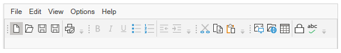

# Getting Started with ToolBarAdv

>**Important**
Starting with v16.2.0.x, if you refer to Syncfusion assemblies from trial setup or from the NuGet feed, include a license key in your projects. Refer to this [link](https://help.syncfusion.com/common/essential-studio/licensing/license-key) to learn about registering Syncfusion license key in your WPF application to use our components.

This section explains how to add the ToolBarAdv control to an application and its structure.

## Adding ToolBarAdv to a WPF Application

ToolBarAdv can be added to an application in a following way.

### Create the ToolBarAdv Control to an application by using XAML:

The following ways explains how to add ToolBarAdv control using XAML code:

* Create a WPF project in Visual Studio and refer “Syncfusion.Shared.Wpf” assembly to the project.    
* Include an XML namespace for the above assemblies to the Main window.





<Window x:Class="Application_New.MainWindow"

xmlns="http://schemas.microsoft.com/winfx/2006/xaml/presentation"

xmlns:x="http://schemas.microsoft.com/winfx/2006/xaml"

xmlns:syncfusion="http://schemas.syncfusion.com/wpf"

Title="MainWindow" Height="350" Width="525">




* Now add the ToolBarAdv control with a required optimal name using the namespace 





<syncfusion:ToolBarAdv Height="100" HorizontalAlignment="Left" Margin="92,90,0,0" Name="toolBarAdv1" VerticalAlignment="Top" Width="200" />





### Create the ToolBarAdv control to an application by C#:





ToolBarAdv tool = new ToolBarAdv();

tool.Name = "toolBarAdv1";

tool.Width = 100;

tool.Height = 50;





## Appearance and Structure of the Control

* The Overflow button is a toggle button that displays on clicking the Overflow panel.
* The Gripper is used to drag the ToolBarAdv to change its Band. The state of the ToolBarAdv can be changed to float and dock by clicking the gripper and dragging the ToolBarAdv, when the ToolBarAdv is hosted in ToolBarManager.

## Setting icon template

The icon template supports adding any type of images such as path data, font icons, etc. as template in ToolBar. The icon will automatically resize the template content according to its size provided in the data template.




        <syncfusion:ToolBarManager x:Name="toolBarManager" Grid.Row="1" CanDockAtLeft="{Binding IsChecked, ElementName=canDockAtLeft}"
                               CanDockAtTop="{Binding IsChecked, ElementName=canDockAtTop}" CanDockAtRight="{Binding IsChecked, ElementName=canDockAtRight}"
                               CanDockAtBottom="{Binding IsChecked, ElementName=canDockAtBottom}">

            <syncfusion:ToolBarManager.Resources>
                <DataTemplate x:Key="NewDataTemplate">
                    <Path x:Name="New_Folder" Data="M7,1.7070007 L7,5 10.292999,5 z M1,1 L1,15 11,15 11,6 6,6 6,1 z M0,0 L6.7070007,0 12,5.2929993 12,16 0,16 z" 
                          Fill="{Binding Foreground, ElementName=button1}" HorizontalAlignment="Center" Stretch="Fill" Width="14" Height="14" VerticalAlignment="Center" />
                </DataTemplate>
                <DataTemplate x:Key="OpenDataTemplate">
                    <Path x:Name="Open" Data="M5.162991,5.0009986 L1.7839907,10.979999 4.3081884,10.984653 5.0009999,10.984999 5.0009999,10.98593 12.088991,10.999 14.480014,5.0009986 z M0,0 L5.7069998,0 6.7069998,1 13,1 13,3.9999998 12,3.9999998 12,1.9999998 6.2930002,1.9999998 5.2930002,1 0.99999994,1 0.99999994,10.335325 4.5790062,4.0009986 15.954991,4.0009986 12.765994,12.000998 4.552258,11.98482 0,11.982999 z" 
                          Fill="{Binding Foreground, ElementName=button1}" HorizontalAlignment="Center" Stretch="Fill" Width="14" Height="14" VerticalAlignment="Center"/>
                </DataTemplate>
                <DataTemplate x:Key="SaveDataTemplate">
                    <Path x:Name="Print" Data="M5.0000019,11 L5.0000019,15 11.000002,15 11.000002,11 z M4.0000019,1 L4.0000019,6 12.000002,6 12.000002,1 z M1,1 L1,13.174 2.7160001,15 4.0000019,15 4.0000019,10 12.000002,10 12.000002,15 15,15 15,1 13.000002,1 13.000002,7 3.0000019,7 3.0000019,1 z M0,0 L3.0000019,0 13.000002,0 16,0 16,16 12.000002,16 4.0000019,16 2.2840004,16 0,13.57 z" 
                          Fill="{Binding Foreground, ElementName=button1}" HorizontalAlignment="Center" Stretch="Fill" Width="16" Height="14" VerticalAlignment="Center"/>
                </DataTemplate>
                <DataTemplate x:Key="SaveAllDataTemplate">
                    <Path Data="M5.0000019,11 L5.0000019,15 11.000002,15 11.000002,11 z M4.0000019,1 L4.0000019,6 12.000002,6 12.000002,1 z M1,1 L1,13.174 2.7160001,15 4.0000019,15 4.0000019,10 12.000002,10 12.000002,15 15,15 15,1 13.000002,1 13.000002,7 3.0000019,7 3.0000019,1 z M0,0 L3.0000019,0 13.000002,0 16,0 16,16 12.000002,16 4.0000019,16 2.2840004,16 0,13.57 z" 
                          Fill="{Binding Foreground, ElementName=button1}" HorizontalAlignment="Center" Stretch="Fill" Width="10" Height="10" VerticalAlignment="Center"/>
                </DataTemplate>
                <DataTemplate x:Key="PrintDataTemplate">
                    <Path Data="M5,11 L5,15 8.6761963,15 8.63936,14.971036 C7.6388242,14.144945 7,12.895562 7,11.5 7,11.344937 7.0078866,11.19168 7.0232801,11.040607 L7.0279369,11 z M13.145977,10.145986 L13.853984,10.853022 10.999985,13.706986 9.1459842,11.85303 9.8539908,11.145993 10.999985,12.293035 z M11.5,8 C9.5699999,8 7.9999999,9.5699999 8,11.5 7.9999999,13.43 9.5699999,15 11.5,15 13.43,15 15,13.43 15,11.5 15,9.5699999 13.43,8 11.5,8 z M2,7 L3,7 3,8 2,8 z M1,6 L1,11 4,11 4,10 7.2574663,10 7.2735391,9.954464 C7.9054199,8.2322998 9.5617187,7 11.5,7 12.895562,7 14.144945,7.6388242 14.971036,8.6393602 L15,8.6761966 15,6 12,6 4,6 z M5,1 L5,5 11,5 11,1 z M4,0 L12,0 12,5 16,5 16,11.5 C16,13.981 13.981,16 11.5,16 L4,16 4,12 0,12 0,5 4,5 z" 
                          Fill="{Binding Foreground, ElementName=button1}" HorizontalAlignment="Center" Stretch="Fill" Width="10" Height="10" VerticalAlignment="Center"/>
                </DataTemplate>
            </syncfsuion:ToolBarManager.Resources>
            <syncfusion:ToolBarManager.TopToolBarTray>
                <syncfusion:ToolBarTrayAdv VerticalAlignment="Top"  IsLocked="{Binding IsChecked, ElementName=lockTop}">
                    <syncfusion:ToolBarAdv x:Name="toolBar" ToolBarName="Standard" EnableAddRemoveButton="True">
                       <Button
                            x:Name="newFile"
                            Width="22"
                            Height="22"
                            Command="{Binding ButtonCommand}"
                            CommandParameter="{Binding ElementName=newFile}"
                            ToolTip="New" 
                            Content="{StaticResource NewFile}">
                        </Button>
                        <Button
                            x:Name="openFile"
                            Width="22"
                            Height="22"
                            Command="{Binding ButtonCommand}"
                            CommandParameter="{Binding ElementName=openFile}"
                            ToolTip="Open"
                            Content="{StaticResource OpenFile}">
                        </Button>
                        <Button
                            x:Name="saveFile"
                            Width="22"
                            Height="22"
                            Command="{Binding ButtonCommand}"
                            CommandParameter="{Binding ElementName=saveFile}"
                            ToolTip="Save"
                            Content="{StaticResource SaveFile}">
                        </Button>
                        <Button
                            x:Name="saveAllFile"
                            Width="22"
                            Height="22"
                            Command="{Binding ButtonCommand}"
                            CommandParameter="{Binding ElementName=saveAllFile}"
                            ToolTip="SaveAll"
                            Content="{StaticResource SaveAll}">
                        </Button>
                         <syncfusion:ToolBarItemSeparator />
                        <Button
                            x:Name="printFile"
                            Width="22"
                            Height="22"
                            Command="{Binding ButtonCommand}"
                            CommandParameter="{Binding ElementName=printFile}"
                            ToolTip="Print"
                            Content="{StaticResource PrintFile}">
                        </Button>
                    </syncfusion:ToolBarAdv>
                </syncfusion:ToolBarTrayAdv>
                
            </syncfusion:ToolBarManager.TopToolBarTray>
           
            <syncfusion:ToolBarManager.RightToolBarTray>
                <syncfusion:ToolBarTrayAdv IsLocked="{Binding IsChecked, ElementName=lockRight}">
                   
                </shared:ToolBarTrayAdv>
            </syncfusion:ToolBarManager.RightToolBarTray>
            <syncfusion:ToolBarManager.BottomToolBarTray>
                <syncfusion:ToolBarTrayAdv IsLocked="{Binding IsChecked, ElementName=lockBottom}"/>
            </syncfusion:ToolBarManager.BottomToolBarTray>

        </syncfusion:ToolBarManager>

 

 
 

 

## Properties

### Properties of ToolBarAdv

<table>
<tr>
<td>
Property  </td><td>
Description  </td><td>
Type  </td><td>
Data Type  </td></tr>
<tr>
<td>
Band  </td><td>
Gets or sets a value indicating where the ToolBarAdv should be placed in the ToolBarTrayAdv.  </td><td>
Dependency Property  </td><td>
Int  </td></tr>
<tr>
<td>
BandIndex  </td><td>
Gets or sets the band index number indicating the position of the ToolBarAdv on the band.  </td><td>
Dependency Property  </td><td>
Int  </td></tr>
<tr>
<td>
ToolBarName  </td><td>
Gets or sets the name of the ToolBarAdv.  </td><td>
Dependency Property  </td><td>
String  </td></tr>
<tr>
<td>
GripperVisibility  </td><td>
Gets or sets a value indicating whether gripper can be visible.  </td><td>
Dependency Property  </td><td>
Bool  </td></tr>
<tr>
<td>
FloatingBarLocation  </td><td>
Gets or sets the location for the floating ToolBarAdv.  </td><td>
Dependency Property  </td><td>
Point  </td></tr>
<tr>
<td>
ControlsResourceDictionary  </td><td>
Gets or sets resource dictionary in which ToolBarAdv will look up for Framework element’s styles.  </td><td>
Dependency Property  </td><td>
Resource Dictionary  </td></tr>
<tr>
<td>
IsOverflowOpen  </td><td>
Gets or sets a value indicating whether overflow popup is open.  </td><td>
Dependency Property  </td><td>
Bool  </td></tr>
<tr>
<td>
ToolBarItemInfoCollection  </td><td>
Gets or sets the items to be displayed in the Add or Remove Buttons popup.  </td><td>
Dependency Property  </td><td>
ObservableCollection  </td></tr>
<tr>
<td>
IsOverflowItem  </td><td>
Gets or sets a value indicating whether an item can be displayed in overflow panel.  </td><td>
Attached Property  </td><td>
Bool  </td></tr>
<tr>
<td>
OverflowMode  </td><td>
Gets or sets an overflow mode for a specified item.  </td><td>
Attached Property  </td><td>
OverflowMode  </td></tr>
<tr>
<td>
Icon  </td><td>
Gets or sets an icon for specified item to be displayed in the Add or Remove Buttons menu.  </td><td>
Attached Property  </td><td>
ImageSource  </td></tr>
<tr>
<td>
Label  </td><td>
Gets or sets a label for specified item to be displayed in the Add or Remove Buttons menu.  </td><td>
Attached Property  </td><td>
String  </td></tr>
<tr>
<td>
IsAvailable  </td><td>
Gets or sets a value indicating whether a specified item should be hidden.  </td><td>
Attached Property  </td><td>
Boolean  </td></tr>
</table>
### Properties of ToolBarManager

<table>
<tr>
<td>
Property  </td><td>
Description  </td><td>
Type  </td><td>
Data Type  </td></tr>
<tr>
<td>
IsLocked  </td><td>
Gets or Sets a value indicating whether ToolBarTrayAdv is locked.  </td><td>
Dependency property  </td><td>
bool  </td></tr>
<tr>
<td>
Orientation  </td><td>
Gets or Sets the orientation of the ToolBarAdv.  </td><td>
Dependency property  </td><td>
Orientation  </td></tr>
<tr>
<td>
ToolBars  </td><td>
Gets or sets toolbars.  </td><td>
Dependency property  </td><td>
ObservableCollection  </td></tr>
<tr>
<td>
TopToolBarTray  </td><td>
Gets or sets ToolBarTrayAdv which has to be displayed at the Top of ToolBarManager.  </td><td>
Dependency Property  </td><td>
ToolBarTrayAdv  </td></tr>
<tr>
<td>
BottomToolBarTray  </td><td>
Gets or sets ToolBarTrayAdv which has to be displayed at the bottom of ToolBarManager.  </td><td>
Dependency Property  </td><td>
ToolBarTrayAdv  </td></tr>
<tr>
<td>
LeftToolBarTray  </td><td>
Gets or sets ToolBarTrayAdv which has to be displayed at the left of ToolBarManager.  </td><td>
Dependency Property  </td><td>
ToolBarTrayAdv  </td></tr>
<tr>
<td>
RightToolBarTray  </td><td>
Gets or sets ToolBarTrayAdv which has to be displayed at the right of ToolBarManager.  </td><td>
Dependency Property  </td><td>
ToolBarTrayAdv  </td></tr>
<tr>
<td>
CanDockAtTop  </td><td>
Gets or sets a value indicating whether toolbar can be docked at the top.  </td><td>
Dependency Property  </td><td>
bool  </td></tr>
<tr>
<td>
CanDockAtBottom  </td><td>
Gets or sets a value indicating whether toolbar can be docked at the bottom.  </td><td>
Dependency Property  </td><td>
bool  </td><td>
<tr>
<td>
CanDockAtLeft  </td><td>
Gets or sets a value indicating whether toolbar can be docked at the left.  </td><td>
Dependency Property  </td><td>
bool  </td><td>
<tr>
<td>
CanDockAtRight  </td><td>
Gets or sets a value indicating whether toolbar can be docked at the right.  </td><td>
Dependency Property  </td><td>
bool  </td><td>
<tr>
<td>
Content  </td><td>
Gets or sets the content of the ToolBarManager.  </td><td>
Dependency Property  </td><td>
UIElement  </td><td>
<tr>
<td>
FloatingToolBarStyle  </td><td>
Gets or sets a style of floating tool bar  </td><td>
Dependency Property  </td><td>
Style  </td><td>
<tr>
<td>
ToolBarState  </td><td>
Gets or sets the state of the toolbar.  </td><td>
Attached Property  </td><td>
ToolBarState  </td><td>

