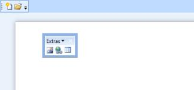

# ToolBarAdv State in WPF ToolBar (ToolBarAdv)

ToolBarAdv provides different states such as Docking, Floating or Hidden. It can be change using the property `ToolBarState` of the ToolBarManager. 





<syncfusion:ToolBarManager x:Name="toolBarManager" >

<syncfusion:ToolBarManager.TopToolBarTray>

<syncfusion:ToolBarTrayAdv >

<syncfusion:ToolBarAdv ToolBarName="Standard" Band="0">

<Button syncfusion:ToolBarAdv.Label="New Document"
        syncfusion:ToolBarAdv.Icon="Images/NewDocumentHS.png">

<Image Source="Images/NewDocumentHS.png" Width="16" Height="16"/>

</Button>

<Button syncfusion:ToolBarAdv.Label="Open Document"
        syncfusion:ToolBarAdv.Icon="Images/openHS.png">

<Image Source="Images/openHS.png" Width="16" Height="16"/>

</Button>

<syncfusion:ToolBarAdv Band="1" ToolBarName="Extras"
            syncfusion:ToolBarManager.ToolBarState="Floating"
			FloatingBarLocation="500,300">

<Button syncfusion:ToolBarAdv.Label="Insert Picture"
        syncfusion:ToolBarAdv.Icon="Images/InsertPictureHS.png">

<Image Source="Images/InsertPictureHS.png" Width="16" Height="16"/>

</Button>

<Button syncfusion:ToolBarAdv.Label="Insert Hyperlink"
        syncfusion:ToolBarAdv.Icon="Images/InsertHyperlinkHS.png">

<Image Source="Images/InsertHyperlinkHS.png" Width="16" Height="16"/>

</Button>

<Button syncfusion:ToolBarAdv.Label="Insert Table"
        syncfusion:ToolBarAdv.Icon="Images/TableHS.png">

<Image Source="Images/TableHS.png" Width="16" Height="16"/>

</Button>

</syncfusion:ToolBarAdv>

</syncfusion:ToolBarAdv>

</syncfusion:ToolBarTrayAdv>

</syncfusion:ToolBarManager.TopToolBarTray>

<Grid >

<Grid.RowDefinitions>

<RowDefinition Height="*"/>

<RowDefinition Height="Auto"/>

</Grid.RowDefinitions>

<ScrollViewer >

<Grid Margin="20">

<Border CornerRadius="2" Background="Black"
        Opacity="0.3" Width="600" Height="700">

<Border.Effect>

<BlurEffect Radius="15"/>

</Border.Effect>

</Border>

<RichTextBox Width="600" Height="700" Padding="20"></RichTextBox>

</Grid>

</ScrollViewer>

</Grid>

</syncfusion:ToolBarManager>





ToolBarAdv toolBar = new ToolBarAdv(); 

toolBar.FloatingBarLocation = new Point(500, 300); 

ToolBarManager.SetToolBarState(toolBar, ToolBarState.Floating);

Grid1.Children.Add(toolBar);





ToolBarAdv can be floated only when it is hosted in ToolBarManager.

## Specifying location for floating ToolBarAdv.

The location of the floating ToolBarAdv can be changed using the `FloatingBarLocation` property. The following code illustrates this





<syncfusion:ToolBarAdv FloatingBarLocation="50,50"/>





ToolBarAdv toolBar = new ToolBarAdv();

toolBar.FloatingBarLocation = new Point(50, 50);





## Restrict Docking of ToolBarAdv for a specific position

By default, the ToolBarAdv can be docked to any position. To restrict docking of ToolBarAdv to particular position, the following properties can be used. Each will restrict docking at corresponding positions in ToolBarManager.

* CanDockAtLeft—restricts docking at the left.
* CanDockAtTop—restricts docking at the top.
* CanDockAtRight—restricts docking at the right.
* CanDockAtBottom—restricts docking at the bottom.

Following code restricts docking at the top:





<syncfusion:ToolBarManager CanDockAtTop="False"/>





ToolBarManager toolBarManager = new ToolBarManager(); 

toolBarManager.CanDockAtTop = false;




