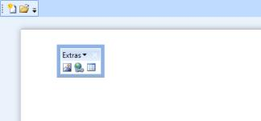

# Toolbar State in WPF ToolBar

ToolBar provides different states such as Docking, Floating or Hidden. It can be change using the property `ToolBarState` of the ToolBarManager. 





    <syncfusion:ToolBarManager x:Name="toolBarManager" >
        <syncfusion:ToolBarManager.TopToolBarTray>
            <syncfusion:ToolBarTrayAdv>

                <syncfusion:ToolBarAdv ToolBarName="Standard" Band="0">
                    <Button syncfusion:ToolBarAdv.Label="New Document"
                    syncfusion:ToolBarAdv.Icon="Images/New.png">
                        <Image Source="Images/NewDocumentHS.png" Width="16" Height="16"/>
                    </Button>
                    <Button syncfusion:ToolBarAdv.Label="Open Document"
                    syncfusion:ToolBarAdv.Icon="Images/Open.png">
                        <Image Source="Images/OpenDocument.png" Width="16" Height="16"/>
                    </Button>
				</syncfusion:ToolBarAdv>

                <syncfusion:ToolBarAdv Band="1" ToolBarName="Extras"
                syncfusion:ToolBarManager.ToolBarState="Floating" FloatingBarLocation="500,300">
                    <Button syncfusion:ToolBarAdv.Label="Save Document"
                     syncfusion:ToolBarAdv.Icon="Images/Save.png">
                        <Image Source="Images/SaveDocument.png" Width="16" Height="16"/>
                    </Button>
                    <Button syncfusion:ToolBarAdv.Label="Insert Table"
                      syncfusion:ToolBarAdv.Icon="Images/Insert.png">
                        <Image Source="Images/InsertTable.png" Width="16" Height="16"/>
                    </Button>
                </syncfusion:ToolBarAdv>
            </syncfusion:ToolBarTrayAdv>
        </syncfusion:ToolBarManager.TopToolBarTray>
    </syncfusion:ToolBarManager>





    ToolBarManager toolBarManager = new ToolBarManager();
    //Initialize ToolBarTrayAdv
    ToolBarTrayAdv toolBarTray = new ToolBarTrayAdv();
    // Initialize toolbar1 and subscribe to ToolBarStateChanged event
    ToolBarAdv toolbar1 = new ToolBarAdv();
    // Add a button to the toolbar1
    toolbar1.Items.Add(new Button
     {
        Content = new Image
        {
            Source = new BitmapImage(new Uri("Images/Open.png")),
            Stretch = Stretch.Uniform
        },
        Height = 40,
        Width = 40,
        ToolTip = "Open Folder",
        Margin = new Thickness(5, 0, 5, 0)
    });
    // Add toolbar1 to the ToolBarTrayAdv
    toolBarTray.ToolBars.Add(toolbar1);
    // Set Floating location for the floating toolbar
    toolbar1.FloatingBarLocation = new Point(500, 300);
    // Set the floating toolbar state to floating
    ToolBarManager.SetToolBarState(toolbar1, ToolBarState.Floating);
    // Add buttons to the floating toolbar
    toolbar1.Items.Add(new Button
    {
        Content = new Image
        {
           Source = new BitmapImage(new Uri("Images/Save.png")),
           Stretch = Stretch.Uniform
        },
           Height = 40,
           Width = 40,
           ToolTip = "Save",
           Margin = new Thickness(5, 0, 5, 0)
    });
    // Set the ToolBarTrayAdv as the top tray for the ToolBarManager
    toolBarManager.TopToolBarTray = toolBarTray;
    // Set the ToolBarManager as the main content
    this.Content = toolBarManager;





ToolBar can be floated only when it is hosted in ToolBarManager.

## Specifying location for floating ToolBar.

The location of the floating ToolBar can be changed using the `FloatingBarLocation` property. The following code illustrates this





<syncfusion:ToolBarAdv FloatingBarLocation="50,50"/>




    ToolBarAdv toolBar = new ToolBarAdv();
    toolBar.FloatingBarLocation = new Point(50, 50);




## Restrict Docking of ToolBar for a specific position

By default, the ToolBar can be docked to any position. To restrict docking of ToolBar to particular position, the following properties can be used. Each will restrict docking at corresponding positions in ToolBarManager.

* CanDockAtLeft—restricts docking at the left.
* CanDockAtTop—restricts docking at the top.
* CanDockAtRight—restricts docking at the right.
* CanDockAtBottom—restricts docking at the bottom.

Following code restricts docking at the top:





<syncfusion:ToolBarManager CanDockAtTop="False"/>





    ToolBarManager toolBarManager = new ToolBarManager(); 
    toolBarManager.CanDockAtTop = false;





## ToolBarStateChanged event

The [`ToolBarStateChanged`](https://help.syncfusion.com/cr/wpf/Syncfusion.Windows.Tools.Controls.ToolBarAdv.html#Syncfusion_Windows_Tools_Controls_ToolBarAdv_ToolBarStateChanged) event is triggered when the state of a ToolBar changes, such as when it is hidden, floated, or docked. The handler receives an instance of [`ToolBarStateChangedEventArgs`](https://help.syncfusion.com/cr/wpf/Syncfusion.Windows.Tools.Controls.ToolBarStateChangedEventArgs.html), which contains information about the state change.

* `NewState` — gets the current state of the ToolBar control.
* `OldState` — gets the previous state of the ToolBar control.

The following code illustrates this : 





        <syncfusion:ToolBarManager x:Name="toolBarManager" >
           <syncfusion:ToolBarManager.TopToolBarTray>
                <syncfusion:ToolBarTrayAdv >
				
                        <syncfusion:ToolBarAdv ToolBarStateChanged="Toolbar1_ToolBarStateChanged" 
						ToolBarName="Standard" Band="0">
                                <Button syncfusion:ToolBarAdv.Label="Open Document"
                                syncfusion:ToolBarAdv.Icon="Images/Open.png">
                                        <Image Source="Images/Open.png" Width="16" Height="16"/>
                                </Button>
						</syncfusion:ToolBarAdv>
								 
                        <syncfusion:ToolBarAdv Band="1" ToolBarName="Extras">
                                <Button syncfusion:ToolBarAdv.Label="Save Document"
                                syncfusion:ToolBarAdv.Icon="Images/Save.png">
                                        <Image Source="Images/Save.png" Width="16" Height="16"/>
                                </Button>
                        </syncfusion:ToolBarAdv>
                       
                </syncfusion:ToolBarTrayAdv>
           </syncfusion:ToolBarManager.TopToolBarTray>
        </syncfusion:ToolBarManager> 





        ToolBarManager toolBarManager = new ToolBarManager();
        ToolBarTrayAdv toolBarTray = new ToolBarTrayAdv();
		
        ToolBarAdv toolbar1 = new ToolBarAdv();
        // Subscribe to the ToolBarStateChanged event for toolbar1
        toolbar1.ToolBarStateChanged += Toolbar1_ToolBarStateChanged;
        toolbar1.Items.Add(new Button
        {
                Content = new Image
                {
                        Source = new BitmapImage(new Uri("Images\\Open.png")),
                        Stretch = Stretch.Uniform
                },
                Height = 40,
                Width = 40,
                ToolTip = "Open Folder",
                Margin = new Thickness(5, 0, 5, 0)
        });
		
        ToolBarAdv toolbar2 = new ToolBarAdv();
        toolbar2.Items.Add(new Button
        {
                Content = new Image
                {
                        Source = new BitmapImage(new Uri("Images\\Save.png")),
                        Stretch = Stretch.Uniform
                },
                Height = 40,
                Width = 40,
                ToolTip = "Save",
                Margin = new Thickness(5, 0, 5, 0)
        });
		
        // Add ToolBars to the ToolBarTrayAdv
        toolBarTray.ToolBars.Add(toolbar1);
        toolBarTray.ToolBars.Add(toolbar2);
        // Set the ToolBarTrayAdv as the top tray for the ToolBarManager
        toolBarManager.TopToolBarTray = toolBarTray;
        this.Content = toolBarManager;

        private void Toolbar1_ToolBarStateChanged(object sender, ToolBarStateChangedEventArgs e)
        {
           // Access the new and old values
           object oldValue = e.OldState;
           object newValue = e.NewState;
        }



