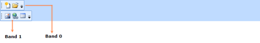

# Specifying the Position of ToolBarAdvs in a ToolBarTrayAdv

You can specify the position the ToolBarAdv in the ToolBarTrayAdv using the Band and the BandIndex properties. Band indicates the band in ToolBarTrayAdv, where ToolBarAdv has to be placed.  BandIndex indicates the order in which the ToolBarAdv has to be placed within the band. 

Specify the position the ToolBarAdv in the ToolBarTrayAdv as given in the following code:

[XAML]

&lt;shared:ToolBarTrayAdv &gt;

                    &lt;shared:ToolBarAdv ToolBarName="Standard"&gt;

                        &lt;Button shared:ToolBarAdv.Icon="Images/NewDocumentHS.png"&gt;

                            &lt;Image Source="Images/NewDocumentHS.png" Width="16" Height="16"/&gt;

                        &lt;/Button&gt;

                        &lt;Button  &gt;

                            &lt;Image Source="Images/openHS.png"  Width="16" Height="16"/&gt;

                        &lt;/Button&gt;

                    &lt;/shared:ToolBarAdv&gt;

                    &lt;shared:ToolBarAdv Band="1"   ToolBarName="Extras"&gt;

                        &lt;Button &gt;

                            &lt;Image Source="Images/InsertPictureHS.png"  Width="16" Height="16"/&gt;

                        &lt;/Button&gt;

                        &lt;Button  &gt;

                            &lt;Image Source="Images/InsertHyperlinkHS.png"  Width="16" Height="16"/&gt;

                        &lt;/Button&gt;

                        &lt;Button  &gt;

                            &lt;Image Source="Images/TableHS.png"  Width="16" Height="16"/&gt;

                        &lt;/Button&gt;

                    &lt;/shared:ToolBarAdv&gt;

                &lt;/shared:ToolBarTrayAdv&gt;

[C#]

  ToolBarTrayAdv tray = new ToolBarTrayAdv();

            ToolBarAdv toolBar = new ToolBarAdv();

            Button button = new Button();

            button.Content = new Image()

            {

                Source = new BitmapImage()

                {

                    UriSource = new Uri("Images/NewDocumentHS.png", UriKind.RelativeOrAbsolute)

                }

            };

            toolBar.Items.Add(button);

            button = new Button();

            button.Content = new Image()

            {

                Source = new BitmapImage()

                {

                    UriSource = new Uri("Images/openHS.png", UriKind.RelativeOrAbsolute)

                }

            };

            toolBar.Items.Add(button);

            tray.ToolBars.Add(toolBar);

            toolBar = new ToolBarAdv();

            toolBar.Band = 1;

            button = new Button();

            button.Content = new Image()

            {

                Source = new BitmapImage()

                {

                    UriSource = new Uri("Images/InsertPictureHS.png", UriKind.RelativeOrAbsolute)

                }

            };

            toolBar.Items.Add(button);

            button = new Button();

            button.Content = new Image()

            {

                Source = new BitmapImage()

                {

                    UriSource = new Uri("Images/InsertHyperlinkHS.png", UriKind.RelativeOrAbsolute)

                }

            };

            toolBar.Items.Add(button);

button = new Button();

            button.Content = new Image()

            {

                Source = new BitmapImage()

                {

                    UriSource = new Uri("Images/TableHS.png", UriKind.RelativeOrAbsolute)

                }

            };

            toolBar.Items.Add(button);

            tray.ToolBars.Add(toolBar);

{  | markdownify }
{:.image }

