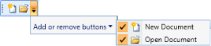

# Add or Remove buttons

ToolBarAdv provides option to show or hide an item. By default, the Add or Remove Button will be listed in the overflow popup. When you click Add or Remove Button, a popup will display the items available in ToolBarAdv. Unselect the respective checkboxes of the items you want to hide.

## Adding an Item to Add or Remove Button

You can add an item to Add or Remove Buttons, setting the ToolBarAdv.Icon and ToolBarAdv.Label properties. 

Following code illustrates how to add an item in Add or Remove Buttons:





<shared:ToolBarAdv >

                        <Button shared:ToolBarAdv.Label="New Document" shared:ToolBarAdv.Icon="Images/NewDocumentHS.png">

                            <Image Source="Images/NewDocumentHS.png" Width="16" Height="16"/>

                        </Button>

                        <Button  shared:ToolBarAdv.Label="Open Document" shared:ToolBarAdv.Icon="Images/openHS.png">

                            <Image Source="Images/openHS.png"  Width="16" Height="16"/>

                        </Button>

                    </shared:ToolBarAdv>





ToolBarAdv toolBar = new ToolBarAdv();

            Button button = new Button();

            button.Content = new Image()

            {

                Source = new BitmapImage()

                {

                    UriSource = new Uri("Images/NewDocumentHS.png", UriKind.RelativeOrAbsolute)

                }

            };

            ToolBarAdv.SetLabel(button, "New Document");

            ToolBarAdv.SetIcon(button, new BitmapImage() { UriSource = new Uri("Images/NewDocumentHS.png", UriKind.RelativeOrAbsolute) });

            toolBar.Items.Add(button);

            button = new Button();

            button.Content = new Image()

            {

                Source = new BitmapImage()

                {

                    UriSource = new Uri("Images/openHS.png", UriKind.RelativeOrAbsolute)

                }

            };

            ToolBarAdv.SetLabel(button, "Open Document");

            ToolBarAdv.SetIcon(button, new BitmapImage() { UriSource = new Uri("Images/openHS.png", UriKind.RelativeOrAbsolute) });

            toolBar.Items.Add(button);




