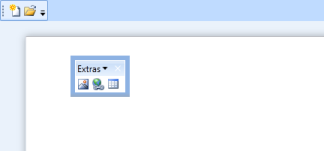

# ToolBarAdv state

ToolBarAdv can be set to docking, floating or hidden state as required.    

Following code illustrates how to set ToolBarAdv to floating state:




<shared:ToolBarManager x:Name="toolBarManager" >

            <shared:ToolBarManager.Resources>

                

                

            </shared:ToolBarManager.Resources>

            <shared:ToolBarManager.TopToolBarTray>

                <shared:ToolBarTrayAdv VerticalAlignment="Top">

                    <shared:ToolBarAdv ToolBarName="Standard">

                        <Button shared:ToolBarAdv.Label="New Document" shared:ToolBarAdv.Icon="Images/NewDocumentHS.png">

                            <Image Source="Images/NewDocumentHS.png" Width="16" Height="16"/>

                        </Button>

                        <Button  shared:ToolBarAdv.Label="Open Document" shared:ToolBarAdv.Icon="Images/openHS.png">

                            <Image Source="Images/openHS.png"  Width="16" Height="16"/>

                        </Button>

                    <shared:ToolBarAdv Band="1"   ToolBarName="Extras" shared:ToolBarManager.ToolBarState="Floating" FloatingBarLocation="500,300">

                        <Button shared:ToolBarAdv.Label="Insert Picture"  shared:ToolBarAdv.Icon="Images/InsertPictureHS.png">

                            <Image Source="Images/InsertPictureHS.png"  Width="16" Height="16"/>

                        </Button>

                        <Button  shared:ToolBarAdv.Label="Insert Hyperlink"  shared:ToolBarAdv.Icon="Images/InsertHyperlinkHS.png">

                            <Image Source="Images/InsertHyperlinkHS.png"  Width="16" Height="16"/>

                        </Button>

                        <Button  shared:ToolBarAdv.Label="Insert Table"  shared:ToolBarAdv.Icon="Images/TableHS.png">

                            <Image Source="Images/TableHS.png"  Width="16" Height="16"/>

                        </Button>

                   </shared:ToolBarAdv>

                </shared:ToolBarTrayAdv>

            </shared:ToolBarManager.TopToolBarTray>

            <Grid  >

                <Grid.RowDefinitions>

                    <RowDefinition Height="*"/>

                    <RowDefinition Height="Auto"/>

                </Grid.RowDefinitions>

                <ScrollViewer >

                    <Grid Margin="20">

                        <Border CornerRadius="2" Background="Black" Opacity="0.3"   Width="600" Height="700">

                            <Border.Effect>

                                <BlurEffect Radius="15"/>

                            </Border.Effect>

                        </Border>

                        <RichTextBox  Width="600" Height="700" Padding="20">

                        </RichTextBox>

                        </Grid>

                </ScrollViewer>

            </Grid>

        </shared:ToolBarManager>





ToolBarAdv toolBar = new ToolBarAdv();

            toolBar.FloatingBarLocation = new Point(500, 300);

            ToolBarManager.SetToolBarState(toolBar, ToolBarState.Floating);





ToolBarAdv can be floated only when it is hosted in ToolBarManager. 

## Specifying location for floating ToolBarAdv

You can change the location of the floating ToolBarAdv using the _FloatingBarLocation_ property. The following code illustrates this:




<shared:ToolBarAdv FloatingBarLocation="50,50"></shared:ToolBarAdv>





ToolBarAdv toolBar = new ToolBarAdv();

            toolBar.FloatingBarLocation = new Point(50, 50);





