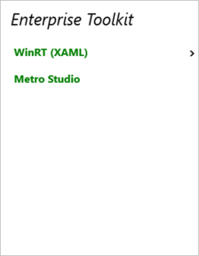

# Header Template in WPF Tree Navigator (SfTreeNavigator)

The HeaderTemplate property of Tree Navigator can be used to customize the Tree Navigator header. 




<navigation:SfTreeNavigator.HeaderTemplate>
<DataTemplate>
<TextBlock Text="{Binding}" FontStyle="Italic"/>
</DataTemplate>
</navigation:SfTreeNavigator.HeaderTemplate>



Tree Navigator now displayed as shown below.

