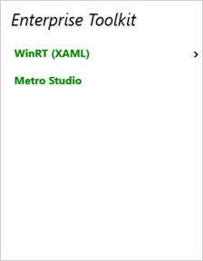

# Header Template in WPF Tree Navigator

The HeaderTemplate property of [SfTreeNavigator](https://help.syncfusion.com/cr/wpf/Syncfusion.Windows.Controls.Navigation.SfTreeNavigator.html) control can be used to customize the Tree Navigator header. 




<navigation:SfTreeNavigator.HeaderTemplate>
<DataTemplate>
<TextBlock Text="{Binding}" FontStyle="Italic"/>
</DataTemplate>
</navigation:SfTreeNavigator.HeaderTemplate>



Tree Navigator now displayed as shown below.

