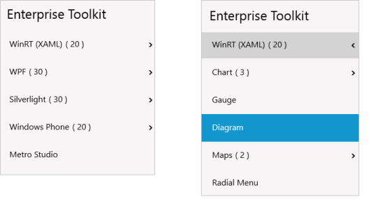

# WPF Tree Navigator (SfTreeNavigator) Overview

The tree navigator control provides a unique interface that can expand a tree structure in-place without taking up more space on the screen.

### Key features

* Items Source – Any business object collection can be bound to control. 
* Hierarchical Data Template – Business objects displayed in the hierarchy can be customized with single template. 
* Navigation Mode – Two types of navigation mode (Default and Extended) support.
