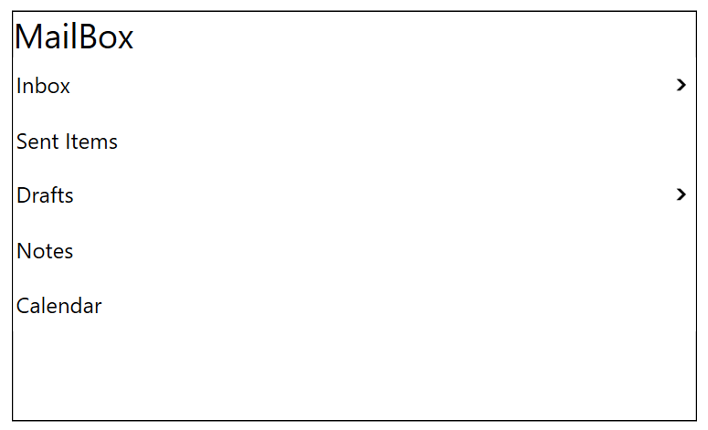

# WPF Tree Navigator (SfTreeNavigator) Overview

The tree navigator control provides a distinctive user experience by allowing for the expansion of tree structures directly within the existing screen space. This control effectively presents hierarchical data in a tree-like format, featuring expandable and collapsible nodes for easy navigation.

## Example




<navigation:SfTreeNavigator Header="MailBox" x:Name="TreeNavigator" Width="500" Height="300" >
    <navigation:SfTreeNavigatorItem Header="Inbox">
        <navigation:SfTreeNavigatorItem  Header="Mail1"/>
        <navigation:SfTreeNavigatorItem  Header="Mail2"/>
    </navigation:SfTreeNavigatorItem>
    <navigation:SfTreeNavigatorItem Header="Sent Items"/>
    <navigation:SfTreeNavigatorItem  Header="Drafts">
        <navigation:SfTreeNavigatorItem  Header="Mail1"/>
    </navigation:SfTreeNavigatorItem>
    <navigation:SfTreeNavigatorItem  Header="Notes"/>
    <navigation:SfTreeNavigatorItem  Header="Calendar"/>
</navigation:SfTreeNavigator>




SfTreeNavigator sfTreeNavigator = new SfTreeNavigator();
sfTreeNavigator.Header = "MailBox";
SfTreeNavigatorItem inbox = new SfTreeNavigatorItem() { Header = "Inbox" };
SfTreeNavigatorItem sentItems = new SfTreeNavigatorItem() { Header = "Sent Items" };
SfTreeNavigatorItem drafts = new SfTreeNavigatorItem() { Header = "Drafts" };
SfTreeNavigatorItem notes = new SfTreeNavigatorItem() { Header = "Notes" };
SfTreeNavigatorItem calendar = new SfTreeNavigatorItem() { Header = "Calendar" };

SfTreeNavigatorItem inbox_mail1 = new SfTreeNavigatorItem() { Header = "Mail1" };
SfTreeNavigatorItem inbox_mail2 = new SfTreeNavigatorItem() { Header = "Mail2" };
SfTreeNavigatorItem draft_mail1 = new SfTreeNavigatorItem() { Header = "Mail1" };

inbox.Items.Add(inbox_mail1);
inbox.Items.Add(inbox_mail2);
drafts.Items.Add(draft_mail1);

sfTreeNavigator.Items.Add(inbox);
sfTreeNavigator.Items.Add(sentItems);
sfTreeNavigator.Items.Add(drafts);
sfTreeNavigator.Items.Add(notes);
sfTreeNavigator.Items.Add(calendar);




### Key features

* Items Source – Any business object collection can be bound to control. 
* Hierarchical Data Template – Business objects displayed in the hierarchy can be customized with single template. 
* Navigation Mode – Two types of navigation mode (Default and Extended) support.
* Header - Customize the TreeNavigator header using the HeaderTemplate property.
