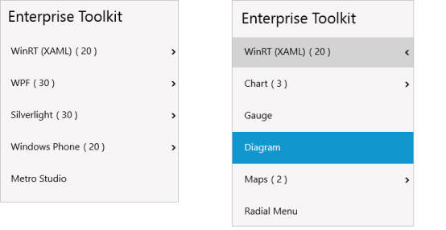

# About Syncfusion® WPF Tree Navigator Control

The WPF Tree Navigator control provides a unique interface that can expand a tree structure in-place without taking up more space on the screen.

## Key features

* Items Source – Any business object collection can be bound to control. 
* Hierarchical Data Template – Business objects displayed in the hierarchy can be customized with single template. 
* Navigation Mode – Two types of navigation mode (Default and Extended) support.
* Header Customization - Customize the header content using the HeaderTemplate property.
* Selection - Update the item selection using the SelectedItem property.
