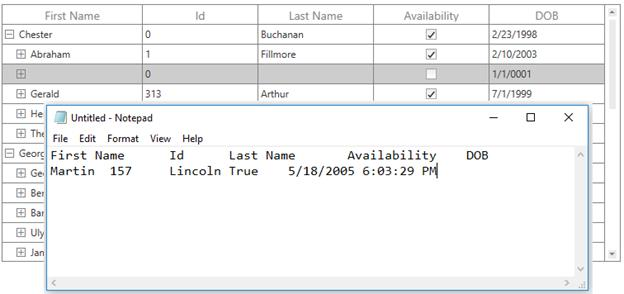

# Clipboard Operations in WPF TreeGrid (SfTreeGrid)

SfTreeGrid provides support to the clipboard operations such as cut, copy, and paste the data within control and between other applications such as Notepad and Excel. The clipboard operations of copy and paste are enabled by default. You can copy selected nodes/cells from tree grid by clicking `Ctrl+C` and paste the content from the [Clipboard](https://docs.microsoft.com/en-us/dotnet/api/system.windows.clipboard?redirectedfrom=MSDN&view=net-5.0) to tree grid by clicking `Ctrl+V`.

## Copy

The copy operation works based on the [GridCopyOption](https://help.syncfusion.com/cr/wpf/Syncfusion.UI.Xaml.Grid.SfGridBase.html#Syncfusion_UI_Xaml_Grid_SfGridBase_GridCopyOption) property.

The GridCopyOption property provides the following options:

* [None](http://help.syncfusion.com/cr/wpf/Syncfusion.UI.Xaml.Grid.GridCopyOption.html): Disables copy in tree grid.

* [CopyData](http://help.syncfusion.com/cr/wpf/Syncfusion.UI.Xaml.Grid.GridCopyOption.html):Enables copy in tree grid.

* [IncludeHeaders](http://help.syncfusion.com/cr/wpf/Syncfusion.UI.Xaml.Grid.GridCopyOption.html): Copies the column header along with data.

* [IncludeFormat](http://help.syncfusion.com/cr/wpf/Syncfusion.UI.Xaml.Grid.GridCopyOption.html): Copies the display text with format instead of actual value.

* [IncludeHiddenColumn](http://help.syncfusion.com/cr/wpf/Syncfusion.UI.Xaml.Grid.GridCopyOption.html): Copies hidden column to the clipboard.

You can use the IncludeHeaders, IncludeFormat, and IncludeHiddenColumn options along with CopyData option.



<syncfusion:SfTreeGrid Name="treeGrid"
                                       AutoExpandMode="RootNodesExpanded"
                                       AutoGenerateColumns="False" 
                                       GridCopyOption="CopyData,IncludeHeaders" 
                                       ChildPropertyName="Children"
                                       ColumnSizer="Star"
                                       ExpanderColumn="FirstName"
                                       ItemsSource="{Binding PersonDetails}"
                                       NavigationMode="Row">



this.treeGrid.GridCopyOption = GridCopyOption.CopyData | GridCopyOption.IncludeHeaders;




N> `IncludeHiddenColumn` is not supported when **SelectionUnit** is [Cell](https://help.syncfusion.com/cr/wpf/Syncfusion.UI.Xaml.Grid.GridSelectionUnit.html).

## Paste

The paste operation works based on the [GridPasteOption](https://help.syncfusion.com/cr/wpf/Syncfusion.UI.Xaml.Grid.SfGridBase.html#Syncfusion_UI_Xaml_Grid_SfGridBase_GridPasteOption) property.

The GridPasteOption property provides the following options:

* [None](http://help.syncfusion.com/cr/wpf/Syncfusion.UI.Xaml.Grid.GridPasteOption.html): Disables paste in tree grid.

* [PasteData](http://help.syncfusion.com/cr/wpf/Syncfusion.UI.Xaml.Grid.GridPasteOption.html): Enables paste in tree grid. When an incompatible value is pasted into a record/cell, the pasting operation is skipped for that particular record/cell.

* [ExcludeFirstLine](http://help.syncfusion.com/cr/wpf/Syncfusion.UI.Xaml.Grid.GridPasteOption.html): Pastes the data copied with [IncludeHeader](http://help.syncfusion.com/cr/wpf/Syncfusion.UI.Xaml.Grid.GridCopyOption.html) copy option.

* [IncludeHiddenColumn](http://help.syncfusion.com/cr/wpf/Syncfusion.UI.Xaml.Grid.GridPasteOption.html): Pastes the values in hidden columns.

You can use the ExcludeFirstLine and IncludeHiddenColumn options along with the PasteData option.



<syncfusion:SfTreeGrid Name="treeGrid"
                                       AutoExpandMode="RootNodesExpanded"
                                       AutoGenerateColumns="False" 
                                       NavigationMode="Cell"
                                       ChildPropertyName="Children"
                                       ColumnSizer="Star" 
                                       GridCopyOption="CopyData,IncludeHeaders"
                                       GridPasteOption="PasteData,ExcludeFirstLine" 
                                       ExpanderColumn="FirstName"
                                       ItemsSource="{Binding PersonDetails}"
                                       >


this.treeGrid.GridCopyOption = GridCopyOption.CopyData | GridCopyOption.IncludeHeaders;

this.treeGrid.GridPasteOption = GridPasteOption.PasteData | GridPasteOption.ExcludeFirstLine;



## Cut

The cut operation works based on the [GridCopyOption](https://help.syncfusion.com/cr/wpf/Syncfusion.UI.Xaml.Grid.SfGridBase.html#Syncfusion_UI_Xaml_Grid_SfGridBase_GridCopyOption) property.

The GridCopyOption property provides the following options:

* [None](http://help.syncfusion.com/cr/wpf/Syncfusion.UI.Xaml.Grid.GridCopyOption.html): Disables cut in tree grid.

* [CutData](http://help.syncfusion.com/cr/wpf/Syncfusion.UI.Xaml.Grid.GridCopyOption.html): Enables cut in tree grid.

* [IncludeHeaders](http://help.syncfusion.com/cr/wpf/Syncfusion.UI.Xaml.Grid.GridCopyOption.html): Copies column header also along with data.

* [IncludeFormat](http://help.syncfusion.com/cr/wpf/Syncfusion.UI.Xaml.Grid.GridCopyOption.html) Cuts the display text with format instead of actual value.

* [IncludeHiddenColumn](http://help.syncfusion.com/cr/wpf/Syncfusion.UI.Xaml.Grid.GridCopyOption.html): Cuts the hidden column also to the clipboard.

You can use the IncludeHeaders, IncludeFormat, and IncludeHiddenColumn options along with the CutData option.



<syncfusion:SfTreeGrid Name="treeGrid"
                                       GridCopyOption="CutData,IncludeHeaders"                                                                                
                                       ChildPropertyName="Children"
                                       ColumnSizer="Star"
                                       ExpanderColumn="FirstName"
                                       ItemsSource="{Binding PersonDetails}"
                                       NavigationMode="Row">


this.treeGrid.GridCopyOption = GridCopyOption.CutData | GridCopyOption.IncludeHeaders;



## Events

### CopyContent

The [CopyContent](https://help.syncfusion.com/cr/wpf/Syncfusion.UI.Xaml.TreeGrid.SfTreeGrid.html) event occurs when copy/cut the cells in tree grid. The [GridCopyPasteEventArgs](http://help.syncfusion.com/cr/wpf/Syncfusion.UI.Xaml.Grid.GridCopyPasteEventArgs.html) provides information to the `CopyContent` event. You can cancel the copy operation by handling this event.



this.treeGrid.CopyContent += TreeGrid_CopyContent;

private void TreeGrid_CopyContent(object sender, GridCopyPasteEventArgs e)
{
    if (((e.OriginalSender as SfTreeGrid).SelectedItem as PersonInfo).Id == 1094)
        e.Handled = true;
}



### PasteContent

The [PasteContent](https://help.syncfusion.com/cr/wpf/Syncfusion.UI.Xaml.TreeGrid.SfTreeGrid.html) event occurs when paste the clipboard value into tree grid. The [GridCopyPasteEventArgs](http://help.syncfusion.com/cr/wpf/Syncfusion.UI.Xaml.Grid.GridCopyPasteEventArgs.html) provides information to the PasteContent event. You can cancel paste operation by handling this event.



this.treeGrid.PasteContent += TreeGrid_PasteContent;

private void TreeGrid_PasteContent(object sender, GridCopyPasteEventArgs e)
{
    if (((e.OriginalSender as SfTreeGrid).SelectedItem as PersonInfo).Id == 1094)
        e.Handled = true;
}



### CopyCellContent

The [CopyGridCellContent](https://help.syncfusion.com/cr/wpf/Syncfusion.UI.Xaml.TreeGrid.SfTreeGrid.html) event occurs when a cell is being copied/cut. The [GridCopyPasteCellEventArgs](http://help.syncfusion.com/cr/wpf/Syncfusion.UI.Xaml.Grid.GridCopyPasteCellEventArgs.html) provides information to the CopyGridCellContent event, which has following members:

* [ClipBoardValue](https://help.syncfusion.com/cr/wpf/Syncfusion.UI.Xaml.Grid.GridCopyPasteCellEventArgs.html#Syncfusion_UI_Xaml_Grid_GridCopyPasteCellEventArgs_ClipBoardValue): Returns the cell value.

* [Column](https://help.syncfusion.com/cr/wpf/Syncfusion.UI.Xaml.Grid.GridCopyPasteCellEventArgs.html#Syncfusion_UI_Xaml_Grid_GridCopyPasteCellEventArgs_Column): Returns the corresponding GridColumn of a cell.

* [RowData](https://help.syncfusion.com/cr/wpf/Syncfusion.UI.Xaml.Grid.GridCopyPasteCellEventArgs.html#Syncfusion_UI_Xaml_Grid_GridCopyPasteCellEventArgs_RowData): Returns the corresponding RowData of a cell.

* [OriginalSender](https://help.syncfusion.com/cr/wpf/Syncfusion.UI.Xaml.Grid.GridEventArgs.html#Syncfusion_UI_Xaml_Grid_GridEventArgs_OriginalSender): Returns SfTreeGrid.

You can change the text copied to the clipboard by changing the ClipBoardValue.



this.treeGrid.CopyCellContent += TreeGrid_CopyCellContent;

private void TreeGrid_CopyCellContent(object sender, TreeGridCopyPasteCellEventArgs e)
{
            
}



The following code example changes the clipboard value to 100 instead of cell value 1094 in tree grid.



private void TreeGrid_CopyCellContent(object sender, TreeGridCopyPasteCellEventArgs e)
{
    if (e.Column.MappingName == "Id" && (e.RowData as PersonInfo).Id == 157)
        e.ClipBoardValue = 100;
}



The following code example demonstrates how to handle the copy operation when MappingName of a column is Id.



private void TreeGrid_CopyCellContent(object sender, TreeGridCopyPasteCellEventArgs e)
{
    if (e.Column.MappingName == "Id")
        e.Handled = true;
}



N> When `GridCopyOption` with `IncludeHeaders` (CopyData, IncludeHeaders / CutData, IncludeHeaders), the `CopyGridCellContent` event also fires for header rows, causing e.RowData to be `null`.
With CopyData or CutData (without headers), the event fires only for data rows, and RowData is populated correctly.

### PasteCellContent

The [PasteGridCellContent](https://help.syncfusion.com/cr/wpf/Syncfusion.UI.Xaml.TreeGrid.SfTreeGrid.html) event occurs when a cell is being pasted. The [GridCopyPasteCellEventArgs](http://help.syncfusion.com/cr/wpf/Syncfusion.UI.Xaml.Grid.GridCopyPasteCellEventArgs.html) provides information to the `PasteGridCellContent` event, which has the following members:

* [ClipBoardValue](https://help.syncfusion.com/cr/wpf/Syncfusion.UI.Xaml.Grid.GridCopyPasteCellEventArgs.html#Syncfusion_UI_Xaml_Grid_GridCopyPasteCellEventArgs_ClipBoardValue): Returns the clipboard value of a particular cell.

* [Column](https://help.syncfusion.com/cr/wpf/Syncfusion.UI.Xaml.Grid.GridCopyPasteCellEventArgs.html#Syncfusion_UI_Xaml_Grid_GridCopyPasteCellEventArgs_Column): Returns the corresponding GridColumn of a cell.

* [RowData](https://help.syncfusion.com/cr/wpf/Syncfusion.UI.Xaml.Grid.GridCopyPasteCellEventArgs.html#Syncfusion_UI_Xaml_Grid_GridCopyPasteCellEventArgs_RowData): Returns the corresponding RowData of a cell.

* [OriginalSender](https://help.syncfusion.com/cr/wpf/Syncfusion.UI.Xaml.Grid.GridEventArgs.html#Syncfusion_UI_Xaml_Grid_GridEventArgs_OriginalSender): Returns SfTeeGrid.

You can paste the text to tree grid by changing the ClipBoardValue.



this.treeGrid.PasteCellContent += TreeGrid_PasteCellContent;

private void TreeGrid_PasteCellContent(object sender, TreeGridCopyPasteCellEventArgs e)
{
            
}



The following code example demonstrates how to change the clipboard value to Test instead of Martin.



private void TreeGrid_PasteCellContent(object sender, TreeGridCopyPasteCellEventArgs e)
{
    if (e.Column.MappingName == "FirstName" && (e.RowData as PersonInfo).FirstName == "Martin")
        e.ClipBoardValue = "Test";
}



The following code example demonstrates how to handle the paste operation when MappingName of column is Id.



private void TreeGrid_PasteCellContent(object sender, TreeGridCopyPasteCellEventArgs e)
{
    if (e.Column.MappingName == "Id")
        e.Handled = true;
}



## Handle the clipboard operations programmatically

### Copy the node

You can copy the selected nodes or cells in tree grid using the [Copy](https://help.syncfusion.com/cr/wpf/Syncfusion.UI.Xaml.TreeGrid.TreeGridCutCopyPaste.html#Syncfusion_UI_Xaml_TreeGrid_TreeGridCutCopyPaste_Copy) method in [TreeGridCopyPaste](https://help.syncfusion.com/cr/wpf/Syncfusion.UI.Xaml.TreeGrid.TreeGridCutCopyPaste.html) of tree grid.




this.treeGrid.TreeGridCopyPaste.Copy();




Copy a record by selecting the record using the [MoveCurrentCell](https://help.syncfusion.com/cr/wpf/Syncfusion.UI.Xaml.TreeGrid.TreeGridBaseSelectionController.html#Syncfusion_UI_Xaml_TreeGrid_TreeGridBaseSelectionController_MoveCurrentCell_Syncfusion_UI_Xaml_ScrollAxis_RowColumnIndex_System_Boolean_) method and [Copy](https://help.syncfusion.com/cr/wpf/Syncfusion.UI.Xaml.TreeGrid.TreeGridCutCopyPaste.html#Syncfusion_UI_Xaml_TreeGrid_TreeGridCutCopyPaste_Copy) method in [TreeGridCopyPaste](https://help.syncfusion.com/cr/wpf/Syncfusion.UI.Xaml.TreeGrid.TreeGridCutCopyPaste.html) of treegrid.



RowColumnIndex rowColumnIndex = new RowColumnIndex();
rowColumnIndex.RowIndex = 2;
rowColumnIndex.ColumnIndex = 2;
this.treeGrid.SelectionController.MoveCurrentCell(rowColumnIndex);
this.treeGrid.TreeGridCopyPaste.Copy();



Copy the multiple records by selecting a group of records using the SelectRows method and [Copy](https://help.syncfusion.com/cr/wpf/Syncfusion.UI.Xaml.TreeGrid.TreeGridCutCopyPaste.html#Syncfusion_UI_Xaml_TreeGrid_TreeGridCutCopyPaste_Copy) method in [TreeGridCopyPaste](https://help.syncfusion.com/cr/wpf/Syncfusion.UI.Xaml.TreeGrid.TreeGridCutCopyPaste.html) of tree grid.



this.treeGrid.SelectionController.SelectRows(2, 10);
this.treeGrid.TreeGridCopyPaste.Copy();



Copy the multiple cells by selecting group of cells using **SelectCells** method and `Copy` method in `GridCopyPaste` of tree grid.



this.treeGrid.SelectCells(this.treeGrid.GetNodeAtRowIndex(10).Item, this.treeGrid.Columns[1], this.treeGrid.GetNodeAtRowIndex(12).Item, this.treeGrid.Columns[3]);
this.treeGrid.TreeGridCopyPaste.Copy();



### Paste to tree grid

Paste the clipboard value into tree grid using the [Paste](https://help.syncfusion.com/cr/wpf/Syncfusion.UI.Xaml.TreeGrid.TreeGridCutCopyPaste.html#Syncfusion_UI_Xaml_TreeGrid_TreeGridCutCopyPaste_Paste) method in [TreeGridCopyPaste](https://help.syncfusion.com/cr/wpf/Syncfusion.UI.Xaml.TreeGrid.TreeGridCutCopyPaste.html) of tree grid.



this.treeGrid.TreeGridCopyPaste.Paste();



Paste the clipboard value into the selected record by selecting a record using the MoveCurrentCell method and `Paste` method in [TreeGridCopyPaste](https://help.syncfusion.com/cr/wpf/Syncfusion.UI.Xaml.TreeGrid.TreeGridCutCopyPaste.html) of tree grid.



RowColumnIndex rowColumnIndex = new RowColumnIndex();
rowColumnIndex.RowIndex = 1;
rowColumnIndex.ColumnIndex = 1;
this.treeGrid.SelectionController.MoveCurrentCell(rowColumnIndex);
this.treeGrid.TreeGridCopyPaste.Paste();



### Cut from tree grid

Cut the selected records/cells in the tree grid using the [Cut](https://help.syncfusion.com/cr/wpf/Syncfusion.UI.Xaml.TreeGrid.TreeGridCutCopyPaste.html#Syncfusion_UI_Xaml_TreeGrid_TreeGridCutCopyPaste_Cut) method in [TreeGridCopyPaste](https://help.syncfusion.com/cr/wpf/Syncfusion.UI.Xaml.TreeGrid.TreeGridCutCopyPaste.html) of tree grid.



this.treeGrid.TreeGridCopyPaste.Cut();



Cut the entire record in tree grid by selecting the whole tree grid using the [SelectAll](https://help.syncfusion.com/cr/wpf/Syncfusion.UI.Xaml.TreeGrid.TreeGridBaseSelectionController.html#Syncfusion_UI_Xaml_TreeGrid_TreeGridBaseSelectionController_SelectAll) method and `Cut` method in [TreeGridCopyPaste](https://help.syncfusion.com/cr/wpf/Syncfusion.UI.Xaml.TreeGrid.TreeGridCutCopyPaste.html) of tree grid.



this.treeGrid.SelectionController.SelectAll();
this.treeGrid.TreeGridCopyPaste.Cut();



Cut the entire column in tree grid by using **SelectCells** method and `Cut` method in `GridCopyPaste` of SfDataGrid.



var firstRowData = this.treeGrid.GetNodeAtRowIndex(treeGrid.GetFirstDataRowIndex()).Item;
var lastRowData = this.treeGrid.GetNodeAtRowIndex(treeGrid.GetLastDataRowIndex()).Item;
this.treeGrid.SelectCells(firstRowData, this.treeGrid.Columns[2], lastRowData, this.treeGrid.Columns[2]);
this.treeGrid.TreeGridCopyPaste.Cut();



### Customize the copy and paste behaviors

The tree grid processes the clipboard operations in the [TreeGridCutCopyPaste](https://help.syncfusion.com/cr/wpf/Syncfusion.UI.Xaml.TreeGrid.TreeGridCutCopyPaste.html) class. You can customize the default copy paste behaviors by overriding the TreeGridCutCopyPaste class and set it to `SfTreeGrid.TreeGridCopyPaste`.



public class CustomCopyPaste : TreeGridCutCopyPaste
{

    public CustomCopyPaste(SfTreeGrid sfTreeGrid) : base(sfTreeGrid)
    {
    }
}


public MainWindow()
{
    InitializeComponent();
    this.treeGrid.TreeGridCopyPaste = new CustomCopyPaste(this.treeGrid);
}



### Paste a cell into many cells in WPF TreeGrid

By default, you can copy one cell and paste it into another cell when Cell Selection is enabled in SfTreeGrid. The below code shows how to copy one cell and paste it into all the selected cells by overriding [PasteCell](https://help.syncfusion.com/cr/wpf/Syncfusion.UI.Xaml.TreeGrid.TreeGridCutCopyPaste.html#Syncfusion_UI_Xaml_TreeGrid_TreeGridCutCopyPaste_PasteCell_System_Object_Syncfusion_UI_Xaml_TreeGrid_TreeGridColumn_System_Object_) method in [GridCutCopyPaste](https://help.syncfusion.com/cr/wpf/Syncfusion.UI.Xaml.Grid.GridCutCopyPaste.html) class.



public class CustomTreeGridCutCopyPaste : TreeGridCutCopyPaste
{
    public CustomTreeGridCutCopyPaste(SfTreeGrid treeGrid) : base(treeGrid)
    {
    }
    protected override void PasteCell(object record, TreeGridColumn column, object value)
    {
        var text = Clipboard.GetText();

        string[] clipBoardText = Regex.Split(text, @"\r\n");

        clipBoardText = Regex.Split(clipBoardText[0], @"\t");

        //Get the clipBoardText and check if the clipBoardText is more than one cell

        //means call the base.

        if (clipBoardText.Count() > 1)
        {
            base.PasteCell(record, column, value);
        }

        //Get the selectedCells for paste the copied cell 
        var selectedCells = this.TreeGrid.GetSelectedCells();
        int selectedCellsCount = selectedCells.Count;

        for (int i = 0; i < selectedCellsCount; i++)
        {
            record = selectedCells[i].RowData;

            column = selectedCells[i].Column;

            //Call PasteToCell method with particular record of selectedCells,

            //Column of selected records and rowData

            if (record != null && column != null)
                base.PasteCell(record, column, value);
        }
    }
}



### Paste a record into selected rows

By default, you can copy a row and paste it into another row in treegrid. The following code demonstrates how to copy a row and paste it into all the selected rows by overriding the [PasteRow](https://help.syncfusion.com/cr/wpf/Syncfusion.UI.Xaml.TreeGrid.TreeGridCutCopyPaste.html#Syncfusion_UI_Xaml_TreeGrid_TreeGridCutCopyPaste_PasteRow_System_Object_System_Object_) method in the [TreeGridCutCopyPaste](https://help.syncfusion.com/cr/wpf/Syncfusion.UI.Xaml.TreeGrid.TreeGridCutCopyPaste.html) class.



public class CustomCopyPaste : TreeGridCutCopyPaste
{
    public CustomCopyPaste(SfTreeGrid sfTreeGrid) : base(sfTreeGrid)
    {
    }

    protected override void PasteRow(object clipboardcontent, object selectedRecords)
    {
        var text = Clipboard.GetText();
        string[] clipBoardText = Regex.Split(text, @"\r\n");

        // Get the clipBoardText and check if the clipBoardText is more than one row.

        //means call the base.

        if (clipBoardText.Count() > 1)
        {
            base.PasteRow(clipboardcontent, selectedRecords);
            return;
        }

        var selectedRecord = this.TreeGrid.SelectedItems;

        for (int i = 0; i < selectedRecord.Count; i++)
        {
            // Get the selected records for paste the copied row.
            selectedRecords = selectedRecord[i];

            // Call the PasteRow method with clipBoardContent and selectedRecords.
            base.PasteRow(clipboardcontent, selectedRecords);
        }
    }
}



### Select the pasted records

By default, after pasting the clipboard value to tree grid, the selection is maintained in previously selected records. The following code demonstrates how to select the pasted records after the paste operation by overriding the [PasteToRow](https://help.syncfusion.com/cr/wpf/Syncfusion.UI.Xaml.TreeGrid.TreeGridCutCopyPaste.html#Syncfusion_UI_Xaml_TreeGrid_TreeGridCutCopyPaste_PasteRow_System_Object_System_Object_) method in the [TreeGridCutCopyPaste](https://help.syncfusion.com/cr/wpf/Syncfusion.UI.Xaml.TreeGrid.TreeGridCutCopyPaste.html) class.



public class CustomCopyPaste : TreeGridCutCopyPaste
{
    public CustomCopyPaste(SfTreeGrid sfTreeGrid) : base(sfTreeGrid)
    {

    }
    protected override void PasteRow(object clipboardcontent, object selectedRecords)
    {
        base.PasteRow(clipboardcontent, selectedRecords);

        // Add the selected record to list.
        this.TreeGrid.SelectedItems.Add(selectedRecords);
    }
}



### Create new records while pasting

By default, when pasting the clipboard value to tree grid, it changes the values of the already existing records. The following code example demonstrates how to add the copied records as new rows in the tree grid by overriding the [PasteRows](https://help.syncfusion.com/cr/wpf/Syncfusion.UI.Xaml.TreeGrid.TreeGridCutCopyPaste.html#Syncfusion_UI_Xaml_TreeGrid_TreeGridCutCopyPaste_PasteRows_System_Object_) method in the [TreeGridCutCopyPaste](https://help.syncfusion.com/cr/wpf/Syncfusion.UI.Xaml.TreeGrid.TreeGridCutCopyPaste.html) class.



public class CustomCopyPaste : TreeGridCutCopyPaste
{
    public CustomCopyPaste(SfTreeGrid sfTreeGrid) : base(sfTreeGrid)
    {

    }

    protected override void PasteRows(object clipBoardRows)
    {
        var copiedRecord = (string[])clipBoardRows;
        int copiedRecordsCount = copiedRecord.Count();

        // Based on the clipboard count, add the new record for paste.

        if (copiedRecordsCount > 0)
        {
            //Get the viewModel for adding the record.
            var record = this.TreeGrid.DataContext as ViewModel;

            for (int i = 0; i < copiedRecordsCount; i++)
            {
                // Create a new instance for Model for adding the new record.
                PersonInfo entity = new PersonInfo();

                for (int j = 0; j < this.TreeGrid.Columns.Count; j++)
                {
                    string[] values = Regex.Split(copiedRecord[i], @"\t");

                    // Add a new record using the PasteToCell method by passing the created data, particular column, and clipboard value.
                    this.PasteCell(entity, this.TreeGrid.Columns[j], values[j]);
                }

                // Add the pasted record in collection.
                record.PersonDetails.Add(entity);
            }
        }
    }
}



### Paste data by custom column order

By default, the data can be pasted only from the first column. However, you can paste the copied data anywhere in the grid by deriving a new class from [TreeGridCutCopyPaste](https://help.syncfusion.com/cr/wpf/Syncfusion.UI.Xaml.TreeGrid.TreeGridCutCopyPaste.html) and overriding the [PasteRow](https://help.syncfusion.com/cr/wpf/Syncfusion.UI.Xaml.TreeGrid.TreeGridCutCopyPaste.html#Syncfusion_UI_Xaml_TreeGrid_TreeGridCutCopyPaste_PasteRow_System_Object_System_Object_) virtual method.



public class CustomCopyPaste : TreeGridCutCopyPaste
{
    public CustomCopyPaste(SfTreeGrid sfTreeGrid) : base(sfTreeGrid)
    {

    }

    protected override void PasteRow(object clipboardcontent, object selectedRecords)
    {
        // Split the row into number of cells by using \t.
        clipboardcontent = Regex.Split(clipboardcontent.ToString(), @"\t");
        var copyValue = (string[])clipboardcontent;
           
            int columnindex = 0;
            // Get the currentcell column index.
            var index = this.TreeGrid.SelectionController.CurrentCellManager.CurrentCell.ColumnIndex;
            foreach (var column in TreeGrid.Columns)
            {
                if (index >= TreeGrid.Columns.Count)
                    return;
                if (copyValue.Count() <= this.TreeGrid.Columns.IndexOf(column))
                    break;
                // Call the PasteToCell method, pass the copied data, and paste the column index.
                PasteCell(selectedRecords, this.TreeGrid.Columns[index], copyValue[columnindex]);
                index++;
                columnindex++;
            }
        }
}



### Copy the column and paste it as a new column

You can copy a column and paste it into a new position using the context menu option in tree grid.



<syncfusion:SfTreeGrid.HeaderContextMenu>
                <ContextMenu ItemsSource="{Binding Menu,Source={StaticResource viewmodel}}" >
                    <ContextMenu.ItemContainerStyle>
                        
                    </ContextMenu.ItemContainerStyle>
                </ContextMenu>
 </syncfusion:SfTreeGrid.HeaderContextMenu>


private static void OnCopyColumn(object obj)
{

    if (obj is TreeGridColumnContextMenuInfo)
    {
        // The selected column is stored into CopiedColumn.
        CopiedColumn = (obj as TreeGridColumnContextMenuInfo).Column;
    }
}

private static void OnPasteColumn(object obj)
{
    if (obj is TreeGridColumnContextMenuInfo && CopiedColumn != null)
    {
        var grid = (obj as TreeGridColumnContextMenuInfo).TreeGrid;
        //  Get the index for corresponding column.
        var index = grid.Columns.IndexOf((obj as TreeGridColumnContextMenuInfo).Column);
        // Copy the column and insert based on the index position.
        grid.Columns.Insert(index + 1, new TreeGridTextColumn() { MappingName = CopiedColumn.MappingName });
    }
}



**Copy the ID column using context menu**

**Paste the ID column after ReportsTo column**

You can download the [sample](https://github.com/SyncfusionExamples/how-to-copy-a-column-and-paste-it-as-a-new-column-in-wpf-treegrid).

N> You can refer to our [WPF TreeGrid](https://www.syncfusion.com/wpf-controls/treegrid) feature tour page for its groundbreaking feature representations. You can also explore our [WPF TreeGrid example](https://github.com/syncfusion/wpf-demos) to know how to render and configure the treegrid.