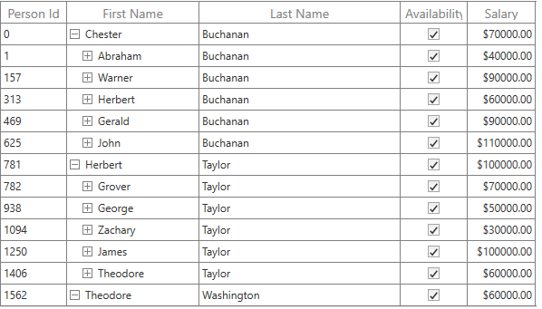

# Column Sizing in WPF TreeGrid (SfTreeGrid)

SfTreeGrid allows you to set the column widths based on certain logic using [SfTreeGrid.ColumnSizer](https://help.syncfusion.com/cr/wpf/Syncfusion.UI.Xaml.TreeGrid.SfTreeGrid.html#Syncfusion_UI_Xaml_TreeGrid_SfTreeGrid_ColumnSizer) or [TreeGridColumn.ColumnSizer](https://help.syncfusion.com/cr/wpf/Syncfusion.UI.Xaml.TreeGrid.TreeGridColumn.html#Syncfusion_UI_Xaml_TreeGrid_TreeGridColumn_ColumnSizer) property. 

Below is the list of predefined column sizing options available.

<table>
<tr>
<th>
Type
</th>
<th>
Column width
</th>
</tr>
<tr>
<td>
<code>Star</code>
</td>
<td>
Divides the total width equally for columns. 
</td>
</tr>
<tr>
<td>
<code>Auto</code>
</td>
<td>
Calculates the width of column based on header and cell contents. So that header and cell content&#39;s are not truncated.  
</td>
</tr>
<tr>
<td>
<code>FillColumn</code>
</td>
<td>
While setting the `TreeGrid.ColumnSizer` property, all column widths are calculated based on content of cell and last column fills the remaining space of grid. And possible to set any column to fill the remaining space instead of last column by setting `TreeGridColumn.ColumnSizer` as `FillColumn` for that particular column.
</td>
</tr>
<tr>
<td>
<code>AutoFillColumn</code>
</td>
While setting the `TreeGrid.ColumnSizer` property, all column widths are calculated based on content of cell and the last column fills the remaining column width as auto fill. And possible to set any column to fill the remaining space instead of last column by setting `TreeGridColumn.ColumnSizer` as `AutoFillColumn` for that particular column.
<td>
</td>
</tr>
<tr>
<td>
<code>SizeToCells</code>
</td>
<td>
Calculates the width of column based on cell contents. So that cell content&#39;s are not truncated.  
</td>
</tr>
<tr>
<td>
<code>SizeToHeader</code>
</td>
<td>
Calculates the width of column based on header content. So that header content is not truncated.  
</td>
</tr>
<tr>
<td>
<code>None</code>
</td>
<td>
Default column width or defined width set to column.
</td>
</tr>
</table>

N> ColumnSizer will not work when the column width defined explicitly. ColumnSizer calculates column width based on `MinWidth` and `MaxWidth` properties.

Below code, applies `GridLengthUnitType.Star` to equally set width for `SfTreeGrid.Columns`.




<syncfusion:SfTreeGrid Name="treeGrid"
					AutoExpandMode="RootNodesExpanded"
					AutoGenerateColumns="True"
					ChildPropertyName="Children"
					ColumnSizer="Star"
					ExpanderColumn="FirstName"
					ItemsSource="{Binding PersonDetails}">
					



N> The `TreeGridColumn.ColumnSizer` takes higher priority than the `SfTreeGrid.ColumnSizer`.

### Refreshing ColumnSizer at runtime

You can refresh the `ColumnSizer` at runtime by calling [SfTreeGrid.TreeGridColumnSizer.Refresh](https://help.syncfusion.com/cr/wpf/Syncfusion.UI.Xaml.TreeGrid.TreeGridColumnSizer.html#Syncfusion_UI_Xaml_TreeGrid_TreeGridColumnSizer_Refresh().html) method.
SfTreeGrid support to recalculates the column auto width by calling reset methods of `TreeGridColumnSizer`. [TreeGridColumnSizer.ResetAutoCalculationforAllColumns](https://help.syncfusion.com/cr/wpf/Syncfusion.UI.Xaml.Grid.ColumnSizerBase-1.html#Syncfusion_UI_Xaml_Grid_ColumnSizerBase_1_ResetAutoCalculationforAllColumns) method reset widths to all columns. [TreeGridColumnSizer.ResetAutoCalculation](https://help.syncfusion.com/cr/wpf/Syncfusion.UI.Xaml.Grid.ColumnSizerBase-1.html#Syncfusion_UI_Xaml_Grid_ColumnSizerBase_1_ResetAutoCalculation_Syncfusion_UI_Xaml_Grid_GridColumnBase_) method reset the width to particular column.

N> The `TreeGridColumnSizer.ResetAutoCalculationforAllColumns` or `TreeGridColumnSizer.ResetAutoCalculation` methods applicable for Auto, FillColumn, AutoFillColumn, SizeToCells types.

For example, you can refresh all the column&#39;s width based on the cell contents of newly added records at runtime. 



var viewModel = this.treeGrid.DataContext as ViewModel;
viewModel.PersonDetails.Add(new PersonInfo("Smith", "Anders","Red", new DateTime(2008, 10, 26), null));
this.treeGrid.TreeGridColumnSizer.ResetAutoCalculationforAllColumns();
this.treeGrid.TreeGridColumnSizer.Refresh();   



### Resetting column width to apply ColumnSizer

When the width of the column is explicitly defined or column is resized, then column width is not changed based on `TreeGridColumnSizer`. You can reset [TreeGridColumn.Width](https://help.syncfusion.com/cr/wpf/Syncfusion.UI.Xaml.Grid.GridColumnBase.html#Syncfusion_UI_Xaml_Grid_GridColumnBase_Width) by setting `double.NaN` to apply column width based on column sizer.




foreach (var column in treeGrid.Columns)
{

	if (!double.IsNaN(column.Width))
		column.Width = double.NaN;
}
this.treeGrid.TreeGridColumnSizer.Refresh();   



### Customizing built-in column sizing logic

SfTreeGrid process column sizing operations in [TreeGridColumnSizer](http://help.syncfusion.com/cr/wpf/Syncfusion.UI.Xaml.Grid.GridColumnSizer.html) class. You can customize the column sizing operations by overriding `GridColumnSizer` and set it to `SfTreeGrid.TreeGridColumnSizer`.



this.treeGrid.TreeGridColumnSizer = new TreeGridColumnSizerExt(treeGrid);

public class TreeGridColumnSizerExt:TreeGridColumnSizer
{

	public TreeGridColumnSizerExt(SfTreeGrid treeGrid)
		:base(treeGrid)
	{
	}        

	// Calculate Width for column when ColumnSizer is SizeToCells.        

	protected override double CalculateCellWidth(TreeGridColumn column)
	{
		return base.CalculateCellWidth(column);
	}

	//Calculate Width for the column when ColumnSizer is SizeToHeader

	protected override double CalculateHeaderWidth(TreeGridColumn column)
	{
		return base.CalculateHeaderWidth(column);
	}
}



### Auto width calculation based on font settings

By default, the ColumnSizer calculates column&#39;s width based on fixed `FontSize`, `FontFamily`, `Margin`,`SortIconWidth`. You can change the calculation by customized settings.

#### Changing SortIcon width

You can change the filter icon and sort icon widths for column width calculation by setting [TreeGridColumnSizer.SortIconWidth](https://help.syncfusion.com/cr/wpf/Syncfusion.UI.Xaml.Grid.ColumnSizerBase-1.html#Syncfusion_UI_Xaml_Grid_ColumnSizerBase_1_SortIconWidth) properties.



this.treeGrid.TreeGridColumnSizer.SortIconWidth = 20;



#### Changing Font settings for SfTreeGrid

You can change the `font settings` for column width calculation by setting [TreeGridColumnSizer.FontSize](https://help.syncfusion.com/cr/wpf/Syncfusion.UI.Xaml.Grid.ColumnSizerBase-1.html#Syncfusion_UI_Xaml_Grid_ColumnSizerBase_1_FontSize), [TreeGridColumnSizer.FontFamily](https://help.syncfusion.com/cr/wpf/Syncfusion.UI.Xaml.Grid.ColumnSizerBase-1.html#Syncfusion_UI_Xaml_Grid_ColumnSizerBase_1_FontFamily) and [TreeGridColumnSizer.Margin](https://help.syncfusion.com/cr/wpf/Syncfusion.UI.Xaml.Grid.ColumnSizerBase-1.html#Syncfusion_UI_Xaml_Grid_ColumnSizerBase_1_Margin) properties.  This settings will be considered for all columns.



this.treeGrid.TreeGridColumnSizer.FontSize = 10.0;
this.treeGrid.TreeGridColumnSizer.FontFamily = new FontFamily("TimesNewRoman");
this.treeGrid.TreeGridColumnSizer.Margin = new Thickness(9, 3, 1, 3);



### Star column sizer ratio support

You can customize the `ColumnSizer.Star` width calculation logic by overriding [SetStarWidth](https://help.syncfusion.com/cr/wpf/Syncfusion.UI.Xaml.TreeGrid.TreeGridColumnSizer.html#Syncfusion_UI_Xaml_TreeGrid_TreeGridColumnSizer_SetStarWidth_System_Double_System_Collections_Generic_IEnumerable_Syncfusion_UI_Xaml_TreeGrid_TreeGridColumn__) method of [TreeGridColumnSizer](https://help.syncfusion.com/cr/wpf/Syncfusion.UI.Xaml.TreeGrid.TreeGridColumnSizer.html).

For example, you can calculate the column width, with specified ratios instead of dividing equal width for all columns in Star calculation using `ColumnRatio` attached property.



public static class StarRatio
{

	public static int GetColumnRatio(DependencyObject obj)
	{
		return (int)obj.GetValue(ColumnRatioProperty);
	}

	public static void SetColumnRatio(DependencyObject obj, int value)
	{
		obj.SetValue(ColumnRatioProperty, value);
	}

	public static readonly DependencyProperty ColumnRatioProperty = DependencyProperty.RegisterAttached("ColumnRatio", typeof(int), typeof(StarRatio), new PropertyMetadata(1, null));
}



Below code to define the star width calculation based on the `ColumnRatio`.



//Assign the customized TreeGridColumnSizerExt to SfTreeGrid.TreeGridColumnSizer
this.treeGrid.TreeGridColumnSizer = new TreeGridColumnSizerExt(treeGrid);

public class TreeGridColumnSizerExt : TreeGridColumnSizer
{

	public TreeGridColumnSizerExt(SfTreeGrid treeGrid) : base(treeGrid)
	{
	}

	protected override void SetStarWidth(double remainingColumnWidth, IEnumerable<TreeGridColumn> remainingColumns)
	{           
		var removedColumn = new List<TreeGridColumn>();
		var columns = remainingColumns.ToList();
		var totalRemainingStarValue = remainingColumnWidth;
		double removedWidth = 0;
		bool isRemoved;

		while (columns.Count > 0)
		{
			isRemoved = false;
			removedWidth = 0;
			var columnsCount = 0;

			columns.ForEach((col) =>
			{
				columnsCount += StarRatio.GetColumnRatio(col);
			});

			double starWidth = Math.Floor((totalRemainingStarValue / columnsCount));
			var column = columns.First();
			starWidth *= StarRatio.GetColumnRatio(column);
			double computedWidth = SetColumnWidth(column, starWidth);

			if (starWidth != computedWidth && starWidth > 0)
			{
				isRemoved = true;
				columns.Remove(column);

				foreach (var remColumn in removedColumn)
				{

					if (!columns.Contains(remColumn))
					{
						removedWidth += remColumn.ActualWidth;
						columns.Add(remColumn);
					}
				}
				removedColumn.Clear();
				totalRemainingStarValue += removedWidth;
			}

			totalRemainingStarValue = totalRemainingStarValue - computedWidth;

			if (!isRemoved)
			{
				columns.Remove(column);

				if (!removedColumn.Contains(column))
					removedColumn.Add(column);
			}
		}
	}
}
	



Below code uses the `ColumnRatio` to apply the defined star width for each column.




<syncfusion:SfTreeGrid Name="treeGrid"
			AutoExpandMode="RootNodesExpanded"
			AutoGenerateColumns="False"
			ChildPropertyName="Children"
			ColumnSizer="Star"
			ExpanderColumn="FirstName"
			ItemsSource="{Binding PersonDetails}">
	<syncfusion:SfTreeGrid.Columns>
		<syncfusion:TreeGridTextColumn HeaderText="Person Id" 
											MappingName="Id" 
											TextAlignment="Left" 
											local:StarRatio.ColumnRatio="1" />
		<syncfusion:TreeGridTextColumn HeaderText="First Name" 
											MappingName="FirstName" 
											local:StarRatio.ColumnRatio="2" />
		<syncfusion:TreeGridTextColumn HeaderText="Last Name" 
											MappingName="LastName" 
											local:StarRatio.ColumnRatio="3"/>
		<syncfusion:TreeGridCheckBoxColumn HeaderText="Availability" MappingName="LikesCake" />
		<syncfusion:TreeGridCurrencyColumn MappingName="Salary" />
	</syncfusion:SfTreeGrid.Columns>
</syncfusion:SfTreeGrid>
	



### Change the width of TreeGridComboBoxColumn based on it&#39;s ItemsSource

By default, the `ColumnSizer` calculates auto width based on the column content. You can change the auto width calculation for [TreeGridComboBoxColumn](https://help.syncfusion.com/cr/wpf/Syncfusion.UI.Xaml.TreeGrid.TreeGridComboBoxColumn.html) based on its items source by overriding the [CalculateCellWidth](https://help.syncfusion.com/cr/wpf/Syncfusion.UI.Xaml.TreeGrid.TreeGridColumnSizer.html#Syncfusion_UI_Xaml_TreeGrid_TreeGridColumnSizer_CalculateCellWidth_Syncfusion_UI_Xaml_TreeGrid_TreeGridColumn_) virtual method.

Below code creates `CustomColumnSizer` to change the width of `TreeGridComboboxColumn` and set to `SfTreeGrid.TreeGridColumnSizer`.



this.TreeGrid.TreeGridColumnSizer = new CustomColumnSizer(this.treeGrid);

public class CustomColumnSizer : TreeGridColumnSizer
{

	public CustomColumnSizer(SfTreeGrid treeGrid)
		: base(treeGrid)
	{
	}

	protected override double CalculateCellWidth(TreeGridColumn column)
	{

		if (column is TreeGridComboBoxColumn)
		{
			double colWidth = double.MaxValue;
			var source = (column as TreeGridComboBoxColumn).ItemsSource;
			string maximumComboItemsText = string.Empty;
			var clientSize = new Size(colWidth, TreeGrid.RowHeight);

			foreach (var comboItems in source)
			{
				string comboItemText = (string)comboItems;

				if (maximumComboItemsText.Length < comboItemText.Length)
					maximumComboItemsText = comboItemText;
			}
			var measureSize = MeasureText(clientSize, maximumComboItemsText, column, null, Syncfusion.UI.Xaml.Grid.GridQueryBounds.Width);
			return measureSize.Width + SystemParameters.ScrollWidth;
		}

		else
			return base.CalculateCellWidth(column);
	}
}




N> You can refer to our [WPF TreeGrid](https://www.syncfusion.com/wpf-controls/treegrid) feature tour page for its groundbreaking feature representations. You can also explore our [WPF TreeGrid example](https://github.com/syncfusion/wpf-demos) to know how to render and configure the treegrid.