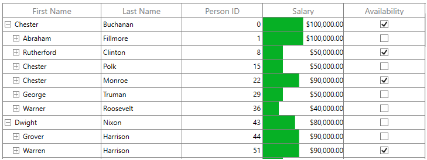
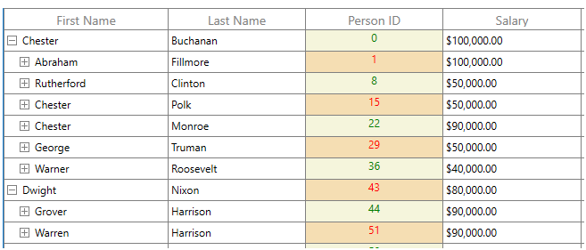
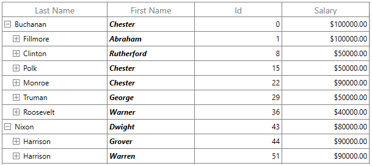
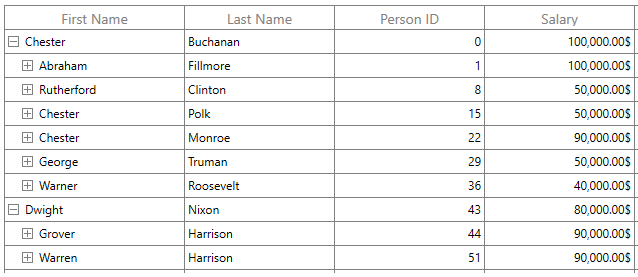
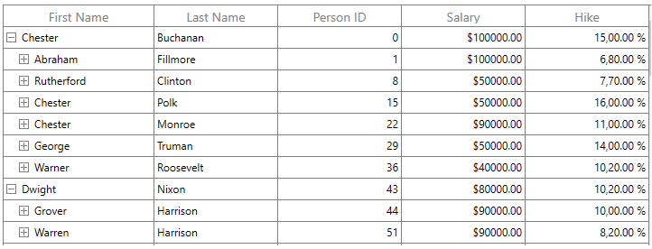
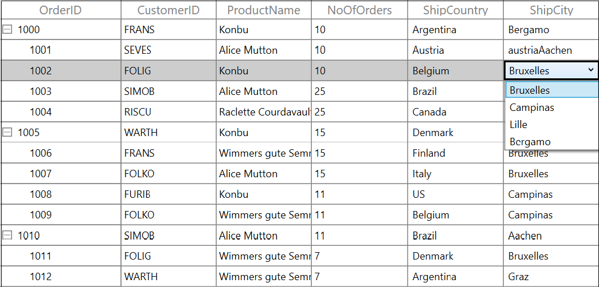
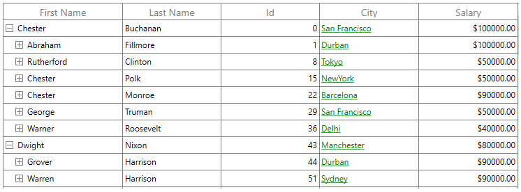
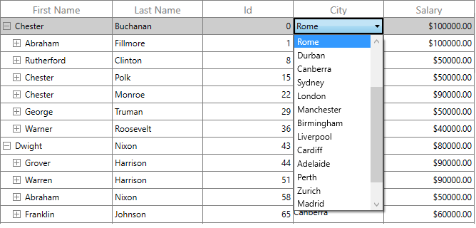

# Column Types in WPF TreeGrid (SfTreeGrid)

SfTreeGrid provides support for various built-in column types. Each column has its own properties and renderer to handle different types of data. 
You can also add or override existing columns and renderers as you need.

<table>
<tr>
<th>
Column Type
</th>
<th>
Renderer 
</th>
<th>
Description
</th>
</tr>
<tr>
<td>
{{'[TreeGridTextColumn](https://help.syncfusion.com/cr/wpf/Syncfusion.UI.Xaml.TreeGrid.TreeGridTextColumn.html#"")'| markdownify }}
</td>
<td>
{{'[TreeGridCellTextBoxRenderer](https://help.syncfusion.com/cr/wpf/Syncfusion.UI.Xaml.TreeGrid.Cells.TreeGridCellTextBoxRenderer.html#"")'| markdownify }}
</td>
<td>
Use to display the string data. 
</td>
</tr>
<tr>
<td>
{{'[TreeGridNumericColumn](https://help.syncfusion.com/cr/wpf/Syncfusion.UI.Xaml.TreeGrid.TreeGridNumericColumn.html#"")'| markdownify }}
</td>
<td>
{{'[TreeGridCellNumericRenderer](https://help.syncfusion.com/cr/wpf/Syncfusion.UI.Xaml.TreeGrid.Cells.TreeGridCellNumericRenderer.html#"")'| markdownify }}
</td>
<td>
Use to display the numeric data.
</td>
</tr>
<tr>
<td>
{{'[TreeGridCurrencyColumn](https://help.syncfusion.com/cr/wpf/Syncfusion.UI.Xaml.TreeGrid.TreeGridCurrencyColumn.html#"")'| markdownify }}
</td>
<td>
{{'[TreeGridCellCurrencyRenderer](https://help.syncfusion.com/cr/wpf/Syncfusion.UI.Xaml.TreeGrid.Cells.TreeGridCellCurrencyRenderer.html#"")'| markdownify }}
</td>
<td>
Use to display the currency value. 
</td>
</tr>
<tr>
<td>
{{'[TreeGridPercentColumn](https://help.syncfusion.com/cr/wpf/Syncfusion.UI.Xaml.TreeGrid.TreeGridPercentColumn.html#"")'| markdownify }}
</td>
<td>
{{'[TreeGridCellPercentageRenderer](https://help.syncfusion.com/cr/wpf/Syncfusion.UI.Xaml.TreeGrid.Cells.TreeGridCellPercentageRenderer.html#"")'| markdownify }}
</td>
<td>
Use to display the percent value. 
</td>
</tr>
<tr>
<td>
{{'[TreeGridMaskColumn](https://help.syncfusion.com/cr/wpf/Syncfusion.UI.Xaml.TreeGrid.TreeGridMaskColumn.html#"")'| markdownify }}
</td>
<td>
{{'[TreeGridCellMaskRenderer](https://help.syncfusion.com/cr/wpf/Syncfusion.UI.Xaml.TreeGrid.Cells.TreeGridCellMaskRenderer.html#"")'| markdownify }}
</td>
<td>
Use to display the data to be masked. 
</td>
</tr>
<tr>
<td>
{{'[TreeGridDateTimeColumn](https://help.syncfusion.com/cr/wpf/Syncfusion.UI.Xaml.TreeGrid.TreeGridDateTimeColumn.html#"")'| markdownify }}
</td>
<td>
{{'[TreeGridCellDateTimeRenderer](https://help.syncfusion.com/cr/wpf/Syncfusion.UI.Xaml.TreeGrid.Cells.TreeGridCellDateTimeRenderer.html#"")'| markdownify }}
</td>
<td>
Use to display the date time value.
</td>
</tr>
<tr>
<td>
{{'[TreeGridComboBoxColumn](https://help.syncfusion.com/cr/wpf/Syncfusion.UI.Xaml.TreeGrid.TreeGridComboBoxColumn.html#"")'| markdownify }}
</td>
<td>
{{'[TreeGridCellComboBoxRenderer](https://help.syncfusion.com/cr/wpf/Syncfusion.UI.Xaml.TreeGrid.Cells.TreeGridCellComboBoxRenderer.html#"")'| markdownify }}
</td>
<td>
Use to display the IEnumerable data using ComboBox.
</td>
</tr>
<tr>
<td>
{{'[TreeGridCheckBoxColumn](https://help.syncfusion.com/cr/wpf/Syncfusion.UI.Xaml.TreeGrid.TreeGridCheckBoxColumn.html#"")'| markdownify }}
</td>
<td>
{{'[TreeGridCellCheckBoxRenderer](https://help.syncfusion.com/cr/wpf/Syncfusion.UI.Xaml.TreeGrid.Cells.TreeGridCellCheckBoxRenderer.html#"")'| markdownify }}
</td>
<td>
Use to display the boolean type data.
</td>
</tr>
<tr>
<td>
{{'[TreeGridHyperlinkColumn](https://help.syncfusion.com/cr/wpf/Syncfusion.UI.Xaml.TreeGrid.TreeGridHyperlinkColumn.html#"")'| markdownify }}
</td>
<td>
{{'[TreeGridCellHyperLinkRenderer](https://help.syncfusion.com/cr/wpf/Syncfusion.UI.Xaml.TreeGrid.Cells.TreeGridCellHyperlinkRenderer.html#"")'| markdownify }}
</td>
<td>
Use to display the URI data.
</td>
</tr>
<tr>
<td>
{{'[TreeGridTemplateColumn](https://help.syncfusion.com/cr/wpf/Syncfusion.UI.Xaml.TreeGrid.TreeGridTemplateColumn.html#"")'| markdownify }}
</td>
<td>
{{'[TreeGridCellTemplateRenderer](https://help.syncfusion.com/cr/wpf/Syncfusion.UI.Xaml.TreeGrid.Cells.TreeGridCellTemplateRenderer.html#"")'| markdownify }}
</td>
<td>
Use to display the custom template-specified content.
</td>
</tr>
</table>

## TreeGridColumn

TreeGridColumn is an abstract class provides base functionalities for all the column types in SfTreeGrid. 

### Mapping column to particular property

Column can be bound to a property in data object using [TreeGridColumn.MappingName](https://help.syncfusion.com/cr/wpf/Syncfusion.UI.Xaml.Grid.GridColumnBase.html#Syncfusion_UI_Xaml_Grid_GridColumnBase_MappingName) property. In addition, it supports to format or bind different property for display and edit mode separately via [TreeGridColumn.DisplayBinding](https://help.syncfusion.com/cr/wpf/Syncfusion.UI.Xaml.Grid.GridColumnBase.html#Syncfusion_UI_Xaml_Grid_GridColumnBase_DisplayBinding) and [TreeGridColumn.ValueBinding](https://help.syncfusion.com/cr/wpf/Syncfusion.UI.Xaml.Grid.GridColumnBase.html#Syncfusion_UI_Xaml_Grid_GridColumnBase_ValueBinding). 

When you set `MappingName`, `DisplayBinding` and `ValueBinding` are created based on `MappingName`, if these properties are not defined explicitly. 

You can use `DisplayBinding` property to format the column in display, by setting `StringFormat` or `Converter` property of `Binding`.




<syncfusion:SfTreeGrid Name="treeGrid"
  					   AllowEditing="True"                        
					   AutoExpandMode="RootNodesExpanded"
					   AutoGenerateColumns="False"
					   ChildPropertyName="Children"                        
					   ItemsSource="{Binding EmployeeDetails}">
	<syncfusion:SfTreeGrid.Columns>
		<syncfusion:TreeGridTextColumn MappingName="Salary" DisplayBinding="{Binding Path=Salary, StringFormat='{}{0:C}'}"/>
	</syncfusion:SfTreeGrid.Columns>
</syncfusion:SfTreeGrid>




In the below screenshot, `Salary` column display value is formatted to currency by setting `DisplayBinding` property.

### CellTemplate in TreeGridColumn

You can load any WPF control in the display mode for all columns by setting [TreeGridColumn.CellTemplate](https://help.syncfusion.com/cr/wpf/Syncfusion.UI.Xaml.Grid.GridColumnBase.html#Syncfusion_UI_Xaml_Grid_GridColumnBase_CellTemplate) property. In edit mode, corresponding editor will be loaded based on column type. 

In the below code snippet, `TreeGridCurrencyColumn` is loaded with `ProgressBar` and `TextBlock`. When you start editing `DoubleTextBox` will be loaded as Editor.




<syncfusion:SfTreeGrid Name="treeGrid"
					   AllowEditing="True"
				       AllowSorting="True"
					   AutoExpandMode="RootNodesExpanded"
					   AutoGenerateColumns="False"
					   ChildPropertyName="Children"
					   ColumnSizer="Star"
					   ItemsSource="{Binding EmployeeDetails}"
					   LiveNodeUpdateMode="AllowDataShaping">
	<syncfusion:SfTreeGrid.Columns>
		<syncfusion:TreeGridCurrencyColumn MappingName="Salary" >
			<syncfusion:TreeGridCurrencyColumn.CellTemplate>
				<DataTemplate>
					<Grid>
						<ProgressBar x: Name="progressBar"
									    Background="Transparent"
										BorderThickness="0"
										Maximum="200000"
										Minimum="0"
										Visibility="Visible"
										Value="{Binding Salary}" />
						<TextBlock  HorizontalAlignment="Right"
									VerticalAlignment="Center"
									Text="{Binding Salary,
														Converter={StaticResource CurrencyConverter}}"
									TextAlignment="Center" />
					</Grid>
				</DataTemplate>
			</syncfusion:TreeGridCurrencyColumn.CellTemplate>
		</syncfusion:TreeGridCurrencyColumn>
	</syncfusion:SfTreeGrid.Columns>
</syncfusion:SfTreeGrid>
	



`CellTemplate` is not support by [TreeGridHyperlinkColumn](https://help.syncfusion.com/cr/wpf/Syncfusion.UI.Xaml.TreeGrid.TreeGridHyperlinkColumn.html) and[TreeGridCheckBoxColumn](https://help.syncfusion.com/cr/wpf/Syncfusion.UI.Xaml.TreeGrid.TreeGridCheckBoxColumn.html) columns.

#### Reusing same DataTemplate for multiple columns

By default, underlying record is `DataContext` for CellTemplate. So you have to define, template for each column to display values based on `MappingName`. 

You can use the same [DataTemplate](https://msdn.microsoft.com/en-us/library/windows/apps/windows.ui.xaml.datatemplate.aspx) for all columns to display value based on MappingName by setting [TreeGridColumn.SetCellBoundValue](https://help.syncfusion.com/cr/wpf/Syncfusion.UI.Xaml.Grid.GridColumnBase.html#Syncfusion_UI_Xaml_Grid_GridColumnBase_SetCellBoundValue)  property to `true`. Setting `SetCellBoundValue` to true, changes the DataContext for CellTemplate to `DataContextHelper` which has the following members,

* `Value` - Return the value base on `MappingName`.
* `Record` - Returns the underlying data object.




<DataTemplate   x:Key="cellTemplate">
	<TextBlock  Foreground="Red"
			Margin="3,0,0,0"
			Text="{Binding Path=Value}"/>
</DataTemplate>

<syncfusion:SfTreeGrid  Name="treeGrid"
					    AutoExpandMode="RootNodesExpanded"
					    AutoGenerateColumns="False"
					    ChildPropertyName="Children"
					    ColumnSizer="Star"
				    	ItemsSource="{Binding EmployeeDetails}">
				<syncfusion:SfTreeGrid.Columns>
					<syncfusion:TreeGridTextColumn HeaderText="First Name" MappingName="FirstName" 
												   SetCellBoundValue="True"
												   CellTemplate="{StaticResource cellTemplate}"/>
					<syncfusion:TreeGridTextColumn HeaderText="Last Name" MappingName="LastName" />
					<syncfusion:TreeGridNumericColumn HeaderText="Person ID" MappingName="Id"  NumberDecimalDigits="0"
													  SetCellBoundValue="True"
													  CellTemplate="{StaticResource cellTemplate}"/>
					<syncfusion:TreeGridTextColumn MappingName="Salary" DisplayBinding="{Binding Path=Salary, StringFormat='{}{0:C}'}"/>
					<syncfusion:TreeGridCheckBoxColumn HeaderText="Availability" MappingName="IsAvailable" />
				</syncfusion:SfTreeGrid.Columns>
</syncfusion:SfTreeGrid>
	



#### Setting CellTemplate based on custom logic using TemplateSelector

`TreeGridColumn` provides support to choose different[DataTemplate](https://msdn.microsoft.com/en-us/library/windows/apps/windows.ui.xaml.datatemplate.aspx) based on underlying data object using [TreeGridColumn.CellTemplateSelector](https://help.syncfusion.com/cr/wpf/Syncfusion.UI.Xaml.Grid.GridColumnBase.html#Syncfusion_UI_Xaml_Grid_GridColumnBase_CellTemplateSelector) property.  

For example, two different templates loaded alternatively in `Salary` column. 




<Window.Resources>			
	<local:CustomCellTemplateSelector x:Key="cellTemplateSelector"/>
	<DataTemplate   x:Key="DefaultTemplate">
		<TextBlock  Background="Wheat"
				    Foreground="Red"
				    Text="{Binding Path=Id}"
			    	TextAlignment="Center" />
	</DataTemplate>
	<DataTemplate   x:Key="AlternateTemplate">
		<TextBlock  Background="Beige"
				    Foreground="Green"
				    Text="{Binding Path=Id}"
				    TextAlignment="Center" />
	</DataTemplate>
</Window.Resources>
	



Below code returns the `DefaultTemplate` and `AlternateTemplate` based on Salary? value.




public class CustomCellTemplateSelector : DataTemplateSelector
{

	public override System.Windows.DataTemplate SelectTemplate(object item, System.Windows.DependencyObject container)
	{

		if (item == null)
			return null;
		var data = item as Employee;            

		if (data.Id % 2 == 0)
			return Application.Current.MainWindow.FindResource("AlternateTemplate") as DataTemplate;

		else
			return Application.Current.MainWindow.FindResource("DefaultTemplate") as DataTemplate;
	}
}
	



In the below code, the custom template selector set to `TreeGridColumn.CellTemplateSelector`.




<syncfusion:SfTreeGrid Name="treeGrid"
					AutoExpandMode="RootNodesExpanded"
					AutoGenerateColumns="False"
					ChildPropertyName="Children"
					ColumnSizer="Star"
					ItemsSource="{Binding EmployeeDetails}">
	<syncfusion:SfTreeGrid.Columns>						
		<syncfusion:TreeGridTextColumn HeaderText="Person ID" MappingName="Id"  
									   CellTemplateSelector="{StaticResource cellTemplateSelector}"/>						
	</syncfusion:SfTreeGrid.Columns>
</syncfusion:SfTreeGrid>      
	



N> Non-Editable columns does not support `CellTemplate`.

#### Binding ViewModel properties with CellTemplate

You can bind properties in ViewModel with the controls in CellTemplate.
 
Below command defined in ViewModel is bound to `Button` inside `CellTemplate`. Below code, denote the base command.




public class BaseCommand : ICommand
{
	#region Fields
	readonly Action<object> _execute;
	readonly Predicate<object> _canExecute;
	public event EventHandler CanExecuteChanged;
	#endregion
	#region Constructors
	
	/// 

	/// Creates a new command that always execute.
	/// 

	/// <param name="execute">The execution logic.</param>

	public BaseCommand(Action<object> execute)
		: this(execute, null)
	{
	}

	/// 

	/// Creates a new command.
	/// 

	/// <param name="execute">The execution logic.</param>
	/// <param name="canExecute">The execution status logic.</param>

	public BaseCommand(Action<object> execute, Predicate<object> canExecute)
	{

		if (execute == null)
			throw new ArgumentNullException("execute");
		_execute = execute;
		_canExecute = canExecute;
	}
	#endregion        
	bool ICommand.CanExecute(object parameter)
	{
		return _canExecute == null ? true : _canExecute(parameter);
	}

	void ICommand.Execute(object parameter)
	{
		_execute(parameter);
	}                
}
	



Below code, defines the command for `Button` in `ViewModel`.




public class ViewModel
{    
	private BaseCommand deleteRecord;

	public BaseCommand DeleteRecord
	{
		get
		{

			if (deleteRecord == null)
				deleteRecord = new BaseCommand(OnDeleteRecordClicked, OnCanDelete);
			return deleteRecord;
		}
	}

	private static bool OnCanDelete(object obj)
	{
		return true;
	}

	private void OnDeleteRecordClicked(object obj)
	{
		//TODO ACTION.
	}
}	
	



In the below code, Button inside CellTemplate bound to the command in ViewModel. 




<syncfusion:SfTreeGrid Name="treeGrid"
						AutoExpandMode="AllNodesExpanded"
						ChildPropertyName="ReportsTo"
						ItemsSource="{Binding Employees}"
						ParentPropertyName="ID">

	<syncfusion:SfTreeGrid.Columns>
		<syncfusion:TreeGridTextColumn HeaderText="ID" MappingName="ID">
			<syncfusion:TreeGridTextColumn.CellTemplate>
				<DataTemplate>
					<Button Command="{Binding DeleteRecord,
										Source={StaticResource viewModel}}"
							CommandParameter="{Binding}" 
							HorizontalAlignment="Stretch" 
							VerticalAlignment="Stretch"
							Content="Delete" />
								   <!--or-->
					 <Button Command="{Binding DataContext.DeleteRecord,
											  ElementName=treeGrid}"
									 CommandParameter="{Binding}"
									 Content="Delete" />
				</DataTemplate>
			</syncfusion:TreeGridTextColumn.CellTemplate>
		</syncfusion:TreeGridTextColumn>
	</syncfusion:SfTreeGrid.Columns>
</syncfusion:SfTreeGrid>




### Data Formatting

`TreeGridColumn` supports to format the data using [Converter](https://msdn.microsoft.com/en-us/library/windows/apps/windows.ui.xaml.data.binding.converter.aspx) properties, by defining `TreeGridColumn.DisplayBinding` and `TreeGridColumn.ValueBinding`. `TreeGridColumn.DisplayBinding` formats the data in display mode. `TreeGridColumn.ValueBinding` formats the data in edit mode.

#### Format column using StringFormat

You can apply format for the column using [StringFormat](https://msdn.microsoft.com/en-us/library/system.windows.data.bindingbase.stringformat.aspx) property by defining `DisplayBinding.StringFormat` applies to `TreeGridTexColumn` alone. Refer the Converter section to format the other column types.




<syncfusion:SfTreeGrid Name="treeGrid"
					AllowEditing="True"                        
					AutoExpandMode="RootNodesExpanded"
					AutoGenerateColumns="False"
					ChildPropertyName="Children"                        
					ItemsSource="{Binding EmployeeDetails}">
	<syncfusion:SfTreeGrid.Columns>
		<syncfusion:TreeGridTextColumn MappingName="Salary" DisplayBinding="{Binding Path=Salary, StringFormat='{}{0:C}'}"/>
	</syncfusion:SfTreeGrid.Columns>
</syncfusion:SfTreeGrid>
	



When column is auto-generated, you can set the 'StringFormat' by handling 'AutoGeneratingColumn' event.




void treeGrid_AutoGeneratingColumn(object sender, AutoGeneratingColumnArgs e)
{

	if (e.Column.MappingName == "Salary")
	{

		if (e.Column is TreeGridNumericColumn)
		{
			e.Column = new TreeGridTextColumn() { MappingName = "Salary", HeaderText = "Salary" };
		}
		e.Column.DisplayBinding = new Binding() { Path = new PropertyPath(e.Column.MappingName), StringFormat = "{0:C}" };
		e.Column.ValueBinding = new Binding() { Path = new PropertyPath(e.Column.MappingName),StringFormat="{0:C}" };
	}
}




#### Format column using Converter

You can format the column using `Converter` property by defining `DisplayBinding`. 




<Window.Resources>
	<local:CurrencyFormatConverter x:Key="CurrencyConverter" />
</Window.Resources>

<syncfusion:SfTreeGrid Name="treeGrid"
					AutoExpandMode="RootNodesExpanded"
					AutoGenerateColumns="False"
					ChildPropertyName="Children"
					ColumnSizer="Star"
					ItemsSource="{Binding EmployeeDetails}">

	<syncfusion:SfTreeGrid.Columns>
		<syncfusion:TreeGridNumericColumn MappingName="Salary" DisplayBinding="{Binding Path=Salary, Converter={StaticResource CurrencyConverter}}"/>
	</syncfusion:SfTreeGrid.Columns>
</syncfusion:SfTreeGrid>
	






public class CurrencyFormatConverter : IValueConverter
{

	public object Convert(object value, Type targetType, object parameter, string language)
	{
		return string.Format("{0:C2}", value);
	}

	public object ConvertBack(object value, Type targetType, object parameter, string language)
	{
		return value;
	}
}




When column is auto-generated, you can set the `Converter` by handling [AutoGeneratingColumn](https://help.syncfusion.com/cr/wpf/Syncfusion.UI.Xaml.TreeGrid.SfTreeGrid.html) event




treeGrid.AutoGeneratingColumn += TreeGrid_AutoGeneratingColumn;

private void TreeGrid_AutoGeneratingColumn(object sender, TreeGridAutoGeneratingColumnEventArgs e)
{

	if (e.Column.MappingName == "Salary")
	{

		if (e.Column is TreeGridNumericColumn)
		{
			e.Column = new TreeGridTextColumn() { MappingName = "Salary" };
		}
		e.Column.DisplayBinding = new Binding() { Path = new PropertyPath(e.Column.MappingName), Converter = new CurrencyFormatConverter() };
	}
}



### Styling TreeGridColumn

`TreeGridColumn` support to customize the style of particular column using [TreeGridColumn.CellStyle](https://help.syncfusion.com/cr/wpf/Syncfusion.UI.Xaml.Grid.GridColumnBase.html#Syncfusion_UI_Xaml_Grid_GridColumnBase_CellStyle) property.
 
#### Change the font setting

You can change the font settings such as `FontSize`, `FontFamily`, `FontWeight` etc. by writing style of TargetType `TreeGridCell` or `TreeGridColumn.CellStyle` property.




<syncfusion:SfTreeGrid  Name="treeGrid"
						AutoExpandMode="AllNodesExpanded"
						AutoGenerateColumns="True"
						ChildPropertyName="ReportsTo"
						ItemsSource="{Binding Employees}"
						ParentPropertyName="ID">
	<syncfusion:SfTreeGrid.Columns>
		<syncfusion:TreeGridTextColumn HeaderText="First Name" MappingName="FirstName">
			<syncfusion:TreeGridTextColumn.CellStyle>
				
			</syncfusion:TreeGridTextColumn.CellStyle>
		</syncfusion:TreeGridTextColumn>
	</syncfusion:SfTreeGrid.Columns>
</syncfusion:SfTreeGrid>
	



When column is auto-generated, you can style the column by handling `AutoGeneratingColumn` event




this.treeGrid.AutoGeneratingColumn += TreeGrid_AutoGeneratingColumn;

private void TreeGrid_AutoGeneratingColumn(object sender, TreeGridAutoGeneratingColumnEventArgs e)
{

	if (e.Column.MappingName == "FirstName")
	{
		 e.Column.CellStyle=this.Resources["cellStyle"] as Style;
	}
}
	



#### Styles based on custom logic

You can apply the styles to columns based on certain condition using [TreeGridColumn.CellStyleSelector](https://help.syncfusion.com/cr/wpf/Syncfusion.UI.Xaml.Grid.GridColumnBase.html#Syncfusion_UI_Xaml_Grid_GridColumnBase_CellStyleSelector) property.

Below code creates two different styles by TargetType `TreeGridCell`.




<Application.Resources>
	
	
</Application.Resources>




In the below code, returns the style based on `ID` value. Using `Container` you can format the columns data based on `TreeGridCell`.




public class CustomCellStyleSelector : StyleSelector
{

	protected override Style SelectStyleCore(object item, DependencyObject container)
	{
		var treeGridCell = container as TreeGridCell;
		var mappingName = treeGridCell.ColumnBase.TreeGridColumn.MappingName;
		var record = treeGridCell.DataContext;
		var cellValue = record.GetType().GetProperty(mappingName).GetValue(record);

		if (mappingName.Equals("ID"))
		{

			if (Convert.ToInt16(cellValue)%3==0)
				return App.Current.Resources["cellStyle1"] as Style;

			else
				return App.Current.Resources["cellStyle2"] as Style;
		}
		return base.SelectStyle(item, container);
	}
}
	



Below code, set the customized style selector to `TreeGridColumn.CellStyleSelector` property.




<Window.Resources>
	<local:CustomCellStyleSelector x:Key="cellStyleSelector>
</Window.Resources>

<syncfusion:SfTreeGrid Name="treeGrid"
						AutoExpandMode="AllNodesExpanded"
						AutoGenerateColumns="True"
						ChildPropertyName="ReportsTo"
						ItemsSource="{Binding Employees}"
						ParentPropertyName="ID">
	<syncfusion:SfTreeGrid.Columns>
		<syncfusion:TreeGridTextColumn MappingName="ID" 
									   CellStyleSelector="{StaticResource cellStyleSelector}" />
	</syncfusion:SfTreeGrid.Columns>
</syncfusion:SfTreeGrid>
	



When column is auto-generated, you can style the column by handling `AutoGeneratingColumn` event



this.treeGrid.AutoGeneratingColumn += TreeGrid_AutoGeneratingColumn;

private void TreeGrid_AutoGeneratingColumn(object sender, TreeGridAutoGeneratingColumnEventArgs e)
{

	if (e.Column.MappingName == "ID")
	{
		e.Column.CellStyleSelector = new CustomCellStyleSelector();
	}
}
	



### UI Interaction

#### Hide Column

You can hide or unhide the particular column programmatically by setting [TreeGridColumn.IsHidden](https://help.syncfusion.com/cr/wpf/Syncfusion.UI.Xaml.Grid.GridColumnBase.html#Syncfusion_UI_Xaml_Grid_GridColumnBase_IsHidden) property. For allowing end-user to hide or unhide column in UI refer [Resizing Columns](https://help.syncfusion.com/wpf/sftreegrid/columns#resizing-columns) section.

#### Disable column

You can disable column by setting [TreeGridColumn.AllowFocus](https://help.syncfusion.com/cr/wpf/Syncfusion.UI.Xaml.Grid.GridColumnBase.html#Syncfusion_UI_Xaml_Grid_GridColumnBase_AllowFocus) property. Therefore, that column can? be selected or edited. 

### Width, alignment and padding settings

#### Width

The width of `TreeGridColumn` can be changed by setting `Width` property. Column width set based on [TreeGridColumn.MinimumWidth](https://help.syncfusion.com/cr/wpf/Syncfusion.UI.Xaml.Grid.GridColumnBase.html#Syncfusion_UI_Xaml_Grid_GridColumnBase_MinimumWidth) and [TreeGridColumn.MaximumWidth](https://help.syncfusion.com/cr/wpf/Syncfusion.UI.Xaml.Grid.GridColumnBase.html#Syncfusion_UI_Xaml_Grid_GridColumnBase_MaximumWidth) properties.

N> If the `TreeGridColumn.Width` is defined explicitly takes priority than `TreeGridColumn.ColumnSizer`.

#### Padding

TreeGridColumn allows you to the change the padding of cell content by setting `Padding` property. 

#### Alignment

TreeGridColumn allows you to change the alignment of `TreeGridCell` and `TreeGridHeaderCellControl` content using `TextAlignment`, `VerticalAlignment` and `HorizontalHeaderContentAlignment` properties.

## TreeGridTextColumnBase

[TreeGridTextColumnBase](https://help.syncfusion.com/cr/wpf/Syncfusion.UI.Xaml.TreeGrid.TreeGridTextColumnBase.html) is the abstract class derived from `TreeGridColumn`. The following columns are derived from the `TreeGridTextColumnBase`.

1. TreeGridTextColumn

2. TreeGridDateTimeColumn

3. TreeGridNumericColumn

4. TreeGridMaskColumn

5. TreeGridTemplateColumn

### TreeGridTextColumnBase properties

* Text decorations - You can [decorate](https://msdn.microsoft.com/en-us/library/system.windows.textdecorations.aspx) column? data using [TextDecorations](https://help.syncfusion.com/cr/wpf/Syncfusion.UI.Xaml.TreeGrid.TreeGridTextColumnBase.html#Syncfusion_UI_Xaml_TreeGrid_TreeGridTextColumnBase_TextDecorations) property.

* Text trimming - You can [trim]() the column? data using [TextTrimming](https://help.syncfusion.com/cr/wpf/Syncfusion.UI.Xaml.TreeGrid.TreeGridTextColumnBase.html#Syncfusion_UI_Xaml_TreeGrid_TreeGridTextColumnBase_TextTrimming) property.

* Text wrapping - You can [wrap](https://msdn.microsoft.com/en-us/library/system.windows.textwrapping.aspx) the column? data using [TextWrapping](https://help.syncfusion.com/cr/wpf/Syncfusion.UI.Xaml.TreeGrid.TreeGridTextColumnBase.html#Syncfusion_UI_Xaml_TreeGrid_TreeGridTextColumnBase_TextWrapping) property. 




<syncfusion:SfTreeGrid Name="treeGrid"
					AutoExpandMode="RootNodesExpanded"                    
					ChildPropertyName="Children"                  
					ItemsSource="{Binding EmployeeDetails}">
	<syncfusion:SfTreeGrid.Columns>			
		<syncfusion:TreeGridTextColumn HeaderText="First Name" 
										MappingName="FirstName"
										TextDecorations="StrikeThrough"
										TextTrimming="WordEllipsis"
										TextWrapping="Wrap"/> 
	</syncfusion:SfTreeGrid.Columns>
</syncfusion:SfTreeGrid>
	



## TreeGridTextColumn

`TreeGridTextColumn` derived from `TreeGridTextColumnBase` which hosts `TextBox` in edit mode.




<syncfusion:SfTreeGrid Name="treeGrid"   
				AutoGenerateColumns="False"
				ChildPropertyName="ReportsTo"
				ItemsSource="{Binding Employees}"
				ParentPropertyName="ID">

	<syncfusion:SfTreeGrid.Columns>
		<syncfusion:TreeGridTextColumn HeaderText="First Name" 
									   MappingName="FirstName"  
									  />
	</syncfusion:SfTreeGrid.Columns>
</syncfusion:SfTreeGrid>




treeGrid.Columns.Add(new TreeGridTextColumn() { MappingName = "FirstName", HeaderText = "First Name" });



## TreeGridNumericColumn

[TreeGridNumericColumn](https://help.syncfusion.com/cr/wpf/Syncfusion.UI.Xaml.TreeGrid.TreeGridNumericColumn.html) derived from `TreeGridTextColumnBase` which displays columns data as numeric. It hosts `SfNumericTextBox` in editing mode.



	
<syncfusion:SfTreeGrid Name="treeGrid"   
					   AutoGenerateColumns="False"
					   ChildPropertyName="ReportsTo"
					   ItemsSource="{Binding Employees}"
					   ParentPropertyName="ID">
	<syncfusion:SfTreeGrid.Columns>
		<syncfusion:TreeGridNumericColumn MappingName="Salary" />
	</syncfusion:SfTreeGrid.Columns>	
</syncfusion:SfTreeGrid>
	




this.treeGrid.Columns.Add(new TreeGridNumericColumn() { MappingName = "Salary" });
  



### Data formatting

`TreeGridNumericColumn` allows you to format the numeric data with culture-specific information.

* [NumberDecimalDigits](https://help.syncfusion.com/cr/wpf/Syncfusion.UI.Xaml.TreeGrid.TreeGridNumericColumn.html#Syncfusion_UI_Xaml_TreeGrid_TreeGridNumericColumn_NumberDecimalDigits) - You can change the [Number of decimal digits](https://msdn.microsoft.com/en-us/library/system.globalization.numberformatinfo.numberdecimaldigits.aspx) to be displayed after the decimal point using `NumberDecimalDigits` property.

* [NumberDecimalSeparator](https://help.syncfusion.com/cr/wpf/Syncfusion.UI.Xaml.TreeGrid.TreeGridNumericColumn.html#Syncfusion_UI_Xaml_TreeGrid_TreeGridNumericColumn_NumberDecimalSeparator) - By default, the dot (.) operator [separates the decimal part](https://msdn.microsoft.com/en-us/library/system.globalization.numberformatinfo.numberdecimalseparator.aspx) of numeric value .You can use any operator as decimal separator using `NumberDecimalSeparator` property.

* [NumberGroupSeparator](https://help.syncfusion.com/cr/wpf/Syncfusion.UI.Xaml.TreeGrid.TreeGridNumericColumn.html#Syncfusion_UI_Xaml_TreeGrid_TreeGridNumericColumn_NumberGroupSeparator) - By default, the comma (,) [separates group of digits](https://msdn.microsoft.com/en-us/library/system.globalization.numberformatinfo.numbergroupseparator.aspx) before the decimal point. You can use any operator as group separator using `NumberGroupSeparator` property.

* [NumberGroupSizes](https://help.syncfusion.com/cr/wpf/Syncfusion.UI.Xaml.TreeGrid.TreeGridNumericColumn.html#Syncfusion_UI_Xaml_TreeGrid_TreeGridNumericColumn_NumberGroupSizes) - You can change the [number of digits in each group](https://msdn.microsoft.com/en-us/library/system.globalization.numberformatinfo.numbergroupsizes.aspx) before the decimal point on numeric values using `NumberGroupSizes` property.

* `Formatting negative pattern` - You can format the [pattern of negative](https://msdn.microsoft.com/en-us/library/system.globalization.numberformatinfo.numbernegativepattern.aspx) numeric values using `NumberNegativePattern`.




<syncfusion:SfTreeGrid Name="treeGrid"
				AutoExpandMode="RootNodesExpanded"                    
				ChildPropertyName="Children"                  
				ItemsSource="{Binding EmployeeDetails}">
<syncfusion:SfTreeGrid.Columns>        
	<syncfusion:TreeGridNumericColumn MappingName="Salary" 
									  NumberDecimalDigits="2"
									  NumberDecimalSeparator="."
									  NumberGroupSeparator=","
									  NumberGroupSizes="3"/>        
	</syncfusion:SfTreeGrid.Columns>
</syncfusion:SfTreeGrid>
	



## TreeGridCurrencyColumn

` TreeGridCurrencyColumn` derived from `GridEditorColumn` and it displays columns data as currency. It hosts `CurrencyTextBox` element in editing mode.




<syncfusion:SfTreeGrid Name="treeGrid"
				AutoExpandMode="RootNodesExpanded"                    
				ChildPropertyName="Children"                  
				ItemsSource="{Binding EmployeeDetails}">
	<syncfusion:SfTreeGrid.Columns>        
		<syncfusion:TreeGridCurrencyColumn MappingName="Salary" HeaderText = "Salary" />        
	</syncfusion:SfTreeGrid.Columns>
</syncfusion:SfTreeGrid>  





this.treeGrid.Columns.Add(new TreeGridCurrencyColumn() { MappingName = "Salary", HeaderText = "Salary" });




### Data formatting

`TreeGridCurrencyColumn` allows you to format the parsing currency data with culture-specific information.

* [CurrencySymbol](https://help.syncfusion.com/cr/wpf/Syncfusion.UI.Xaml.TreeGrid.TreeGridCurrencyColumn.html#Syncfusion_UI_Xaml_TreeGrid_TreeGridCurrencyColumn_CurrencySymbol) - By default, the currency symbol will be displayed based on culture. You can change the symbol using `CurrencySymbol` property. 

* [CurrencyDecimalDigits](https://help.syncfusion.com/cr/wpf/Syncfusion.UI.Xaml.TreeGrid.TreeGridCurrencyColumn.html#Syncfusion_UI_Xaml_TreeGrid_TreeGridCurrencyColumn_CurrencyDecimalDigits) - You can change the [number of decimal digits](https://msdn.microsoft.com/en-us/library/system.globalization.numberformatinfo.currencydecimaldigits.aspx) to be displayed after the decimal point on currency values using `CurrencyDecimalDigits` property. 

* [CurrencyDecimalSeparator](https://help.syncfusion.com/cr/wpf/Syncfusion.UI.Xaml.TreeGrid.TreeGridCurrencyColumn.html#Syncfusion_UI_Xaml_TreeGrid_TreeGridCurrencyColumn_CurrencyDecimalSeparator) - By default, the dot (.) operator [separates the decimal part](https://msdn.microsoft.com/en-us/library/system.globalization.numberformatinfo.currencydecimalseparator.aspx) of currency value .You can use any operator as decimal separator through `CurrencyDecimalSeparator` property. 

* [CurrencyGroupSeparator](https://help.syncfusion.com/cr/wpf/Syncfusion.UI.Xaml.TreeGrid.TreeGridCurrencyColumn.html#Syncfusion_UI_Xaml_TreeGrid_TreeGridCurrencyColumn_CurrencyGroupSeparator) - By default, the comma (,) [separates the group](https://msdn.microsoft.com/en-US/library/system.globalization.numberformatinfo.currencygroupseparator(v=vs.110).aspx) of digits before the decimal point on currency value .You can use any operator as group separator through CurrencyGroupSeparator property. 

* [CurrencyGroupSizes](https://help.syncfusion.com/cr/wpf/Syncfusion.UI.Xaml.TreeGrid.TreeGridCurrencyColumn.html#Syncfusion_UI_Xaml_TreeGrid_TreeGridCurrencyColumn_CurrencyGroupSizes) - You can specify [the number of digits in each group](https://msdn.microsoft.com/en-us/library/system.globalization.numberformatinfo.currencygroupsizes.aspx) before the decimal point on currency value using `CurrencyGroupSizes` property. 

* Pattern - You can format the pattern for both [positive](https://msdn.microsoft.com/en-us/library/system.globalization.numberformatinfo.currencypositivepattern.aspx) and [negative](https://msdn.microsoft.com/en-us/library/system.globalization.numberformatinfo.currencynegativepattern.aspx) currency values through [CurrencyPositivePattern](https://help.syncfusion.com/cr/wpf/Syncfusion.UI.Xaml.TreeGrid.TreeGridCurrencyColumn.html#Syncfusion_UI_Xaml_TreeGrid_TreeGridCurrencyColumn_CurrencyPositivePattern) and [CurrencyNegativePattern](https://help.syncfusion.com/cr/wpf/Syncfusion.UI.Xaml.TreeGrid.TreeGridCurrencyColumn.html#Syncfusion_UI_Xaml_TreeGrid_TreeGridCurrencyColumn_CurrencyNegativePattern). 




<syncfusion:SfTreeGrid Name="treeGrid"
				AutoExpandMode="RootNodesExpanded"                    
				ChildPropertyName="Children"                  
				ItemsSource="{Binding EmployeeDetails}">
	<syncfusion:SfTreeGrid.Columns>        
		<syncfusion:TreeGridCurrencyColumn MappingName="Salary" 
							   CurrencyDecimalDigits="2"
							   CurrencyDecimalSeparator="."
							   CurrencyGroupSeparator=","
							   CurrencyGroupSizes="3"
							   CurrencyPositivePattern="1"
							   CurrencySymbol="$"/>       
	</syncfusion:SfTreeGrid.Columns>
</syncfusion:SfTreeGrid>
	



## TreeGridPercentColumn

` TreeGridPercentColumn` derived from `GridEditorColumn` and it displays columns data as percent. It hosts `PercentTextBox` element in editing mode. 

You can display data as percent value or double value using [PercentEditMode](https://help.syncfusion.com/cr/wpf/Syncfusion.UI.Xaml.TreeGrid.TreeGridPercentColumn.html#Syncfusion_UI_Xaml_TreeGrid_TreeGridPercentColumn_PercentEditMode) property. `PercentEditMode.PercentMode` returns the value as percentage. `PercentEditMode.DoubleMode` returns the value as numeric.




<syncfusion:SfTreeGrid Name="treeGrid"
						AutoGenerateColumns="False"
						AutoExpandMode="RootNodesExpanded"                    
						ChildPropertyName="Children"                  
						ItemsSource="{Binding EmployeeDetails}">
	<syncfusion:SfTreeGrid.Columns>
		<syncfusion:TreeGridPercentColumn MappingName="Hike" HeaderText = "Hike"/>
	</syncfusion:SfTreeGrid.Columns>
</syncfusion:SfTreeGrid>





this.treeGrid.Columns.Add(new TreeGridPercentColumn() { MappingName = "Hike", HeaderText = "Hike" });




### Data formatting

`TreeGridPercentColumn` allows you to format the parsing percent data with culture-specific information.

* [PercentSymbol](https://help.syncfusion.com/cr/wpf/Syncfusion.UI.Xaml.TreeGrid.TreeGridPercentColumn.html#Syncfusion_UI_Xaml_TreeGrid_TreeGridPercentColumn_PercentSymbol) **-** By default, the percent operator (%) will be loaded with the value. You can change the symbol using `PercentSymbol` property. 

* [PercentDecimalDigits](https://help.syncfusion.com/cr/wpf/Syncfusion.UI.Xaml.TreeGrid.TreeGridPercentColumn.html#Syncfusion_UI_Xaml_TreeGrid_TreeGridPercentColumn_PercentDecimalDigits) **-** You can change the [number of decimal digits](https://msdn.microsoft.com/en-us/library/system.globalization.numberformatinfo.percentdecimaldigits.aspx) to be displayed after the decimal point on percent value can be specified using `PercentDecimalDigits` property. 

* [PercentDecimalSeparator](https://help.syncfusion.com/cr/wpf/Syncfusion.UI.Xaml.TreeGrid.TreeGridPercentColumn.html#Syncfusion_UI_Xaml_TreeGrid_TreeGridPercentColumn_PercentDecimalSeparator) **-** By default, the dot (.) operator [separates the decimal part](https://msdn.microsoft.com/en-us/library/system.globalization.numberformatinfo.percentdecimalseparator.aspx) of percent value .You can use any operator as decimal separator using `PercentDecimalSeparator` property.

* [PercentGroupSeparator](https://help.syncfusion.com/cr/wpf/Syncfusion.UI.Xaml.TreeGrid.TreeGridPercentColumn.html#Syncfusion_UI_Xaml_TreeGrid_TreeGridPercentColumn_PercentGroupSeparator) **-** By default, the comma (,) operator [separates the group](https://msdn.microsoft.com/en-us/library/system.globalization.numberformatinfo.percentgroupseparator.aspx) of digits left to the decimal point on currency value .You can use any operator as group separator using `PercentGroupSeparator` property. 

* [PercentGroupSizes](https://help.syncfusion.com/cr/wpf/Syncfusion.UI.Xaml.TreeGrid.TreeGridPercentColumn.html#Syncfusion_UI_Xaml_TreeGrid_TreeGridPercentColumn_PercentGroupSizes) **-** You can specify [the number of digits in each group](https://msdn.microsoft.com/en-us/library/system.globalization.numberformatinfo.percentgroupsizes.aspx) before the decimal point through `PercentGroupSizes` property. 

* Pattern **-** You can specify the pattern for both [positive](https://msdn.microsoft.com/en-us/library/system.globalization.numberformatinfo.percentpositivepattern.aspx) and [negative](https://msdn.microsoft.com/en-us/library/system.globalization.numberformatinfo.percentnegativepattern.aspx) percent values through [PercentPositivePattern](https://help.syncfusion.com/cr/wpf/Syncfusion.UI.Xaml.TreeGrid.TreeGridPercentColumn.html#Syncfusion_UI_Xaml_TreeGrid_TreeGridPercentColumn_PercentPositivePattern) and [PercentNegativePattern](https://help.syncfusion.com/cr/wpf/Syncfusion.UI.Xaml.TreeGrid.TreeGridPercentColumn.html#Syncfusion_UI_Xaml_TreeGrid_TreeGridPercentColumn_PercentNegativePattern).




<syncfusion:SfTreeGrid Name="treeGrid"
						AutoGenerateColumns="False"
						AutoExpandMode="RootNodesExpanded"                    
						ChildPropertyName="Children"                  
						ItemsSource="{Binding EmployeeDetails}">
	<syncfusion:SfTreeGrid.Columns>
		<syncfusion:TreeGridPercentColumn MappingName="Hike" 
							  PercentDecimalDigits="2"
							  PercentDecimalSeparator="."
							  PercentEditMode="PercentMode"
							  PercentGroupSeparator=","
							  PercentGroupSizes="2"
							  PercentPositivePattern="0"/>
	</syncfusion:SfTreeGrid.Columns>
</syncfusion:SfTreeGrid>  
 



## TreeGridDateTimeColumn

[TreeGridDateTimeColumn](https://help.syncfusion.com/cr/wpf/Syncfusion.UI.Xaml.TreeGrid.TreeGridDateTimeColumn.html) derived from `TreeGridTextColumnBase` and it displays columns data as date time. It hosts `SfDatePicker` element in editing mode.




<syncfusion:SfTreeGrid Name="treeGrid"                               
						ChildPropertyName="ReportsTo"
						ItemsSource="{Binding Employees}"
						ParentPropertyName="ID">

	<syncfusion:SfTreeGrid.Columns>
		<syncfusion:TreeGridDateTimeColumn MappingName="DOB" HeaderText="Employee DOB"/>
	</syncfusion:SfTreeGrid.Columns>
</syncfusion:SfTreeGrid>
	




treeGrid.Columns.Add(new TreeGridDateTimeColumn() { MappingName = "DOB", HeaderText = "Employee DOB" });
	



### Change the pattern of date time value

You can format the date time value using [TreeGridDateTimeColumn.Pattern](https://help.syncfusion.com/cr/wpf/Syncfusion.UI.Xaml.TreeGrid.TreeGridDateTimeColumn.html#Syncfusion_UI_Xaml_TreeGrid_TreeGridDateTimeColumn_Pattern) property, which contains the set of predefined date time patterns,

<table>
<tr>
<th>Pattern</th>
<th>Expected</th>
</tr>
<tr>
<td>LongDate</td>
<td>Monday, June 15, 2016</td></tr>
<tr>
<td>LongTime</td><td> 	1:45:30 PM</td></tr>
<tr>
<td>ShortDate</td><td> 	6/15/2016</td></tr>
<tr>
<td>ShortTime</td><td> 	1:45 PM</td></tr>
<tr>
<td>FullDateTime</td><td> 	Monday, June 15, 2016 1:45 PM</td></tr>
<tr>
<td>MonthDay</td><td> 	June 15 </td></tr>
<tr>
<td>RFC1123</td><td> 	Mon, 15 Jun 2016 20:45:30 GMT</td></tr>
<tr>
<td>SortableDateTime</td><td> 	2016-06-15T13:45:30</td></tr>
<tr>
<td>UniversalSortableDateTime</td><td> 	2016-06-15 13:45:30Z</td></tr>
<tr>
<td>YearMonth</td><td> 	June, 2016 </td></tr>
</table>

When the predefined `Pattern` does not meet your requirement, you can set the custom pattern using [CustomPattern](https://help.syncfusion.com/cr/wpf/Syncfusion.UI.Xaml.TreeGrid.TreeGridDateTimeColumn.html#Syncfusion_UI_Xaml_TreeGrid_TreeGridDateTimeColumn_CustomPattern) property.




<syncfusion:SfTreeGrid Name="treeGrid"
						AutoGenerateColumns="False"
						ColumnSizer="Star"
						AutoExpandMode="RootNodesExpanded"                    
						ChildPropertyName="Children"                  
						ItemsSource="{Binding EmployeeDetails}">
	<syncfusion:SfTreeGrid.Columns>        
		<syncfusion:TreeGridDateTimeColumn MappingName="DOB" HeaderText="Date of Birth" 
											CustomPattern="dd-mm-yyyy hh:mm:ss"
											Pattern="CustomPattern" />
	</syncfusion:SfTreeGrid.Columns>
</syncfusion:SfTreeGrid>




You can also change the format of standard date time pattern such as short pattern, long pattern, etc. by using [GridDateTimeColumn.DateTimeFormat](https://help.syncfusion.com/cr/wpf/Syncfusion.UI.Xaml.TreeGrid.TreeGridDateTimeColumn.html#Syncfusion_UI_Xaml_TreeGrid_TreeGridDateTimeColumn_DateTimeFormat) property.




<syncfusion:SfTreeGrid Name="treeGrid"
						AutoGenerateColumns="False"
						ColumnSizer="Star"
						AutoExpandMode="RootNodesExpanded"                    
						ChildPropertyName="Children"                  
						ItemsSource="{Binding EmployeeDetails}">
	<syncfusion:SfTreeGrid.Columns>        
		<syncfusion:TreeGridDateTimeColumn MappingName="DOB" HeaderText="Date of Birth"                                             
										Pattern="LongDate">
				<syncfusion:TreeGridDateTimeColumn.DateTimeFormat>
					<global:DateTimeFormatInfo LongDatePattern="dd-MM-yyyy hh:mm:ss" />
				</syncfusion:TreeGridDateTimeColumn.DateTimeFormat>
		</syncfusion:TreeGridDateTimeColumn>
	</syncfusion:SfTreeGrid.Columns>
</syncfusion:SfTreeGrid>




### AutoIncrement

You can allow end-user to increment or decrement the value when 'MouseWheel' or pressing up and down arrow keys by setting [AllowScrollingOnCircle](https://help.syncfusion.com/cr/wpf/Syncfusion.UI.Xaml.TreeGrid.TreeGridDateTimeColumn.html#Syncfusion_UI_Xaml_TreeGrid_TreeGridDateTimeColumn_AllowScrollingOnCircle) property to `true`.

### Null value support

`TreeGridDateTimeColumn` provides support to restrict or allow null value in columns based on [AllowNullValue](https://help.syncfusion.com/cr/wpf/Syncfusion.UI.Xaml.TreeGrid.TreeGridDateTimeColumn.html#Syncfusion_UI_Xaml_TreeGrid_TreeGridDateTimeColumn_AllowNullValue) property. Instead of displaying null values, you can display hint text using [NullText](https://help.syncfusion.com/cr/wpf/Syncfusion.UI.Xaml.TreeGrid.TreeGridDateTimeColumn.html#Syncfusion_UI_Xaml_TreeGrid_TreeGridDateTimeColumn_NullText) or or you can set the default value using [NullValue](https://help.syncfusion.com/cr/wpf/Syncfusion.UI.Xaml.TreeGrid.TreeGridDateTimeColumn.html#Syncfusion_UI_Xaml_TreeGrid_TreeGridDateTimeColumn_NullValue) property.




<syncfusion:TreeGridDateTimeColumn HeaderText="Employee DOB"
							       MappingName="DOB" 
							       AllowNullValue="True" 
							       NullValue="17/11/2016" />
							   



### Setting date time value range

You can restrict and display the input value with in the range using [MinDate](https://help.syncfusion.com/cr/wpf/Syncfusion.UI.Xaml.TreeGrid.TreeGridDateTimeColumn.html#Syncfusion_UI_Xaml_TreeGrid_TreeGridDateTimeColumn_MinDateTime) and [MaxDate](https://help.syncfusion.com/cr/wpf/Syncfusion.UI.Xaml.TreeGrid.TreeGridDateTimeColumn.html#Syncfusion_UI_Xaml_TreeGrid_TreeGridDateTimeColumn_MaxDateTime) properties.

### Editing support

By default, the user can input the date time value by selecting through Calendar in dropdown. You allow users to input or delete the date time value from the key board by setting [TreeGridDateTimeColumn.CanEdit](https://help.syncfusion.com/cr/wpf/Syncfusion.UI.Xaml.TreeGrid.TreeGridDateTimeColumn.html#Syncfusion_UI_Xaml_TreeGrid_TreeGridDateTimeColumn_CanEdit) to `true`.

### Disable date selection

You can disable the date selection on dropdown popup by setting the [DisableDateSelection](https://help.syncfusion.com/cr/wpf/Syncfusion.UI.Xaml.TreeGrid.TreeGridDateTimeColumn.html#Syncfusion_UI_Xaml_TreeGrid_TreeGridDateTimeColumn_DisableDateSelection) property to `true`, so dropdown calender displays months to select.

### EnableBackSpaceKey and EnableDeleteKey

You can delete using backspace and delete keys by setting [EnableBackSpaceKey](https://help.syncfusion.com/cr/wpf/Syncfusion.UI.Xaml.TreeGrid.TreeGridDateTimeColumn.html#Syncfusion_UI_Xaml_TreeGrid_TreeGridDateTimeColumn_EnableBackspaceKey) and [EnableDeleteKey](https://help.syncfusion.com/cr/wpf/Syncfusion.UI.Xaml.TreeGrid.TreeGridDateTimeColumn.html#Syncfusion_UI_Xaml_TreeGrid_TreeGridDateTimeColumn_EnableDeleteKey) properties to `true`.

### Enable clock and calendar

By default, the Calendar displayed in dropdown popup. You can enable both Calendar and Clock control in dropdown popup by setting the [EnableClassicStyle](https://help.syncfusion.com/cr/wpf/Syncfusion.UI.Xaml.TreeGrid.TreeGridDateTimeColumn.html#Syncfusion_UI_Xaml_TreeGrid_TreeGridDateTimeColumn_EnableClassicStyle) to `true`.

### Show repeat button

You can increment or decrement the selected part of date time value by enabling the repeat button through [TreeGridDateTimeColumn.ShowRepeatButton](https://help.syncfusion.com/cr/wpf/Syncfusion.UI.Xaml.TreeGrid.TreeGridDateTimeColumn.html#Syncfusion_UI_Xaml_TreeGrid_TreeGridDateTimeColumn_ShowRepeatButton) property.

### Format using Converter

`TreeGridDateTimeColumn` allows you to set different cultures by setting [ConverterCulture](https://msdn.microsoft.com/en-us/library/system.windows.data.binding.converterculture.aspx) property in [DisplayBinding](https://help.syncfusion.com/cr/wpf/Syncfusion.UI.Xaml.Grid.GridColumnBase.html#Syncfusion_UI_Xaml_Grid_GridColumnBase_DisplayBinding) and [ValueBinding](https://help.syncfusion.com/cr/wpf/Syncfusion.UI.Xaml.Grid.GridColumnBase.html#Syncfusion_UI_Xaml_Grid_GridColumnBase_ValueBinding).




<syncfusion:SfTreeGrid Name="treeGrid"
						AutoExpandMode="RootNodesExpanded"                    
						ChildPropertyName="Children"                  
						ItemsSource="{Binding EmployeeDetails}">
	<syncfusion:SfTreeGrid.Columns>        
		<syncfusion:TreeGridDateTimeColumn HeaderText="Date of Birth"                                             
									DisplayBinding="{Binding Path=DOB,
									ConverterCulture=fr-FR,
									Converter={StaticResource converter}}"
									ValueBinding="{Binding  Path=DOB,
									ConverterCulture=fr-FR}" />
	</syncfusion:SfTreeGrid.Columns>
</syncfusion:SfTreeGrid>
	



N> By default, short date pattern is applied in TreeGridDateTimeColumn.

Below code, returns the culture-specified date time value instead of default pattern.




public class CultureFormatConverter : IValueConverter
{

	public object Convert(object value, Type targetType, object parameter, System.Globalization.CultureInfo culture)
	{
		return value;
	}

	public object ConvertBack(object value, Type targetType, object parameter, System.Globalization.CultureInfo culture)
	{
		throw new NotImplementedException();
	}
}
	



## TreeGridCheckBoxColumn

[TreeGridCheckBoxColumn](https://help.syncfusion.com/cr/wpf/Syncfusion.UI.Xaml.TreeGrid.TreeGridCheckBoxColumn.html) derived from `TreeGridColumn` and it used display and edit `Boolean` type data. It hosts `CheckBox` element as `TreeGridCell` content.




<syncfusion:SfTreeGrid Name="treeGrid"
						ChildPropertyName="ReportsTo"
						ItemsSource="{Binding Employees}"
						ParentPropertyName="ID">
	<syncfusion:SfTreeGrid.Columns>
		<syncfusion:TreeGridCheckBoxColumn MappingName="AvailabilityStatus"/>
	</syncfusion:SfTreeGrid.Columns>
</syncfusion:SfTreeGrid>
	




treeGrid.Columns.Add(new TreeGridCheckBoxColumn() { MappingName = "AvailabilityStatus", HeaderText = "Available Status"	});
	




`TreeGridCheckBoxColumn` allows you to customize check box state and its alignment.

* [IsThreeState](https://help.syncfusion.com/cr/wpf/Syncfusion.UI.Xaml.TreeGrid.TreeGridCheckBoxColumn.html#Syncfusion_UI_Xaml_TreeGrid_TreeGridCheckBoxColumn_IsThreeState) - By default, the `TreeGridCheckBoxColumn` has `Checked` and `Unchecked**`** state. You can enable another `Intermediate` state setting `IsThreeState` property to `true`.

* [HorizontalAlignment](https://help.syncfusion.com/cr/wpf/Syncfusion.UI.Xaml.TreeGrid.TreeGridCheckBoxColumn.html#Syncfusion_UI_Xaml_TreeGrid_TreeGridCheckBoxColumn_HorizontalAlignment) - You can change the horizontal alignment of CheckBox using `HorizontalAlignment` property.  

## TreeGridTemplateColumn

[TreeGridTemplateColumn](https://help.syncfusion.com/cr/wpf/Syncfusion.UI.Xaml.TreeGrid.TreeGridTemplateColumn.html) derived from `TreeGridTextColumnBase` and it displays the template-specified cell content. You can load any WPF control in the display mode for all columns by setting [CellTemplate](https://help.syncfusion.com/cr/wpf/Syncfusion.UI.Xaml.Grid.GridColumnBase.html#Syncfusion_UI_Xaml_Grid_GridColumnBase_CellTemplate) and [EditTemplate](https://help.syncfusion.com/cr/wpf/Syncfusion.UI.Xaml.TreeGrid.TreeGridTemplateColumn.html#Syncfusion_UI_Xaml_TreeGrid_TreeGridTemplateColumn_EditTemplate) properties.

Using `CellTemplate`, you can format data or conditionally change the properties using [DataTrigger](https://msdn.microsoft.com/en-in/library/system.windows.datatrigger.aspx).




<syncfusion:SfTreeGrid Name="treeGrid"
                ChildPropertyName="ReportsTo"
                ItemsSource="{Binding Employees}"
                ParentPropertyName="ID">

    <syncfusion:SfTreeGrid.Columns>
        <syncfusion:TreeGridTemplateColumn MappingName="FirstName" HeaderText="First Name">
            <syncfusion:TreeGridTemplateColumn.CellTemplate>
                <DataTemplate>
                    <TextBlock Text="{Binding FirstName}"/>
                </DataTemplate>
            </syncfusion:TreeGridTemplateColumn.CellTemplate>
            <syncfusion:TreeGridTemplateColumn.EditTemplate>
                <DataTemplate>
                    <TextBox Text="{Binding FirstName}"
                                Syncfusion:FocusManagerHelper.FocusedElement="True"/>
                </DataTemplate>
            </syncfusion:TreeGridTemplateColumn.EditTemplate>
        </syncfusion:TreeGridTemplateColumn>
    </syncfusion:SfTreeGrid.Columns>
</syncfusion:SfTreeGrid>




DataTemplate cellTemplate = new DataTemplate();

FrameworkElementFactory frameworkElement1 = new FrameworkElementFactory(typeof(TextBlock));
Binding displayBinding = new Binding() { Path = new PropertyPath("FirstName") };

frameworkElement1.SetValue(TextBlock.TextProperty, displayBinding);

cellTemplate.VisualTree = frameworkElement1;

//EditTemplate creation.
DataTemplate editTemplate = new DataTemplate();

FrameworkElementFactory frameworkElement2 = new FrameworkElementFactory(typeof(TextBox));
Binding editBinding = new Binding() { Path = new PropertyPath("FirstName"), Mode = BindingMode.TwoWay };

frameworkElement2.SetValue(TextBox.TextProperty, editBinding);

editTemplate.VisualTree = frameworkElement2;

this.treeGrid.Columns.Add(new TreeGridTemplateColumn() { HeaderText = "First Name", MappingName = "FirstName", CellTemplate = cellTemplate, EditTemplate = editTemplate, SetCellBoundValue = false });




### Mouse interaction for UIElement loaded inside template

You can allow `UIElement` loaded inside `CellTemplate` or `EditTemplate` to handle mouse interaction in required cases by setting VisualContainer.WantsMouseInput attached property to the particular `UIElement` inside template.




<syncfusion:TreeGridTemplateColumn MappingName="City">
	<syncfusion:TreeGridTemplateColumn.CellTemplate>
		<DataTemplate>
			<ComboBox ItemsSource="{Binding CityCollection, Source={StaticResource viewModel}}" syncfusion:VisualContainer.WantsMouseInput="True" />
		</DataTemplate>
	</syncfusion:TreeGridTemplateColumn.CellTemplate>
</syncfusion:TreeGridTemplateColumn>
				

				

### Keyboard interaction for UIElement loaded inside CellTemplate

You can allow `UIElement` loaded inside `CellTemplate` to handle keyboard interaction by setting [FocusManagerHelper.WantsKeyInput](https://help.syncfusion.com/cr/wpf/Syncfusion.UI.Xaml.Grid.FocusManagerHelper.html#Syncfusion_UI_Xaml_Grid_FocusManagerHelper_WantsKeyInputProperty) attached property to `TreeGridColumn`. You can use this when loading edit element in CellTemplate. 

In this case SfTreeGrid handles the below key operations and other keys are handled by UIElement loaded inside `CellTemplate`. 

* <kbd>Tab</kbd>
* <kbd>Enter</kbd>
* <kbd>PageUp</kbd>
* <kbd>PageDown</kbd>




<syncfusion:TreeGridTemplateColumn MappingName="FirstName" 
									syncfusion:FocusManagerHelper.WantsKeyInput="True" 
									HeaderText="First Name">
	<syncfusion:TreeGridTemplateColumn.CellTemplate>
		<DataTemplate>
			<TextBlock Text="{Binding FirstName}"/>
		</DataTemplate>
	</syncfusion:TreeGridTemplateColumn.CellTemplate>                
</syncfusion:TreeGridTemplateColumn>
	



### Setting focus to particular element inside Template when cell gets activated or edited

You can allow logical focus to specific UIElement loaded inside `EditTemplate` or `CellTemplate` by setting `[FocusManagerHelper.FocusedElement](https://help.syncfusion.com/cr/wpf/Syncfusion.UI.Xaml.Grid.FocusManagerHelper.html#Syncfusion_UI_Xaml_Grid_FocusManagerHelper_FocusedElementProperty)` attached property. 

You can use this property to start editing the template column value as like normal column when the user gets into edit mode.



xmlns:sync="using:Syncfusion.UI.Xaml.Grid"
xmlns:syncfusion="using:Syncfusion.UI.Xaml.TreeGrid"

<syncfusion:SfTreeGrid Name="treeGrid"
                ChildPropertyName="ReportsTo"
                ItemsSource="{Binding Employees}"
                ParentPropertyName="ID">

    <syncfusion:SfTreeGrid.Columns>
        <syncfusion:TreeGridTemplateColumn MappingName="FirstName" HeaderText="First Name">
            <syncfusion:TreeGridTemplateColumn.CellTemplate>
                <DataTemplate>
                    <TextBlock Text="{Binding FirstName}"/>
                </DataTemplate>
            </syncfusion:TreeGridTemplateColumn.CellTemplate>
            <syncfusion:TreeGridTemplateColumn.EditTemplate>
                <DataTemplate>
                    <TextBox Text="{Binding FirstName}"
                                sync:FocusManagerHelper.FocusedElement="True"/>
                </DataTemplate>
            </syncfusion:TreeGridTemplateColumn.EditTemplate>
        </syncfusion:TreeGridTemplateColumn>
    </syncfusion:SfTreeGrid.Columns>
</syncfusion:SfTreeGrid>




### Binding CellTemplate and EditTemplate based on MappingName

By default, underlying record is `DataContext` for CellTemplate. So you have to define, template for each column to display values based on `MappingName`. 

You can use the same [DataTemplate](https://msdn.microsoft.com/en-us/library/windows/apps/windows.ui.xaml.datatemplate.aspx) for all columns to display value based on MappingName by setting [SetCellBoundValue](https://help.syncfusion.com/cr/wpf/Syncfusion.UI.Xaml.Grid.GridColumnBase.html#Syncfusion_UI_Xaml_Grid_GridColumnBase_SetCellBoundValue) property to `true`. Setting `SetCellBoundValue` to `true`, changes the DataContext for CellTemplate to [DataContextHelper](https://help.syncfusion.com/cr/wpf/Syncfusion.UI.Xaml.TreeGrid.Cells.TreeGridDataContextHelper.html) which has the following members,

* `Value` - Return the value base on `MappingName`.
* `Record` - Returns the underlying data object.

N> EditTemplate support available only for TreeGridTemplateColumn.



<syncfusion:SfTreeGrid Name="treeGrid"
                        AllowEditing="True"
                        AutoExpandMode="RootNodesExpanded"
                        AutoGenerateColumns="False"
                        ChildPropertyName="ReportsTo"
                        ItemsSource="{Binding Employees}"
                        ParentPropertyName="ID">

    <syncfusion:SfTreeGrid.Columns>
        <syncfusion:TreeGridTemplateColumn HeaderText="First Name"
                                        MappingName="FirstName"
                                        SetCellBoundValue="True">
            <syncfusion:TreeGridTemplateColumn.CellTemplate>
                <DataTemplate>
                    <Grid>
                        <TextBlock Text="{Binding FirstName}" />
                    </Grid>
                </DataTemplate>
            </syncfusion:TreeGridTemplateColumn.CellTemplate>
            <syncfusion:TreeGridTemplateColumn.EditTemplate>
                <DataTemplate>
                    <Grid>
                        <TextBox sync:FocusManagerHelper.FocusedElement="True" Text="{Binding FirstName}" />
                    </Grid>
                </DataTemplate>
            </syncfusion:TreeGridTemplateColumn.EditTemplate>
        </syncfusion:TreeGridTemplateColumn>
    </syncfusion:SfTreeGrid.Columns>
</syncfusion:SfTreeGrid>




### Set EditTemplate based on custom logic

`TreeGridTemplateColumn` provides support to load different edit elements based on underlying data object using [TreeGridTemplateColumn.EditTemplateSelector](https://help.syncfusion.com/cr/wpf/Syncfusion.UI.Xaml.TreeGrid.TreeGridTemplateColumn.html#Syncfusion_UI_Xaml_TreeGrid_TreeGridTemplateColumn_EditTemplateSelector) property.

Below code returns the `DefaultTemplate` and `AlternateTemplate` based on ID? value.




<Window.Resources>
	<local:CustomCellTemplateSelector x:Key="cellTemplateSelector"/>
	<local:CustomEditTemplateSelector x:Key="editTemplateSelector"/>

	<DataTemplate x:Key="DefaultCellTemplate">
		<TextBlock VerticalAlignment="Center"
			Foreground="Red"
			Text="{Binding Path=Id}"
			TextAlignment="Center" />
	</DataTemplate>

	<DataTemplate x:Key="AlternateCellTemplate">
		<TextBlock VerticalAlignment="Center"
			Foreground="Green"
			Text="{Binding Path=Id}"
			TextAlignment="Center" />
	</DataTemplate>

	<DataTemplate x:Key="DefaultEditTemplate">
		<TextBox Height="45"
			VerticalAlignment="Center"
			Foreground="Red"
			Text="{Binding Path=Id}"
			TextAlignment="Center" />
	</DataTemplate>

	<DataTemplate x:Key="AlternateEditTemplate">
		<TextBox Height="45"
			VerticalAlignment="Center"
			Foreground="Green"
			Text="{Binding Path=Id}"
			TextAlignment="Center" />
	</DataTemplate>

</Window.Resources>
	



public class CustomEditTemplateSelector : DataTemplateSelector
{

	public override System.Windows.DataTemplate SelectTemplate(object item, System.Windows.DependencyObject container)
	{

		if (item == null)
			return null;

		var data = item as Employee;

		if (data.Id % 2 == 0)
			return App.Current.Resources["AlternateEditTemplate"] as DataTemplate;

		else
			return App.Current.Resources["DefaultEditTemplate"] as DataTemplate;
	}
}

public class CustomCellTemplateSelector : DataTemplateSelector
{

	public override System.Windows.DataTemplate SelectTemplate(object item, System.Windows.DependencyObject container)
	{

		if (item == null)
			return null;
		var data = item as Employee;

		if (data.Id % 2 == 0)
			return Application.Current.MainWindow.FindResource("AlternateCellTemplate") as DataTemplate;

		else
			return Application.Current.MainWindow.FindResource("DefaultCellTemplate") as DataTemplate;
	}
}




In the below code, custom template selector set to `TreeGridTemplateColumn.EditTemplateSelector`.




<syncfusion:SfTreeGrid Name="treeGrid"
						AutoGenerateColumns="False"
						ColumnSizer="Star"
					   AllowEditing="True"
						AutoExpandMode="RootNodesExpanded"                    
						ChildPropertyName="Children"                  
						ItemsSource="{Binding EmployeeDetails}">
	<syncfusion:SfTreeGrid.Columns>                
		<syncfusion:TreeGridTemplateColumn MappingName="Id"
							   CellTemplateSelector="{StaticResource cellTemplateSelector}"    
							   EditTemplateSelector="{StaticResource editTemplateSelector}"/>
	</syncfusion:SfTreeGrid.Columns>
</syncfusion:SfTreeGrid>
	



## TreeGridComboBoxColumn

[TreeGridComboBoxColumn](https://help.syncfusion.com/cr/wpf/Syncfusion.UI.Xaml.TreeGrid.TreeGridComboBoxColumn.html) derived from `TreeGridColumn` which hosts `ComboBox` as edit element. The data source to ComboBox can be set by using `[TreeGridComboBoxColumn.ItemsSource](https://help.syncfusion.com/cr/wpf/Syncfusion.UI.Xaml.TreeGrid.TreeGridComboBoxColumn.html#Syncfusion_UI_Xaml_TreeGrid_TreeGridComboBoxColumn_ItemsSource) property.

By default, `TreeGridComboBoxColumn` displays the value using `MappingName` property. You can set [DisplayMemberPath](https://help.syncfusion.com/cr/wpf/Syncfusion.UI.Xaml.TreeGrid.TreeGridComboBoxColumn.html#Syncfusion_UI_Xaml_TreeGrid_TreeGridComboBoxColumn_DisplayMemberPath) which denotes the path to a value on the source object (TreeGridComboBoxColumn.ItemsSource) to serve as the visual representation of object. You can set the [SelectedValuePath](https://help.syncfusion.com/cr/wpf/Syncfusion.UI.Xaml.TreeGrid.TreeGridComboBoxColumn.html#Syncfusion_UI_Xaml_TreeGrid_TreeGridComboBoxColumn_SelectedValuePath) which denotes the path to get the SelectedValue from the SelectedItem. 




<syncfusion:SfTreeGrid x:Name="treeGrid"                              
						AutoGenerateColumns="False"
						ChildPropertyName="Children"                             
						ItemsSource="{Binding EmployeeDetails}">
	<syncfusion:SfTreeGrid.Columns>
		<syncfusion:TreeGridComboBoxColumn ItemsSource="{Binding CityCollection, Source={StaticResource viewModel}}" 
											MappingName="City" />
	</syncfusion:SfTreeGrid.Columns>
</syncfusion:SfTreeGrid>




treeGrid.Columns.Add(new TreeGridComboBoxColumn() {	MappingName = "City", ItemsSource = viewModel.CityCollection });




SfTreeGrid triggers, [CurrentCellDropDownSelectionChanged](https://help.syncfusion.com/cr/wpf/Syncfusion.UI.Xaml.Grid.SfDataGrid.html) event, when the SelectedValue is changed. [CurrentCellDropDownSelectionChangedEventArgs](https://help.syncfusion.com/cr/wpf/Syncfusion.UI.Xaml.Grid.CurrentCellDropDownSelectionChangedEventArgs.html) of [CurrentCellDropDownSelectionChanged](https://help.syncfusion.com/cr/wpf/Syncfusion.UI.Xaml.Grid.SfDataGrid.html) event provides the information about the changed cell value. 

`SelectedIndex` property returns the index of selected item.

`SelectedItem**`** property returns the selected item from drop down list.

### Keep the dropdown to be opened

You can keep the drop-down control open when start editing on the text box of `ComboBox` also by setting [StaysOpenOnEdit](https://help.syncfusion.com/cr/wpf/Syncfusion.UI.Xaml.TreeGrid.TreeGridComboBoxColumn.html#Syncfusion_UI_Xaml_TreeGrid_TreeGridComboBoxColumn_StaysOpenOnEdit) property to true.

### Improving dropdown opening time

You can improve the drop-down opening time on loading by setting [VirtualizingStackPanel](https://msdn.microsoft.com/en-us/library/windows/apps/windows.ui.xaml.controls.virtualizingstackpanel.aspx) as [ItemsPanelTemplate](https://msdn.microsoft.com/en-us/library/windows/apps/windows.ui.xaml.controls.itemspaneltemplate.aspx) of `ComboBox`, when the large number of items loaded in it.




<Window.Resources>
	
</Window.Resources>
	



### Opening dropdown popup in single-click

You can open the drop down within single click by setting [ComboBox.IsDropDownOpen](https://msdn.microsoft.com/en-us/library/windows/apps/windows.ui.xaml.controls.combobox.isdropdownopen.aspx) property to `true` in [OnEditElement](https://help.syncfusion.com/cr/wpf/Syncfusion.UI.Xaml.TreeGrid.Cells.TreeGridCellComboBoxRenderer.html#Syncfusion_UI_Xaml_TreeGrid_Cells_TreeGridCellComboBoxRenderer_OnEditElementLoaded_System_Object_System_Windows_RoutedEventArgs_) method by overriding existing renderer.
Below code, creates `TreeGridCellComboBoxRendererExt` to set `IsDropDownOpen` property. Replace the default renderer with created renderer in [SfTreeGrid.CellRenderers](https://help.syncfusion.com/cr/wpf/Syncfusion.UI.Xaml.TreeGrid.SfTreeGrid.html#Syncfusion_UI_Xaml_TreeGrid_SfTreeGrid_CellRenderers) collection.




treeGrid.CellRenderers.Remove("ComboBox");
treeGrid.CellRenderers.Add("ComboBox", new TreeGridCellComboBoxRendererExt());

public class TreeGridCellComboBoxRendererExt : TreeGridCellComboBoxRenderer
{

	protected override void OnEditElementLoaded(object sender, System.Windows.RoutedEventArgs e)
	{
		base.OnEditElementLoaded(sender, e);
		var combobox = sender as ComboBox;
		combobox.IsDropDownOpen = true;
	}
}




N> This is applicable when `SfTreeGrid.EditTrigger` is `OnTap`

### Loading Different ItemSource for each row of TreeGridComboBoxColumn

You can load the different ItemsSource to each row of TreeGridComboBoxColumn by setting  [SfTreeGrid.ItemsSourceSelector](https://help.syncfusion.com/cr/wpf/Syncfusion.UI.Xaml.TreeGrid.TreeGridComboBoxColumn.html#Syncfusion_UI_Xaml_TreeGrid_TreeGridComboBoxColumn_ItemsSourceSelector) property. 

### Implementing IItemsSourceSelector

`ItemsSourceSelector` needs to implement [IItemsSourceSelector](https://help.syncfusion.com/cr/wpf/Syncfusion.UI.Xaml.Grid.IItemsSourceSelector.html) interface which requires you to implement [GetItemsSource](https://help.syncfusion.com/cr/wpf/Syncfusion.UI.Xaml.Grid.IItemsSourceSelector.html#Syncfusion_UI_Xaml_Grid_IItemsSourceSelector_GetItemsSource_System_Object_System_Object_) method which receives the below parameters,
<ul>
<li> <b>Record</b> – data object associated with row.</li>
<li> <b>Data Context</b>  – Data context of data grid.</li>
</ul>

In the below code, ItemsSource for ShipCity column returned based on ShipCountry column value using the record and data context of data grid passed to `GetItemsSource` method.




<Window.Resources>
    <local:ItemsSourceSelector x:Key="itemSourceSelector" />
</Window.Resources>

<syncfusion:SfTreeGrid x:Name="treeGrid"         
						AllowEditing="True"
						AutoGenerateColumns="False"
						ChildPropertyName="Children"
						ItemsSource="{Binding OrderDetails}"
						ColumnSizer="Star">
    <interactivity:Interaction.Behaviors>
        <local:ItemsSourceSelectorBehavior />
    </interactivity:Interaction.Behaviors>
    <syncfusion:SfTreeGrid.Columns>
        <syncfusion:TreeGridComboBoxColumn MappingName="ShipCountry"  ItemsSource="{Binding Path=DataContext.CountryList, ElementName=treeGrid}"/>
        <syncfusion:TreeGridComboBoxColumn  HeaderText="ShipCity" DisplayMemberPath="ShipCityName"
                                        ItemsSourceSelector="{StaticResource itemSourceSelector}"
                                        MappingName="ShipCityID" SelectedValuePath="ShipCityID"/>
    </syncfusion:SfTreeGrid.Columns>
</syncfusion:SfTreeGrid>


/// 

/// Implementation class for ItemsSourceSelector interface
/// 

public class ItemsSourceSelector : IItemsSourceSelector
{
    public IEnumerable GetItemsSource(object record, object dataContext)
    {
        if (record == null)
            return null;
  
        var orderinfo = record as OrderDetails;
        var countryName = orderinfo.ShipCountry;
  
        var viewModel = dataContext as ViewModel;
  
        //Returns ShipCity collection based on ShipCountry.
        if (viewModel.ShipCities.ContainsKey(countryName))
        {
            ObservableCollection<ShipCityDetails> shipCities = null;
            viewModel.ShipCities.TryGetValue(countryName, out shipCities);
            return shipCities.ToList();
        }
        return null;
    }
}



The following screenshot illustrates the different ShipCity ItemsSource bound to each row of the ComboBox based on the Country Name.

You can download the sample from [here](http://www.syncfusion.com/downloads/support/directtrac/general/ze/ComboBoxColumnsDemo834486903.zip).

## TreeGridHyperlinkColumn

[TreeGridHyperlinkColumn](https://help.syncfusion.com/cr/wpf/Syncfusion.UI.Xaml.TreeGrid.TreeGridHyperlinkColumn.html) derived from `TreeGridTextColumn` and it displays columns data as hyperlink. It hosts `HyperlinkButton` element as `TreeGridCell` content.




<syncfusion:SfTreeGrid x:Name="treeGrid"
						AutoExpandMode="RootNodesExpanded"
						AllowEditing="True"
						AutoGenerateColumns="False"
						ChildPropertyName="Children"
						ItemsSource="{Binding EmployeeDetails}">
	<syncfusion:SfTreeGrid.Columns>
		<syncfusion:TreeGridHyperlinkColumn HeaderText="City" MappingName="CityDescription" />
	</syncfusion:SfTreeGrid.Columns>
</syncfusion:SfTreeGrid>
	



this.treeGrid.Columns.Add(new TreeGridHyperlinkColumn() { MappingName = "CityDescription",  HeaderText ="City" });




You can allow end-user to navigate the `Uri` when the cell value contains valid `Uri` address or using [CurrentCellRequestNavigate](https://help.syncfusion.com/cr/wpf/Syncfusion.UI.Xaml.Grid.SfDataGrid.html) event. The `CurrentCellRequestNavigate` occurs when the current cell in `TreeGridHyperLinkColumn` is clicked for navigation.  

[CurrentCellRequestNavigateEventArgs](https://help.syncfusion.com/cr/wpf/Syncfusion.UI.Xaml.TreeGrid.SfTreeGrid.html) of `CurrentCellRequestNavigate` event provide information about the hyperlink triggered this event. [CurrentCellRequestNavigateEventArgs.NavigateText](https://help.syncfusion.com/cr/wpf/Syncfusion.UI.Xaml.Grid.CurrentCellRequestNavigateEventArgs.html#Syncfusion_UI_Xaml_Grid_CurrentCellRequestNavigateEventArgs_NavigateText) returns the value using `ValueBinding` or `MappingName` to navigate. 




this.treeGrid.CurrentCellRequestNavigate += TreeGrid_CurrentCellRequestNavigate;  
							 
private async void TreeGrid_CurrentCellRequestNavigate(object sender, Syncfusion.UI.Xaml.Grid.CurrentCellRequestNavigateEventArgs args)
{
	var URI = string.Format("https://en.wikipedia.org/wiki/" + args.NavigateText);
	Windows.System.Launcher.LaunchUriAsync(new Uri(URI));
}




### Cancel the navigation

You can cancel the navigation when clicking hyperlink by setting [CurrentCellRequestNavigateEventArgs.Handled](https://help.syncfusion.com/cr/wpf/Syncfusion.UI.Xaml.Grid.CurrentCellRequestNavigateEventArgs.html#Syncfusion_UI_Xaml_Grid_CurrentCellRequestNavigateEventArgs_Handled) to `false`. 



	
this.treeGrid.CurrentCellRequestNavigate += TreeGrid_CurrentCellRequestNavigate;  
							 
private async void TreeGrid_CurrentCellRequestNavigate(object sender, Syncfusion.UI.Xaml.Grid.CurrentCellRequestNavigateEventArgs args)
{
	   args.Handled = true;
}
	



### Customize Hyperlink

#### Change the alignment

You can change the horizontal alignment of `TreeGridHyperlinkColumn` using [HorizontalAlignment](https://help.syncfusion.com/cr/wpf/Syncfusion.UI.Xaml.TreeGrid.TreeGridHyperlinkColumn.html#Syncfusion_UI_Xaml_TreeGrid_TreeGridHyperlinkColumn_HorizontalAlignment) property.

#### Change the foreground color

You can change the foreground color of `TreeGridHyperlinkColumn` by writing the style with target type `HyperlinkButton`.




<syncfusion:SfTreeGrid Name="treeGrid"
							AutoGenerateColumns="False"								                                  
							AutoExpandMode="RootNodesExpanded"                    
							ChildPropertyName="Children"                  
							ItemsSource="{Binding EmployeeDetails}">
	<syncfusion:SfTreeGrid.Columns>
		<syncfusion:TreeGridHyperlinkColumn HeaderText="City" MappingName="CityDescription">
			<syncfusion:TreeGridHyperlinkColumn.CellStyle>
				
					</Style.Resources>
				</Style>
			</syncfusion:TreeGridHyperlinkColumn.CellStyle>
		</syncfusion:TreeGridHyperlinkColumn>			
	</syncfusion:SfTreeGrid.Columns>
</syncfusion:SfTreeGrid>	
	



## TreeGridMaskColumn

`TreeGridMaskColumn` derived from `GridTextColumnBase` and it displays columns data with specified mask pattern. It hosts `MaskedTextBox` element in editing mode.

You can set the input mask at runtime by setting [TreeGridMaskColumn.Mask](https://help.syncfusion.com/cr/wpf/Syncfusion.UI.Xaml.TreeGrid.TreeGridMaskColumn.html#Syncfusion_UI_Xaml_TreeGrid_TreeGridMaskColumn_Mask) property.

For example, 

In the below code snippet, `Mask` applied to format and validate the user input to get five digit numeric value for phone number.




<syncfusion:SfTreeGrid Name="treeGrid"
							AutoGenerateColumns="False"								                                  
							AutoExpandMode="RootNodesExpanded"                    
							ChildPropertyName="Children"                  
							ItemsSource="{Binding EmployeeDetails}">
	<syncfusion:SfTreeGrid.Columns>
		<syncfusion:TreeGridMaskColumn HeaderText="Contact Number"
												   MappingName="ContactNumber"
												   Mask="(99)-9999"
												   TextAlignment="Left" />			
	</syncfusion:SfTreeGrid.Columns>
</syncfusion:SfTreeGrid>




this.treeGrid.Columns.Add(new TreeGridMaskColumn() { HeaderText = "Contact Number", MappingName = "ContactNumber", Mask = "(99)999" });




Mask for numeric value not exceeds two digits to the left of the decimal point. 

In the below code snippet, `Mask` applied to format and validate the user input to enter one digit double value.




<syncfusion:SfTreeGrid Name="treeGrid"
							AutoGenerateColumns="False"								                                  
							AutoExpandMode="RootNodesExpanded"                    
							ChildPropertyName="Children"                  
							ItemsSource="{Binding EmployeeDetails}">
	<syncfusion:SfTreeGrid.Columns>
		<syncfusion:TreeGridMaskColumn HeaderText="Contact Number"
												   MappingName="ContactNumber"
												   Mask="####.00" />			
	</syncfusion:SfTreeGrid.Columns>
</syncfusion:SfTreeGrid>	




### Specifying prompt character

By default, an underscore (_) is displayed when the user input is absent. This can be changed by setting [TreeGridMaskColumn.PromptChar](https://help.syncfusion.com/cr/wpf/Syncfusion.UI.Xaml.TreeGrid.TreeGridMaskColumn.html#Syncfusion_UI_Xaml_TreeGrid_TreeGridMaskColumn_PromptChar) property.




<syncfusion:SfTreeGrid Name="treeGrid"
							AutoGenerateColumns="False"								                                  
							AutoExpandMode="RootNodesExpanded"                    
							ChildPropertyName="Children"                  
							ItemsSource="{Binding EmployeeDetails}">
	<syncfusion:SfTreeGrid.Columns>
		<syncfusion:TreeGridMaskColumn HeaderText="Contact Number"
												   MappingName="ContactNumber"
												   Mask="#######"
												   PromptChar="^" />			
	</syncfusion:SfTreeGrid.Columns>
</syncfusion:SfTreeGrid>




### Setting mask format

You can decide whether the value contains the literals and prompt characters in it through [TreeGridMaskColumn.MaskFormat](https://help.syncfusion.com/cr/wpf/Syncfusion.UI.Xaml.TreeGrid.TreeGridMaskColumn.html#Syncfusion_UI_Xaml_TreeGrid_TreeGridMaskColumn_MaskFormat) property.

The `TreeGridMaskColumn.MaskFormat` property has the following format.

* `ExcludePromptAndLiterals`
* `IncludePrompt`
* `IncludeLiterals`
* `IncludePromptAndLiterals`

## Custom column support

SfTreeGrid allows you to create your own column by overriding predefined column type or creating a new custom column.

### Creating column from existing column

You can create your own column by overriding the [predefined](https://help.syncfusion.com/wpf/sftreegrid/column-type) column types in SfTreeGrid.

For example, the `TreeGridDateTimeColumn` loads the `DateTime` value by default. If you want to display [DateTimeOffset](https://msdn.microsoft.com/en-us/library/system.datetimeoffset.aspx) value, you can create a new column by overriding the `TreeGridDateTimeColumn` class.

In the below code snippet, converter created to format the DateTimeOffSet value to DateTime by defining `ValueBinding` (edit) and `DisplayBinding` (non-edit).




public class DateTimeOffsetFormatConverter : IValueConverter
{
	private TreeGridDateTimeOffsetColumn cachedColumn;
	public DateTimeOffsetFormatConverter(TreeGridDateTimeOffsetColumn column)
	{
		cachedColumn = column;
	}
	public object Convert(object value, Type targetType, object parameter, System.Globalization.CultureInfo culture)
	{
		value = ((DateTime)value);
		var column = cachedColumn as TreeGridDateTimeColumn;

		if (value == null || DBNull.Value == value)
		{

			if (column.AllowNullValue && column.MaxDateTime != System.DateTime.MaxValue && column.NullText == string.Empty)
				return column.MaxDateTime;

			if (column.AllowNullValue && column.NullValue != null)
				return column.NullValue;

			else if (column.AllowNullValue && column.NullText != string.Empty)
				return column.NullText;

			if (column.MaxDateTime != System.DateTime.MaxValue)
				return column.MaxDateTime;
		}

		DateTime _columnValue;
		_columnValue = (DateTime)value;

		if (_columnValue < column.MinDateTime)
			_columnValue = column.MinDateTime;

		if (_columnValue > column.MaxDateTime)
			_columnValue = column.MaxDateTime;

		return DateTimeFormatString(_columnValue, column);
	}

	private string DateTimeFormatString(DateTime columnValue, TreeGridDateTimeColumn column)
	{

		switch (column.Pattern)
		{

			case DateTimePattern.ShortDate:
				return columnValue.ToString("d", column.DateTimeFormat);

			case DateTimePattern.LongDate:
				return columnValue.ToString("D", column.DateTimeFormat);

			case DateTimePattern.LongTime:
				return columnValue.ToString("T", column.DateTimeFormat);

			case DateTimePattern.ShortTime:
				return columnValue.ToString("t", column.DateTimeFormat);

			case DateTimePattern.FullDateTime:
				return columnValue.ToString("F", column.DateTimeFormat);

			case DateTimePattern.RFC1123:
				return columnValue.ToString("R", column.DateTimeFormat);

			case DateTimePattern.SortableDateTime:
				return columnValue.ToString("s", column.DateTimeFormat);

			case DateTimePattern.UniversalSortableDateTime:
				return columnValue.ToString("u", column.DateTimeFormat);

			case DateTimePattern.YearMonth:
				return columnValue.ToString("Y", column.DateTimeFormat);

			case DateTimePattern.MonthDay:
				return columnValue.ToString("M", column.DateTimeFormat);

			case DateTimePattern.CustomPattern:
				return columnValue.ToString(column.CustomPattern, column.DateTimeFormat);

			default:
				return columnValue.ToString("MMMM", column.DateTimeFormat);
		}
	}

	public object ConvertBack(object value, Type targetType, object parameter, System.Globalization.CultureInfo culture)
	{
		throw new NotImplementedException();
	}
}

public class DateTimeOffsetToDateTimeConverter : IValueConverter
{

	public object Convert(object value, Type targetType, object parameter, System.Globalization.CultureInfo culture)
	{

		if (value == null)
			return null;
		return value != null ? ((DateTimeOffset)value).DateTime : DateTime.Now;
	}

	public object ConvertBack(object value, Type targetType, object parameter, System.Globalization.CultureInfo culture)
	{

		if (value == null)
			return null;
		return value != null ? (new DateTimeOffset((DateTime)value)) : new DateTimeOffset(DateTime.Now);
	}
}
	



In the below code snippet, `TreeGridDateTimeOffsetColumn` column created from `TreeGridDateTimeColumn`.




public class TreeGridDateTimeOffsetColumn : TreeGridDateTimeColumn
{

	protected override void SetDisplayBindingConverter()
	{

		if ((DisplayBinding as Binding).Converter == null)
			(DisplayBinding as Binding).Converter = new DateTimeOffsetFormatConverter(this);

		if ((ValueBinding as Binding).Converter == null)
			(ValueBinding as Binding).Converter = new DateTimeOffsetToDateTimeConverter();
	}
}




In the below code snippet, created `TreeGridDateTimeOffsetColumn` added to [SfTreeGrid.Columns](https://help.syncfusion.com/wpf/sfdatagrid/columns) collection and specify the full date-time pattern in `FormatString` as `F`. Since the `ShortDate` is the default pattern of `TreeGridDateTimeColumn`.




<local:TreeGridDateTimeOffsetColumn HeaderText="Employee DOB" 
								MappingName="DOB"
								Pattern="FullDateTime" />
								



this.treeGrid.Columns.Add(new TreeGridDateTimeOffsetColumn() { MappingName = "DOB",  Pattern = DateTimePattern.FullDateTime });




### Customize column renderer

SfTreeGrid allows you to customize the column related operations like key navigation and UI related interactions by overriding the corresponding renderer associated with the column. Each column has its own renderer with set of virtual methods for handling the column level operations. 
Below table lists the available cell types for unbound row and its renderers.
<table>
<tr>
<th>
Column Name
</th>
<th>
Renderer
</th>
<td>
Cell Type
</td>
</tr>
<tr>
<td>
{{'[TreeGridTextColumn](https://help.syncfusion.com/cr/wpf/Syncfusion.UI.Xaml.TreeGrid.TreeGridTextColumn.html#"")'| markdownify }}
</td>
<td>
{{'[TreeGridCellTextBoxRenderer](https://help.syncfusion.com/cr/wpf/Syncfusion.UI.Xaml.TreeGrid.Cells.TreeGridCellTextBoxRenderer.html#"")'| markdownify }}
</td>
<td>
TextBox
</td>
</tr>
<tr>
<td>
{{'[TreeGridNumericColumn](https://help.syncfusion.com/cr/wpf/Syncfusion.UI.Xaml.TreeGrid.TreeGridNumericColumn.html#"")'| markdownify }}
</td>
<td>
{{'[TreeGridCellNumericRenderer](https://help.syncfusion.com/cr/wpf/Syncfusion.UI.Xaml.TreeGrid.Cells.TreeGridCellNumericRenderer.html#"")'| markdownify }}
</td>
<td>
Numeric
</td>
</tr>
<tr>
<td>
{{'[TreeGridCurrencyColumn](https://help.syncfusion.com/cr/wpf/Syncfusion.UI.Xaml.TreeGrid.TreeGridCurrencyColumn.html#"")'| markdownify }}
</td>
<td>
{{'[TreeGridCellCurrencyRenderer](https://help.syncfusion.com/cr/wpf/Syncfusion.UI.Xaml.TreeGrid.Cells.TreeGridCellCurrencyRenderer.html#"")'| markdownify }}
</td>
<td>
Currency
</td>
</tr>
<tr>
<td>
{{'[TreeGridPercentColumn](https://help.syncfusion.com/cr/wpf/Syncfusion.UI.Xaml.TreeGrid.TreeGridPercentColumn.html#"")'| markdownify }}
</td>
<td>
{{'[TreeGridCellPercentageRenderer](https://help.syncfusion.com/cr/wpf/Syncfusion.UI.Xaml.TreeGrid.Cells.TreeGridCellPercentageRenderer.html#"")'| markdownify }}
</td>
<td>
Percent 
</td>
</tr>
<tr>
<td>
{{'[TreeGridMaskColumn](https://help.syncfusion.com/cr/wpf/Syncfusion.UI.Xaml.TreeGrid.TreeGridMaskColumn.html#"")'| markdownify }}
</td>
<td>
{{'[TreeGridCellMaskRenderer](https://help.syncfusion.com/cr/wpf/Syncfusion.UI.Xaml.TreeGrid.Cells.TreeGridCellMaskRenderer.html#"")'| markdownify }}
</td>
<td>
Mask 
</td>
</tr>
<tr>
<td>
{{'[TreeGridCheckBoxColumn](https://help.syncfusion.com/cr/wpf/Syncfusion.UI.Xaml.TreeGrid.TreeGridCheckBoxColumn.html#"")'| markdownify }}
</td>
<td>
{{'[TreeGridCheckBoxCellRenderer](https://help.syncfusion.com/cr/wpf/Syncfusion.UI.Xaml.TreeGrid.Cells.TreeGridCellCheckBoxRenderer.html#"")'| markdownify }}
</td>
<td>
CheckBox
</td>
</tr>
<tr>
<td>
{{'[TreeGridTemplateColumn](https://help.syncfusion.com/cr/wpf/Syncfusion.UI.Xaml.TreeGrid.TreeGridTemplateColumn.html#"")'| markdownify }}
</td>
<td>
{{'[TreeGridCellTemplateRenderer](https://help.syncfusion.com/cr/wpf/Syncfusion.UI.Xaml.TreeGrid.Cells.TreeGridCellTemplateRenderer.html#"")'| markdownify }}
</td>
<td>
Template
</td>
</tr>
<tr>
<td>
{{'[TreeGridComboBoxColumn](https://help.syncfusion.com/cr/wpf/Syncfusion.UI.Xaml.TreeGrid.TreeGridComboBoxColumn.html#"")'| markdownify }}
</td>
<td>
{{'[TreeGridCellComboBoxRenderer](https://help.syncfusion.com/cr/wpf/Syncfusion.UI.Xaml.TreeGrid.Cells.TreeGridCellComboBoxRenderer.html#"")'| markdownify }}
</td>
<td>
ComboBox
</td>
</tr>
<tr>
<td>
{{'[TreeGridDateTimeColumn](https://help.syncfusion.com/cr/wpf/Syncfusion.UI.Xaml.TreeGrid.TreeGridDateTimeColumn.html#"")'| markdownify }}
</td>
<td>
{{'[TreeGridCellDateTimeRenderer](https://help.syncfusion.com/cr/wpf/Syncfusion.UI.Xaml.TreeGrid.Cells.TreeGridCellDateTimeRenderer.html#"")'| markdownify }}
</td>
<td>
DateTime
</td>
</tr>
<tr>
<td>
{{'[TreeGridHyperlinkColumn](https://help.syncfusion.com/cr/wpf/Syncfusion.UI.Xaml.TreeGrid.TreeGridHyperlinkColumn.html#"")'| markdownify }}
</td>
<td>
{{'[TreeGridCellHyperlinkRenderer](https://help.syncfusion.com/cr/wpf/Syncfusion.UI.Xaml.TreeGrid.Cells.TreeGridCellHyperlinkRenderer.html#"")'| markdownify }}
</td>
<td>
HyperlinkButton
</td>
</tr>
</table>

Below code, creates the `TreeGridCellTextBoxRendererExt` to change the fore ground of `FirstName` column and replacing created renderer to `CellRenderers`.




this.treeGrid.CellRenderers.Remove("TextBox");
this.treeGrid.CellRenderers.Add("TextBox",new TreeGridCellTextBoxRendererExt());

public class TreeGridCellTextBoxRendererExt : TreeGridCellTextBoxRenderer
{

	public override void OnInitializeDisplayElement(TreeDataColumnBase dataColumn, TextBlock uiElement, object dataContext)
	{
		base.OnInitializeDisplayElement(dataColumn, uiElement, dataContext);

		if (dataColumn.TreeGridColumn.MappingName.Equals("FirstName"))
			uiElement.Foreground = new SolidColorBrush(Colors.Blue);
	}

	public override void OnUpdateDisplayBinding(TreeDataColumnBase dataColumn, TextBlock uiElement, object dataContext)
	{
		base.OnUpdateDisplayBinding(dataColumn, uiElement, dataContext);

		if (dataColumn.TreeGridColumn.MappingName.Equals("FirstName"))
			uiElement.Foreground = new SolidColorBrush(Colors.Blue);
	}
}
	



### Create the renderer of existing column

You can change the renderer of existing column by removing the predefined cell type value from [CellRenderers](https://help.syncfusion.com/cr/wpf/Syncfusion.UI.Xaml.TreeGrid.SfTreeGrid.html#Syncfusion_UI_Xaml_TreeGrid_SfTreeGrid_CellRenderers) collection and add the newly derived renderer from [TreeGridVirtualizingCellRenderer](https://help.syncfusion.com/cr/wpf/Syncfusion.UI.Xaml.TreeGrid.SfTreeGrid.html#Syncfusion_UI_Xaml_TreeGrid_SfTreeGrid_CellRenderers).

Below code creates the new `TreeGridComboBoxRenderer` with `ComboBoxAdv` as edit element for `TreeGridComboBoxColumn` and replacing created renderer to `CellRenderers`.




this.treeGrid.CellRenderers.Remove("ComboBox");
this.treeGrid.CellRenderers.Add("ComboBox", new TreeGridComboBoxRendererExt());

public class TreeGridComboBoxRendererExt : TreeGridVirtualizingCellRenderer<ContentControl, ComboBoxAdv>
{
	public TreeGridComboBoxRendererExt()
	{
	}

	/// 

	/// Create new display element.
	/// 

	/// <returns></returns>

	protected override ContentControl OnCreateDisplayUIElement()
	{
		return new ContentControl();
	}

	/// 

	/// Create new edit element.
	/// 

	/// <returns></returns>

	protected override ComboBoxAdv OnCreateEditUIElement()
	{
		return new ComboBoxAdv();
	}

	/// 

	/// Initialize binding for display element.
	/// 

	/// <param name="dataColumn"></param>
	/// <param name="uiElement"></param>
	/// <param name="dataContext"></param>

	public override void OnInitializeDisplayElement(TreeDataColumnBase dataColumn, ContentControl uiElement, object dataContext)
	{
		SetDisplayBinding(uiElement, dataColumn.TreeGridColumn, dataContext);
	}

	/// 

	/// custom binding for display element.
	/// 

	/// <param name="element"></param>
	/// <param name="column"></param>
	/// <param name="dataContext"></param>

	private static void SetDisplayBinding(ContentControl element, TreeGridColumn column, object dataContext)
	{
		var comboBoxColumn = (TreeGridComboBoxColumn)column;
		var binding = new Binding
		{
			Path = new PropertyPath(comboBoxColumn.MappingName),
			Mode = BindingMode.TwoWay,
			UpdateSourceTrigger = UpdateSourceTrigger.PropertyChanged,
			Converter = (comboBoxColumn.DisplayBinding as Binding).Converter,
		};
		element.SetBinding(ContentControl.ContentProperty, binding);
	}

	/// 

	/// Update binding for display element.
	/// 

	/// <param name="dataColumn"></param>
	/// <param name="uiElement"></param>
	/// <param name="dataContext"></param>

	public override void OnUpdateDisplayBinding(TreeDataColumnBase dataColumn, ContentControl uiElement, object dataContext)
	{
		SetDisplayBinding(uiElement, dataColumn.TreeGridColumn, dataContext);
	}

	/// 

	/// Initialize binding for edit element.
	/// 

	/// <param name="dataColumn"></param>
	/// <param name="uiElement"></param>
	/// <param name="dataContext"></param>

	public override void OnInitializeEditElement(TreeDataColumnBase dataColumn, ComboBoxAdv uiElement, object dataContext)
	{
		SetEditBinding(uiElement, dataColumn.TreeGridColumn, dataContext);
	}

	/// 

	/// Update binding for edit element.
	/// 

	/// <param name="dataColumn"></param>
	/// <param name="uiElement"></param>
	/// <param name="dataContext"></param>

	public override void OnUpdateEditBinding(TreeDataColumnBase dataColumn, ComboBoxAdv element, object dataContext)
	{
		SetEditBinding(element, dataColumn.TreeGridColumn, dataContext);
	}

	/// 

	/// custom binding for display element.
	/// 

	/// <param name="element"></param>
	/// <param name="column"></param>
	/// <param name="dataContext"></param>

	private static void SetEditBinding(ComboBoxAdv element, TreeGridColumn column, object dataContext)
	{
		var comboboxColumn = (TreeGridComboBoxColumn)column;
		var binding = new Binding
		{
			Source = dataContext,
			Path = new PropertyPath(comboboxColumn.MappingName),
			Mode = BindingMode.TwoWay,
			UpdateSourceTrigger = UpdateSourceTrigger.PropertyChanged,
		};
		element.SetBinding(ComboBoxAdv.SelectedValueProperty, binding);

		var itemsSourceBinding = new Binding { Path = new PropertyPath("ItemsSource"), Mode = BindingMode.TwoWay, Source = comboboxColumn };
		element.SetBinding(ComboBoxAdv.ItemsSourceProperty, itemsSourceBinding);

		var displayMemberBinding = new Binding { Path = new PropertyPath("DisplayMemberPath"), Mode = BindingMode.TwoWay, Source = comboboxColumn };
		element.SetBinding(ComboBoxAdv.DisplayMemberPathProperty, displayMemberBinding);

		var selectedValuePathBinding = new Binding { Path = new PropertyPath("SelectedValuePath"), Mode = BindingMode.TwoWay, Source = comboboxColumn };
		element.SetBinding(ComboBoxAdv.SelectedValuePathProperty, selectedValuePathBinding);

		var itemTemplateBinding = new Binding { Path = new PropertyPath("ItemTemplate"), Mode = BindingMode.TwoWay, Source = comboboxColumn };
		element.SetBinding(ComboBoxAdv.ItemTemplateProperty, itemTemplateBinding);

	}

	/// 

	/// Let Renderer decide whether the parent grid should be allowed to handle keys and prevent
	/// the key event from being handled by the visual UIElement for this renderer. 
	/// 

	/// <param name="e">A <see cref="KeyRoutedEventArgs" /> object.</param>
	/// <returns>
	/// True if the parent grid should be allowed to handle keys; false otherwise.
	/// </returns>  

	protected override bool ShouldGridTryToHandleKeyDown(System.Windows.Input.KeyEventArgs e)
	{

		if (!HasCurrentCellState || !IsInEditing)
			return true;

		switch (e.Key)
		{
			case Key.End:
			case Key.Home:
			case Key.Enter:
			case Key.Escape:
				return !((ComboBoxAdv)CurrentCellRendererElement).IsDropDownOpen;

			case Key.Down:
			case Key.Up:
			case Key.Left:
			case Key.Right:
				return !((ComboBoxAdv)CurrentCellRendererElement).IsDropDownOpen;
		}
		return base.ShouldGridTryToHandleKeyDown(e);
	}

	/// 

	/// Gets the control value.
	/// 

	public override object GetControlValue()
	{

		if (!HasCurrentCellState)
			return base.GetControlValue();
		return CurrentCellRendererElement.GetValue(IsInEditing ? ComboBoxAdv.SelectedValueProperty : ContentControl.ContentProperty);
	}

	/// 

	/// Set the control value.
	/// 

	/// <param name="value">The value.</param>

	public override void SetControlValue(object value)
	{

		if (!HasCurrentCellState)
			return;

		if (IsInEditing)
			((ComboBoxAdv)CurrentCellRendererElement).SelectedValue = value;

		else
			throw new Exception("Value cannot be Set for Unloaded Editor");
	}
}
	



### Creating new column and renderer

You can create a new column by deriving [TreeGridColumn](https://help.syncfusion.com/cr/wpf/Syncfusion.UI.Xaml.TreeGrid.TreeGridColumn.html), rendered in UI using customized [CellType](https://help.syncfusion.com/cr/wpf/Syncfusion.UI.Xaml.TreeGrid.TreeGridColumn.html#Syncfusion_UI_Xaml_TreeGrid_TreeGridColumn_CellType) using [GridVirtualizingCellRenderer](https://help.syncfusion.com/cr/wpf/Syncfusion.UI.Xaml.TreeGrid.Cells.TreeGridVirtualizingCellRenderer-2.html).

Below steps to create custom column in SfDataGrid.

*    Creating custom column
*    Creating renderer.
*    Adding the custom renderer to SfDataGrid.CellRenderers collection.
*    Defining custom column.

### Creating custom column

You can create custom column by overriding a new class from `TreeGridColumn` class.

Below code creates the converter to format the date time value.




public class CustomConverter : IValueConverter
{

	public object Convert(object value, Type targetType, object parameter, System.Globalization.CultureInfo culture)
	{

		if (string.IsNullOrEmpty(value.ToString()))
			return null;
		return new ConvertToDateTimeClass().ConvertToDateTime(value);
	}

	public object ConvertBack(object value, Type targetType, object parameter, System.Globalization.CultureInfo culture)
	{
		return new ConvertToDateTimeClass().ConvertToDateTime(value);
	}
}

public class ConvertToDateTimeClass
{

	public string ConvertToDateTime(object value)
	{
		DateTime date = Convert.ToDateTime(value);

		return date.Year + "/" + date.Month + "/" + date.Day;
	}
}




In the below code, new column created with converter using `SetDisplayBindingConverter` method.




public class DatePickerColumn : TreeGridColumn
{

	public DatePickerColumn()
	{
		SetCellType("DatePickerRenderer");
	}

	protected override void SetDisplayBindingConverter()
	{
		(this.DisplayBinding as Binding).Converter = new CustomConverter();
	}

	protected override Freezable CreateInstanceCore()
	{
		return new DatePickerColumn();
	}
}




### Creating renderer

After creating custom column, you need to create renderer for the custom column. Below are the steps to create custom renderer. You can create custom renderer either by deriving `TreeGridVirtualizingCellRenderer` class or overriding existing renderers.

In the below code snippet, display and edit `UIElement` defined via `TreeGridVirtualizingCellRenderer` parameter.




/// 

/// CustomRenderer Creation
/// 

/// <param name="TextBlock">Display Control</param>
/// <param name="DatePicker">Edit Control</param>

public class DatePickerRenderer : TreeGridVirtualizingCellRenderer<TextBlock, DatePicker>
{

	public DatePickerRenderer()
	{

	}
}




With the below code snippet, you can create the display and edit element for renderer by overriding [OnCreateDisplayUIElement](https://help.syncfusion.com/cr/wpf/Syncfusion.UI.Xaml.TreeGrid.Cells.TreeGridVirtualizingCellRendererBase-2.html#Syncfusion_UI_Xaml_TreeGrid_Cells_TreeGridVirtualizingCellRendererBase_2_OnCreateDisplayUIElement) and [OnCreateEditUIElement](https://help.syncfusion.com/cr/wpf/Syncfusion.UI.Xaml.TreeGrid.Cells.TreeGridVirtualizingCellRendererBase-2.html#Syncfusion_UI_Xaml_TreeGrid_Cells_TreeGridVirtualizingCellRendererBase_2_OnCreateEditUIElement) methods.




/// 

/// Create new display element.
/// 

/// <returns></returns>

protected override TextBlock OnCreateDisplayUIElement()
{
	return new TextBlock();
}
/// 

/// Create new edit element.
/// 

/// <returns></returns>

protected override DatePicker OnCreateEditUIElement()
{
	return new DatePicker();
}




With the below code snippet, you can initialize the binding for display element by overriding the [OnInitializeDisplayElement](https://help.syncfusion.com/cr/wpf/Syncfusion.UI.Xaml.TreeGrid.Cells.TreeGridVirtualizingCellRendererBase-2.html#Syncfusion_UI_Xaml_TreeGrid_Cells_TreeGridVirtualizingCellRendererBase_2_OnInitializeDisplayElement_Syncfusion_UI_Xaml_TreeGrid_TreeDataColumnBase__0_System_Object_) method.




/// 

/// Initialize binding for display element.
/// 

/// <param name="dataColumn"></param>
/// <param name="uiElement"></param>
/// <param name="dataContext"></param>

public override void OnInitializeDisplayElement(TreeDataColumnBase dataColumn, TextBlock uiElement, object dataContext)
{
	base.OnInitializeDisplayElement(dataColumn, uiElement, dataContext);
	SetDisplayBinding(uiElement, dataColumn.TreeGridColumn, dataContext);
}

/// 

/// custom binding for display element.
/// 

/// <param name="element"></param>
/// <param name="column"></param>
/// <param name="dataContext"></param>

private static void SetDisplayBinding(TextBlock element, TreeGridColumn column, object dataContext)
{
	var customColumn = (DatePickerColumn)column;
	var binding = new Binding
	{
		Path = new PropertyPath(customColumn.MappingName),
		Mode = BindingMode.TwoWay,
		UpdateSourceTrigger = UpdateSourceTrigger.PropertyChanged,
		Converter = (column.DisplayBinding as Binding).Converter,
	};
	element.SetBinding(TextBlock.TextProperty, binding);
}




With the below code snippet, updates the binding while UI interaction by overriding [OnUpdateDisplayBinding](https://help.syncfusion.com/cr/wpf/Syncfusion.UI.Xaml.TreeGrid.Cells.TreeGridVirtualizingCellRendererBase-2.html#Syncfusion_UI_Xaml_TreeGrid_Cells_TreeGridVirtualizingCellRendererBase_2_OnUpdateDisplayBinding_Syncfusion_UI_Xaml_TreeGrid_TreeDataColumnBase__0_System_Object_) method.




/// 

/// Update binding for display element.
/// 

/// <param name="dataColumn"></param>
/// <param name="uiElement"></param>
/// <param name="dataContext"></param>

public override void OnUpdateDisplayBinding(TreeDataColumnBase dataColumn, TextBlock uiElement, object dataContext)
{
	base.OnUpdateDisplayBinding(dataColumn, uiElement, dataContext);
	SetDisplayBinding(uiElement, dataColumn.TreeGridColumn, dataContext);
}




Similarly, you can initialize and update the binding for edit element by overriding [OnInitializeEditElement](https://help.syncfusion.com/cr/wpf/Syncfusion.UI.Xaml.TreeGrid.Cells.TreeGridVirtualizingCellRendererBase-2.html#Syncfusion_UI_Xaml_TreeGrid_Cells_TreeGridVirtualizingCellRendererBase_2_OnInitializeEditElement_Syncfusion_UI_Xaml_TreeGrid_TreeDataColumnBase__1_System_Object_) and [OnUpdateEditBinding](https://help.syncfusion.com/cr/wpf/Syncfusion.UI.Xaml.TreeGrid.Cells.TreeGridVirtualizingCellRendererBase-2.html#Syncfusion_UI_Xaml_TreeGrid_Cells_TreeGridVirtualizingCellRendererBase_2_OnUpdateEditBinding_Syncfusion_UI_Xaml_TreeGrid_TreeDataColumnBase__1_System_Object_) methods.




/// 

/// Initialize binding for edit element.
/// 

/// <param name="dataColumn"></param>
/// <param name="uiElement"></param>
/// <param name="dataContext"></param>

public override void OnInitializeEditElement(TreeDataColumnBase dataColumn, DatePicker uiElement, object dataContext)
{
	base.OnInitializeEditElement(dataColumn, uiElement, dataContext);
	SetEditBinding(uiElement, dataColumn.TreeGridColumn, dataContext);
}

/// 

/// Update binding for edit element.
/// 

/// <param name="dataColumn"></param>
/// <param name="uiElement"></param>
/// <param name="dataContext"></param>

public override void OnUpdateEditBinding(TreeDataColumnBase dataColumn, DatePicker element, object dataContext)
{
	base.OnUpdateEditBinding(dataColumn, element, dataContext);
	SetEditBinding(element, dataColumn.TreeGridColumn, dataContext);
}

/// 

/// custom binding for display element.
/// 

/// <param name="element"></param>
/// <param name="column"></param>
/// <param name="dataContext"></param>

private static void SetEditBinding(DatePicker element, TreeGridColumn column, object dataContext)
{
	var customColumn = (DatePickerColumn)column;
	var binding = new Binding
	{
		Source = dataContext,
		Path = new PropertyPath(customColumn.MappingName),
		Mode = BindingMode.TwoWay,
		UpdateSourceTrigger = UpdateSourceTrigger.PropertyChanged,
	};

	element.SetBinding(DatePicker.TextProperty, binding);
}




You can customize the editor control while loading by overriding [OnEditElementLoaded](https://help.syncfusion.com/cr/wpf/Syncfusion.UI.Xaml.TreeGrid.Cells.TreeGridVirtualizingCellRendererBase-2.html#Syncfusion_UI_Xaml_TreeGrid_Cells_TreeGridVirtualizingCellRendererBase_2_OnEditElementLoaded_System_Object_System_Windows_RoutedEventArgs_) method.




/// 

/// Handling operations on edit mode UIElement.
/// 

/// <param name="sender"></param>
/// <param name="e"></param>

protected override void OnEditElementLoaded(object sender, RoutedEventArgs e)
{
	var datePicker = (sender as DatePicker);
	datePicker.Focus();

	DatePickerTextBox datePickerTextBox =
		(DatePickerTextBox)GridUtil.FindDescendantChildByType(datePicker, typeof(DatePickerTextBox));

	if (this.TreeGrid.EditorSelectionBehavior == Syncfusion.UI.Xaml.Grid.EditorSelectionBehavior.SelectAll)
	{
		datePickerTextBox.SelectAll();
	}

	else
	{
		datePickerTextBox.Select(datePickerTextBox.SelectedText.Length, 0);
	}
	PreviewInputText = null;
}




With the below code snippet, you can customize the keyboard interactions for the custom column by overriding [ShouldGridTryToHandleKeyDown](https://help.syncfusion.com/cr/wpf/Syncfusion.UI.Xaml.TreeGrid.Cells.TreeGridVirtualizingCellRenderer-2.html#Syncfusion_UI_Xaml_TreeGrid_Cells_TreeGridVirtualizingCellRenderer_2_ShouldGridTryToHandleKeyDown_System_Windows_Input_KeyEventArgs_) method.




/// 

/// Let Renderer decide whether the parent grid should be allowed to handle keys and prevent
/// the key event from being handled by the visual UIElement for this renderer. 
/// 

/// <param name="e">A <see cref="KeyEventArgs" /> object.</param>
/// <returns>
/// True if the parent grid should be allowed to handle keys; false otherwise.
/// </returns>

protected override bool ShouldGridTryToHandleKeyDown(System.Windows.Input.KeyEventArgs e)
{

	if (!HasCurrentCellState || !IsInEditing)
		return true;

	DatePickerTextBox datePickerTextBox =
		(DatePickerTextBox)
			GridUtil.FindDescendantChildByType(CurrentCellRendererElement as DatePicker,
				typeof(DatePickerTextBox));

	switch (e.Key)
	{
		case Key.End:
		case Key.Home:
		case Key.Enter:
		case Key.Escape:
			return !((DatePicker)CurrentCellRendererElement).IsDropDownOpen;

		case Key.Down:
		case Key.Up:
		case Key.Left:
		case Key.Right:
			return !((DatePicker)CurrentCellRendererElement).IsDropDownOpen;
	}
	return base.ShouldGridTryToHandleKeyDown(e);
}




You can handle the cell value for the custom renderer by overriding [GetControlValue](https://help.syncfusion.com/cr/wpf/Syncfusion.UI.Xaml.Grid.Cells.GridCellRendererBase.html#Syncfusion_UI_Xaml_Grid_Cells_GridCellRendererBase_GetControlValue) and [SetControlValue](https://help.syncfusion.com/cr/wpf/Syncfusion.UI.Xaml.Grid.Cells.GridCellRendererBase.html#Syncfusion_UI_Xaml_Grid_Cells_GridCellRendererBase_SetControlValue_System_Object_) methods.




/// 

/// Gets the control value.
/// 

public override object GetControlValue()
{

	if (!HasCurrentCellState)
		return base.GetControlValue();

	return CurrentCellRendererElement.GetValue(IsInEditing ? DatePicker.TextProperty : TextBlock.TextProperty);
}

/// 

/// Set the control value.
/// 

/// <param name="value">The value.</param>

public override void SetControlValue(object value)
{

	if (!HasCurrentCellState)
		return;

	if (IsInEditing)
		((TextBox)CurrentCellRendererElement).Text = value.ToString();

	else
		throw new Exception("Value cannot be Set for Unloaded Editor");
}




### Adding the custom renderer to SfTreeGrid.CellRenderers collection

By below code, you can add the previous created custom renderer to [SfTreeGrid.CellRenderers](https://help.syncfusion.com/cr/wpf/Syncfusion.UI.Xaml.TreeGrid.SfTreeGrid.html#Syncfusion_UI_Xaml_TreeGrid_SfTreeGrid_CellRenderers) collection.




this.treeGrid.CellRenderers.Add("DatePickerRenderer", new DatePickerRenderer());




### Loading custom column

By below code, you can define the custom column in SfTreeGrid.




<syncfusion:SfTreeGrid Name="treeGrid"
							AllowEditing="True"
							AutoExpandMode="RootNodesExpanded"                    
							ChildPropertyName="Children"                  
							ItemsSource="{Binding EmployeeDetails}">
	<syncfusion:SfTreeGrid.Columns>			
		<local:DatePickerColumn MappingName="DOB"/>			
	</syncfusion:SfTreeGrid.Columns>
</syncfusion:SfTreeGrid>
	



this.treeGrid.Columns.Add(new DatePickerColumn() { AllowEditing = true, MappingName = "DOB" });





## How To

### Restrict the input content length

You can restrict the range of input using `MaxLength` property on `TreeGridColumn` in below ways.

* Using Converter property in [DisplayBinding](https://help.syncfusion.com/cr/wpf/Syncfusion.UI.Xaml.Grid.GridColumnBase.html#Syncfusion_UI_Xaml_Grid_GridColumnBase_DisplayBinding) and [ValueBinding](https://help.syncfusion.com/cr/wpf/Syncfusion.UI.Xaml.Grid.GridColumnBase.html#Syncfusion_UI_Xaml_Grid_GridColumnBase_ValueBinding) 

* Using control style 

* Overriding existing cell types

#### Using Converter

You can restrict the length of user input in both display and edit element using `Converter` using `DisplayBinding` and `ValueBinding`.




<Window.Resources>
	<local:MaxLengthConverter x:Key="maxLengthConverter"/>
</Window.Resources>

<syncfusion:SfTreeGrid x:Name="treeGrid"
				AutoExpandMode="RootNodesExpanded"
				AllowEditing="True"
				AutoGenerateColumns="False"
				ChildPropertyName="Children"
				ItemsSource="{Binding EmployeeDetails}">
	<syncfusion:SfTreeGrid.Columns>
		<syncfusion:TreeGridTextColumn HeaderText="First Name" 
										MappingName="FirstName"
										DisplayBinding="{Binding FirstName,Converter={StaticResource maxLengthConverter}}" 
										ValueBinding="{Binding FirstName,Converter={StaticResource maxLengthConverter}}" />
	</syncfusion:SfTreeGrid.Columns>
</syncfusion:SfTreeGrid>




public class MaxLengthConverter : IValueConverter
{

	public object Convert(object value, Type targetType, object parameter, string language)
	{

		// Define max length for column.
		int maxLength = 5;

		// Get the ColumnValue
		var columnValue = System.Convert.ToString(value);

		if (columnValue.Length < maxLength)
			return columnValue;

		else
			return columnValue.Substring(0, maxLength);

	}

	public object ConvertBack(object value, Type targetType, object parameter, string language)
	{
		return value;
	}
}




#### Using control style 

You can set the `MaxLength` property in edit mode by writing style of TargetType edit element of the corresponding column.
N> TextBlock does not have the MaxLength property. Therefore, you can use the converter to format in display.




<Window.Resources>
	
</Window.Resources>

<syncfusion:SfTreeGrid x:Name="treeGrid"
		AutoExpandMode="RootNodesExpanded"
		AllowEditing="True"
		AutoGenerateColumns="False"
		ChildPropertyName="Children"
		ItemsSource="{Binding EmployeeDetails}">
	<syncfusion:SfTreeGrid.Columns>
		<syncfusion:TreeGridTextColumn HeaderText="First Name" MappingName="FirstName" />
	</syncfusion:SfTreeGrid.Columns>
</syncfusion:SfTreeGrid>




#### Overriding existing cell types

You can set the `MaxLength` property to the edit element of the particular column by overriding existing cell types. 
Below code, overrides the `OnInitializeEditElement` method of the corresponding renderer and set the `MaxLength` to the UIElement and add the renderer to [STreeGrid.CellRenderers](https://help.syncfusion.com/cr/wpf/Syncfusion.UI.Xaml.TreeGrid.SfTreeGrid.html#Syncfusion_UI_Xaml_TreeGrid_SfTreeGrid_CellRenderers) collection.




this.treeGrid.CellRenderers.Remove("TextBox");
this.treeGrid.CellRenderers.Add("TextBox", new TreeGridCellTextBoxRendererExt());

public class TreeGridCellTextBoxRendererExt : TreeGridCellTextBoxRenderer
{

	public override void OnInitializeEditElement(TreeDataColumnBase dataColumn, TextBox uiElement, object dataContext)
	{

		if (dataColumn.TreeGridColumn != null && dataColumn.TreeGridColumn.MappingName == "FirstName")
		{
			uiElement.MaxLength = 7;
		}

		else
		{
			uiElement.MaxLength = 0;
		}
		base.OnInitializeEditElement(dataColumn, uiElement, dataContext);
	}
}



