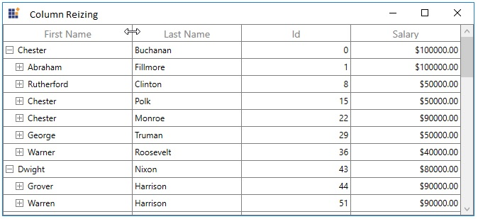

# Columns

SfTreeGrid allows you to add or remove columns using [SfTreeGrid.Columns](https://help.syncfusion.com/cr/wpf/Syncfusion.UI.Xaml.TreeGrid.SfTreeGrid.html#Syncfusion_UI_Xaml_TreeGrid_SfTreeGrid_Columns) property. You can choose the columns to be added from built-in column types or you can create your own column and add to the `SfTreeGrid.Columns`.

Below are the built-in column types supported in SfTreeGrid. Each column has its own properties to handle different types of data. 

<table>
<tr>
<th>
Column Type
</th>
<th>
Description
</th>
</tr>
<tr>
<td>
{{'[TreeGridTextColumn](https://help.syncfusion.com/cr/wpf/Syncfusion.UI.Xaml.TreeGrid.TreeGridTextColumn.html#"")'| markdownify }}
</td>
<td>
Use to display the string data. 
</td>
</tr>
<tr>
<td>
{{'[TreeGridNumericColumn](https://help.syncfusion.com/cr/wpf/Syncfusion.UI.Xaml.TreeGrid.TreeGridNumericColumn.html#"")'| markdownify }}
</td>
<td>
Use to display the numeric data
</td>
</tr>
<tr>
<td>
{{'[TreeGridCurrencyColumn](https://help.syncfusion.com/cr/wpf/Syncfusion.UI.Xaml.TreeGrid.TreeGridCurrencyColumn.html#"")'| markdownify }}
</td>
<td>
Use to display the currency value. 
</td>
</tr>
<tr>
<td>
{{'[TreeGridPercentColumn](https://help.syncfusion.com/cr/wpf/Syncfusion.UI.Xaml.TreeGrid.TreeGridPercentColumn.html#"")'| markdownify }}
</td>
<td>
Use to display the percent value. 
</td>
</tr>
<tr>
<td>
{{'[TreeGridMaskColumn](https://help.syncfusion.com/cr/wpf/Syncfusion.UI.Xaml.TreeGrid.TreeGridMaskColumn.html#"")'| markdownify }}
</td>
<td>
Use to display the data to be masked. 
</td>
</tr>
<tr>
<td>
{{'[TreeGridDateTimeColumn](https://help.syncfusion.com/cr/wpf/Syncfusion.UI.Xaml.TreeGrid.TreeGridDateTimeColumn.html#"")'| markdownify }}
</td>
<td>
Use to display the date time value 
</td>
</tr>
<tr>
<td>
{{'[TreeGridComboBoxColumn](https://help.syncfusion.com/cr/wpf/Syncfusion.UI.Xaml.TreeGrid.TreeGridComboBoxColumn.html#"")'| markdownify }}
</td>
<td>
Use to display the IEnumerable data using Combo Box.
</td>
</tr>
<tr>
<td>
{{'[TreeGridCheckBoxColumn](https://help.syncfusion.com/cr/wpf/Syncfusion.UI.Xaml.TreeGrid.TreeGridCheckBoxColumn.html#"")'| markdownify }}
</td>
<td>
Use to display the Boolean type data
</td>
</tr>
<tr>
<td>
{{'[TreeGridHyperlinkColumn](https://help.syncfusion.com/cr/wpf/Syncfusion.UI.Xaml.TreeGrid.TreeGridHyperlinkColumn.html#"")'| markdownify }}
</td>
<td>
Use to display the URI data
</td>
</tr>
<tr>
<td>
{{'[TreeGridTemplateColumn](https://help.syncfusion.com/cr/wpf/Syncfusion.UI.Xaml.TreeGrid.TreeGridTemplateColumn.html#"")'| markdownify }}
</td>
<td>
Use to display the custom template-specified content.
</td>
</tr>
</table>

## Defining Columns

You can let the SfTreeGrid to create columns or you can manually defined columns to de displayed. Below sections explains both ways, 

1. Automatically generating columns
2. Manually define columns

### Automatically generating columns

The automatic column generation based on properties of data object can be enabled or disabled by setting [SfTreeGrid.AutoGenerateColumns](https://help.syncfusion.com/cr/wpf/Syncfusion.UI.Xaml.Grid.SfGridBase.html#Syncfusion_UI_Xaml_Grid_SfGridBase_AutoGenerateColumns). Default value is `true`. 

Columns are generated based on type of property. For example, [TreeGridNumericColumn](https://help.syncfusion.com/cr/wpf/Syncfusion.UI.Xaml.TreeGrid.TreeGridNumericColumn.html) is added for `int` type property. Below are table shows data type and its column type. For remaining types, [TreeGridTextColumn](https://help.syncfusion.com/cr/wpf/Syncfusion.UI.Xaml.TreeGrid.TreeGridTextColumn.html) will be added. 

<table>
<tr>
<th>
Data Type
</th>
<th>
Column
</th>
</tr>
<tr>
<td>
string, object, dynamic
</td>
<td>
TreeGridTextColumn
</td>
</tr>
<tr>
<td>
int, float, double, decimal and also it’s nullable
</td>
<td>
TreeGridNumericColumn
</td>
</tr>
<tr>
<td>
DateTime, DateTimeOffset and also it’s nullable
</td>
<td>
TreeGridDateTimeColumn
</td>
</tr>
<tr>
<td>
Uri, Uri?
</td>
<td>
TreeGridHyperLinkColumn
</td>
</tr>
<tr>
<td>
bool, bool?
</td>
<td>
TreeGridCheckBoxColumn
</td>
</tr>
</table>

N> The order of columns in the collection will determine the order of that they will appear in SfTreeGrid.

#### AutoGenerateColumns with different modes

Column auto generation is controlled using [SfTreeGrid.AutoGenerateColumnsMode](https://help.syncfusion.com/cr/wpf/Syncfusion.UI.Xaml.Grid.SfGridBase.html#Syncfusion_UI_Xaml_Grid_SfGridBase_AutoGenerateColumnsMode) property.

The `SfTreeGrid.AutoGenerateColumnsMode` includes the following modes.

<table>
<tr>
<th>
Mode
</th>
<th>
Behavior
</th>
<th>
When ItemsSource changed
</th>
</tr>
<tr>
<td>
`Reset`
</td>
<td>
Generates the columns based on the properties defined in the underlying data object.
</td>
<td>
Keeps the columns added manually. 
Clears the columns which are auto generated before and creates new columns based on new ItemsSource.
</td>
</tr>
<tr>
<td>
`RetainOld`
</td>
<td>
Generates the columns based on the properties defined in the underlying data object.
</td>
<td>
The same columns will be maintained when changing ItemsSource also. So filtering, sorting and grouping settings will be maintained.
</td>
</tr>
<tr>
<td>
`ResetAll`
</td>
<td>
Generates the columns based on the properties defined in the underlying data object.
</td>
<td>
Clear all the columns including the columns defined manually and creates new columns based on new ItemsSource.
</td>
</tr>
<tr>
<td>
`None`
</td>
<td>
Columns will not be generated.
</td>
<td>
Keeps old columns in TreeGrid.Columns collection.
</td>
</tr>
</table>

### Customize auto-generated columns

You can customize or cancel the generated column by handling [AutoGeneratingColumn](https://help.syncfusion.com/cr/wpf/Syncfusion.UI.Xaml.TreeGrid.SfTreeGrid.html) event. `AutoGeneratingColumn` event occurs when the individual column is auto-generated for public and non-static property of underlying data object.



this.treeGrid.AutoGeneratingColumn += TreeGrid_AutoGeneratingColumn;

private void TreeGrid_AutoGeneratingColumn(object sender, TreeGridAutoGeneratingColumnEventArgs e)
{
}
	



[TreeGridAutoGeneratingColumnEventArgs](https://help.syncfusion.com/cr/wpf/Syncfusion.UI.Xaml.TreeGrid.TreeGridAutoGeneratingColumnEventArgs.html) provides the information about the auto-generated column to the `AutoGeneratingColumn` event. [TreeGridAutoGeneratingColumnEventArgs.Column](https://help.syncfusion.com/cr/wpf/Syncfusion.UI.Xaml.TreeGrid.TreeGridAutoGeneratingColumnEventArgs.html#Syncfusion_UI_Xaml_TreeGrid_TreeGridAutoGeneratingColumnEventArgs_Column) property returns the newly created column.

#### Cancel column generation for particular property

You can cancel the specific column adding to the TreeGrid by handling `AutoGeneratingColumn` event.

In the below code, column generation for `ReportsTo` property is canceled by setting `Cancel` property to `true`. 



treeGrid.AutoGeneratingColumn += TreeGrid_AutoGeneratingColumn; 

private void TreeGrid_AutoGeneratingColumn(object sender, TreeGridAutoGeneratingColumnEventArgs e)
{

	if (e.Column.MappingName == "ReportsTo")
		e.Cancel = true;
}
	



#### Changing column type

You can change the type of column adding to SfTreeGrid by setting the instance of column you want to add in `AutoGeneratingColumn` event. 
In the below code, column type for `Salary` property is changed to `TreeGridTextColumn` by setting instance of TreeGridTextColumn to `Column` property. 



treeGrid.AutoGeneratingColumn += TreeGrid_AutoGeneratingColumn; 

private void TreeGrid_AutoGeneratingColumn(object sender, TreeGridAutoGeneratingColumnEventArgs e)
{

	if (e.Column.MappingName == "Salary")
	{

		if (e.Column is TreeGridNumericColumn)
			e.Column = new TreeGridTextColumn() { MappingName = "Salary" };
	}
}
	



#### Changing property settings

You can change the column properties in `AutoGeneratingColumn` event handler. 




treeGrid.AutoGeneratingColumn += TreeGrid_AutoGeneratingColumn;

private void TreeGrid_AutoGeneratingColumn(object sender, TreeGridAutoGeneratingColumnEventArgs e)
{

	if (e.Column.MappingName == "Salary")
	{
		e.Column.AllowEditing = false;
		e.Column.AllowSorting = false;
		e.Column.AllowFocus = true;
		e.Column.AllowResizing = false;
		e.Column.ColumnSizer = TreeColumnSizer.Star;
		e.Column.AllowDragging = true;
	}
}
	



### Setting template to auto-generated column

You can set [TreeGridColumn.HeaderTemplate](https://help.syncfusion.com/cr/wpf/Syncfusion.UI.Xaml.Grid.GridColumnBase.html#Syncfusion_UI_Xaml_Grid_GridColumnBase_HeaderTemplate) and [TreeGridColumn.CellTemplate](https://help.syncfusion.com/cr/wpf/Syncfusion.UI.Xaml.Grid.GridColumnBase.html#Syncfusion_UI_Xaml_Grid_GridColumnBase_CellTemplate) properties for auto-generated column in `AutoGeneratingColumn` event handler. 




<Window.Resources>
	<DataTemplate x:Key="headerTemplate">
		<TextBlock FontSize="10"
				Text="This is the first name of the employee"
				TextWrapping="Wrap" />
	</DataTemplate>
</Window.Resources>
	



treeGrid.AutoGeneratingColumn += TreeGrid_AutoGeneratingColumn;

private void TreeGrid_AutoGeneratingColumn(object sender, TreeGridAutoGeneratingColumnEventArgs e)
{

	if (e.Column.MappingName == "FirstName")
	{
		e.Column.HeaderTemplate = this.Resources["headerTemplate"] as DataTemplate;
	}
}




Below screenshot shows the customized header template loaded on the header of FirstName column.

### Data Annotations with AutoGenerateColumns

SfTreeGrid support to generate the columns based on built-in [Data Annotation Attributes](https://msdn.microsoft.com/en-us/library/mt185499.aspx). Data Annotations ignored, when the `AutoGenerateColumns` is set to False.

#### Exclude column

You can skip the column generation using `AutoGenerateField` property or set the `Bindable` attribute to false.




[Display(AutoGenerateField = false, Description = "Title field is not generated in UI")]

public string Title
{
	get
	{
		return _title;
	}
	set
	{
		_title = value;
		RaisePropertyChanged("Title");
	}
}
	



#### Editing 

You can change the value of the property using `Editable` attribute.




[Editable(true)]

public string FirstName
{
	get
	{
		return _firstName;
	}
	set
	{
		_firstName = value;
		RaisePropertyChanged("FirstName");
	}
}
	



#### Change the HeaderText of column

You can customize header text of column using `Display.Name` property.




[Display(Name ="FirstName of the employee",Description ="First Name is necessary for identification")]

public string FirstName
{
	get
	{
		return _firstName;
	}
	set
	{
		_firstName = value;
		RaisePropertyChanged("FirstName");
	}
}
	



#### Change the order of the columns

You can change the columns order using `DisplayAttribute.Order` property.




[Display(Order = 0)]

public string FirstName
{
	get { return _firstName; }
	set
	{
		_firstName = value;
		RaisePropertyChanged("FirstName");
	}
} 
[Display(Order = -1)]

public string LastName
{
	get { return _lastName; }
	set
	{
		_lastName = value;
		RaisePropertyChanged("LastName");
	}
}
	



The FirstName and LastName column rearranged based on specified order.

#### Customizing data format 

You can customize the data format using `DataTypeAttribute.DataType` property.




[DataType(DataType.Currency)]

public double? Salary
{
	get
	{
		return _salary;
	}
	set
	{
		_salary = value;
		RaisePropertyChanged("Salary");
	}
}
	



### Manually defining columns

SfTreeGrid control allows you to define the columns manually by adding desired column to the [SfTreeGrid.Columns](https://help.syncfusion.com/cr/wpf/Syncfusion.UI.Xaml.TreeGrid.SfTreeGrid.html#Syncfusion_UI_Xaml_TreeGrid_SfTreeGrid_Columns) collection.




<syncfusion:SfTreeGrid Name="treeGrid"
						AutoGenerateColumns="False"
						ChildPropertyName="ReportsTo"
						ItemsSource="{Binding EmployeeInfo}"
						ParentPropertyName="ID"
						SelfRelationRootValue="-1">
	<syncfusion:SfTreeGrid.Columns>
		<syncfusion:TreeGridTextColumn HeaderText="First Name" MappingName="FirstName" />
		<syncfusion:TreeGridTextColumn HeaderText="Last Name" MappingName="LastName" />
		<syncfusion:TreeGridTextColumn HeaderText="Employee ID" MappingName="ID" />
		<syncfusion:TreeGridTextColumn MappingName="Title" />
		<syncfusion:TreeGridNumericColumn MappingName="Salary" />
		<syncfusion:TreeGridTextColumn MappingName="ReportsTo" />
	</syncfusion:SfTreeGrid.Columns>
</syncfusion:SfTreeGrid>
	



treeGrid.Columns.Add(new TreeGridTextColumn() { MappingName = "FirstName", HeaderText = "First Name" });
treeGrid.Columns.Add(new TreeGridTextColumn() { MappingName = "LastName", HeaderText = "Last Name" });
treeGrid.Columns.Add(new TreeGridTextColumn() { MappingName = "ID", HeaderText = "Employee ID" });
treeGrid.Columns.Add(new TreeGridTextColumn() { MappingName = "Title" });
treeGrid.Columns.Add(new TreeGridNumericColumn() { MappingName = "Salary" });
treeGrid.Columns.Add(new TreeGridTextColumn() { MappingName = "ReportsTo", HeaderText = "Reports To" });
	



You can refer more information about handling the column level operations for manually defined columns in Column types section.

## Column manipulation

You can get the columns (added or auto-generated) from [SfTreeGrid.Columns](https://help.syncfusion.com/cr/wpf/Syncfusion.UI.Xaml.TreeGrid.SfTreeGrid.html#Syncfusion_UI_Xaml_TreeGrid_SfTreeGrid_Columns) property.

### Adding column

You can add column at runtime by adding instance of column to `SfTreeGrid.Columns` property.




treeGrid.Columns.Add(new TreeGridTextColumn() { MappingName = "FirstName", HeaderText = "First Name" });
	



### Accessing column

You can access the column through its column index or [TreeGridColumn.MappingName](https://help.syncfusion.com/cr/wpf/Syncfusion.UI.Xaml.Grid.GridColumnBase.html#Syncfusion_UI_Xaml_Grid_GridColumnBase_MappingName) from the SfTreeGrid.Columns collection.




TreeGridColumn column = treeGrid.Columns[1];
//OR
TreeGridColumn column = treeGrid.Columns["FirstName"];
	



### Clearing or Removing Column

You can remove all the columns by clearing the `SfTreeGrid.Columns` property.



this.treeGrid.Columns.Clear();



You can remove a column using Remove and RemoveAt methods.




treeGrid.Columns.Remove(column);
//OR
treeGrid.Columns.RemoveAt(1);
	



## Resizing Columns

SfTreeGrid allows to resize the columns like in excel by resizing column header. This can be enabled or disabled by setting [SfTreeGrid.AllowResizingColumns](https://help.syncfusion.com/cr/wpf/Syncfusion.UI.Xaml.Grid.SfGridBase.html#Syncfusion_UI_Xaml_Grid_SfGridBase_AllowResizingColumns) or [TreeGridColumn.AllowResizing](https://help.syncfusion.com/cr/wpf/Syncfusion.UI.Xaml.TreeGrid.TreeGridColumn.html#Syncfusion_UI_Xaml_TreeGrid_TreeGridColumn_AllowResizing) property.

N> Resizing considers MinWidth and MaxWidth of column.




<syncfusion:SfTreeGrid Name="treeGrid"
				AllowResizingColumns="True"
				AutoGenerateColumns="False"
				ChildPropertyName="ReportsTo"
				ItemsSource="{Binding EmployeeInfo}"
				ParentPropertyName="ID"
				SelfRelationRootValue="-1"/>
				



You can change the column width by clicking and dragging the resizing cursor at the edge of column header. The resizing cursor appears when you hover the grid line exists between two columns. 

### Hidden column resizing

SfTreeGrid shows indication for hidden columns in column header and also allows end-users to resize the hidden columns when setting [SfTreeGrid.AllowResizingHiddenColumns](https://help.syncfusion.com/cr/wpf/Syncfusion.UI.Xaml.Grid.SfGridBase.html#Syncfusion_UI_Xaml_Grid_SfGridBase_AllowResizingHiddenColumns) property to `true`.

### Disable resizing

You can cancel resizing of particular column by setting [TreeGridColumn.AllowResizing](https://help.syncfusion.com/cr/wpf/Syncfusion.UI.Xaml.TreeGrid.TreeGridColumn.html#Syncfusion_UI_Xaml_TreeGrid_TreeGridColumn_AllowResizing) property to `false`. In another way, you can cancel the resizing by handling [SfTreeGrid.ResizingColumns](https://help.syncfusion.com/cr/wpf/Syncfusion.UI.Xaml.TreeGrid.SfTreeGrid.html) event. The `ResizingColumns` event occurs when you start dragging by resizing cursor on headers.
[ResizingColumnsEventArgs](https://help.syncfusion.com/cr/wpf/Syncfusion.UI.Xaml.Grid.ResizingColumnsEventArgs.html) of `ResizingColumns` provides information about the columns’s index and width. 




treeGrid.ResizingColumns += TreeGrid_ResizingColumns;

private void TreeGrid_ResizingColumns(object sender, ResizingColumnsEventArgs e)
{
	if (e.ColumnIndex == 1)
		e.Cancel = true;
}
	



### Identify resizing of the column gets completed

SfTreeGrid allows you to identify the progress of the resizing of columns through `ResizingColumnsEventArgs.Reason` property. You can get the width of the column after resizing completed by getting `ResizingColumnsEventArgs.Width` when `ResizingColumnsEventArgs.Reason` is `ColumnResizingReason.Resized` in `ResizingColumns` event.



this.treeGrid.ResizingColumns += OnResizingColumns;

void OnResizingColumns(object sender, ResizingColumnsEventArgs e)
{
    if (e.Reason == Syncfusion.UI.Xaml.Grid.ColumnResizingReason.Resized)
    {
        var resizedWidth = e.Width;
    }
}



## Column drag and drop

You can allow end-users to rearrange the columns by drag and drop the column headers by setting [SfTreeGrid.AllowDraggingColumns](https://help.syncfusion.com/cr/wpf/Syncfusion.UI.Xaml.Grid.SfGridBase.html#Syncfusion_UI_Xaml_Grid_SfGridBase_AllowDraggingColumns) to `true`.




<syncfusion:SfTreeGrid Name="treeGrid"
						AllowDraggingColumns="True"
						AutoGenerateColumns="False"
						ChildPropertyName="ReportsTo"
						ItemsSource="{Binding EmployeeInfo}"
						ParentPropertyName="ID"
						SelfRelationRootValue="-1"/>
						



You can enable or disable dragging on particular column using [TreeGridColumn.AllowDragging](https://help.syncfusion.com/cr/wpf/Syncfusion.UI.Xaml.TreeGrid.TreeGridColumn.html#Syncfusion_UI_Xaml_TreeGrid_TreeGridColumn_AllowDragging) property.



<syncfusion:TreeGridTextColumn AllowDragging="True"
								HeaderText="First Name"
								MappingName="FirstName" />
								



### Disable column reordering
You can cancel the particular column dragging by handling [SfTreeGrid.ColumnDragging](https://help.syncfusion.com/cr/wpf/Syncfusion.UI.Xaml.TreeGrid.SfTreeGrid.html). `ColumnDragging` event occurs when you start dragging the column header. 

[TreeGridColumnDraggingEventArgs](https://help.syncfusion.com/cr/wpf/Syncfusion.UI.Xaml.TreeGrid.TreeGridColumnDraggingEventArgs.html) of `ColumnDragging` event provides information about the column triggered this event. 

[TreeGridColumnDraggingEventArgs.From](https://help.syncfusion.com/cr/wpf/Syncfusion.UI.Xaml.TreeGrid.TreeGridColumnDraggingEventArgs.html#Syncfusion_UI_Xaml_TreeGrid_TreeGridColumnDraggingEventArgs_From) - It returns the index of column triggered this event.

[TreeGridColumnDraggingEventArgs.To](https://help.syncfusion.com/cr/wpf/Syncfusion.UI.Xaml.TreeGrid.TreeGridColumnDraggingEventArgs.html#Syncfusion_UI_Xaml_TreeGrid_TreeGridColumnDraggingEventArgs_To) - It returns the index where you try to drop the column. 

[TreeGridColumnDraggingEventArgs.Reason](https://help.syncfusion.com/cr/wpf/Syncfusion.UI.Xaml.TreeGrid.TreeGridColumnDraggingEventArgs.html#Syncfusion_UI_Xaml_TreeGrid_TreeGridColumnDraggingEventArgs_Reason) - It returns column dragging details by [QueryColumnDraggingReason](https://help.syncfusion.com/cr/wpf/Syncfusion.UI.Xaml.Grid.QueryColumnDraggingReason.html).  




treeGrid.ColumnDragging += TreeGrid_ColumnDragging;

private void TreeGrid_ColumnDragging(object sender, TreeGridColumnDraggingEventArgs e)
{
	var column = treeGrid.Columns[e.From];

	if(column.MappingName=="FirstName" && e.Reason==QueryColumnDraggingReason.Dropping)
	{
		e.Cancel = true;
	}
}
	



## Freezing Columns

You can freeze the columns in view at the left and right side like in excel by setting [SfTreeGrid.FrozenColumnCount](https://help.syncfusion.com/cr/wpf/Syncfusion.UI.Xaml.Grid.SfGridBase.html#Syncfusion_UI_Xaml_Grid_SfGridBase_FrozenColumnCount) and [SfTreeGrid.FooterColumnCount](https://help.syncfusion.com/cr/wpf/Syncfusion.UI.Xaml.Grid.SfGridBase.html#Syncfusion_UI_Xaml_Grid_SfGridBase_FooterColumnCount) properties.




<syncfusion:SfTreeGrid Name="treeGrid" 
                        AutoExpandMode="RootNodesExpanded"
                        ChildPropertyName="Children"
                        FrozenColumnCount="2"
						FooterColumnCount="2"
                        ItemsSource="{Binding EmployeeDetails}">




this.treeGrid.FrozenColumnCount = 2;
this.treeGrid.FooterColumnCount = 2;
	



## Stacked Headers

SfTreeGrid supports additional unbound header rows known as `stacked header rows` that span across the TreeGrid columns using [StackedHeaderRows](https://help.syncfusion.com/cr/wpf/Syncfusion.UI.Xaml.Grid.SfGridBase.html#Syncfusion_UI_Xaml_Grid_SfGridBase_StackedHeaderRows). You can group one or more columns under each stacked header.

Each [StackedHeaderRow](http://help.syncfusion.com/cr/wpf/Syncfusion.UI.Xaml.Grid.StackedHeaderRow.html) contains the [StackedColumns](https://help.syncfusion.com/cr/wpf/Syncfusion.UI.Xaml.Grid.StackedHeaderRow.html#Syncfusion_UI_Xaml_Grid_StackedHeaderRow_StackedColumns) where each [StackedColumn](http://help.syncfusion.com/cr/wpf/Syncfusion.UI.Xaml.Grid.StackedColumn.html) contains a number of child columns. `StackedColumn.ChildColumns` property returns the columns which are grouped under the stacked header row. `StackedColumn.HeaderText` returns the text that displays in stacked header row.




<syncfusion:SfTreeGrid.StackedHeaderRows>
    <syncfusion:StackedHeaderRow>
        <syncfusion:StackedHeaderRow.StackedColumns>
            <syncfusion:StackedColumn ChildColumns="OrderID,OrderDate,CustomerID,CustomerArea,UnitPrice,Discount" HeaderText="Sales Details" />
        </syncfusion:StackedHeaderRow.StackedColumns>
    </syncfusion:StackedHeaderRow>
    <syncfusion:StackedHeaderRow>
        <syncfusion:StackedHeaderRow.StackedColumns>
            <syncfusion:StackedColumn ChildColumns="OrderID,OrderDate" HeaderText="Order Details" />
            <syncfusion:StackedColumn ChildColumns="CustomerID,CustomerArea" HeaderText="Customer Details" />
            <syncfusion:StackedColumn ChildColumns="UnitPrice,Discount" HeaderText="Price Details" />
        </syncfusion:StackedHeaderRow.StackedColumns>
    </syncfusion:StackedHeaderRow>
</syncfusion:SfTreeGrid.StackedHeaderRows>




var stackedHeaderRow = new StackedHeaderRow();
stackedHeaderRow.StackedColumns.Add(new StackedColumn() { ChildColumns = "OrderID,OrderDate,CustomerID,CustomerArea,UnitPrice,Discount", HeaderText = "Sales Details" });
this.treeGrid.StackedHeaderRows.Add(stackedHeaderRow);
var stackedHeaderRow1 = new StackedHeaderRow();
stackedHeaderRow1.StackedColumns.Add(new StackedColumn() { ChildColumns = "OrderID,OrderDate", HeaderText = "Order Details" });
stackedHeaderRow1.StackedColumns.Add(new StackedColumn() { ChildColumns = "CustomerID,CustomerArea", HeaderText = "Customer Details" });
stackedHeaderRow1.StackedColumns.Add(new StackedColumn() { ChildColumns = "UnitPrice,Discount", HeaderText = "Price Details" });
this.treeGrid.StackedHeaderRows.Add(stackedHeaderRow1);
	



### Adding ChildColumns

You can add the child columns in particular stacked header directly.




var childColumn = this.treeGrid.StackedHeaderRows[0].StackedColumns[0].ChildColumns;
this.treeGrid.StackedHeaderRows[0].StackedColumns[0].ChildColumns = childColumn + ","  + "Discount";




### Removing ChildColumns

Similarly, you can remove the child columns from particular stacked header directly.




var removingColumns = this.treeGrid.StackedHeaderRows[0].StackedColumns[0].ChildColumns.Split(',').ToList<string>();
string childColumns = string.Empty;

foreach (var stackedColumnName in removingColumns.ToList())
{

    if (stackedColumnName.Equals("OrderID"))
    {
        removingColumns.Remove(stackedColumnName);
    }

    else
        childColumns = childColumns + stackedColumnName + ",";
}

this.treeGrid.StackedHeaderRows[0].StackedColumns[0].ChildColumns = childColumns;
}




### Changing Stacked Header Row Height

You can change the height of StackedHeaderRows by using [GetTreePanel.RowHeights](https://help.syncfusion.com/cr/wpf/Syncfusion.UI.Xaml.TreeGrid.TreeGridPanel.html) property.




this.treeGrid.Loaded += TreeGrid_Loaded;

private void TreeGrid_Loaded(object sender, RoutedEventArgs e)
{
    var getTreePanel = this.treeGrid.GetTreePanel();
    int count = this.treeGrid.StackedHeaderRows.Count;

    for (int i = 0; i < count; i++)
    {
        getTreePanel.RowHeights[i] = 50;
    }
    getTreePanel.InvalidateMeasure();
}




## Binding column properties with ViewModel

SfTreeGrid provides MVVM support for binding `TreeGridColumn` properties with ViewModel properties. 




public class ViewModel
{
	private bool _allowEditing =true;

	public bool AllowEditing
	{
		get { return _ allowEditing; }
		set { _ allowEditing = value; }
	}
}
	



Below code, binds the `ViewModel.AllowEditing` property to `TreeGridColumn. AllowEditing` property.



<Window.DataContext>
	<local:ViewModel/>
</Window.DataContext>

<syncfusion:SfTreeGrid Name="treeGrid"
						AllowEditing="False"
						AutoExpandMode="AllNodesExpanded"
						AutoGenerateColumns="False"
						ChildPropertyName="ReportsTo"
						ParentPropertyName="ID">
	<syncfusion:SfTreeGrid.Columns>
		<syncfusion:TreeGridTextColumn AllowEditing="{Binding AllowEditing}" MappingName="ID" />
	</syncfusion:SfTreeGrid.Columns>
</syncfusion:SfTreeGrid>
	


