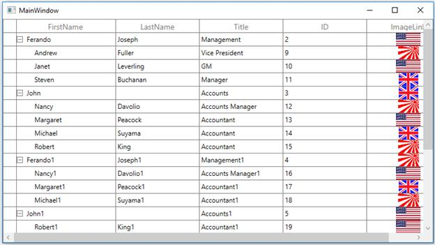
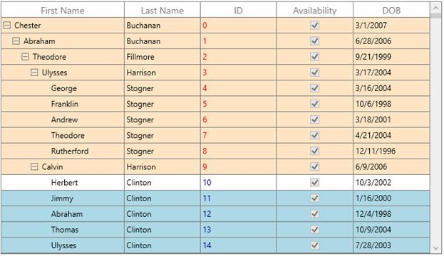

# Conditional Styling in WPF TreeGrid (SfTreeGrid)

You can style the treegrid and its inner elements conditionally based on data in three ways,

1. Using Converter
2. Using Data Triggers
3. Using StyleSelector

<table>
<tr>
<td>
{{'**Styling ways**'| markdownify }}
</td>
<td>
{{'**Performance details**'| markdownify }}
</td>
</tr>
<tr>
<td>
Converter
</td>
<td>
Provide good performance when compared other two ways.
</td>
</tr>
<tr>
<td>
Trigger
</td>
<td>
When compared to converter, performance is slow while styling more number of columns or rows.
</td>
</tr>
<tr>
<td>
StyleSelector
</td>
<td>
It affects scrolling performance while styling more number of columns based on number of columns visible.
</td>
</tr>
</table>

# Conditional Styling in WPF TreeGrid (SfTreeGrid)

## Style cells using converter

The record cells ([TreeGridCell](https://help.syncfusion.com/cr/wpf/Syncfusion.UI.Xaml.TreeGrid.TreeGridCell.html)) can be customized conditionally by changing its property value based on cell value or data object using converter.

Here, grid cell background is changed using converter, where converter returns the value based on ID property of underlying record.



<syncfusion:Window.Resources>
   <local:StyleConverter x:Key="converter" />
</syncfusion:Window.Resources>
<syncfusion:TreeGridTextColumn HeaderText="ID"
                               MappingName="Id"
                               TextAlignment="Left" >
             <syncfusion:TreeGridTextColumn.CellStyle>
                         
           </syncfusion:TreeGridTextColumn.CellStyle>
   </syncfusion:TreeGridTextColumn>


internal class StyleConverter : IValueConverter
{
    public object Convert(object value, Type targetType, object parameter, System.Globalization.CultureInfo culture)
    {
        int input = (int)value;

        //custom condition is checked based on data.

    if (input < 10)
        return new SolidColorBrush(Colors.LightBlue);

    else if (input >10 && input<20)
        return new SolidColorBrush(Colors.Bisque);

    else
        return DependencyProperty.UnsetValue;
    }

    public object ConvertBack(object value, Type targetType, object parameter, System.Globalization.CultureInfo culture)
    {
        throw new NotImplementedException();
    }
}



## Style cells based on record using converter

You can also style the cells based on record instead of passing single property to converter, where converter returns the value based on underlying record. This can be assigned to GridColumn.CellStyle to style the column based on other column properties.



<syncfusion:Window.Resources>
        <local:StyleConverter x:Key="converter" />

        
</syncfusion:Window.Resources>


internal class StyleConverter : IValueConverter
{
    public object Convert(object value, Type targetType, object parameter, System.Globalization.CultureInfo culture)
    {
        var data = value as PersonInfo;

        //custom condition is checked based on data.

        if (data.Id < 10)
            return new SolidColorBrush(Colors.LightBlue);

        else if (data.Id < 20 && data.Id > 10)
            return new SolidColorBrush(Colors.Bisque);

        else
            return DependencyProperty.UnsetValue;
    }

    public object ConvertBack(object value, Type targetType, object parameter, System.Globalization.CultureInfo culture)
    {
        throw new NotImplementedException();
    }
}  



## Style cells using triggers

The record cells ([TreeGridCell](https://help.syncfusion.com/cr/wpf/Syncfusion.UI.Xaml.TreeGrid.TreeGridCell.html)) can be customized by setting [Style.Triggers](https://msdn.microsoft.com/en-us/library/system.windows.style.triggers(v=vs.110).aspx) that apply property values based on specified conditions. Multiple conditions can be specified by setting [MultiDataTrigger](https://msdn.microsoft.com/en-us/library/system.windows.multidatatrigger(v=vs.110).aspx).



<syncfusion:TreeGridTextColumn HeaderText="ID"
                               MappingName="Id"
                               TextAlignment="Left" >
      <syncfusion:TreeGridTextColumn.CellStyle>
            
    </syncfusion:TreeGridTextColumn.CellStyle>
</syncfusion:TreeGridTextColumn>



## Style cells using style selector

The record cells ([TreeGridCell](https://help.syncfusion.com/cr/wpf/Syncfusion.UI.Xaml.TreeGrid.TreeGridCell.html)) can be customized conditionally based on data by setting [SfTreeGrid.CellStyleSelector](https://help.syncfusion.com/cr/wpf/Syncfusion.UI.Xaml.TreeGrid.SfTreeGrid.html#Syncfusion_UI_Xaml_TreeGrid_SfTreeGrid_CellStyleSelectorProperty) property and the particular column record cells can be customized by setting [GridColumn.CellStyleSelector](https://help.syncfusion.com/cr/wpf/Syncfusion.UI.Xaml.Grid.GridColumnBase.html#Syncfusion_UI_Xaml_Grid_GridColumnBase_CellStyleSelector) property and you can get the container as TreeGridCell in the StyleSelector.



<Application.Resources>
        <local:SelectorClass x:Key="styleSelector" />
        
        
</Application.Resources>


public class SelectorClass : StyleSelector
{
    public override Style SelectStyle(object item, DependencyObject container)
    {
        var data = item as PersonInfo;

        if (data != null && ((container as TreeGridCell).ColumnBase.TreeGridColumn.MappingName == "Id"))
        {
            //custom condition is checked based on data.

            if (data.Id < 10)
                return App.Current.Resources["redCellStyle"] as Style;
            return App.Current.Resources["blueCellStyle"] as Style;
        }
        return base.SelectStyle(item, container);
    }
}



## Add image to cell

You can add the image to tree gird cell by using TreeGridTemplateColumn,



<syncfusion:TreeGridTemplateColumn MappingName="ImageLink">
    <syncfusion:TreeGridTemplateColumn.CellTemplate>
          <DataTemplate>
               <Image Source="{Binding Path=ImageLink,
                                         Converter={StaticResource converter}}"/>
          </DataTemplate>
    </syncfusion:TreeGridTemplateColumn.CellTemplate>
</syncfusion:TreeGridTemplateColumn>


public class StringToImageConverter : IValueConverter
{
    public object Convert(object value, Type targetType, object parameter, System.Globalization.CultureInfo culture)
    {
        string imagename = value as string;
        return new BitmapImage(new Uri(string.Format(@"..\..\Images\{0}", imagename), UriKind.Relative));
    }

    public object ConvertBack(object value, Type targetType, object parameter, System.Globalization.CultureInfo culture)
    {
        return null;
    }
}



You can download the sample [here](https://github.com/SyncfusionExamples/how-to-load-images-in-a-cell-in-wpf-and-uwp-treegrid/tree/master/WPF).

# Conditional Styling in WPF TreeGrid (SfTreeGrid)

## Style rows using converter

The record rows ([TreeGridRowControl ](https://help.syncfusion.com/cr/wpf/Syncfusion.UI.Xaml.TreeGrid.TreeGridRowControl.html)) can be customized conditionally by changing its property value based on ‘cell value’ or ‘data object’ by using converter, where converter returns the value based on underlying record.



<syncfusion:Window.Resources>
        <local:StyleConverter x:Key="converter"/>
        
    </syncfusion:Window.Resources>


public class StyleConverter : IValueConverter
{
    public object Convert(object value, Type targetType, object parameter, CultureInfo culture)
    {
        var input = (value as PersonInfo).Id;

        //custom condition is checked based on data.

        if (input < 10)
            return new SolidColorBrush(Colors.Bisque);

        else if (input < 20 && input>10)
            return new SolidColorBrush(Colors.LightBlue);

        else
            return DependencyProperty.UnsetValue;
    }

    public object ConvertBack(object value, Type targetType, object parameter, CultureInfo culture)
    {
        throw new NotImplementedException();
    }
}



## Style rows using style selector

The record rows ([TreeGridRowControl](https://help.syncfusion.com/cr/wpf/Syncfusion.UI.Xaml.TreeGrid.TreeGridRowControl.html)) can be customized conditionally based on data by setting [SfTreeGrid.RowStyleSelector](https://help.syncfusion.com/cr/wpf/Syncfusion.UI.Xaml.TreeGrid.SfTreeGrid.html#Syncfusion_UI_Xaml_TreeGrid_SfTreeGrid_RowStyleSelectorProperty) property and you can get the container as TreeGridRowControl in StyleSelector.



<Application.Resources>
        <local:SelectorClass x:Key="rowStyleSelector" />
        
        
</Application.Resources>


public class SelectorClass : StyleSelector
{
    public override Style SelectStyle(object item, DependencyObject container)
    {
        var row = (item as TreeDataRowBase).RowData;
        var data = row as PersonInfo;

        if (data.Id < 10)
            return App.Current.Resources["rowStyle1"] as Style;
        return App.Current.Resources["rowStyle2"] as Style;
    }
}



# Conditional Styling in WPF TreeGrid (SfTreeGrid)

The appearance of row header ([GridRowHeaderCell](https://help.syncfusion.com/cr/wpf/Syncfusion.UI.Xaml.TreeGrid.TreeGridRowHeaderCell.html)) can be customized conditionally by changing its property value based on ‘cell value’ or ‘data object’ by using converter,where converter returns the value based on Underlying record.



<syncfusion:ChromelessWindow.Resources>
        <local:StyleConverter x:Key="converter"/>
        
</syncfusion:ChromelessWindow.Resources>


public class StyleConverter : IValueConverter
{
    public object Convert(object value, Type targetType, object parameter, CultureInfo culture)
    {
        var data = value as PersonInfo;

        //custom condition is checked.

        if (data.Id<10)
            return Brushes.Green;

        else
            return Brushes.Red;
    }

    public object ConvertBack(object value, Type targetType, object parameter, CultureInfo culture)
    {
        throw new NotImplementedException();
    }
}



