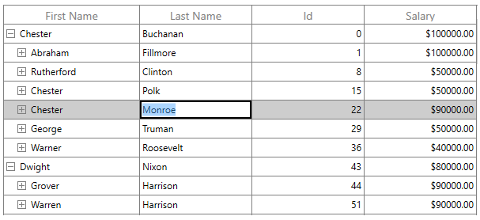
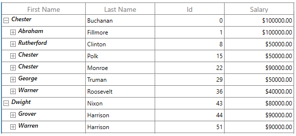
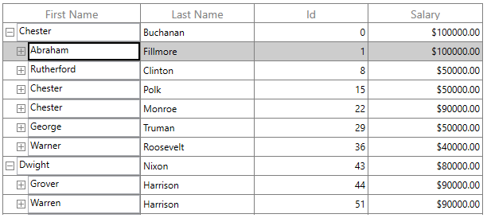

# Editing in WPF TreeGrid (SfTreeGrid)

SfTreeGrid provides support for editing and it can be enabled or disabled by setting [SfTreeGrid.AllowEditing]() property.




<syncfusion:SfTreeGrid x:Name="treeGrid"
						AllowEditing="True"
						AutoGenerateColumns="True"
						ItemsSource="{Binding EmployeeDetails}" />
							



	this.treeGrid.AllowEditing = true;
	



You can enable or disable editing for particular column by setting [TreeGridColumn.AllowEditing](https://help.syncfusion.com/cr/wpf/Syncfusion.UI.Xaml.Grid.GridColumnBase.html#Syncfusion_UI_Xaml_Grid_GridColumnBase_AllowEditing) property.




<syncfusion:TreeGridTextColumn AllowEditing="True"
							HeaderText="First Name"
							MappingName="FirstName" />
							



this.treeGrid.Columns["FirstName"].AllowEditing = true;
	



N> `TreeGridColumn.AllowEditing` takes higher priority than `SfTreeGrid.AllowEditing`

N> It is mandatory to set the NavigationMode to Cell to enable CurrentCell navigation and editing.

### Entering into edit mode

You can enter into edit mode by pressing &lt;kbd&gt;F2&lt;/kbd&gt; key or clicking (touch also supported) the cell. You can allow users to edit the cell in single click (OnTap) or double click (OnDoubleTab) by setting [SfTreeGrid.EditTrigger](https://help.syncfusion.com/cr/wpf/Syncfusion.UI.Xaml.Grid.SfGridBase.html#Syncfusion_UI_Xaml_Grid_SfGridBase_EditTrigger) property.




<syncfusion:SfTreeGrid Name="treeGrid"
					EditTrigger="OnTap"
					AllowEditing="True"
					AutoExpandMode="RootNodesExpanded"                             
					ChildPropertyName="ReportsTo"
					ItemsSource="{Binding EmployeeInfo}"
					ParentPropertyName="ID"/>
					



this.treeGrid.EditTrigger = EditTrigger.OnTap;
	



### Cursor placement

When the cell enters into edit mode, cursor is placed based on [SfTreeGrid.EditorSelectionBehavior](https://help.syncfusion.com/cr/wpf/Syncfusion.UI.Xaml.Grid.SfGridBase.html#Syncfusion_UI_Xaml_Grid_SfGridBase_EditorSelectionBehavior) property.

SelectAll ֠selects the text of edit element loaded inside cell.

MoveLast ֠places the cursor at the last of edit element loaded inside cell.  




<syncfusion:SfTreeGrid Name="treeGrid"
					AllowEditing="True"
					EditorSelectionBehavior="SelectAll"
					AutoExpandMode="RootNodesExpanded"
					ChildPropertyName="ReportsTo"
					EditTrigger="OnTap"
					ParentPropertyName="ID"
					ItemsSource="{Binding EmployeeInfo}" />
						



this.treeGrid.EditorSelectionBehavior = EditorSelectionBehavior.SelectAll;
	



## Support for IEditableObject

SfTreeGrid supports to commit and roll back the changes in row level when underlying data object implements [IEditableObject](https://docs.microsoft.com/en-us/dotnet/api/system.componentmodel.ieditableobject?redirectedfrom=MSDN&view=net-5.0) interface.

The editing changes in a row will be committed only when user move to next row or pressing enter key in [EndEdit](https://docs.microsoft.com/en-us/dotnet/api/system.componentmodel.ieditableobject.endedit?redirectedfrom=MSDN&view=net-5.0#System_ComponentModel_IEditableObject_EndEdit). Also when user press &lt;kbd&gt; Esc &lt;/kbd&gt; key, then the changes made in a row will be reverted in [CancelEdit](https://docs.microsoft.com/en-us/dotnet/api/system.componentmodel.ieditableobject.canceledit?redirectedfrom=MSDN&view=net-5.0#System_ComponentModel_IEditableObject_CancelEdit). 

`IEditableObject` has the following methods to capture editing,

[BeginEdit](https://docs.microsoft.com/en-us/dotnet/api/system.componentmodel.ieditableobject.beginedit?redirectedfrom=MSDN&view=net-5.0#System_ComponentModel_IEditableObject_BeginEdit) - Gets called to begin edit on underlying data object when cell in a row get into edit mode. 

[CancelEdit](https://docs.microsoft.com/en-us/dotnet/api/system.componentmodel.ieditableobject.canceledit?redirectedfrom=MSDN&view=net-5.0#System_ComponentModel_IEditableObject_CancelEdit) - Gets called when user press the &lt;kbd&gt;Esc&lt;/kbd&gt; key to discard the changes in a row since last `BeginEdit` call. 

[EndEdit](https://docs.microsoft.com/en-us/dotnet/api/system.componentmodel.ieditableobject.endedit?redirectedfrom=MSDN&view=net-5.0#System_ComponentModel_IEditableObject_EndEdit) - Gets called when user move to the next row or press Enter key  to commit changes in underlying data object since last `BeginEdit` call. 

In the below code snippet explains the simple implementation of IEditableObject.




public class EmployeeInfo : IEditableObject, INotifyPropertyChanged
{      
	int _id;
	/// 

	/// Gets or sets the ID.
	/// 

	/// <value>The ID.</value>

	public int ID
	{
		get
		{
			return _id;
		}
		set
		{
			_id = value;
			RaisePropertyChanged("ID");
		}
	}

	string _firstName;
	/// 

	/// Gets or sets the first name.
	/// 

	/// <value>The first name.</value>   

	public string FirstName
	{
		get { return _firstName; }
		set
		{
			_firstName = value;
			RaisePropertyChanged("FirstName");
		}
	}

	string _lastName;
	/// 

	/// Gets or sets the last name.
	/// 

	/// <value>The last name.</value>

	public string LastName
	{
		get { return _lastName; }
		set
		{
			_lastName = value;
			RaisePropertyChanged("LastName");
		}
	}

	private string _title;
	/// 

	/// Gets or sets the title.
	/// 

	/// <value>The title.</value>

	public string Title
	{
		get
		{
			return _title;
		}
		set
		{
			_title = value;
			RaisePropertyChanged("Title");
		}
	}

	double? _salary;
	/// 

	/// Gets or sets the salary.
	/// 

	/// <value>The salary.</value>

	public double? Salary
	{
		get
		{
			return _salary;
		}
		set
		{
			_salary = value;
			RaisePropertyChanged("Salary");
		}
	}

	int _reportsTo;
	/// 

	/// Gets or sets the reports to.
	/// 

	/// <value>The reports to.</value>

	public int ReportsTo
	{
		get
		{
			return _reportsTo;
		}
		set
		{
			_reportsTo = value;
			RaisePropertyChanged("ReportsTo");
		}
	}
	  
	protected Dictionary<string, object> BackUp()
	{
		var dictionary = new Dictionary<string, object>();
		var itemProperties = this.GetType().GetTypeInfo().DeclaredProperties;

		foreach (var pDescriptor in itemProperties)
		{

			if (pDescriptor.CanWrite)
				dictionary.Add(pDescriptor.Name, pDescriptor.GetValue(this));
		}
		return dictionary;
	}

	private Dictionary<string, object> storedValues;

	public void BeginEdit()
	{
		this.storedValues = this.BackUp();
	}

	public void CancelEdit()
	{

		if (this.storedValues == null)
			return;

		foreach (var item in this.storedValues)
		{
			var itemProperties = this.GetType().GetTypeInfo().DeclaredProperties;
			var pDesc = itemProperties.FirstOrDefault(p => p.Name == item.Key);

			if (pDesc != null)
				pDesc.SetValue(this, item.Value);
		}
	}

	public void EndEdit()
	{           

		if (this.storedValues != null)
		{
			this.storedValues.Clear();
			this.storedValues = null;
		}
	}

	public event PropertyChangedEventHandler PropertyChanged;

	public void RaisePropertyChanged(string propertyName)
	{

		if (PropertyChanged != null)
			PropertyChanged(this, new PropertyChangedEventArgs(propertyName));
	}
}
	



## Events

SfTreeGrid triggers the following events during editing. 

### CurrentCellBeginEdit Event

[CurrentCellBeginEdit](https://help.syncfusion.com/cr/wpf/Syncfusion.UI.Xaml.TreeGrid.SfTreeGrid.html) event occurs when the [CurrentCell](https://help.syncfusion.com/cr/wpf/Syncfusion.UI.Xaml.TreeGrid.TreeGridCurrentCellManager.html#Syncfusion_UI_Xaml_TreeGrid_TreeGridCurrentCellManager_CurrentCell) enter into edit mode. [TreeCurrentCellBeginEditEventArgs](https://help.syncfusion.com/cr/wpf/Syncfusion.UI.Xaml.TreeGrid.TreeGridCurrentCellBeginEditEventArgs.html) has following members which provides information for `CurrentCellBeginEdit` event.

* [Cancel](https://docs.microsoft.com/en-us/dotnet/api/system.componentmodel.canceleventargs.cancel?redirectedfrom=MSDN&view=net-5.0#System_ComponentModel_CancelEventArgs_Cancel) : When set to `true`, the event is canceled and the `CurrentCell` does not enter into the edit mode.

* [RowColumnIndex](https://help.syncfusion.com/cr/wpf/Syncfusion.UI.Xaml.TreeGrid.TreeGridCurrentCellBeginEditEventArgs.html#Syncfusion_UI_Xaml_TreeGrid_TreeGridCurrentCellBeginEditEventArgs_RowColumnIndex) : Gets the current row column index of the TreeGrid.

* [Column](https://help.syncfusion.com/cr/wpf/Syncfusion.UI.Xaml.TreeGrid.TreeGridCurrentCellBeginEditEventArgs.html#Syncfusion_UI_Xaml_TreeGrid_TreeGridCurrentCellBeginEditEventArgs_Column) : Gets the Tree Grid Column of the SfTreeGrid.




this.treeGrid.CurrentCellBeginEdit += TreeGrid_CurrentCellBeginEdit;

void TreeGrid_CurrentCellBeginEdit(object sender, TreeGridCurrentCellBeginEditEventArgs args)
{
}
	



### CurrentCellEndEdit Event

[CurrentCellEndEdit](https://help.syncfusion.com/cr/wpf/Syncfusion.UI.Xaml.TreeGrid.SfTreeGrid.html) event occurs when the [CurrentCell](https://help.syncfusion.com/cr/wpf/Syncfusion.UI.Xaml.TreeGrid.TreeGridCurrentCellManager.html#Syncfusion_UI_Xaml_TreeGrid_TreeGridCurrentCellManager_CurrentCell) exits the edit mode. 
[CurrentCellEndEditEventArgs]() has following members which provides information for `CurrentCellEndEdit` event.

* RowColumnIndex : Gets the value for the current row column index.




this.treeGrid.CurrentCellEndEdit += TreeGrid_CurrentCellEndEdit;

void TreeGrid_CurrentCellEndEdit(object sender, CurrentCellEndEditEventArgs args)
{
}
	



### CurrentCellValueChanged Event

[CurrentCellValueChanged](https://help.syncfusion.com/cr/wpf/Syncfusion.UI.Xaml.TreeGrid.SfTreeGrid.html) event occurs whenever a value changes in TreeGridColumn that supports editing. 
[TreeGridCurrentCellValueChangedEventArgs](https://help.syncfusion.com/cr/wpf/Syncfusion.UI.Xaml.TreeGrid.TreeGridCurrentCellValueChangedEventArgs.html) has following members which provides information for `CurrentCellValueChanged` event.

* [Column](https://help.syncfusion.com/cr/wpf/Syncfusion.UI.Xaml.TreeGrid.TreeGridCurrentCellValueChangedEventArgs.html#Syncfusion_UI_Xaml_TreeGrid_TreeGridCurrentCellValueChangedEventArgs_Column) : Gets the Grid Column of the SfTreeGrid.
* [RowColumnIndex](https://help.syncfusion.com/cr/wpf/Syncfusion.UI.Xaml.TreeGrid.TreeGridCurrentCellValueChangedEventArgs.html#Syncfusion_UI_Xaml_TreeGrid_TreeGridCurrentCellValueChangedEventArgs_RowColumnIndex) : Gets the value of the current RowColumnIndex.




this.treeGrid.CurrentCellValueChanged += TreeGrid_CurrentCellValueChanged;

void TreeGrid_CurrentCellValueChanged(object sender, TreeGridCurrentCellValueChangedEventArgs args)
{
}
	



N> For TreeGridComboBoxColumn, you have to use the 'CurrentCellDropDownSelectionChanged' event.

### CurrentCellDropDownSelectionChanged Event

[CurrentCellDropDownSelectionChanged](https://help.syncfusion.com/cr/wpf/Syncfusion.UI.Xaml.TreeGrid.SfTreeGrid.html) event occurs whenever the `SelectedItem` of `TreeGridComboBoxColumn` column changed.
[CurrentCellDropDownSelectionChangedEventArgs](https://help.syncfusion.com/cr/wpf/Syncfusion.UI.Xaml.Grid.CurrentCellDropDownSelectionChangedEventArgs.html) has following members which provides information for `CurrentCellDropDownSelectionChanged` event.

* [RowColumnIndex](https://help.syncfusion.com/cr/wpf/Syncfusion.UI.Xaml.Grid.CurrentCellDropDownSelectionChangedEventArgs.html#Syncfusion_UI_Xaml_Grid_CurrentCellDropDownSelectionChangedEventArgs_RowColumnIndex)  - Gets the RowColumnIndex of the corresponding item that were selected from the drop-down control.
* [SelectedIndex](https://help.syncfusion.com/cr/wpf/Syncfusion.UI.Xaml.Grid.CurrentCellDropDownSelectionChangedEventArgs.html#Syncfusion_UI_Xaml_Grid_CurrentCellDropDownSelectionChangedEventArgs_SelectedIndex) - Gets the index of the corresponding item that were selected from the drop-down control.
* [SelectedItem](https://help.syncfusion.com/cr/wpf/Syncfusion.UI.Xaml.Grid.CurrentCellDropDownSelectionChangedEventArgs.html#Syncfusion_UI_Xaml_Grid_CurrentCellDropDownSelectionChangedEventArgs_SelectedItem) - Gets the data item that were selected from the drop-down control.




this.treeGrid.CurrentCellDropDownSelectionChanged += TreeGrid_CurrentCellDropDownSelectionChanged;

void TreeGrid_CurrentCellDropDownSelectionChanged(object sender, CurrentCellDropDownSelectionChangedEventArgs args)
{
}
	



## Programmatically edit the cell

### BeginEdit

SfTreeGrid allows you to edit the cell programmatically by calling the [BeginEdit](https://help.syncfusion.com/cr/wpf/Syncfusion.UI.Xaml.TreeGrid.TreeGridCurrentCellManager.html#Syncfusion_UI_Xaml_TreeGrid_TreeGridCurrentCellManager_BeginEdit) method. Initially the[CurrentCell](https://help.syncfusion.com/cr/wpf/Syncfusion.UI.Xaml.TreeGrid.TreeGridCurrentCellManager.html#Syncfusion_UI_Xaml_TreeGrid_TreeGridCurrentCellManager_CurrentCell) need to set before calling the `BeginEdit` method when the CurrentCell value is null.




this.treeGrid.Loaded += TreeGrid_Loaded;

void TreeGrid_Loaded(object sender, RoutedEventArgs e)
{            
	RowColumnIndex rowColumnIndex = new RowColumnIndex(2, 3);
	treeGrid.SelectionController.MoveCurrentCell(rowColumnIndex);
	treeGrid.SelectionController.CurrentCellManager.BeginEdit();
}




### EndEdit

You can call the [EndEdit](https://help.syncfusion.com/cr/wpf/Syncfusion.UI.Xaml.TreeGrid.TreeGridCurrentCellManager.html#Syncfusion_UI_Xaml_TreeGrid_TreeGridCurrentCellManager_EndEdit_System_Boolean_) method to programmatically end edit. 




this.treeGrid.Loaded += TreeGrid_Loaded;

void TreeGrid_Loaded(object sender, RoutedEventArgs e)
{            
	RowColumnIndex rowColumnIndex = new RowColumnIndex(2, 3);
	treeGrid.SelectionController.MoveCurrentCell(rowColumnIndex);
	treeGrid.SelectionController.CurrentCellManager.EndEdit();
}
	



### CancelEdit

You can use the [CurrentCellBeginEdit](https://help.syncfusion.com/cr/wpf/Syncfusion.UI.Xaml.TreeGrid.SfTreeGrid.html) event to cancel the editing operation for the corresponding cell.




this.treeGrid.CurrentCellBeginEdit += TreeGrid_CurrentCellBeginEdit;

void TreeGrid_CurrentCellBeginEdit(object sender, TreeGridCurrentCellBeginEditEventArgs args)
{
	var mappingName = treeGrid.Columns[args.RowColumnIndex.ColumnIndex].MappingName;
	var node = treeGrid.View.GetNodeAt(args.RowColumnIndex.RowIndex);

	if (args.RowColumnIndex == new RowColumnIndex(2, 2))
		args.Cancel = true;
}
	



## ReadOnly

You can prevent users from modifying the contents of a treegrid cell by setting the [SfTreeGrid.IsReadOnly ](https://help.syncfusion.com/cr/wpf/Syncfusion.UI.Xaml.Grid.sfgridbase.html#Syncfusion_UI_Xaml_Grid_SfGridBase_IsReadOnly) property, but the user can able to perform copy and selection operation.



<syncfusion:SfTreeGrid Name="treeGrid"
            AllowEditing="True"
            IsReadOnly="True"
            AutoGenerateColumns="True"
            ItemsSource="{Binding EmployeeDetails}"/>




this.treeGrid.IsReadOnly = true;




You can enable or disable editing for particular column by setting [TreeGridColumn.IsReadOnly](https://help.syncfusion.com/cr/wpf/Syncfusion.UI.Xaml.Grid.GridColumnBase.html#Syncfusion_UI_Xaml_Grid_GridColumnBase_IsReadOnly) property.



<syncfusion:TreeGridTextColumn  HeaderText="Order ID" 
                                MappingName="OrderID"
                                IsReadOnly="True"/>



this.treeGrid.Columns["OrderID"].IsReadOnly = true;




N> We should set the AllowEditing property to achieve the IsReadOnly behavior.
[TreeGridColumn.IsReadOnly ](https://help.syncfusion.com/cr/wpf/Syncfusion.UI.Xaml.Grid.GridColumnBase.html#Syncfusion_UI_Xaml_Grid_GridColumnBase_IsReadOnly)takes higher priority than [SfTreeGrid.IsReadOnly](https://help.syncfusion.com/cr/wpf/Syncfusion.UI.Xaml.Grid.sfgridbase.html#Syncfusion_UI_Xaml_Grid_SfGridBase_IsReadOnly).

## Mouse and Keyboard operations for UIElement inside Template

You can directly load edit element using `TreeGridTemplateColumn.CellTemplate` property. In this case, you can provide focus and control to the UIElement inside CellTemplate in the below ways,

### Providing focus to the control inside the Template

You can focus to the particular `UIElement` loaded inside template when cell gets activated by setting [FocusedManager.FocusedElement](https://help.syncfusion.com/cr/wpf/Syncfusion.UI.Xaml.Grid.FocusManagerHelper.html#Syncfusion_UI_Xaml_Grid_FocusManagerHelper_FocusedElementProperty) attached property.




<syncfusion:SfTreeGrid Name="treeGrid"
						AutoGenerateColumns="False"
						ColumnSizer="Star" 
						AllowEditing="True"
						AutoExpandMode="RootNodesExpanded"                    
						ChildPropertyName="Children"                  
						ItemsSource="{Binding EmployeeDetails}">
	<syncfusion:SfTreeGrid.Columns>                        
		<syncfusion:TreeGridTemplateColumn HeaderText="First Name" MappingName="FirstName" >
			<syncfusion:TreeGridTemplateColumn.CellTemplate>
				<DataTemplate>
					<TextBlock Syncfusion:FocusManagerHelper.FocusedElement="True"
								FontStyle="Italic"
								FontWeight="SemiBold"
								Padding="2,0"
								Text="{Binding FirstName}" />
				</DataTemplate>
			</syncfusion:TreeGridTemplateColumn.CellTemplate>
		</syncfusion:TreeGridTemplateColumn>                
	</syncfusion:SfTreeGrid.Columns>
</syncfusion:SfTreeGrid>




## Providing keyboard control to UIElement inside CellTemplate

You can allow UIElement loaded inside CellTemplate to handle keyboard interaction by setting [FocusManagerHelper.WantsKeyInput](https://help.syncfusion.com/cr/wpf/Syncfusion.UI.Xaml.Grid.FocusManagerHelper.html#Syncfusion_UI_Xaml_Grid_FocusManagerHelper_WantsKeyInputProperty) attached property to `TreeGridColumn`.




<syncfusion:SfTreeGrid Name="treeGrid"
							AutoGenerateColumns="False"
							AllowEditing="True"
							AutoExpandMode="RootNodesExpanded"                    
							ChildPropertyName="Children"                  
							ItemsSource="{Binding EmployeeDetails}">
	<syncfusion:SfTreeGrid.Columns>                        
		<syncfusion:TreeGridTemplateColumn HeaderText="First Name" MappingName="FirstName"
											syncfusion:FocusManagerHelper.WantsKeyInput= "True">
			<syncfusion:TreeGridTemplateColumn.CellTemplate>
				<DataTemplate>
					<Grid>
						<TextBox x:Name="text" Text="{Binding FirstName}"/>
					</Grid>
				</DataTemplate>
			</syncfusion:TreeGridTemplateColumn.CellTemplate>
		</syncfusion:TreeGridTemplateColumn>                
	</syncfusion:SfTreeGrid.Columns>
</syncfusion:SfTreeGrid>




N> Enter and Tab keys are always handled by SfTreeGrid only.

## Providing mouse control to UIElement inside template

You can allow `UIElement` loaded inside template to handle mouse interaction in required cases by setting [VisualContainer.WantsMouseInput](https://help.syncfusion.com/cr/wpf/Syncfusion.UI.Xaml.Grid.VisualContainer.html#Syncfusion_UI_Xaml_Grid_VisualContainer_WantsMouseInputProperty) attached property to `TreeGridColumn`.




<syncfusion:SfTreeGrid Name="treeGrid"
							AutoGenerateColumns="False"
							AllowEditing="True"
							AutoExpandMode="RootNodesExpanded"                    
							ChildPropertyName="Children"                  
							ItemsSource="{Binding EmployeeDetails}">
	<syncfusion:SfTreeGrid.Columns>                        
		<syncfusion:TreeGridTemplateColumn HeaderText="City" MappingName="City" >
			<syncfusion:TreeGridTemplateColumn.CellTemplate>
				<DataTemplate>
					<ComboBox ItemsSource="{Binding CityCollection, Source={StaticResource viewModel}}"                                                           
											syncfusion:VisualContainer.WantsMouseInput="True"/>
				</DataTemplate>
			</syncfusion:TreeGridTemplateColumn.CellTemplate>
		</syncfusion:TreeGridTemplateColumn>                
	</syncfusion:SfTreeGrid.Columns>
</syncfusion:SfTreeGrid>




N> You can refer to our [WPF TreeGrid](https://www.syncfusion.com/wpf-controls/treegrid) feature tour page for its groundbreaking feature representations. You can also explore our [WPF TreeGrid example](https://github.com/syncfusion/wpf-demos) to know how to render and configure the treegrid.