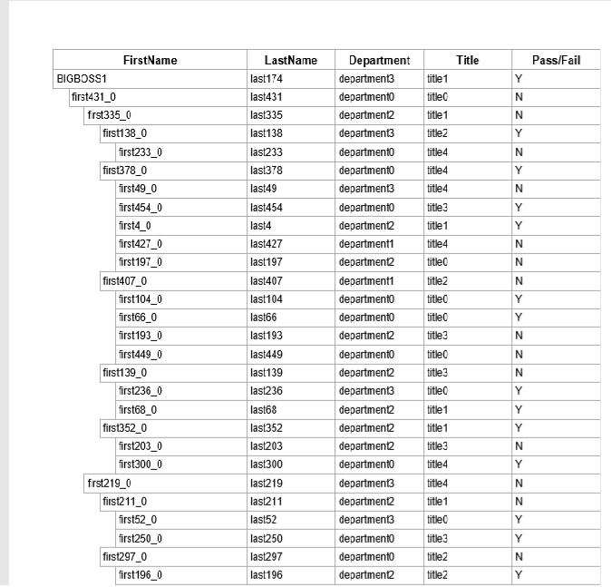
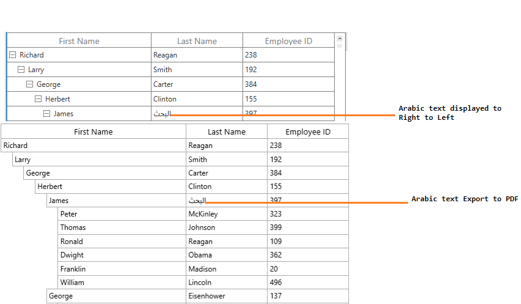

# Export To PDF in WPF TreeGrid (SfTreeGrid)

SfTreeGrid provides support to export the data to PDF file. This also provides support to export the headers and stacked headers. This maintains the sorting and filtering processes when exporting.

The following assemblies should be added for exporting a tree grid to PDF file:-

* Syncfusion.SfGridConverter.WPF
* Syncfusion.Pdf.Base

You can export the tree grid to PDF by using the following extension methods present in the [Syncfusion.UI.Xaml.TreeGrid.Converter](http://help.syncfusion.com/cr/wpf/) namespace:-

* [ExportToPdf](https://help.syncfusion.com/cr/wpf/Syncfusion.UI.Xaml.TreeGrid.Converter.TreeGridPdfExportExtension.html#Syncfusion_UI_Xaml_TreeGrid_Converter_TreeGridPdfExportExtension_ExportToPdf_Syncfusion_UI_Xaml_TreeGrid_SfTreeGrid_Syncfusion_UI_Xaml_TreeGrid_Converter_TreeGridPdfExportingOptions_)

* [ExportToPdfGrid](https://help.syncfusion.com/cr/wpf/Syncfusion.UI.Xaml.TreeGrid.Converter.TreeGridPdfExportExtension.html#Syncfusion_UI_Xaml_TreeGrid_Converter_TreeGridPdfExportExtension_ExportToPdfGrid_Syncfusion_UI_Xaml_TreeGrid_SfTreeGrid_Syncfusion_UI_Xaml_TreeGrid_Converter_TreeGridPdfExportingOptions_)



var options = new TreeGridPdfExportingOptions();
var document = treeGrid.ExportToPdf(options);
document.Save("Sample.pdf");



N> SfTreeGrid exports the data to PDF file using [Essential PDF](http://help.syncfusion.com/file-formats/pdf/overview). You can refer to the [PDF documentation](http://help.syncfusion.com/file-formats/pdf/working-with-document) for manipulation.

## Export options

The exporting operation can be customized by passing [TreeGridPdfExportingOptions](https://help.syncfusion.com/cr/wpf/Syncfusion.UI.Xaml.TreeGrid.Converter.TreeGridPdfExportingOptions.html) instance as an argument to the `ExportToPdf` and `ExportToPdfGrid` methods.

### Auto size column width in PDF

You can export a tree grid to PDF by fitting the column width based on its content by setting the [AutoColumnWidth ](https://help.syncfusion.com/cr/wpf/Syncfusion.UI.Xaml.TreeGrid.Converter.TreeGridPdfExportingOptions.html#Syncfusion_UI_Xaml_TreeGrid_Converter_TreeGridPdfExportingOptions_AutoColumnWidth)property to true.



var options = new TreeGridPdfExportingOptions();
options.AutoColumnWidth = true;
var document = treeGrid.ExportToPdf(options);
document.Save("Sample.pdf");



### Auto size row height in PDF

You can export a tree grid to PDF by fitting the row height based on its content by setting the [AutoRowHeight ](https://help.syncfusion.com/cr/wpf/Syncfusion.UI.Xaml.TreeGrid.Converter.TreeGridPdfExportingOptions.html#Syncfusion_UI_Xaml_TreeGrid_Converter_TreeGridPdfExportingOptions_AutoRowHeight)property to `true`.



var options = new TreeGridPdfExportingOptions();
options.AutoRowHeight = true;
var document = treeGrid.ExportToPdf(options);
document.Save("Sample.pdf");



### Exclude columns when exporting

By default, all the columns (including hidden columns) in the tree grid will be exported to PDF. To exclude some columns when exporting to PDF, use the [ExcludeColumns](https://help.syncfusion.com/cr/wpf/Syncfusion.UI.Xaml.TreeGrid.Converter.TreeGridPdfExportingOptions.html#Syncfusion_UI_Xaml_TreeGrid_Converter_TreeGridPdfExportingOptions_ExcludeColumns) property in [TreeGridPdfExportingOptions](https://help.syncfusion.com/cr/wpf/Syncfusion.UI.Xaml.TreeGrid.Converter.TreeGridPdfExportingOptions.html) class.



var options = new TreeGridPdfExportingOptions();
options.ExcludeColumns.Add("CustomerName");
options.ExcludeColumns.Add("Country");
var document = treeGrid.ExportToPdf(options);
document.Save("Sample.pdf");



### Export format

By default, the display text will be exported to PDF. To export an actual value, set the [ExportFormat ](https://help.syncfusion.com/cr/wpf/Syncfusion.UI.Xaml.TreeGrid.Converter.TreeGridPdfExportingOptions.html#Syncfusion_UI_Xaml_TreeGrid_Converter_TreeGridPdfExportingOptions_ExportFormat)property to `false`.



var options = new TreeGridPdfExportingOptions();
options.ExportFormat = false;
var document = treeGrid.ExportToPdf(options);
document.Save("Sample.pdf");



### Repeat column headers on each page

The column headers can be exported on each page by setting the [RepeatHeaders ](https://help.syncfusion.com/cr/wpf/Syncfusion.UI.Xaml.TreeGrid.Converter.TreeGridPdfExportingOptions.html#Syncfusion_UI_Xaml_TreeGrid_Converter_TreeGridPdfExportingOptions_RepeatHeaders)property.



var options = new TreeGridPdfExportingOptions();
options.RepeatHeaders = true;
var document = treeGrid.ExportToPdf(options);
document.Save("Sample.pdf");



### Export all the columns in one page

When exporting to PDF, you can fit all the columns in one page by setting  the [FitAllColumnsInOnePage ](https://help.syncfusion.com/cr/wpf/Syncfusion.UI.Xaml.TreeGrid.Converter.TreeGridPdfExportingOptions.html#Syncfusion_UI_Xaml_TreeGrid_Converter_TreeGridPdfExportingOptions_FitAllColumnsInOnePage)property to `true`.



var options = new TreeGridPdfExportingOptions();
options.FitAllColumnsInOnePage = true;
var document = treeGrid.ExportToPdf(options);
document.Save("Sample.pdf");



### Export stacked headers to PDF

You can export the stacked headers to PDF by setting the [ExportStackedHeaders ](https://help.syncfusion.com/cr/wpf/Syncfusion.UI.Xaml.TreeGrid.Converter.TreeGridPdfExportingOptions.html#Syncfusion_UI_Xaml_TreeGrid_Converter_TreeGridPdfExportingOptions_ExportStackedHeaders)property to `true`.



var options = new TreeGridPdfExportingOptions();
options.ExportStackedHeaders = true;
var document = treeGrid.ExportToPdf(options);
document.Save("Sample.pdf");



## Define header and footer for PDF page

TreeGrid provides a way to display additional content at the top (header) or bottom (footer) of a page when exporting to PDF. This can be performed by setting the [PageHeaderFooterEventHandler](https://help.syncfusion.com/cr/wpf/Syncfusion.UI.Xaml.TreeGrid.Converter.TreeGridPdfExportingOptions.html#Syncfusion_UI_Xaml_TreeGrid_Converter_TreeGridPdfExportingOptions_PageHeaderFooterEventHandler) property in [TreeGridPdfExportingOptions](https://help.syncfusion.com/cr/wpf/Syncfusion.UI.Xaml.TreeGrid.Converter.TreeGridPdfExportingOptions.html) class.

You can insert any string, image or drawing in the header and footer using the `PdfHeaderFooterEventHandler` property.
Setting [PdfPageTemplateElement](http://help.syncfusion.com/cr/wpf/Syncfusion.Pdf.PdfPageTemplateElement.html) class to the [PdfHeaderFooterEventArgs.PdfDocumentTemplate.Top](https://help.syncfusion.com/cr/wpf/Syncfusion.Pdf.PdfDocumentTemplate.html#Syncfusion_Pdf_PdfDocumentTemplate_Top) property loads the content at the top of a page. Setting `PdfPageTemplateElement` class to the [PdfHeaderFooterEventArgs.PdfDocumentTemplate.Bottom](https://help.syncfusion.com/cr/wpf/Syncfusion.Pdf.PdfDocumentTemplate.html#Syncfusion_Pdf_PdfDocumentTemplate_Bottom) property loads the content at the bottom of a page.



PdfFont font = new PdfStandardFont(PdfFontFamily.TimesRoman, 20f, PdfFontStyle.Bold);
var width = e.PdfPage.GetClientSize().Width;
PdfPageTemplateElement header = new PdfPageTemplateElement(width, 38);
header.Graphics.DrawString("Order Details", font, PdfPens.Black, 70, 3);
e.PdfDocumentTemplate.Top = header;



Here, `string` is inserted in the header of the exported PDF file using the [DrawString](https://help.syncfusion.com/cr/wpf/Syncfusion.Pdf.Graphics.PdfGraphics.html#Syncfusion_Pdf_Graphics_PdfGraphics_DrawString_System_String_Syncfusion_Pdf_Graphics_PdfFont_Syncfusion_Pdf_Graphics_PdfBrush_System_Drawing_PointF_) method. Similarly, you can insert any image, line, etc., using [DrawImage](https://help.syncfusion.com/cr/wpf/Syncfusion.Pdf.Graphics.PdfGraphics.html#Syncfusion_Pdf_Graphics_PdfGraphics_DrawImage_Syncfusion_Pdf_Graphics_PdfImage_System_Drawing_PointF_), [DrawLine](https://help.syncfusion.com/cr/wpf/Syncfusion.Pdf.Graphics.PdfGraphics.html#Syncfusion_Pdf_Graphics_PdfGraphics_DrawLine_Syncfusion_Pdf_Graphics_PdfPen_System_Drawing_PointF_System_Drawing_PointF_), etc., methods respectively.

## PDF page orientation

You can change the page orientation of PDF when exporting. The default page orientation is Portrait.
To change the page orientation, get the exported [PdfGrid](http://help.syncfusion.com/cr/wpf/Syncfusion.Pdf.Grid.PdfGrid.html) by using the [ExportToPdfGrid](https://help.syncfusion.com/cr/wpf/Syncfusion.UI.Xaml.Grid.Converter.GridPdfExportExtension.html#Syncfusion_UI_Xaml_Grid_Converter_GridPdfExportExtension_ExportToPdfGrid_Syncfusion_UI_Xaml_Grid_SfDataGrid_Syncfusion_Data_ICollectionViewAdv_Syncfusion_UI_Xaml_Grid_Converter_PdfExportingOptions_) method. Then, draw that `PdfGrid` into a [PdfDocument](http://help.syncfusion.com/cr/wpf/Syncfusion.Pdf.PdfDocument.html) by changing the [PageSettings.Orientation](https://help.syncfusion.com/cr/wpf/Syncfusion.Pdf.PdfPageSettings.html#Syncfusion_Pdf_PdfPageSettings_Orientation) property.



var options = new TreeGridPdfExportingOptions();
var document = new PdfDocument();
document.PageSettings.Orientation = PdfPageOrientation.Landscape;
var page = document.Pages.Add();
var PDFGrid = treeGrid.ExportToPdfGrid(options);
var format = new PdfGridLayoutFormat()
{
    Layout = PdfLayoutType.Paginate,
    Break = PdfLayoutBreakType.FitPage
};

PDFGrid.Draw(page, new PointF(), format);
document.Save("Sample.pdf");



## Save options

### Save PDF directly to file

After exporting to PDF, you can save the exported PDF file directly to file system using the [Save](https://help.syncfusion.com/cr/wpf/Syncfusion.Pdf.PdfDocumentBase.html#Syncfusion_Pdf_PdfDocumentBase_Save_System_IO_Stream_) method.



var options = new TreeGridPdfExportingOptions();
var document = treeGrid.ExportToPdf(options);
document.Save("Sample.pdf");



You can refer to the [PDF documentation](http://help.syncfusion.com/file-formats/pdf/loading-and-saving-document#saving-a-pdf-document-to-file-system).

### Save PDF as stream

After exporting to PDF, you can save the exported PDF file to stream using the [Save](https://help.syncfusion.com/cr/wpf/Syncfusion.Pdf.PdfDocumentBase.html#Syncfusion_Pdf_PdfDocumentBase_Save_System_IO_Stream_) method.



var options = new TreeGridPdfExportingOptions();
FileStream fileStream = new FileStream("Sample.pdf", FileMode.Create);
var document = treeGrid.ExportToPdf(options);
document.Save(fileStream);
fileStream.Close();



### Save PDF using file dialog

After exporting to PDF, you can save the exported PDF file by opening [FileDialog](https://msdn.microsoft.com/en-us/library/system.windows.forms.filedialog.aspx).



var options = new TreeGridPdfExportingOptions();
FileStream fileStream = new FileStream("Sample.pdf", FileMode.Create);
var document = treeGrid.ExportToPdf(options);
SaveFileDialog sfd = new SaveFileDialog
{
    Filter = "PDF Files(*.pdf)|*.pdf"
};

if (sfd.ShowDialog() == true)
{
    using (Stream stream = sfd.OpenFile())
    {
        document.Save(stream);
    }

    //Message box confirmation to view the created Pdf file.

    if (MessageBox.Show("Do you want to view the Pdf file?", "Pdf file has been created",
                        MessageBoxButton.YesNo, MessageBoxImage.Information) == MessageBoxResult.Yes)
    {

        //Launching the Pdf file using the default Application.
        System.Diagnostics.Process.Start(sfd.FileName);
    }
}



## Open exported PDF without saving in disk

You can view the exported PDF document without saving in a disk by using the [PDFViewerControl](http://help.syncfusion.com/wpf/pdfviewer/overview).



var options = new TreeGridPdfExportingOptions();
FileStream fileStream = new FileStream("Sample.pdf", FileMode.Create);
var document = treeGrid.ExportToPdf(options);
MemoryStream stream = new MemoryStream();
document.Save(stream);
PdfViewerControl pdfViewer = new PdfViewerControl();
pdfViewer.Load(stream);
Window window = new Window();
window.Content = pdfViewer;
window.Show();



## Cell appearance customization when exporting

When exporting, you can customize the cells in a PDF document by setting the [CellsExportingEventHandler](https://help.syncfusion.com/cr/wpf/Syncfusion.UI.Xaml.TreeGrid.Converter.TreeGridPdfExportingOptions.html#Syncfusion_UI_Xaml_TreeGrid_Converter_TreeGridPdfExportingOptions_CellsExportingEventHandler) property in [TreeGridPdfExportingOptions](https://help.syncfusion.com/cr/wpf/Syncfusion.UI.Xaml.TreeGrid.Converter.TreeGridPdfExportingOptions.html) class.

### Cell styling based on cell type in PDF

You can customize the cell styles based on the `CellType` using the [CellsExportingEventHandler](https://help.syncfusion.com/cr/wpf/Syncfusion.UI.Xaml.TreeGrid.Converter.TreeGridPdfExportingOptions.html#Syncfusion_UI_Xaml_TreeGrid_Converter_TreeGridPdfExportingOptions_CellsExportingEventHandler) property.



var options = new TreeGridPdfExportingOptions();
options.CellsExportingEventHandler = GridPdfExportingEventHandler;
var document = treeGrid.ExportToPdf(options);
document.Save("Sample.pdf");

void GridPdfExportingEventHandler(object sender, TreeGridCellPdfExportingEventArgs e)
{
    if (e.CellType == TreeGridCellType.HeaderCell)
        e.PdfGridCell.Style.BackgroundBrush = PdfBrushes.LightSteelBlue;

    else if (e.CellType == TreeGridCellType.RecordCell)
        e.PdfGridCell.Style.BackgroundBrush = PdfBrushes.Wheat;
}



### Cell styling based on the TreeGridPdfExportingOptions in PDF

You can style the stacked header, header and record cells in PDF by using  the [StackedHeaderCellStyle](https://help.syncfusion.com/cr/wpf/Syncfusion.UI.Xaml.TreeGrid.Converter.TreeGridPdfExportingOptions.html#Syncfusion_UI_Xaml_TreeGrid_Converter_TreeGridPdfExportingOptions_StackedHeaderCellStyle), [HeaderCellStyle](https://help.syncfusion.com/cr/wpf/Syncfusion.UI.Xaml.TreeGrid.Converter.TreeGridPdfExportingOptions.html#Syncfusion_UI_Xaml_TreeGrid_Converter_TreeGridPdfExportingOptions_HeaderCellStyle) and [RecordCellStyle](https://help.syncfusion.com/cr/wpf/Syncfusion.UI.Xaml.TreeGrid.Converter.TreeGridPdfExportingOptions.html#Syncfusion_UI_Xaml_TreeGrid_Converter_TreeGridPdfExportingOptions_RecordCellStyle) respectively in [TreeGridPdfExportingOptions](https://help.syncfusion.com/cr/wpf/Syncfusion.UI.Xaml.TreeGrid.Converter.TreeGridPdfExportingOptions.html) class.



var options = new TreeGridPdfExportingOptions();

//Style for Stacked Headers
var stackedHeaderCellStyle = new PdfGridCellStyle();
stackedHeaderCellStyle.BackgroundBrush = PdfBrushes.LightPink;
stackedHeaderCellStyle.Borders.All = new PdfPen(PdfBrushes.DarkGray, 0.2f);
options.StackedHeaderCellStyle = stackedHeaderCellStyle;

//Style for Header
var headerCellStyle = new PdfGridCellStyle();
headerCellStyle.BackgroundBrush = PdfBrushes.LightPink;
headerCellStyle.Borders.All = new PdfPen(PdfBrushes.DarkGray, 0.2f);
options.HeaderCellStyle = headerCellStyle;

//Style for RecordCell
var recordCell = new PdfGridCellStyle();
recordCell.BackgroundBrush = PdfBrushes.LightBlue;
recordCell.Borders.All = new PdfPen(PdfBrushes.DarkGray, 0.2f);
options.RecordCellStyle = recordCell;

options.ExportStackedHeaders = true;
var document = treeGrid.ExportToPdf(options);

document.Save("Sample.pdf");



### Customize exporting content

You can customize the cell values when exporting to PDF using [CellsExportingEventHandler ](https://help.syncfusion.com/cr/wpf/Syncfusion.UI.Xaml.TreeGrid.Converter.TreeGridPdfExportingOptions.html#Syncfusion_UI_Xaml_TreeGrid_Converter_TreeGridPdfExportingOptions_CellsExportingEventHandler)and [TreeGridPdfExportingOptions](https://help.syncfusion.com/cr/wpf/Syncfusion.UI.Xaml.TreeGrid.Converter.TreeGridPdfExportingOptions.html).



var options = new TreeGridPdfExportingOptions();
options.CellsExportingEventHandler = GridPdfExportingEventHandler;
options.FitAllColumnsInOnePage = true;
var document = treeGrid.ExportToPdf(options);
document.Save("Sample.pdf");

void GridPdfExportingEventHandler(object sender, TreeGridCellPdfExportingEventArgs e)
{
    // Based on the column mapping name and the cell type, you can change the cell values while exporting to PDF.

    if (e.CellType == TreeGridCellType.RecordCell && e.ColumnName == "IsClosed")
    {

        //if the cell value is True, "Y" will be displayed else "N" will be displayed.

        if (e.CellValue.Equals("True"))
            e.CellValue = "Y";

        else
            e.CellValue = "N";
    }
}



### Export images to PDF 

By default, images loaded in the [GridTemplateColumn](http://help.syncfusion.com/cr/wpf/Syncfusion.UI.Xaml.Grid.GridTemplateColumn.html) will not be exported to PDF. To export it, use [CellsExportingEventHandler](https://help.syncfusion.com/cr/wpf/Syncfusion.UI.Xaml.TreeGrid.Converter.TreeGridPdfExportingOptions.html#Syncfusion_UI_Xaml_TreeGrid_Converter_TreeGridPdfExportingOptions_CellsExportingEventHandler) property  in [TreeGridPdfExportingOptions](https://help.syncfusion.com/cr/wpf/Syncfusion.UI.Xaml.TreeGrid.Converter.TreeGridPdfExportingOptions.html) class. In `CellsExportingEventHandler`, an image will be loaded in [PdfGridCell](http://help.syncfusion.com/cr/wpf/Syncfusion.Pdf.Grid.PdfGridCell.html) class.



var options = new TreeGridPdfExportingOptions();
options.CellsExportingEventHandler = GridPdfExportingEventHandler;
options.FitAllColumnsInOnePage = true;
var document = treeGrid.ExportToPdf(options);
document.Save("Sample.pdf");

void GridPdfExportingEventHandler(object sender, TreeGridCellPdfExportingEventArgs e)
{
    if (e.CellType == TreeGridCellType.RecordCell && e.ColumnName == "IsClosed")
    {
        var style = new PdfGridCellStyle();
        PdfPen normalBorder = new PdfPen(PdfBrushes.DarkGray, 0.2f);
        System.Drawing.Image image = null;

        //Images are exported based on the CellValue 

        if (e.CellValue.Equals("True"))
        {

            //Access the image from the specified path 
            image = System.Drawing.Image.FromFile(@"..\..\Images\pass.png");
        }

        else
            image = System.Drawing.Image.FromFile(@"..\..\Images\fail.png");

        //Create the PDFImage for the specified image and assigned to BackgroundImage of the PdfGridCellStyle
        style.BackgroundImage = PdfImage.FromImage(image);
                                
        e.PdfGridCell.ImagePosition = PdfGridImagePosition.Fit;
        e.PdfGridCell.Style = style;

        //customize the Border color of PdfGridCell
        e.PdfGridCell.Style.Borders.All = normalBorder;
        e.CellValue = null;
    }
}



You can download the sample [here](http://www.syncfusion.com/downloads/support/directtrac/general/ze/PdfExportingDemo386427743.zip).

## Embed fonts in PDF file

By default, some fonts (such as Unicode font) are not supported in PDF. In this case, it is possible to embed the font in PDF document with the help of [PdfTrueTypeFont](http://help.syncfusion.com/cr/wpf/Syncfusion.Pdf.Graphics.PdfTrueTypeFont.html) class.



var options = new TreeGridPdfExportingOptions();
options.CellsExportingEventHandler = GridPdfExportingEventHandler;
options.FitAllColumnsInOnePage = true;
var document = treeGrid.ExportToPdf(options);
document.Save("Sample.pdf");

void GridPdfExportingEventHandler(object sender, TreeGridCellPdfExportingEventArgs e)
{
    if (e.CellType == TreeGridCellType.RecordCell)
    {
        PdfFont font = new PdfTrueTypeFont(new Font("Arial", 14), true);

        e.PdfGridCell.Style.Font = font;
    }
}



You can download the sample [here](http://www.syncfusion.com/downloads/support/directtrac/general/ze/EmbeddingFonts_to_PDF-1471058966.zip).

## Export parent and expanded child nodes

By default, all the tree grid nodes will be exported when exporting. You can export the parent and expanded child nodes alone by overriding the [ExportNodesToPdf](https://help.syncfusion.com/cr/wpf/Syncfusion.UI.Xaml.TreeGrid.Converter.TreeGridToPdfConverter.html#Syncfusion_UI_Xaml_TreeGrid_Converter_TreeGridToPdfConverter_ExportNodesToPdf_Syncfusion_UI_Xaml_TreeGrid_SfTreeGrid_Syncfusion_UI_Xaml_TreeGrid_TreeNodes_Syncfusion_Pdf_Grid_PdfGrid_Syncfusion_UI_Xaml_TreeGrid_Converter_TreeGridPdfExportingOptions_) method of [TreeGridToPdfConverter](https://help.syncfusion.com/cr/wpf/Syncfusion.UI.Xaml.TreeGrid.Converter.TreeGridToPdfConverter.html) class,



var options = new TreeGridPdfExportingOptions();
FileStream fileStream = new FileStream("Sample1.pdf", FileMode.Create);
var document = treeGrid.ExportToPdf(options,true);
document.Save(fileStream);
fileStream.Close();

public class TreeGridCustomPdfConverter : TreeGridToPdfConverter
{
internal bool _excludeNonExpandedNodes;
public TreeGridCustomPdfConverter(bool excludeNonExpandedNodes) :base()
{
    _excludeNonExpandedNodes = excludeNonExpandedNodes;
}
       
protected override void ExportNodesToPdf(SfTreeGrid treeGrid, TreeNodes nodes, PdfGrid pdfGrid, TreeGridPdfExportingOptions pdfExportingOptions)
{
    if (!_excludeNonExpandedNodes)
    {
        base.ExportNodesToPdf(treeGrid, nodes, pdfGrid, pdfExportingOptions);
    }
    else
    {
        for (int i = 0; i < nodes.Count; i++)
        {
            TreeNode node = nodes[i];
            ExportNodeToPdf(treeGrid, node, pdfGrid, pdfExportingOptions);
            if (node.IsExpanded && node.HasChildNodes)
            {
                node.PopulateChildNodes();
                ExportNodesToPdf(treeGrid, node.ChildNodes, pdfGrid, pdfExportingOptions);
            }
        }
    }
}



You can download the sample [here](http://www.syncfusion.com/downloads/support/directtrac/general/ze/PdfExportingDemo-751618893.ziphttp:/www.syncfusion.com/downloads/support/directtrac/general/ze/PdfExportingDemo-751618893.zip).

## Export Middle Eastern languages (Arabic and Hebrew) content to PDF

By default, [Middle Eastern languages ](http://en.wikipedia.org/wiki/Middle_East)(Arabic and Hebrew) in the tree grid will be exported from left to right in PDF. You can export them as displayed in the tree grid (export from right to left) by enabling the[RightToLeft](https://help.syncfusion.com/cr/wpf/Syncfusion.Pdf.Graphics.PdfStringFormat.html#Syncfusion_Pdf_Graphics_PdfStringFormat_RightToLeft) property in [PdfStringFormat](http://help.syncfusion.com/cr/wpf/Syncfusion.Pdf.Graphics.PdfStringFormat.html) class and apply the format to [PdfGridCell](http://help.syncfusion.com/cr/wpf/Syncfusion.Pdf.Grid.PdfGridCell.html) class using the [CellsExportingEventHandler](https://help.syncfusion.com/cr/wpf/Syncfusion.UI.Xaml.TreeGrid.Converter.TreeGridPdfExportingOptions.html#Syncfusion_UI_Xaml_TreeGrid_Converter_TreeGridPdfExportingOptions_CellsExportingEventHandler) property.



var options = new TreeGridPdfExportingOptions();
options.CellsExportingEventHandler = GridPdfExportingEventHandler;
var document = treeGrid.ExportToPdf(options);
document.Save("Sample.pdf");

void GridPdfExportingEventHandler(object sender, TreeGridCellPdfExportingEventArgs e)
{
    if (e.CellType != TreeGridCellType.RecordCell)
        return;

    PdfStringFormat format = new PdfStringFormat();

    //format the string from right to left.
    format.RightToLeft = true;
    e.PdfGridCell.StringFormat = format;
}



You can download the sample [here](http://www.syncfusion.com/downloads/support/directtrac/general/ze/ExportMiddleEstern_to_PDF32087667.zip).
