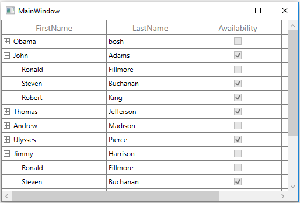

# Getting started with WPF TreeGrid (SfTreeGrid)

The SfTreeGrid is a data oriented control that displays the self-relational and hierarchical data in tree structure with columns. The data can be loaded on-demand also.

## Assembly Deployment

The following list of assemblies needs to be added as reference to use SfTreeGrid control in any application,

<table>
<tr>
<th>
Required assemblies
</th>
<th>
Description
</th>
</tr>
<tr>
<td>
Syncfusion.Data.WPF
</td>
<td>
Syncfusion.Data.WPF assembly is dependent assembly for Syncfusion.SfGrid. WPF
</td>
</tr>
<tr>
<td>
Syncfusion.SfGrid.WPF
</td>
<td>
Syncfusion.SfGrid. WPF assembly contains classes that handles all UI operations of SfTreeGrid.
SfTreeGrid control present in <b>Syncfusion.UI.Xaml.TreeGrid</b> namespace.
This namespace also added in <b>http://schemas.syncfusion.com/wpf Syncfusion</b> WPF schema.

</td>
</tr>
<tr>
<td>
Syncfusion.Shared.WPF
</td>
<td>
Syncfusion.Shared.WPF contains various editor controls (such as IntegerTextBox, DoubleTextBox and etc) which are used in SfTreeGrid.
</td>
</tr>
</table>

In order to use export to excel and export to PDF functionalities of SfTreeGrid control, add the reference to following assemblies,

<table>
<tr>
<th>
Optional Assemblies
</th>
<th>
Description
</th>
</tr>
<tr>
<td>
Syncfusion.SfGridConverter.WPF
</td>
<td>
Syncfusion.SfGridConverter.WPF contains static extension classes for exporting SfTreeGrid to excel and PDF in Syncfusion.UI.Xaml.TreeGrid.Converter namespace.
</td>
</tr>
<tr>
<td>
Syncfusion.XlsIO.Base
</td>
<td>
Syncfusion.XlsIO.Base contains fundamental and base classes for creating and manipulating excel files.
</td>
</tr>
<tr>
<td>
Syncfusion.Pdf.Base
</td>
<td>
Syncfusion.Pdf.Base contains fundamental and base classes for creating PDF.
</td>
</tr>
</table>

### Creating simple application with SfTreeGrid
In this walk through, you will create WPF application with SfTreeGrid control.

1. [Creating project](#creating-the-project)
2. [Adding control via Designer](#adding-control-via-designer)
3. [Adding control manually in XAML](#adding-control-manually-in-xaml)
4. [Adding control manually in C#](#adding-control-manually-in-c)
5. [Binding self-relational data in SfTreeGrid](#binding-self-relational-data-in-sftreegrid)
6. [Binding nested collection with SfTreeGrid](#binding-nested-collection-with-sftreegrid) 
7. [Populate SfTreeGrid in on-demand](https://help.syncfusion.com/wpf/treegrid/on-demand-loading)
8. [Defining Columns](#defining-columns)
9. [Selection](#selection)
10. [Sorting](#sorting)
11. [Editing](#editing)

#### Creating the project

Create new WPF project in Visual Studio to display SfTreeGrid with data objects.

#### Adding control via Designer

SfTreeGrid control can be added to the application by dragging it from Toolbox and dropping it in Designer view. The required assembly references will be added automatically.

#### Adding control manually in XAML
In order to add control manually in XAML, do the below steps,

1. Add the below required assembly references to the project as shown in the below image,
* Syncfusion.Data.WPF
* Syncfusion.SfGrid.WPF
* Syncfusion.Shared.WPF
2. Import Syncfusion WPF schema **http://schemas.syncfusion.com/wpf** or SfTreeGrid control namespace **Syncfusion.UI.Xaml.TreeGrid** in XAML page.
3. Declare SfTreeGrid control in XAML page.



<Window x:Class="WpfApplication1.MainWindow"
        xmlns="http://schemas.microsoft.com/winfx/2006/xaml/presentation"
        xmlns:x="http://schemas.microsoft.com/winfx/2006/xaml"
        xmlns:syncfusion="http://schemas.syncfusion.com/wpf"
        Title="MainWindow"
        Width="525"
        Height="350">
    <Grid>
        <syncfusion:SfTreeGrid x:Name="treeGrid" />
    </Grid>
</Window>



#### Adding control manually in C\#

To add control manually in C#, do the below steps,

1. Add the below required assembly references to the project,
* Syncfusion.Data.WPF
* Syncfusion.SfGrid.WPF
* Syncfusion.Shared.WPF
2. Import SfTreeGrid namespace **Syncfusion.UI.Xaml.TreeGrid**.
3. Create SfTreeGrid control instance and add it to the Page.



using Syncfusion.UI.Xaml.TreeGrid;
namespace WpfApplication1
{

    public partial class MainWindow : Window
    {

        public MainWindow()
        {
            InitializeComponent();
            SfTreeGrid treeGrid = new SfTreeGrid();
            Root_Grid.Children.Add(treeGrid);
        }
    }
}



#### Binding self-relational data in SfTreeGrid

SfTreeGrid supports to bind self-relational data by setting [SfTreeGrid.ParentPropertyName](https://help.syncfusion.com/cr/wpf/Syncfusion.UI.Xaml.TreeGrid.SfTreeGrid.html#Syncfusion_UI_Xaml_TreeGrid_SfTreeGrid_ParentPropertyName) and [SfTreeGrid.ChildPropertyName](https://help.syncfusion.com/cr/wpf/Syncfusion.UI.Xaml.TreeGrid.SfTreeGrid.html#Syncfusion_UI_Xaml_TreeGrid_SfTreeGrid_ChildPropertyName) properties where tree structure is formed based on these two properties.

`SfTreeGrid.ParentPropertyName` – Denotes the property in data object which is used to identify the root nodes.
`SfTreeGrid.ChildPropertyName` - Denotes the property in data object which is used identify its parent by matching the property value with `ParentPropertyName` property value of other data objects.

The data objects which has unique property value in `SfTreeGrid.ParentPropertyName` or the data objects which has the property value as in [SfTreeGrid.SelfRelationRootValue](https://help.syncfusion.com/cr/wpf/Syncfusion.UI.Xaml.TreeGrid.SfTreeGrid.html#Syncfusion_UI_Xaml_TreeGrid_SfTreeGrid_SelfRelationRootValue) are root nodes.

#### Creating Data Model for self-relational collection

SfTreeGrid is a data-bound control. So, before binding to the control, you must create data model for application.

1. Creating data object class named `EmployeeInfo` and declare properties as shown below,



public class EmployeeInfo
{
    int _id;
    string _firstName;
    string _lastName;
    private string _title;
    double? _salary;
    int _reportsTo;

    public string FirstName
    {
        get { return _firstName; }
        set { _firstName = value; }
    }

    public string LastName
    {
        get { return _lastName; }
        set { _lastName = value; }
    }

    public int ID
    {
        get { return _id; }
        set { _id = value; }
    }

    public string Title
    {
        get { return _title; }
        set { _title = value; }
    }

    public double? Salary
    {
        get { return _salary; }
        set { _salary = value; }
    }

    public int ReportsTo
    {
        get { return _reportsTo; }
        set { _reportsTo = value; }
    }
}



N> If you want your data object (EmployeeInfo class) to automatically reflect property changes, then the object must implement [INotifyPropertyChanged](https://msdn.microsoft.com/en-us/library/system.componentmodel.inotifypropertychanged.aspx) interface.

2. Create a `ViewModel` class with Employees property and Employees property is initialized with several data objects in constructor.



public class ViewModel
{

    public ViewModel()
    {
        this.Employees = this.GetEmployees();
    }
    private ObservableCollection<EmployeeInfo> _employees;

    public ObservableCollection<EmployeeInfo> Employees
    {
        get { return _employees; }
        set { _employees = value; }
    }

private  ObservableCollection<EmployeeInfo> GetEmployees()
 {
        ObservableCollection<EmployeeInfo> employeeDetails = new ObservableCollection<EmployeeInfo>();
        employeeDetails.Add(new EmployeeInfo() { FirstName = "Ferando", LastName = "Joseph", Title = "Management", Salary = 2000000, ReportsTo = -1, ID = 2 });
        employeeDetails.Add(new EmployeeInfo() { FirstName = "John", LastName = "Adams", Title = "Accounts", Salary = 2000000, ReportsTo = -1, ID = 3 });
        employeeDetails.Add(new EmployeeInfo() { FirstName = "Thomas", LastName = "Jefferson", Title = "Sales", Salary = 300000, ReportsTo = -1, ID = 4 });
        employeeDetails.Add(new EmployeeInfo() { FirstName = "Andrew", LastName = "Madison", Title = "Marketing", Salary = 4000000, ReportsTo = -1, ID = 5 });
        employeeDetails.Add(new EmployeeInfo() { FirstName = "Ulysses", LastName = "Pierce", Title = "HumanResource", Salary = 1500000, ReportsTo = -1, ID = 6 });
        employeeDetails.Add(new EmployeeInfo() { FirstName = "Jimmy", LastName = "Harrison", Title = "Purchasing", Salary = 200000, ReportsTo = -1, ID = 7 });
        employeeDetails.Add(new EmployeeInfo() { FirstName = "Ronald", LastName = "Fillmore", Title = "Production", Salary = 2800000, ReportsTo = -1, ID = 8 });
        //Management

        employeeDetails.Add(new EmployeeInfo() { FirstName = "Andrew", LastName = "Fuller", ID = 9, Salary = 1200000, ReportsTo = 2, Title = "Vice President" });
        employeeDetails.Add(new EmployeeInfo() { FirstName = "Janet", LastName = "Leverling", ID = 10, Salary = 1000000, ReportsTo = 2, Title = "GM" });
        employeeDetails.Add(new EmployeeInfo() { FirstName = "Steven", LastName = "Buchanan", ID = 11, Salary = 900000, ReportsTo = 2, Title = "Manager" });

        //Accounts
        employeeDetails.Add(new EmployeeInfo() { FirstName = "Nancy", LastName = "Davolio", ID = 12, Salary = 850000, ReportsTo = 3, Title = "Accounts Manager" });
        employeeDetails.Add(new EmployeeInfo() { FirstName = "Margaret", LastName = "Peacock", ID = 13, Salary = 700000, ReportsTo = 3, Title = "Accountant" });
        employeeDetails.Add(new EmployeeInfo() { FirstName = "Michael", LastName = "Suyama", ID = 14, Salary = 700000, ReportsTo = 3, Title = "Accountant" });
        employeeDetails.Add(new EmployeeInfo() { FirstName = "Robert", LastName = "King", ID = 15, Salary = 650000, ReportsTo = 3, Title = "Accountant" });

        //Sales
        employeeDetails.Add(new EmployeeInfo() { FirstName = "Laura", LastName = "Callahan", ID = 16, Salary = 900000, ReportsTo = 4, Title = "Sales Manager" });
        employeeDetails.Add(new EmployeeInfo() { FirstName = "Anne", LastName = "Dodsworth", ID = 17, Salary = 800000, ReportsTo = 4, Title = "Sales Representative" });
        employeeDetails.Add(new EmployeeInfo() { FirstName = "Albert", LastName = "Hellstern", ID = 18, Salary = 750000, ReportsTo = 4, Title = "Sales Representative" });
        employeeDetails.Add(new EmployeeInfo() { FirstName = "Tim", LastName = "Smith", ID = 19, Salary = 700000, ReportsTo = 4, Title = "Sales Representative" });
        employeeDetails.Add(new EmployeeInfo() { FirstName = "Justin", LastName = "Brid", ID = 20, Salary = 700000, ReportsTo = 4, Title = "Sales Representative" });

        //Back Office
        employeeDetails.Add(new EmployeeInfo() { FirstName = "Caroline", LastName = "Patterson", ID = 21, Salary = 800000, ReportsTo = 5, Title = "Receptionist" });
        employeeDetails.Add(new EmployeeInfo() { FirstName = "Xavier", LastName = "Martin", ID = 22, Salary = 700000, ReportsTo = 5, Title = "Mail Clerk" });

        //HR
        employeeDetails.Add(new EmployeeInfo() { FirstName = "Laurent", LastName = "Pereira", ID = 23, Salary = 900000, ReportsTo = 6, Title = "HR Manager" });
        employeeDetails.Add(new EmployeeInfo() { FirstName = "Syed", LastName = "Abbas", ID = 24, Salary = 650000, ReportsTo = 6, Title = "HR Assistant" });
        employeeDetails.Add(new EmployeeInfo() { FirstName = "Amy", LastName = "Alberts", ID = 25, Salary = 650000, ReportsTo = 6, Title = "HR Assistant" });

        //Purchasing

        employeeDetails.Add(new EmployeeInfo() { FirstName = "Pamela", LastName = "Ansman-Wolfe", ID = 26, Salary = 600000, ReportsTo = 7, Title = "Purchase Manager" });
        employeeDetails.Add(new EmployeeInfo() { FirstName = "Michael", LastName = "Blythe", ID = 27, Salary = 550000, ReportsTo = 7, Title = "Store Keeper" });
        employeeDetails.Add(new EmployeeInfo() { FirstName = "David", LastName = "Campbell", ID = 28, Salary = 450000, ReportsTo = 7, Title = "Store Keeper" });

        //Production
        employeeDetails.Add(new EmployeeInfo() { FirstName = "Jillian", LastName = "Carson", ID = 29, Salary = 600000, ReportsTo = 8, Title = "Production Manager" });
        employeeDetails.Add(new EmployeeInfo() { FirstName = "Shu", LastName = "Ito", ID = 30, Salary = 550000, ReportsTo = 8, Title = "Production Engineer" });
        employeeDetails.Add(new EmployeeInfo() { FirstName = "Stephen", LastName = "Jiang", ID = 31, Salary = 450000, ReportsTo = 8, Title = "Production Engineer" });

        return employeeDetails;
    }
}



#### Binding to Data

To bind the SfTreeGrid to data, set [SfTreeGrid.ItemsSource](https://help.syncfusion.com/cr/wpf/Syncfusion.UI.Xaml.TreeGrid.SfTreeGrid.html#Syncfusion_UI_Xaml_TreeGrid_SfTreeGrid_ItemsSource) property to an IEnumerable of implementation and to form tree structure from self-relational data, set [SfTreeGrid.ParentPropertyName](https://help.syncfusion.com/cr/wpf/Syncfusion.UI.Xaml.TreeGrid.SfTreeGrid.html#Syncfusion_UI_Xaml_TreeGrid_SfTreeGrid_ParentPropertyName) and [SfTreeGrid.ChildPropertyName](https://help.syncfusion.com/cr/wpf/Syncfusion.UI.Xaml.TreeGrid.SfTreeGrid.html#Syncfusion_UI_Xaml_TreeGrid_SfTreeGrid_ChildPropertyName) properties. Each row is SfTreeGrid is bound to an object in ItemsSource and each column is bound to a property in data object.

Bind the self-relations collection created in the previous step to `SfTreeGrid.ItemsSource` property and set `ParentPropertyName` as `ID` and `ChildPropertyName` as `ReportsTo` to form the tree structure as shown below,



<Window x:Class="GettingStarted.MainWindow"
        xmlns="http://schemas.microsoft.com/winfx/2006/xaml/presentation"
        xmlns:x="http://schemas.microsoft.com/winfx/2006/xaml"
        xmlns:local="clr-namespace:GettingStarted"
        xmlns:syncfusion="http://schemas.syncfusion.com/wpf"
        Title="MainWindow"
        Width="525"
        Height="350">
    <Window.DataContext>
        <local:ViewModel />
    </Window.DataContext>
    <Grid x:Name="Root_Grid">
        <syncfusion:SfTreeGrid Name="treeGrid"
                               ChildPropertyName="ReportsTo"
                               ItemsSource="{Binding Employees}"
                               ParentPropertyName="ID"
                               SelfRelationRootValue="-1" />

    </Grid>
</Window>






using Syncfusion.UI.Xaml.TreeGrid;
namespace GettingStarted
{

    public partial class MainWindow : Window
    {

        public MainWindow()
        {
            InitializeComponent();
            SfTreeGrid treeGrid = new SfTreeGrid();
            ViewModel viewModel = new ViewModel();           
            treeGrid.ParentPropertyName = "ID";
            treeGrid.ChildPropertyName = "ReportsTo";
            treeGrid.SelfRelationRootValue = -1;
            treeGrid.AutoExpandMode = AutoExpandMode.RootNodesExpanded;
            treeGrid.ItemsSource = viewModel.Employees;
            Root_Grid.Children.Add(treeGrid);
        }
    }    
}



### Binding Nested collection with SfTreeGrid

SfTreeGrid supports to bind nested or hierarchical collection (where each data object has hierarchy within) by setting the property name to [SfTreeGrid.ChildPropertyName](https://help.syncfusion.com/cr/wpf/Syncfusion.UI.Xaml.TreeGrid.SfTreeGrid.html#Syncfusion_UI_Xaml_TreeGrid_SfTreeGrid_ChildPropertyName) which holds the child collection.

#### Creating Data Model for nested collection

1. Create data object class named `PersonInfo` and declare properties as shown below, 



public class PersonInfo
{
    private string _firstName;
    private string _lastName;
    private bool _available;
    private double _salary;
    private ObservableCollection<PersonInfo> _children;

    public string FirstName
    {
        get { return _firstName; }
        set { _firstName = value; }
    }

    public string LastName
    {
        get { return _lastName; }
        set { _lastName = value; }
    }

    public bool Availability
    {
        get { return _available; }
        set { _available = value; }
    }

    public double Salary
    {
        get { return _salary; }
        set { _salary = value; }
    }
 
    public ObservableCollection<PersonInfo> Children
    {
        get { return _children; }
        set { _children = value; }
    }
}




2. Create a `ViewModel` class with PersonDetails property and PersonDetails property is initialized with several data objects in constructor



public class ViewModel 
{
    public ViewModel()
    {
        this.PersonDetails = this. CreatePersonData();
    }
    private ObservableCollection<PersonInfo> _personDetails;

    public ObservableCollection<PersonInfo> PersonDetails
    {
        get { return _personDetails; }
        set { _personDetails = value; }
    }

    private ObservableCollection<PersonInfo> CreatePersonData()
    {
        var personList = new ObservableCollection<PersonInfo>();
        ObservableCollection<PersonInfo> childCollection1 = new ObservableCollection<PersonInfo>();
        childCollection1.Add(new PersonInfo() { FirstName = "Andrew", LastName = "Fuller",Availability=true, Salary = 1200000 });
        childCollection1.Add(new PersonInfo() { FirstName = "Theodore", LastName = "Hoover",Availability=true, Salary = 1200000 });
        childCollection1.Add(new PersonInfo() { FirstName = "Harry", LastName = "Nixon",Availability=false, Salary = 1200000 });
        ObservableCollection<PersonInfo> childCollection2 = new ObservableCollection<PersonInfo>();
        childCollection2.Add(new PersonInfo { FirstName = "Ronald", LastName = "Fillmore", Availability = false, Salary = 23000 });
        childCollection2.Add(new PersonInfo() { FirstName = "Steven", LastName = "Buchanan", Availability = true, Salary = 340000 });
        childCollection2.Add(new PersonInfo() { FirstName = "Robert", LastName = "King", Availability = true, Salary = 32000 });
        personList.Add(new PersonInfo() { FirstName = "Obama", LastName = "bosh",Availability=false, Salary = 2000000, Children = childCollection1 });
        personList.Add(new PersonInfo() { FirstName = "John", LastName = "Adams",Availability=true, Salary = 2000000, Children = childCollection2 });
        personList.Add(new PersonInfo() { FirstName = "Thomas", LastName = "Jefferson",Availability=true, Salary = 300000, Children = childCollection1 });
        personList.Add(new PersonInfo() { FirstName = "Andrew", LastName = "Madison",Availability=false, Salary = 4000000, Children = childCollection2 });
        personList.Add(new PersonInfo() { FirstName = "Ulysses", LastName = "Pierce",Availability=true, Salary = 1500000, Children = childCollection1 });
        personList.Add(new PersonInfo() { FirstName = "Jimmy", LastName = "Harrison",Availability=false, Salary = 200000, Children = childCollection2 });
        personList.Add(new PersonInfo() { FirstName = "Ronald", LastName = "Fillmore", Availability=false,Salary = 2800000, Children = childCollection1 });
            
        return personList;
    }
}



#### Binding to Data

To bind the SfTreeGrid to data, set ItemsSource property to an IEnumerable of implementation and to form tree structure from nested collection data, set [SfTreeGrid.ChildPropertyName](https://help.syncfusion.com/cr/wpf/Syncfusion.UI.Xaml.TreeGrid.SfTreeGrid.html#Syncfusion_UI_Xaml_TreeGrid_SfTreeGrid_ChildPropertyName). Each row in SfTreeGrid is bound to an object in ItemsSource and each column is bound to a property in data object.
Bind the nested collection created in the previous step to [SfTreeGrid.ItemsSource](https://help.syncfusion.com/cr/wpf/Syncfusion.UI.Xaml.TreeGrid.SfTreeGrid.html#Syncfusion_UI_Xaml_TreeGrid_SfTreeGrid_ItemsSource) property and set `ChildPropertyName` as `Children` to form the tree structure as shown below, 



<Window x:Class="NestedCollectionDemo.MainWindow"
        xmlns="http://schemas.microsoft.com/winfx/2006/xaml/presentation"
        xmlns:x="http://schemas.microsoft.com/winfx/2006/xaml"
        xmlns:local="clr-namespace:NestedCollectionDemo"
        xmlns:syncfusion="http://schemas.syncfusion.com/wpf"
        Title="MainWindow"
        Width="525"
        Height="350">
    <Window.DataContext>
        <local:ViewModel />
    </Window.DataContext>
    <Grid x:Name="Root_Grid">
        <syncfusion:SfTreeGrid Name="treeGrid"
                               ChildPropertyName="Children"
                               ItemsSource="{Binding PersonDetails}" />

    </Grid>
</Window>



using Syncfusion.UI.Xaml.TreeGrid;
namespace NestedCollectionDemo
{

    public partial class MainWindow : Window
    {

        public MainWindow()
        {
            InitializeComponent();
            SfTreeGrid treeGrid = new SfTreeGrid();
            ViewModel viewModel = new ViewModel();
            treeGrid.ItemsSource = viewModel.PersonDetails;
            treeGrid.ChildPropertyName = "Children";
            Root_Grid.Children.Add(treeGrid);
        }
    }    
}



### Defining Columns

By default, the SfTreeGrid control generates the columns automatically when value assigned to [SfTreeGrid.ItemsSource](https://help.syncfusion.com/cr/wpf/Syncfusion.UI.Xaml.TreeGrid.SfTreeGrid.html#Syncfusion_UI_Xaml_TreeGrid_SfTreeGrid_ItemsSource) property. The type of the column generated depends on the type of data in the column and the attribute of the property the column bound with.

The following table lists the column types and its constraints for auto column generation.
<table>
<tr>
<th>
Generated Column Type
</th>
<th>
Data Type / Attribute
</th>
</tr>
<tr>
<td>
{{'[TreeGridTextColumn](https://help.syncfusion.com/cr/wpf/Syncfusion.UI.Xaml.TreeGrid.TreeGridTextColumn.html)'| markdownify }}
</td>
<td>
Property of type String and any other type apart from below specified cases.
</td>
</tr>
<tr>
<td>
{{'[TreeGridNumericColumn](https://help.syncfusion.com/cr/wpf/Syncfusion.UI.Xaml.TreeGrid.TreeGridNumericColumn.html)'| markdownify }}
</td>
<td>
Property of type Int or Double
</td>
</tr>
<tr>
<td>
{{'[TreeGridDateTimeColumn](https://help.syncfusion.com/cr/wpf/Syncfusion.UI.Xaml.TreeGrid.TreeGridDateTimeColumn.html)'| markdownify }}
</td>
<td>
Property of type DateTime
</td>
</tr>
<tr>
<td>
{{'[TreeGridCheckBoxColumn](https://help.syncfusion.com/cr/wpf/Syncfusion.UI.Xaml.TreeGrid.TreeGridCheckBoxColumn.html)'| markdownify }}
</td>
<td>
Property of type Bool
</td>
</tr>
<tr>
<td>
{{'[TreeGridCurrencyColumn](https://help.syncfusion.com/cr/wpf/Syncfusion.UI.Xaml.TreeGrid.TreeGridCurrencyColumn.html)'| markdownify }}
</td>
<td>
Property with Currency DataType attribute.
[DataType(DataType.Currency)].
</td>
</tr>
<tr>
<td>
{{'[TreeGridMaskColumn](https://help.syncfusion.com/cr/wpf/Syncfusion.UI.Xaml.TreeGrid.TreeGridMaskColumn.html)'| markdownify }}
</td>
<td>
Property with PhoneNumber DataType attribute. [DataType(DataType.PhoneNumber)]. </td>
</tr>
<tr>
<td>
{{'[TreeGridHyperLinkColumn](https://help.syncfusion.com/cr/wpf/Syncfusion.UI.Xaml.TreeGrid.TreeGridHyperlinkColumn.html)'| markdownify }}
</td>
<td>
Property of type Uri
</td>
</tr>
</table>

When columns are auto-generated, you can handle the [SfTreeGrid.AutoGeneratingColumn](https://help.syncfusion.com/cr/wpf/Syncfusion.UI.Xaml.TreeGrid.SfTreeGrid.html) event to customize or cancel the columns before they are added to the SfTreeGrid.
You can prevent the automatic column generation by setting [SfTreeGrid.AutoGenerateColumns](https://help.syncfusion.com/cr/wpf/Syncfusion.UI.Xaml.Grid.SfGridBase.html#Syncfusion_UI_Xaml_Grid_SfGridBase_AutoGenerateColumns) property to false. When `SfTreeGrid.AutoGenerateColumns` property is false, you should define the columns to be displayed as below,



<syncfusion:SfTreeGrid Name="treeGrid"
                            AutoExpandMode="AllNodesExpanded"
                            AutoGenerateColumns="False"
                            ChildPropertyName="Children"
                            ItemsSource="{Binding PersonDetails}">
    <syncfusion:SfTreeGrid.Columns>
        <syncfusion:TreeGridTextColumn HeaderText="First Name" MappingName="FirstName" />
        <syncfusion:TreeGridTextColumn HeaderText="Last Name" MappingName="LastName" />
        <syncfusion:TreeGridTextColumn HeaderText="ID"
                                            MappingName="Id"
                                            TextAlignment="Left" />
    </syncfusion:SfTreeGrid.Columns>
</syncfusion:SfTreeGrid>




Below is the list of column types provided in SfTreeGrid.
<table>
<tr>
<th>
Column Type
</th>
<th>
Comments
</th>
</tr>
<tr>
<td>
{{'[TreeGridTextColumn](https://help.syncfusion.com/cr/wpf/Syncfusion.UI.Xaml.TreeGrid.TreeGridTextColumn.html)'| markdownify }}
</td>
<td>
Represents SfTreeGrid column that hosts textual content in its cells.
</td>
</tr>
<tr>
<td>
{{'[TreeGridNumericColumn](https://help.syncfusion.com/cr/wpf/Syncfusion.UI.Xaml.TreeGrid.TreeGridNumericColumn.html)'| markdownify }}
</td>
<td>
Represents SfTreeGrid column that hosts {{'[DoubleTextBox](https://help.syncfusion.com/wpf/doubletextbox/overview)'| markdownify }} control in its cells which is used to format and display Numeric values.
</td>
</tr>
<tr>
<td>
{{'[TreeGridDateTimeColumn](https://help.syncfusion.com/cr/wpf/Syncfusion.UI.Xaml.TreeGrid.TreeGridDateTimeColumn.html)'| markdownify }}
</td>
<td>
Represents SfTreeGrid column that hosts {{'[DateTimeEdit](https://help.syncfusion.com/wpf/datetimeedit/overview)'| markdownify }} control in its cells which is used to display and format DateTime values.
</td>
</tr>
<tr>
<td>
{{'[TreeGridComboBoxColumn](https://help.syncfusion.com/cr/wpf/Syncfusion.UI.Xaml.TreeGrid.TreeGridComboBoxColumn.html)'| markdownify }}
</td>
<td>
Represents SfTreeGrid column that hosts `ComboBox`control in its cells.
</td>
</tr>
<tr>
<td>
{{'[TreeGridCheckBoxColumn](https://help.syncfusion.com/cr/wpf/Syncfusion.UI.Xaml.TreeGrid.TreeGridCheckBoxColumn.html)'| markdownify }}
</td>
<td>
Represents SfTreeGrid column that hosts `CheckBox` control in its cells.
</td>
</tr>
<tr>
<td>
{{'[TreeGridMaskColumn](https://help.syncfusion.com/cr/wpf/Syncfusion.UI.Xaml.TreeGrid.TreeGridMaskColumn.html)'| markdownify }}
</td>
<td>
Represents SfTreeGrid column that hosts `MaskedTextBox` control in its cells which is used to display textual content by applying Mask.
</td>
</tr>
<tr>
<td>
{{'[TreeGridCurrencyColumn](https://help.syncfusion.com/cr/wpf/Syncfusion.UI.Xaml.TreeGrid.TreeGridCurrencyColumn.html)'| markdownify }}
</td>
<td>
Represents SfTreeGrid column that hosts 
{{'[CurrencyTextBox](https://help.syncfusion.com/wpf/currencytextbox/overview)'| markdownify }} control in its cells which is used to display numeric values with currency format.
</td>
</tr>
<tr>
<td>
{{'[TreeGridPercentColumn](https://help.syncfusion.com/cr/wpf/Syncfusion.UI.Xaml.TreeGrid.TreeGridPercentColumn.html)'| markdownify }}
</td>
<td>
Represents SfTreeGrid column that hosts {{'[PercentTextBox](https://help.syncfusion.com/wpf/percenttextbox/overview)'| markdownify }} control in its cells which is used to display numeric values with percent format.
</td>
</tr>
<tr>
<td>
{{'[TreeGridHyperlinkColumn](https://help.syncfusion.com/cr/wpf/Syncfusion.UI.Xaml.TreeGrid.TreeGridHyperlinkColumn.html)'| markdownify }}
</td>
<td>
Represents SfTreeGrid column that hosts `HyperLink` control in its cells.
</td>
</tr>
<tr>
<td>
{{'[TreeGridTemplateColumn](https://help.syncfusion.com/cr/wpf/Syncfusion.UI.Xaml.TreeGrid.TreeGridTemplateColumn.html)'| markdownify }}
</td>
<td>
Represents SfTreeGrid column that hosts template-specified content in its cells
</td>
</tr>
</table>

### Selection

By default, the entire row is selected when a user clicks a cell in a SfTreeGrid. You can set the [SfTreeGrid.SelectionMode](https://help.syncfusion.com/cr/wpf/Syncfusion.UI.Xaml.Grid.SfGridBase.html#Syncfusion_UI_Xaml_Grid_SfGridBase_SelectionMode) property to specify whether a user can select single row or cell, or multiple rows or cells. 
You can handle the selection operations with the help of [SfTreeGrid.SelectionChanging](https://help.syncfusion.com/cr/wpf/Syncfusion.UI.Xaml.TreeGrid.SfTreeGrid.html) and [SfTreeGrid.SelectionChanged](https://help.syncfusion.com/cr/wpf/Syncfusion.UI.Xaml.TreeGrid.SfTreeGrid.html) events.

### Sorting

By default, you can sort columns in a SfTreeGrid by clicking the column header. You can configure the sorting by setting [SfTreeGrid.SortColumnDescriptions](https://help.syncfusion.com/cr/wpf/Syncfusion.UI.Xaml.Grid.SfGridBase.html#Syncfusion_UI_Xaml_Grid_SfGridBase_SortColumnDescriptions) property.
You can customize sorting by handling the [SfTreeGrid.SortColumnChanging](https://help.syncfusion.com/cr/wpf/Syncfusion.UI.Xaml.TreeGrid.SfTreeGrid.html) and [SfTreeGrid.SortColumnChanged](https://help.syncfusion.com/cr/wpf/Syncfusion.UI.Xaml.TreeGrid.SfTreeGrid.html) events. To cancel the default sort, set the Cancel property to true in `SfTreeGrid.SortColumnChanging` event.

### Editing

Editing can be enabled by setting [SfTreeGrid.AllowEditing](https://help.syncfusion.com/cr/wpf/Syncfusion.UI.Xaml.Grid.SfGridBase.html#Syncfusion_UI_Xaml_Grid_SfGridBase_AllowEditing) property to True. You can customize the editing operations by handling [SfTreeGrid.CurrentCellBeginEdit](https://help.syncfusion.com/cr/wpf/Syncfusion.UI.Xaml.TreeGrid.SfTreeGrid.html) and [SfTreeGrid.CurrentCellEndEdit](https://help.syncfusion.com/cr/wpf/Syncfusion.UI.Xaml.TreeGrid.SfTreeGrid.html) events.

### Filtering

Filtering can be enabled by setting the [SfTreeGrid.AllowFiltering](https://help.syncfusion.com/cr/wpf/Syncfusion.UI.Xaml.TreeGrid.SfTreeGrid.html#Syncfusion_UI_Xaml_TreeGrid_SfTreeGrid_AllowFiltering) property to true, where advanced filter UI can be opened by clicking the filter icon in column header to filter the nodes in SfTreeGrid. The filtering operations can be customized by handling the [SfTreeGrid.FilterChanging](https://help.syncfusion.com/cr/wpf/Syncfusion.UI.Xaml.TreeGrid.SfTreeGrid.html) and [SfTreeGrid.FilterChanged](https://help.syncfusion.com/cr/wpf/Syncfusion.UI.Xaml.TreeGrid.SfTreeGrid.html) events.

## Theme

SfTreeGrid supports various built-in themes. Refer to the below links to apply themes for the SfTreeGrid,

  * [Apply theme using SfSkinManager](https://help.syncfusion.com/wpf/themes/skin-manager)
	
  * [Create a custom theme using ThemeStudio](https://help.syncfusion.com/wpf/themes/theme-studio#creating-custom-theme)

  