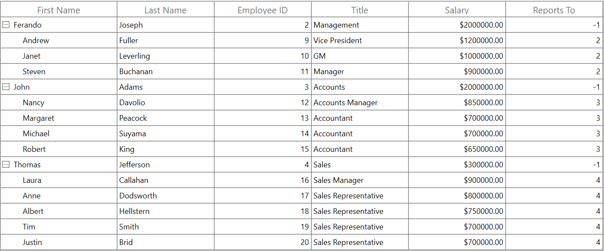
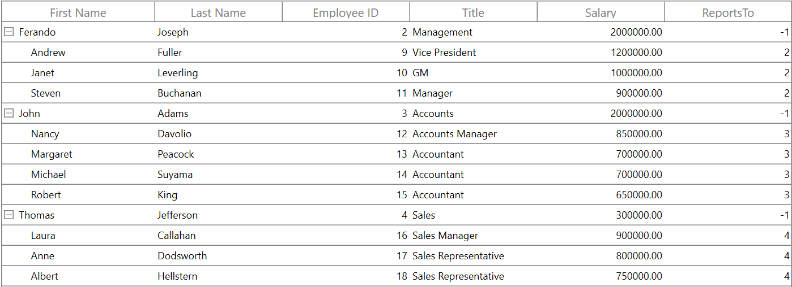
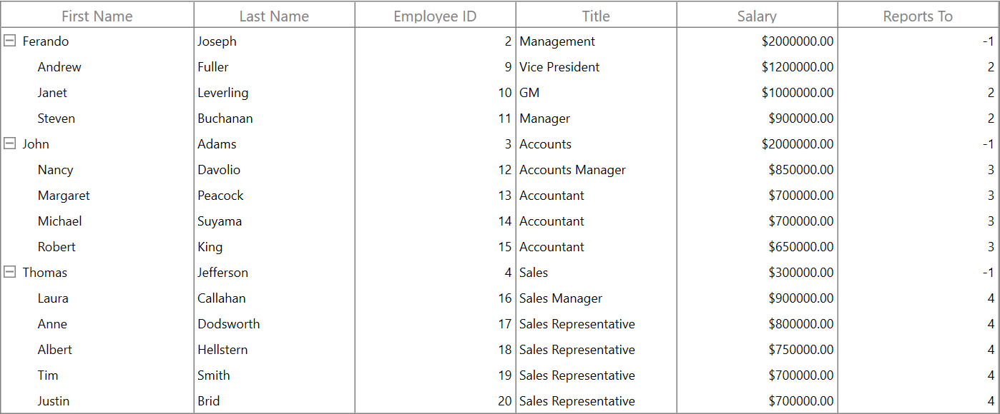
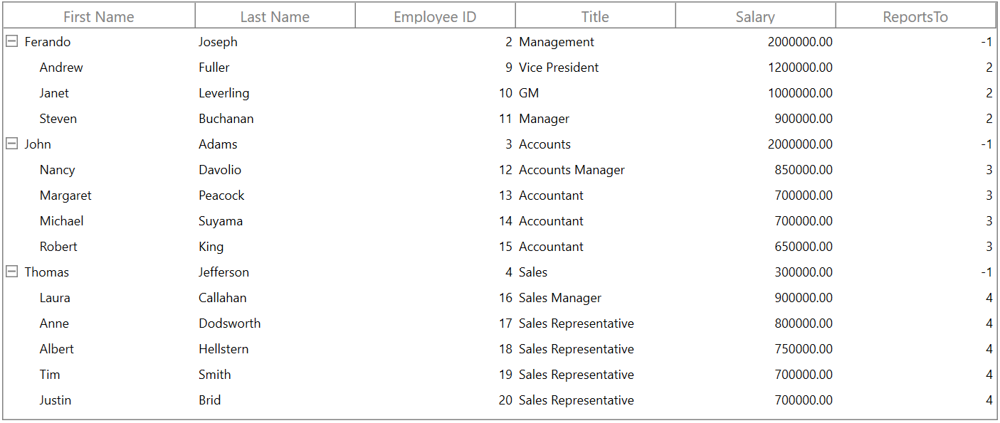
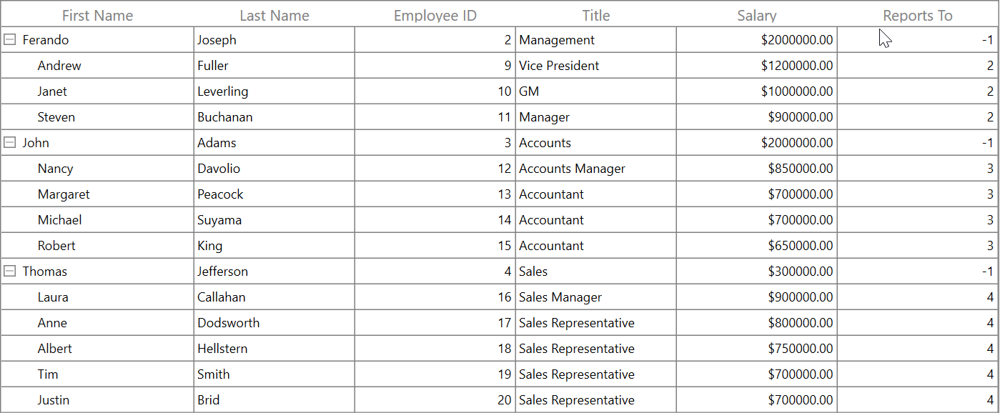

# Grid Lines customization in WPF TreeGrid (SfTreeGrid)

SfTreeGrid allows you to customize the grid lines visibility to vertical, horizontal, both or none. To achieve this, use the following properties.

`SfTreeGrid.GridLinesVisibility`: To set the border lines for the cells other than header and stacked header cells.
`SfTreeGrid.HeaderLinesVisibility`: To set the border lines only for header and stacked header cells.

The following are the list of options available to customize grid lines visibility,

* Both
* Vertical
* Horizontal
* None

## Record rows

### Both

The `GridLinesVisibility.Both` displays the TreeGrid with both horizontal and vertical grid lines. By default GridLinesVisibility value set as Both.



xmlns:syncfusion="http://schemas.syncfusion.com/wpf"

<syncfusion:SfTreeGrid x:Name="sfTreeGrid"
                       AutoExpandMode="RootNodesExpanded"
                       ChildPropertyName="ReportsTo"                       
                       ParentPropertyName="ID"
                       ItemsSource="{Binding Employees}"
                       GridLinesVisibility="Both"
                       SelfRelationRootValue="-1"/>



this.sfTreeGrid.GridLinesVisibility = GridLinesVisibility.Both;



### Horizontal

The `GridLinesVisibility.Horizontal` displays the TreeGrid with horizontal grid lines only.



xmlns:syncfusion="http://schemas.syncfusion.com/wpf"

<syncfusion:SfTreeGrid x:Name="sfTreeGrid"
                       AutoExpandMode="RootNodesExpanded"
                       ChildPropertyName="ReportsTo"
                       ParentPropertyName="ID"
                       ItemsSource="{Binding Employees}"
                       GridLinesVisibility="Horizontal"
                       SelfRelationRootValue="-1"/>



this.sfTreeGrid.GridLinesVisibility = GridLinesVisibility.Horizontal;



### Vertical

The `GridLinesVisibility.Vertical` displays the TreeGrid with vertical grid lines only.



xmlns:syncfusion="http://schemas.syncfusion.com/wpf"

<syncfusion:SfTreeGrid x:Name="sfTreeGrid"
                       AutoExpandMode="RootNodesExpanded"
                       ChildPropertyName="ReportsTo"
                       ItemsSource="{Binding Employees}"
                       GridLinesVisibility="Vertical"
                       ParentPropertyName="ID"
                       SelfRelationRootValue="-1"/>



this.sfTreeGrid.GridLinesVisibility = GridLinesVisibility.Vertical;



### None
`GridLinesVisibility.None` displays the TreeGrid without grid lines.



xmlns:syncfusion="http://schemas.syncfusion.com/wpf"

<syncfusion:SfTreeGrid x:Name="sfTreeGrid"
                       AutoExpandMode="RootNodesExpanded"
                       ChildPropertyName="ReportsTo"
                       ItemsSource="{Binding Employees}"
                       GridLinesVisibility="None"
                       ParentPropertyName="ID"
                       SelfRelationRootValue="-1"/>



this.sfTreeGrid.GridLinesVisibility = GridLinesVisibility.None;



## Header rows

You can customize the TreeGrid header lines visibility by using the `SfTreeGrid.HeaderLinesVisibility` property. You can also customize the header lines visibility to horizontal, vertical, none or both. By default HeaderLinesVisibility value set as Both.



xmlns:syncfusion="http://schemas.syncfusion.com/wpf"

<syncfusion:SfTreeGrid x:Name="sfTreeGrid"
                       AutoExpandMode="RootNodesExpanded"
                       ChildPropertyName="ReportsTo"
                       ParentPropertyName="ID"
                       ItemsSource="{Binding Employees}"
                       HeaderLinesVisibility="Horizontal"
                       SelfRelationRootValue="-1"/>


this.sfTreeGrid.HeaderLinesVisibility = GridLinesVisibility.Horizontal;



## Limitations

* Grid lines customization are not supported for RowHeader.