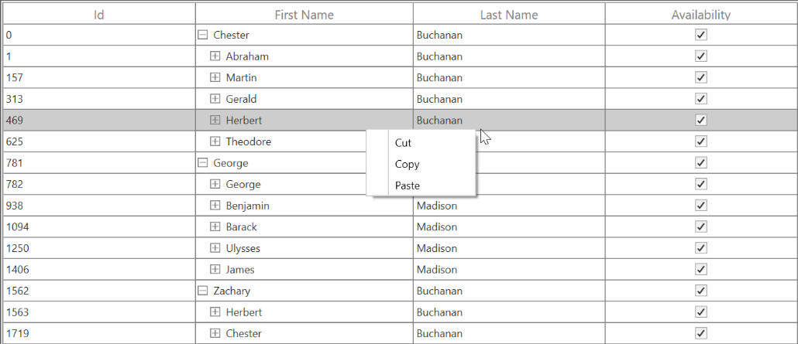
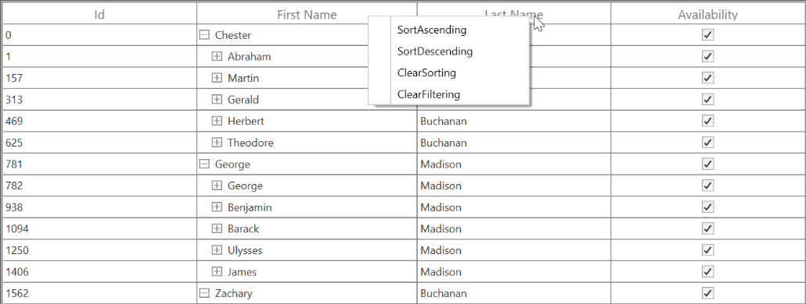

# Interactive Features in WPF TreeGrid (SfTreeGrid)

## Context menu

SfTreeGrid provides an entirely customizable menu to expose the functionalities on user interface. You can create context menus for different rows in an efficient manner.

The following code sample shows the context menu with command bindings.




<ContextMenu Style="{x:Null}">
    <MenuItem Command="{Binding Copy, Source={StaticResource viewModel}}"
          CommandParameter="{Binding}" Header="Copy">
    </MenuItem>
</ContextMenu>




public class BaseCommand : ICommand
{

    #region Fields
    readonly Action<object> _execute;
    readonly Predicate<object> _canExecute;
    #endregion

    #region Constructors
    /// 

    /// Creates a new command that can always execute.
    /// 

    /// <param name="execute">The execution logic.</param>

    public BaseCommand(Action<object> execute)
        : this(execute, null)
    {
    }

    /// 

    /// Creates a new command.
    /// 

    /// <param name="execute">The execution logic.</param>
    /// <param name="canExecute">The execution status logic.</param>

    public BaseCommand(Action<object> execute, Predicate<object> canExecute)
    {

        if (execute == null)
        throw new ArgumentNullException("execute");
        _execute = execute;
        _canExecute = canExecute;
    }
    #endregion
    
    #region ICommand Members

    public bool CanExecute(object parameter)
    {
        return _canExecute == null ? true : _canExecute(parameter);
    }
    
    public event EventHandler CanExecuteChanged
    {
        add { CommandManager.RequerySuggested += value; }
        remove { CommandManager.RequerySuggested -= value; }
    }

    public void Execute(object parameter)
    {
        _execute(parameter);
    }
    
    #endregion
}

public class EmployeeInfoViewModel : INotifyPropertyChanged
{

    public EmployeeInfoViewModel()
    {
        CopyCommand = new ContextMenuDemo.BaseCommand(ShowMessage);
    }
    
    private ICommand copyCommand

    public ICommand CopyCommand
    {
        get
        {
            return copyCommand;
        }
        set
        {
            copyCommand = value;
        }
    }
    
    public void ShowMessage(object obj)
    {

        if (obj is GridRecordContextMenuInfo)
        {
            var grid = (obj as GridRecordContextMenuInfo).DataGrid;
            grid.GridCopyPaste.Copy();
        }
    }
}




### ContextMenu based on rows

You can set different context menus to SfTreeGrid based on rows.

#### ContextMenu for nodes

You can set the context menu to data rows using the [SfTreeGrid.RecordContextMenu](https://help.syncfusion.com/cr/wpf/Syncfusion.UI.Xaml.Grid.SfGridBase.html#Syncfusion_UI_Xaml_Grid_SfGridBase_RecordContextMenu) property.
  



<syncfusion:SfTreeGrid.RecordContextMenu>
  <ContextMenu>
     <MenuItem x:Name="Cut" Header="Cut" />
     <MenuItem x:Name="Copy" Header="Copy"  />
     <MenuItem x:Name="Paste" Header="Paste" />
     <MenuItem x:Name="Delete" Header="Delete" />
  </ContextMenu>
</syncfusion:SfTreeGrid.RecordContextMenu>




this.treeGrid.RecordContextMenu = new ContextMenu();
this.treeGrid.RecordContextMenu.Items.Add(new MenuItem() { Header = "Cut" });
this.treeGrid.RecordContextMenu.Items.Add(new MenuItem() { Header = "Copy" });
this.treeGrid.RecordContextMenu.Items.Add(new MenuItem() { Header = "Paste" });




When binding the menu item using CommandBinding, you can get the command parameter as [TreeGridNodeContextMenuInfo](https://help.syncfusion.com/cr/wpf/Syncfusion.UI.Xaml.TreeGrid.TreeGridNodeContextMenuInfo.html), which contains nodes of the corresponding row.




<syncfusion:SfTreeGrid.RecordContextMenu>
<MenuItem Command="{Binding Copy, Source={StaticResource viewModel}}"              CommandParameter="{Binding}"
              Header="Copy">
    </MenuItem>
</syncfusion:SfTreeGrid.RecordContextMenu>




private static void OnCopyClicked(object obj)
        {
            var contextMenuInfo = obj as TreeGridNodeContextMenuInfo;
            if (contextMenuInfo == null)
                return;
            var grid = contextMenuInfo.TreeGrid;
            grid.GridCopyOption = GridCopyOption.CopyData;
            grid.TreeGridCopyPaste.Copy();
        }




#### ContextMenu for header

You can set the context menu to header using the [SfTreeGrid.HeaderContextMenu](https://help.syncfusion.com/cr/wpf/Syncfusion.UI.Xaml.Grid.SfGridBase.html#Syncfusion_UI_Xaml_Grid_SfGridBase_HeaderContextMenu) property.




<syncfusion:SfTreeGrid.HeaderContextMenu>
    <ContextMenu>
        <MenuItem x:Name=" SortAscending " Header="SortAscending" />
        <MenuItem x:Name=" SortDescending " Header="SortDescending" />
        <MenuItem x:Name=" ClearSorting " Header="ClearSorting" />
        <MenuItem x:Name=" ClearFiltering " Header="ClearFiltering" />
    </ContextMenu>
</syncfusion:SfTreeGrid.HeaderContextMenu>




this.treeGrid.HeaderContextMenu = new ContextMenu();
this.treeGrid.HeaderContextMenu.Items.Add(new MenuItem() { Header = "SortAscending" });
this.treeGrid.HeaderContextMenu.Items.Add(new MenuItem() { Header = "SortDescending" });
this.treeGrid.HeaderContextMenu.Items.Add(new MenuItem() { Header = "ClearSorting" });
this.treeGrid.HeaderContextMenu.Items.Add(new MenuItem() { Header = "ClearFiltering " });




When binding the menu item using CommandBinding, you can get the parameter as [TreeGridColumnContextMenuInfo](https://help.syncfusion.com/cr/wpf/Syncfusion.UI.Xaml.TreeGrid.TreeGridColumnContextMenuInfo.html), which contains a particular GridColumn.




<syncfusion:SfTreeGrid.HeaderContextMenu>
    <MenuItem Command="{Binding Source={x:Static <MenuItem Command="{Binding SortAscending, Source={StaticResource viewModel}}"
              Header="Sort Ascending">
    </MenuItem>
</syncfusion:SfTreeGrid.HeaderContextMenu>




  private static void OnSortAscendingClicked(object obj)
        {
            var contextMenuInfo = obj as TreeGridColumnContextMenuInfo;
            if (contextMenuInfo == null)
                return;
            var grid = contextMenuInfo.TreeGrid;
            var column = contextMenuInfo.Column;
            grid.SortColumnDescriptions.Clear();
            grid.SortColumnDescriptions.Add(new SortColumnDescription() { ColumnName = column.MappingName, SortDirection = ListSortDirection.Ascending });
        }




### ContextMenu for expander

You can set the context menu to header using the [SfTreeGrid.ExpanderContextMenu](https://help.syncfusion.com/cr/wpf/Syncfusion.UI.Xaml.TreeGrid.SfTreeGrid.html#Syncfusion_UI_Xaml_TreeGrid_SfTreeGrid_ExpanderContextMenu) property.




<syncfusion:SfTreeGrid.ExpanderContextMenu>
    <ContextMenu>
        <MenuItem x:Name=" Expand " Header="SortAscending" />
        <MenuItem x:Name=" Collapse" Header="Collapse" />
    </ContextMenu>
</syncfusion:SfTreeGrid.ExpanderContextMenu>




this.treeGrid.ExpanderContextMenu = new ContextMenu();
this.treeGrid.ExpanderContextMenu.Items.Add(new MenuItem() { Header = " Expand" });
this.treeGrid.ExpanderContextMenu.Items.Add(new MenuItem() { Header = "Collapse" });




When binding the menu item using CommandBinding, you can get the parameter as [TreeGridColumnContextMenuInfo](https://help.syncfusion.com/cr/wpf/Syncfusion.UI.Xaml.TreeGrid.TreeGridColumnContextMenuInfo.html), which contains the expander node.




<syncfusion:SfTreeGrid.HeaderContextMenu>
<MenuItem Command="{Binding Expand, Source={StaticResource viewModel}}"    
                                  CommandParameter="{Binding}"                                
 Header="Expand" />    
</syncfusion:SfTreeGrid.HeaderContextMenu>




  private static void OnExpandClicked(object obj)
        {
            var contextMenuInfo = obj as TreeGridNodeContextMenuInfo;
            if (contextMenuInfo == null)
                return;
            var grid = contextMenuInfo.TreeGrid;
            grid.ExpandNode(contextMenuInfo.TreeNode);
        }




### Events

The [TreeGridContextMenuOpening](https://help.syncfusion.com/cr/wpf/Syncfusion.UI.Xaml.TreeGrid.SfTreeGrid.html) event occurs when opening the context menu in SfTreeGrid. [TreeGridContextMenuEventArgs](https://help.syncfusion.com/cr/wpf/Syncfusion.UI.Xaml.TreeGrid.TreeGridContextMenuEventArgs.html#Syncfusion_SfGrid_WPF__ctor) has the following members, which provide information about the TreeGridContextMenuOpening event:
  
[ContextMenu](https://help.syncfusion.com/cr/wpf/Syncfusion.UI.Xaml.TreeGrid.TreeGridContextMenuEventArgs.html#Syncfusion_UI_Xaml_TreeGrid_TreeGridContextMenuEventArgs__ctor_System_Windows_Controls_ContextMenu_System_Object_Syncfusion_UI_Xaml_ScrollAxis_RowColumnIndex_Syncfusion_UI_Xaml_TreeGrid_ContextMenuType_System_Object_) – Gets the corresponding context menu. 
[ContextMenuInfo](https://help.syncfusion.com/cr/wpf/Syncfusion.UI.Xaml.TreeGrid.TreeGridContextMenuEventArgs.html#Syncfusion_UI_Xaml_TreeGrid_TreeGridContextMenuEventArgs_ContextMenuInfo) – Returns the context menu info based on the row that opens the context menu.
[ContextMenuType](https://help.syncfusion.com/cr/wpf/Syncfusion.UI.Xaml.TreeGrid.TreeGridContextMenuEventArgs.html#Syncfusion_UI_Xaml_TreeGrid_TreeGridContextMenuEventArgs__ctor_System_Windows_Controls_ContextMenu_System_Object_Syncfusion_UI_Xaml_ScrollAxis_RowColumnIndex_Syncfusion_UI_Xaml_TreeGrid_ContextMenuType_System_Object_) – Returns the type of context menu.
[RowColumnIndex](https://help.syncfusion.com/cr/wpf/Syncfusion.UI.Xaml.TreeGrid.TreeGridContextMenuEventArgs.html#Syncfusion_UI_Xaml_TreeGrid_TreeGridContextMenuEventArgs__ctor_System_Windows_Controls_ContextMenu_System_Object_Syncfusion_UI_Xaml_ScrollAxis_RowColumnIndex_Syncfusion_UI_Xaml_TreeGrid_ContextMenuType_System_Object_) – RowColumnIndex of the context menu, which is currently going to be opened. The RowColumnIndex is updated only for the RecordContextMenu and remains empty.
[Handled](https://help.syncfusion.com/cr/wpf/Syncfusion.UI.Xaml.Grid.GridHandledEventArgs.html#Syncfusion_UI_Xaml_Grid_GridHandledEventArgs_Handled) - Indicates whether the TreeGridContextMenuOpening event is handled or not.

### Customizing ContextMenus

#### Changing the menu item when ContextMenu opens

You can use the [TreeGridContextMenuOpening](https://help.syncfusion.com/cr/wpf/Syncfusion.UI.Xaml.TreeGrid.SfTreeGrid.html) event to change the menu item when the context menu opens. 




<syncfusion:SfTreeGrid.RecordContextMenu>
    <ContextMenu>
<MenuItem Command="{Binding Cut, Source={StaticResource viewModel}}"   
               CommandParameter="{Binding}"
                  Header="Cut">
        </MenuItem>
<MenuItem Command="{Binding Copy, Source={StaticResource viewModel}}"  
                CommandParameter="{Binding}"
                  Header="Copy">
        </MenuItem>
<MenuItem Command="{Binding Paste, Source={StaticResource viewModel}}" 
                 CommandParameter="{Binding}"
        Header="Paste">
        </MenuItem>
    </ContextMenu>
</syncfusion:SfTreeGrid.RecordContextMenu>




this.treeGrid.TreeGridContextMenuOpening += treeGrid_ TreeGridContextMenuOpening;

void dataGrid_ TreeGridContextMenuOpening (object sender, TreeGridContextMenuEventArgs e)
{
    e.ContextMenu.Items.Clear();

    if(e.ContextMenuType == ContextMenuType.RecordCell)
    {
        e.ContextMenu.Items.Add(new MenuItem() { Header="Record"});
        e.ContextMenu.Items.Add(new MenuItem() { Header = "Data" });
    }
}




####  Changing background to ContextMenu

You can change the appearance of the context menu by customizing the style with TargetType as ContextMenu.




<ContextMenu>
    <MenuItem x:Name="Cut" Header="Expand />
    <MenuItem x:Name="Copy" Header="Collapse" />
</ContextMenu>




## Drag and drop row

SfTreeGrid allows drag and drop the rows within and between controls by setting the [AllowDraggingRows](https://help.syncfusion.com/cr/wpf/Syncfusion.UI.Xaml.TreeGrid.SfTreeGrid.html#Syncfusion_UI_Xaml_TreeGrid_SfTreeGrid_AllowDraggingRows) and [AllowDrop](https://docs.microsoft.com/en-us/dotnet/api/system.windows.uielement.allowdrop?redirectedfrom=MSDN&view=net-5.0#System_Windows_UIElement_AllowDrop) properties to true. It is also possible to drag and drop the rows between treegrid and other controls such as ListView and TreeView. SfTreeGrid allows dropping rows when `AllowDrop` is true and allows dragging when `AllowDraggingRows` is true.



<syncfusion:SfTreeGrid Name="sfTreeGrid" 
                               AllowDraggingRows="True" 
                               AllowDrop="True" 
                               ChildPropertyName="ReportsTo" 
                               AutoGenerateColumns="False"                                  
                               ItemsSource="{Binding Employees}"
                               ParentPropertyName="ID"
                               SelfRelationRootValue="-1" />


sfTreeGrid.AllowDraggingRows = true;
sfTreeGrid.AllowDrop = true;



When dropping, the dragged node(s) can be added above or below as a child node based on its drop position. For example, if you dropped node at the bottom of the targeted node, it will be added below the targeted node. If you drop over the targeted node, it will be added as a child of that targeted node.

N> Drag indicators will not be shown when drop position is set to “Drop as child”.

### Drag multiple nodes

SfTreeGrid allows users to drag multiple selected nodes. You can enable multiple selection by setting the [SfTreeGrid.SelectionMode](https://help.syncfusion.com/cr/wpf/Syncfusion.UI.Xaml.Grid.SfGridBase.html#Syncfusion_UI_Xaml_Grid_SfGridBase_SelectionMode) property to `Multiple` or `Extended`.

### Events

SfTreeGrid triggers the following events when drag and drop:

### DragStart

[DragStart](https://help.syncfusion.com/cr/wpf/Syncfusion.UI.Xaml.TreeGrid.TreeGridRowDragDropController.html): Occurs when you start to drag the node in treegrid. The [TreeGridRowDragStartEventArgs](https://help.syncfusion.com/cr/wpf/Syncfusion.UI.Xaml.TreeGrid.TreeGridRowDragStartEventArgs.html) has the following member, which provides information for the `DragStart` event.

[DraggingNodes](https://help.syncfusion.com/cr/wpf/Syncfusion.UI.Xaml.TreeGrid.TreeGridRowDragStartEventArgs.html#Syncfusion_UI_Xaml_TreeGrid_TreeGridRowDragStartEventArgs_DraggingNodes): Gets the TreeNode that contains the data associated when dragging the rows.
  


sfTreeGrid.RowDragDropController.DragStart += RowDragDropController_DragStart;

private void RowDragDropController_DragStart(object sender, Syncfusion.UI.Xaml.TreeGrid.TreeGridRowDragStartEventArgs e)
{
            
}



### DragOver

[DragOver](https://help.syncfusion.com/cr/wpf/Syncfusion.UI.Xaml.TreeGrid.TreeGridRowDragDropController.html): Occurs continuously when tree node is dragged within the the target treegrid. The [TreeGridRowDragStartEventArgs](https://help.syncfusion.com/cr/wpf/Syncfusion.UI.Xaml.TreeGrid.TreeGridRowDragStartEventArgs.html) has the following members, which provide information for the `DragOver` event:

[Data](https://help.syncfusion.com/cr/wpf/Syncfusion.UI.Xaml.TreeGrid.TreeGridRowDragDropEventArgsBase.html#Syncfusion_UI_Xaml_TreeGrid_TreeGridRowDragDropEventArgsBase_Data): Gets or sets a data object that contains data associated when dragging the rows.

[DropPosition](https://help.syncfusion.com/cr/wpf/Syncfusion.UI.Xaml.TreeGrid.TreeGridRowDragDropEventArgsBase.html#Syncfusion_UI_Xaml_TreeGrid_TreeGridRowDragDropEventArgsBase_DropPosition): Gets a value that indicates the drop position based on the dropped location.

[IsFromOutSideSource](https://help.syncfusion.com/cr/wpf/Syncfusion.UI.Xaml.TreeGrid.TreeGridRowDragDropEventArgsBase.html#Syncfusion_UI_Xaml_TreeGrid_TreeGridRowDragDropEventArgsBase_IsFromOutSideSource): Gets a value that indicates whether the dragging item is from the same TreeGrid.

[ShowDragUI](https://help.syncfusion.com/cr/wpf/Syncfusion.UI.Xaml.TreeGrid.TreeGridRowDragOverEventArgs.html#Syncfusion_UI_Xaml_TreeGrid_TreeGridRowDragOverEventArgs_ShowDragUI): Gets or sets a value that indicates the default Dragging UI.

[TargetNode](https://help.syncfusion.com/cr/wpf/Syncfusion.UI.Xaml.TreeGrid.TreeGridRowDragDropEventArgsBase.html#Syncfusion_UI_Xaml_TreeGrid_TreeGridRowDragDropEventArgsBase_TargetNode): Gets a value that indicates the target node, which is going to be dropped.



sfTreeGrid.RowDragDropController.DragOver += RowDragDropController_DragOver;
private void RowDragDropController_DragOver(object sender, Syncfusion.UI.Xaml.TreeGrid.TreeGridRowDragOverEventArgs e)
{

}



### DragLeave

[DragLeave](https://help.syncfusion.com/cr/wpf/Syncfusion.UI.Xaml.TreeGrid.TreeGridRowDragDropController.html): Occurs when perform a drag-and-drop operation. The [TreeGridRowDragStartEventArgs](https://help.syncfusion.com/cr/wpf/Syncfusion.UI.Xaml.TreeGrid.TreeGridRowDragStartEventArgs.html) has the following members, which provide information for the `DragLeave` event:

[Data](https://help.syncfusion.com/cr/wpf/Syncfusion.UI.Xaml.TreeGrid.TreeGridRowDragDropEventArgsBase.html#Syncfusion_UI_Xaml_TreeGrid_TreeGridRowDragDropEventArgsBase_Data): Gets or sets a data object that contains the data associated when dragging the rows.

[DropPosition](https://help.syncfusion.com/cr/wpf/Syncfusion.UI.Xaml.TreeGrid.TreeGridRowDragDropEventArgsBase.html#Syncfusion_UI_Xaml_TreeGrid_TreeGridRowDragDropEventArgsBase_DropPosition): Gets a value that indicates the drop position based on the dropped location.

[IsFromOutSideSource](https://help.syncfusion.com/cr/wpf/Syncfusion.UI.Xaml.TreeGrid.TreeGridRowDragDropEventArgsBase.html#Syncfusion_UI_Xaml_TreeGrid_TreeGridRowDragDropEventArgsBase_IsFromOutSideSource): Gets a value that indicates whether the dragging item is from the same TreeGrid.

[TargetNode](https://help.syncfusion.com/cr/wpf/Syncfusion.UI.Xaml.TreeGrid.TreeGridRowDragDropEventArgsBase.html#Syncfusion_UI_Xaml_TreeGrid_TreeGridRowDragDropEventArgsBase_TargetNode): Gets a value that indicates the target, node which is going to be dropped.



this.sfTreeGrid.RowDragDropController.DragLeave += RowDragDropController_DragLeave;
private void RowDragDropController_DragLeave(object sender, Syncfusion.UI.Xaml.TreeGrid.TreeGridRowDragLeaveEventArgs e)
{

}



### Drop

[Drop](https://help.syncfusion.com/cr/wpf/Syncfusion.UI.Xaml.TreeGrid.TreeGridRowDragDropController.html): Occurs when a record is dropped within the target treegrid. The [TreeGridRowDragStartEventArgs](https://help.syncfusion.com/cr/wpf/Syncfusion.UI.Xaml.TreeGrid.TreeGridRowDragStartEventArgs.html) has the following members, which provide information for the `Drop` event:

[Data](https://help.syncfusion.com/cr/wpf/Syncfusion.UI.Xaml.TreeGrid.TreeGridRowDragDropEventArgsBase.html#Syncfusion_UI_Xaml_TreeGrid_TreeGridRowDragDropEventArgsBase_Data): Gets or sets a data object that contains the data associated while dragging the rows.

[DraggingNodes](https://help.syncfusion.com/cr/wpf/Syncfusion.UI.Xaml.TreeGrid.TreeGridRowDropEventArgs.html#Syncfusion_UI_Xaml_TreeGrid_TreeGridRowDropEventArgs_DraggingNodes): Gets the tree node, which contains the data associated when dragging the rows.

[DropPosition](https://help.syncfusion.com/cr/wpf/Syncfusion.UI.Xaml.TreeGrid.TreeGridRowDragDropEventArgsBase.html#Syncfusion_UI_Xaml_TreeGrid_TreeGridRowDragDropEventArgsBase_DropPosition): Gets a value that indicates the drop position based on the dropped location.

[IsFromOutSideSource](https://help.syncfusion.com/cr/wpf/Syncfusion.UI.Xaml.TreeGrid.TreeGridRowDragDropEventArgsBase.html#Syncfusion_UI_Xaml_TreeGrid_TreeGridRowDragDropEventArgsBase_IsFromOutSideSource): Gets a value that indicates whether the dragging item is from the same treegrid.

[TargetNode](https://help.syncfusion.com/cr/wpf/Syncfusion.UI.Xaml.TreeGrid.TreeGridRowDragDropEventArgsBase.html#Syncfusion_UI_Xaml_TreeGrid_TreeGridRowDragDropEventArgsBase_TargetNode): Gets a value that indicates the target node, which is going to be dropped.



this.sfTreeGrid.RowDragDropController.Drop += RowDragDropController_Drop;
private void RowDragDropController_Drop(object sender, Syncfusion.UI.Xaml.TreeGrid.TreeGridRowDropEventArgs e)
{

}



### Dropped

[Dropped](https://help.syncfusion.com/cr/wpf/Syncfusion.UI.Xaml.TreeGrid.TreeGridRowDragDropController.html): Occurs when a record is dropped within the target treegrid. The [TreeGridRowDragStartEventArgs](https://help.syncfusion.com/cr/wpf/Syncfusion.UI.Xaml.TreeGrid.TreeGridRowDragStartEventArgs.html) has the following members, which provide information for the `Dropped` event:

[Data](https://help.syncfusion.com/cr/wpf/Syncfusion.UI.Xaml.TreeGrid.TreeGridRowDragDropEventArgsBase.html#Syncfusion_UI_Xaml_TreeGrid_TreeGridRowDragDropEventArgsBase_Data): Gets or sets a data object that contains the data associated when dragging the rows.

[DropPosition](https://help.syncfusion.com/cr/wpf/Syncfusion.UI.Xaml.TreeGrid.TreeGridRowDragDropEventArgsBase.html#Syncfusion_UI_Xaml_TreeGrid_TreeGridRowDragDropEventArgsBase_DropPosition): Gets a value that indicates the drop position based on the dropped location.

[IsFromOutSideSource](https://help.syncfusion.com/cr/wpf/Syncfusion.UI.Xaml.TreeGrid.TreeGridRowDragDropEventArgsBase.html#Syncfusion_UI_Xaml_TreeGrid_TreeGridRowDragDropEventArgsBase_IsFromOutSideSource): Gets a value that indicates whether the dragging item is from the same treegrid.

[TargetNode](https://help.syncfusion.com/cr/wpf/Syncfusion.UI.Xaml.TreeGrid.TreeGridRowDragDropEventArgsBase.html#Syncfusion_UI_Xaml_TreeGrid_TreeGridRowDragDropEventArgsBase_TargetNode): Gets a value that indicates the target node, which is going to be dropped.



this.sfTreeGrid.RowDragDropController.Dropped += RowDragDropController_Dropped;
private void RowDragDropController_Dropped(object sender, Syncfusion.UI.Xaml.TreeGrid.TreeGridRowDroppedEventArgs e)
{

}



### Drag and drop between SfTreeGrid and other controls

#### Drag and drop between ListView and SfTreeGrid

You can drag and drop the items between list view and treegrid by wiring the [Drop](https://help.syncfusion.com/cr/wpf/Syncfusion.UI.Xaml.TreeGrid.TreeGridRowDragDropController.html) event from the [TreeGridRowDragDropController](https://help.syncfusion.com/cr/wpf/Syncfusion.UI.Xaml.TreeGrid.TreeGridRowDragDropController.html) class.



this.AssociatedObject.sfTreeGrid.RowDragDropController.Drop += RowDragDropController_Drop;

private void RowDragDropController_Drop(object sender, Syncfusion.UI.Xaml.TreeGrid.TreeGridRowDropEventArgs e)
{
    if (e.IsFromOutSideSource)
    {
        var item = e.Data.GetData("ListViewRecords") as ObservableCollection<object>;
        var record = item[0] as EmployeeInfo;
        var dropPosition = e.DropPosition.ToString();
        var newItem = new EmployeeInfo();

        var rowIndex = AssociatedObject.sfTreeGrid.ResolveToRowIndex(e.TargetNode.Item);
        int nodeIndex = (int)rowIndex;
        if (dropPosition != "None" && rowIndex != -1)
        {
            if (AssociatedObject.sfTreeGrid.View is TreeGridSelfRelationalView)
            {
                var treeNode = AssociatedObject.sfTreeGrid.GetNodeAtRowIndex(rowIndex);

                if (treeNode == null)
                    return;
                var data = treeNode.Item;
                AssociatedObject.sfTreeGrid.SelectionController.SuspendUpdates();
                var itemIndex = -1;

                TreeNode parentNode = null;

                if (dropPosition == "DropBelow" || dropPosition == "DropAbove")
                {
                    parentNode = treeNode.ParentNode;

                    if (parentNode == null)
                        newItem = new EmployeeInfo() { FirstName = record.FirstName, LastName = record.LastName, ID = record.ID, Salary = record.Salary, Title = record.Title, ReportsTo = -1 };
                    else
                    {
                        var parent = parentNode.Item as EmployeeInfo;
                        newItem = new EmployeeInfo() { FirstName = record.FirstName, LastName = record.LastName, ID = record.ID, Salary = record.Salary, Title = record.Title, ReportsTo = parent.ID };
                    }
                }

                else if (dropPosition == "DropAsChild")
                {

                    if (!treeNode.IsExpanded)
                        AssociatedObject.sfTreeGrid.ExpandNode(treeNode);
                    parentNode = treeNode;
                    var parent = parentNode.Item as EmployeeInfo;
                    newItem = new EmployeeInfo() { FirstName = record.FirstName, LastName = record.LastName, ID = record.ID, Salary = record.Salary, Title = record.Title, ReportsTo = parent.ID };

                }
                IList sourceCollection = null;

                if (dropPosition == "DropBelow" || dropPosition == "DropAbove")
                {

                    if (treeNode.ParentNode != null)
                    {

                        var collection = AssociatedObject.sfTreeGrid.View.GetPropertyAccessProvider().GetValue(treeNode.ParentNode.Item, AssociatedObject.sfTreeGrid.ChildPropertyName) as IEnumerable;

                        sourceCollection = GetSourceListCollection(collection);
                    }

                    else
                    {

                        sourceCollection = GetSourceListCollection(AssociatedObject.sfTreeGrid.View.SourceCollection);
                    }
                    itemIndex = sourceCollection.IndexOf(data);

                    if (dropPosition == "DropBelow")
                    {
                        itemIndex += 1;
                    }
                }

                else if (dropPosition == "DropAsChild")
                {
                    var collection = AssociatedObject.sfTreeGrid.View.GetPropertyAccessProvider().GetValue(data, AssociatedObject.sfTreeGrid.ChildPropertyName) as IEnumerable;

                    sourceCollection = GetSourceListCollection(collection);

                    if (sourceCollection == null)
                    {
                        var list = data.GetType().GetProperty(AssociatedObject.sfTreeGrid.ChildPropertyName).PropertyType.CreateNew() as IList;

                        if (list != null)
                        {
                            AssociatedObject.sfTreeGrid.View.GetPropertyAccessProvider().SetValue(treeNode.Item, AssociatedObject.sfTreeGrid.ChildPropertyName, list);
                            sourceCollection = list;
                        }
                    }
                    itemIndex = sourceCollection.Count;
                }
                sourceCollection.Insert(itemIndex, newItem);
                AssociatedObject.sfTreeGrid.SelectionController.ResumeUpdates();
                (AssociatedObject.sfTreeGrid.SelectionController as TreeGridRowSelectionController).RefreshSelection();
                e.Handled = true;
            }
        }
(AssociatedObject.listView.ItemsSource as ObservableCollection<EmployeeInfo>).Remove(record as EmployeeInfo);
    }
}



In ListView, wire the PreviewMouseMove and Drop events.



this.AssociatedObject.listView.PreviewMouseMove += ListView_PreviewMouseMove;
this.AssociatedObject.listView.Drop += ListView_Drop;

private void ListView_Drop(object sender, DragEventArgs e)
{
    ObservableCollection<TreeNode> treeNodes = new ObservableCollection<TreeNode>();

    if (e.Data.GetDataPresent("Nodes"))
        treeNodes= e.Data.GetData("Nodes") as ObservableCollection<TreeNode>;

    EmployeeInfo item = new EmployeeInfo();

    if (treeNodes.Count == 0 ||treeNodes==null)
        return;
           
    foreach (var node in treeNodes)
    {
        (AssociatedObject.sfTreeGrid.ItemsSource as ObservableCollection<EmployeeInfo>).Remove(node.Item as EmployeeInfo);
        if (node.HasChildNodes)
        {
            list.Add(node.Item as EmployeeInfo);
            GetChildNodes(node);
        }
        else
        {
            list.Add(node.Item as EmployeeInfo);
        }
    }
            
    foreach (var listItem in list)
    {
        (this.AssociatedObject.DataContext as ViewModel).Employee.Add(listItem);
    }
    list.Clear();
}

private void ListView_PreviewMouseMove(object sender, System.Windows.Input.MouseEventArgs e)
{
    if (e.LeftButton == MouseButtonState.Pressed)
    {
        ListBox dragSource = null;
        var records = new ObservableCollection<object>();
        ListBox parent = (ListBox)sender;
        dragSource = parent;
        object data = GetDataFromListBox(dragSource, e.GetPosition(parent));

        records.Add(data);

        var dataObject = new DataObject();
        dataObject.SetData("ListViewRecords", records);
        dataObject.SetData("ListView", this.AssociatedObject.listView);

        if (data != null)
        {
            DragDrop.DoDragDrop(parent, dataObject, DragDropEffects.Move);
        }
    }
    e.Handled = true;
}



Sample for dragging and dropping the items between list view and treegrid: [Sample](https://github.com/SyncfusionExamples/how-to-drag-and-drop-rows-in-wpf-between-listview-and-treegrid).

#### Drag and drop between TreeViewAdv and SfTreeGrid

You can drag and drop the items between tree view and treegrid by wiring the [Drop](https://help.syncfusion.com/cr/wpf/Syncfusion.UI.Xaml.TreeGrid.TreeGridRowDragDropController.html) and [DragStart](https://help.syncfusion.com/cr/wpf/Syncfusion.UI.Xaml.TreeGrid.TreeGridRowDragDropController.html) events from the [TreeGridRowDragDropController](https://help.syncfusion.com/cr/wpf/Syncfusion.UI.Xaml.TreeGrid.TreeGridRowDragDropController.html) class.



private void RowDragDropController_DragStart(object sender, TreeGridRowDragStartEventArgs e)
{
    e.Handled = true;
    var dataObject = new DataObject();
    dataObject.SetData("SourceTreeGrid", this.AssociatedObject.sfTreeGrid);
    dataObject.SetData("Nodes", e.DraggingNodes);
            
    foreach (var node in e.DraggingNodes)
    {
        if (node.HasChildNodes)
        {
            records.Add(node.Item as EmployeeInfo);
            GetChildNodes(node);
        }
        else
        {
            records.Add(node.Item as EmployeeInfo);
        }
    }

    dataObject.SetData(records);

    if(records!=null)
    DragDrop.DoDragDrop(this.AssociatedObject.sfTreeGrid, dataObject, DragDropEffects.Copy | DragDropEffects.Move);
    records.Clear();
}

private void RowDragDropController_Drop(object sender, TreeGridRowDropEventArgs e)
{
    if (e.IsFromOutSideSource)
    {
        ObservableCollection<object> item = e.Data.GetData(typeof(ObservableCollection<object>)) as ObservableCollection<object>;
        var record = item[0] as EmployeeInfo;
        var dropPosition = e.DropPosition.ToString();
        var newItem = new EmployeeInfo();

        var rowIndex = AssociatedObject.sfTreeGrid.ResolveToRowIndex(e.TargetNode.Item);
        int nodeIndex = (int)rowIndex;
        if (dropPosition != "None" && rowIndex != -1)
        {
            if (AssociatedObject.sfTreeGrid.View is TreeGridSelfRelationalView)
            {
                var treeNode = AssociatedObject.sfTreeGrid.GetNodeAtRowIndex(rowIndex);

                if (treeNode == null)
                    return;
                var data = treeNode.Item;
                AssociatedObject.sfTreeGrid.SelectionController.SuspendUpdates();
                var itemIndex = -1;

                TreeNode parentNode = null;

                if (dropPosition == "DropBelow" || dropPosition == "DropAbove")
                {
                    parentNode = treeNode.ParentNode;

                    if (parentNode == null)
                        newItem = new EmployeeInfo() { FirstName = record.FirstName, LastName = record.LastName, ID = record.ID, Salary = record.Salary, Title = record.Title, ReportsTo = -1 };
                    else
                    {
                        var parent = parentNode.Item as EmployeeInfo;
                        newItem = new EmployeeInfo() { FirstName = record.FirstName, LastName = record.LastName, ID = record.ID, Salary = record.Salary, Title = record.Title, ReportsTo = parent.ID };
                    }
                }

                else if (dropPosition == "DropAsChild")
                {

                    if (!treeNode.IsExpanded)
                        AssociatedObject.sfTreeGrid.ExpandNode(treeNode);
                    parentNode = treeNode;
                    var parent = parentNode.Item as EmployeeInfo;
                    newItem = new EmployeeInfo() { FirstName = record.FirstName, LastName = record.LastName, ID = record.ID, Salary = record.Salary, Title = record.Title, ReportsTo = parent.ID };

                }
                IList sourceCollection = null;

                if (dropPosition == "DropBelow" || dropPosition == "DropAbove")
                {

                    if (treeNode.ParentNode != null)
                    {

                        var collection = AssociatedObject.sfTreeGrid.View.GetPropertyAccessProvider().GetValue(treeNode.ParentNode.Item, AssociatedObject.sfTreeGrid.ChildPropertyName) as IEnumerable;

                        sourceCollection = GetSourceListCollection(collection);
                    }

                    else
                    {
                        sourceCollection = GetSourceListCollection(AssociatedObject.sfTreeGrid.View.SourceCollection);
                    }
                    itemIndex = sourceCollection.IndexOf(data);

                    if (dropPosition == "DropBelow")
                    {
                        itemIndex += 1;
                    }
                }

                else if (dropPosition == "DropAsChild")
                {
                    var collection = AssociatedObject.sfTreeGrid.View.GetPropertyAccessProvider().GetValue(data, AssociatedObject.sfTreeGrid.ChildPropertyName) as IEnumerable;

                    sourceCollection = GetSourceListCollection(collection);

                    if (sourceCollection == null)
                    {
                        var list = data.GetType().GetProperty(AssociatedObject.sfTreeGrid.ChildPropertyName).PropertyType.CreateNew() as IList;

                        if (list != null)
                        {
                            AssociatedObject.sfTreeGrid.View.GetPropertyAccessProvider().SetValue(treeNode.Item, AssociatedObject.sfTreeGrid.ChildPropertyName, list);
                            sourceCollection = list;
                        }
                    }
                    itemIndex = sourceCollection.Count;
                }
                sourceCollection.Insert(itemIndex, newItem);
                AssociatedObject.sfTreeGrid.SelectionController.ResumeUpdates();
                (AssociatedObject.sfTreeGrid.SelectionController as TreeGridRowSelectionController).RefreshSelection();
                e.Handled = true;
            }
        }
        (AssociatedObject.treeview.ItemsSource as ObservableCollection<EmployeeInfo>).Remove(record as EmployeeInfo);
    }
}


In TreeViewAdv, you need to wire the Drop event,


private void Treeview_Drop(object sender, DragEventArgs e)
{
    ObservableCollection<TreeNode> treeNodes = new ObservableCollection<TreeNode>();

    if (e.Data.GetDataPresent("Nodes"))
        treeNodes = e.Data.GetData("Nodes") as ObservableCollection<TreeNode>;

    EmployeeInfo item = new EmployeeInfo();

    if (treeNodes.Count == 0 || treeNodes == null)
        return;

    foreach (var node in treeNodes)
    {
        (AssociatedObject.sfTreeGrid.ItemsSource as ObservableCollection<EmployeeInfo>).Remove(node.Item as EmployeeInfo);
    }
}



Sample for dragging and dropping between TreeViewAdv and SfTreeGrid: [Sample](https://github.com/SyncfusionExamples/how-to-drag-and-drop-rows-in-wpf-between-treegrid-and-treeviewadv).

### Changing the row drop indicator

By default, the drop position will be indicated with arrows. To change the drop indicator as line, then set the [sfTreeGrid.RowDropIndicatorMode](https://help.syncfusion.com/cr/wpf/Syncfusion.UI.Xaml.TreeGrid.SfTreeGrid.html#Syncfusion_UI_Xaml_TreeGrid_SfTreeGrid_RowDropIndicatorMode) as `Line`.



<syncfusion:SfTreeGrid Margin="5"
                       Name="sfTreeGrid" 
                       AutoExpandMode="RootNodesExpanded"
                       AllowDraggingRows="True" 
                       AllowDrop="True" 
                       ChildPropertyName="ReportsTo"
                       ItemsSource="{Binding Employees}"
                       ParentPropertyName="ID"
                       SelfRelationRootValue="-1" "
                       RowDropIndicatorMode="Line" />			   



sfTreeGrid.RowDropIndicatorMode = Syncfusion.UI.Xaml.Grid.DropIndicatorMode.Line;




### Customizing drag-and-drop rows

SfTreeGrid processes row drag and drop operations in [TreeGridRowDragDropController](https://help.syncfusion.com/cr/wpf/Syncfusion.UI.Xaml.TreeGrid.TreeGridRowDragDropController.html) class. You can customize the row drag-and-drop operations using the events in the [SfTreeGrid.RowDragDropController](https://help.syncfusion.com/cr/wpf/Syncfusion.UI.Xaml.TreeGrid.TreeGridRowDragDropController.html).

### Auto expand the node on drag over

When drag over the tree node, if drop position is “Drop as child”, then you can auto expand the corresponding tree node by setting the [TreeGridRowDragDropController.CanAutoExpand](https://help.syncfusion.com/cr/wpf/Syncfusion.UI.Xaml.TreeGrid.TreeGridRowDragDropController.html#Syncfusion_UI_Xaml_TreeGrid_TreeGridRowDragDropController_CanAutoExpand) to `true`. It is also possible to control the delay in expanding the node when drag over using [TreeGridRowDragDropController.AutoExpandDelay](https://help.syncfusion.com/cr/wpf/Syncfusion.UI.Xaml.TreeGrid.TreeGridRowDragDropController.html#Syncfusion_UI_Xaml_TreeGrid_TreeGridRowDragDropController_AutoExpandDelay) property. Its default value is 3 sec.



treeGrid.RowDragDropController.CanAutoExpand = true;
treeGrid.RowDragDropController.AutoExpandDelay = new TimeSpan(0, 0, 2);



### Customize default drag UI

SfTreeGrid provides the default UI for drag and drop. However, you can customize the drag UI using the [RowDragDropTemplate](https://help.syncfusion.com/cr/wpf/Syncfusion.UI.Xaml.TreeGrid.SfTreeGrid.html#Syncfusion_UI_Xaml_TreeGrid_SfTreeGrid_RowDragDropTemplate) property.



<DataTemplate x:Key="dragdroptemplate">
            <Border x:Name="border" Width="250"  
                            Background="#ececec" 
                            BorderBrush="#c8c8c8"  Height="60"
                            BorderThickness="1.2">

                <Grid  VerticalAlignment="Center" 
                          HorizontalAlignment="Left">
                    <Grid.RowDefinitions>
                        <RowDefinition Height="Auto"/>
                        <RowDefinition Height="Auto"/>
                        <RowDefinition Height="Auto"/>
                    </Grid.RowDefinitions>
                    <Grid.ColumnDefinitions>
                        <ColumnDefinition Width="Auto"/>
                        <ColumnDefinition Width="Auto"/>
                    </Grid.ColumnDefinitions>

                    <TextBlock Padding="12,0,0,0" Text="Dragging rows count :" FontSize="14" FontFamily="Segoe UI" 
                                       Foreground="#333333" FontWeight="Regular" Background="SkyBlue" />

                    <TextBlock Text="{Binding DraggingRecords.Count}" FontSize="14" 
                                       FontFamily="Segoe UI"
                                       FontWeight="Regular" 
                                       Foreground="#333333" 
                                       Grid.Column="1" Margin="-100,0,0,0"/>

                    <Separator  Grid.Row="1" Height="2" BorderBrush="#c8c8c8"
                                        HorizontalAlignment="Stretch"  BorderThickness="1"
                                        VerticalAlignment="Stretch"  Width="250"/>

                    <TextBlock Text="Drop status:" 
                                       Foreground="#333333"
                                       Padding="12,0,0,0" Background="SkyBlue"
                                       FontFamily="Segoe UI" 
                                       FontWeight="Regular" 
                                       FontSize="14"
                                       Grid.Row="2"/>

                    <TextBlock Text="{Binding DragStatus}" 
                                       FontSize="14"
                                       FontFamily="Segoe UI"
                                       FontWeight="Regular"
                                       Foreground="#333333" 
                                       Margin="-163,0,0,0"
                                       Grid.Row="2" 
                                       Grid.Column="1"/>
                </Grid>
            </Border>
 </DataTemplate>

   <syncfusion:SfTreeGrid Name="sfTreeGrid" AutoExpandMode="RootNodesExpanded" SelectionMode="Extended" AllowDraggingRows="True" AllowDrop="True" 
                               ChildPropertyName="ReportsTo" 
                               ItemsSource="{Binding Employees}"
                               ParentPropertyName="ID"
                               RowDragDropTemplate="{StaticResource DragDropTemplate}"
                               SelfRelationRootValue="-1" >



### Disable dragging of certain nodes

You can restrict the dragging for specific nodes using the DragStart event of the the [TreeGridRowDragDropController](https://help.syncfusion.com/cr/wpf/Syncfusion.UI.Xaml.TreeGrid.TreeGridRowDragDropController.html) class.



private void RowDragDropController_DragStart(object sender, Syncfusion.UI.Xaml.TreeGrid.TreeGridRowDragStartEventArgs e)
{
    var nodes = e.DraggingNodes;
    var node = nodes.FirstOrDefault(n => n.Level == 0);

    if (node != null)
        e.Handled = true;
}



### Disable dropping of certain nodes

You can restrict the dropping for specific nodes using the Drop event of the [TreeGridRowDragDropController](https://help.syncfusion.com/cr/wpf/Syncfusion.UI.Xaml.TreeGrid.TreeGridRowDragDropController.html) class.



private void RowDragDropController_Drop(object sender, Syncfusion.UI.Xaml.TreeGrid.TreeGridRowDropEventArgs e)
{
    // Disable drop on leaf nodes.
    if (!e.TargetNode.HasChildNodes)
        e.Handled = true;
}



### Disable default Drag UI

You can disable the draggable popup by setting the [ShowDragUI](https://help.syncfusion.com/cr/wpf/Syncfusion.UI.Xaml.Grid.GridRowDragOverEventArgs.html#Syncfusion_UI_Xaml_Grid_GridRowDragOverEventArgs_ShowDragUI) as false in the Drop event of [TreeGridRowDragDropController](https://help.syncfusion.com/cr/wpf/Syncfusion.UI.Xaml.TreeGrid.TreeGridRowDragDropController.html) class.



private void RowDragDropController_DragOver(object sender, TreeGridRowDragOverEventArgs e)
{
    e.ShowDragUI = false;
}



N> You can refer to our [WPF TreeGrid](https://www.syncfusion.com/wpf-controls/treegrid) feature tour page for its groundbreaking feature representations. You can also explore our [WPF TreeGrid example](https://github.com/syncfusion/wpf-demos) to know how to render and configure the treegrid.