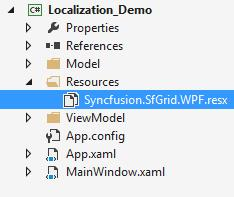
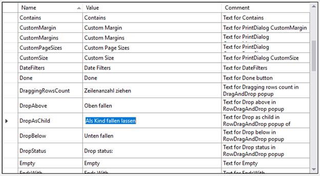
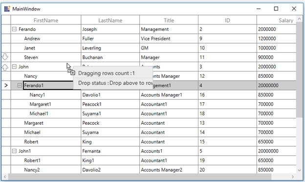

# Localization in WPF TreeGrid (SfTreeGrid)

Localization is the process of translating the application resources into different language for the specific cultures. You can localize the treegrid by [adding resource file](https://msdn.microsoft.com/library/aa992030.aspx). Application culture can be changed by setting `CurrentUICulture` before InitializeComponent method.

Below application culture changed to German.



public MainWindow()
{
    System.Threading.Thread.CurrentThread.CurrentUICulture = new System.Globalization.CultureInfo("de");
    InitializeComponent();
}



## Localize the drag and drop window text in treegrid

To localize the treegrid, drag and drop window based on CurrentUICulture using resource files, follow the below steps.

1.Create new folder and named as `Resources` in your application. 

2.Add the default resource file of treegrid into `Resources` folder. You can download the Syncfusion.SfGrid.WPF.resx [here](http://www.syncfusion.com/downloads/support/directtrac/general/ze/Syncfusion.SfGrid.WPF2020296999.zip).

3.Right-click on the Resources folder, select `Add` and then `NewItem`.

4.In Add New Item wizard, select the `Resource File` option and name the filename as `Syncfusion.SfGrid.WPF.&lt;culture name&gt;.resx`. For example, you have to give name as `Syncfusion.SfGrid.WPF.de.resx` for German culture.

5.The culture name that indicates the name of language and country.

6.Now, select Add option to add the resource file in `Resources` folder.

7.Add the Name/Value pair in Resource Designer of `Syncfusion.SfGrid.WPF.de.resx` file and change its corresponding value to corresponding culture.

You can download the sample [here](https://github.com/SyncfusionExamples/how-to-localize-the-drag-and-drop-window-text-in-treegrid/tree/master/WPF).

## Localize when the resource file is present in different assembly or different namespace

By default, the treegrid try to read the resource file from executing assembly and its default namespace by using [Assembly.GetExecuteAssembly](https://msdn.microsoft.com/en-us/library/system.reflection.assembly.getexecutingassembly.aspx) method. When the resource file is located at different assembly or namespace, then you can let treegrid know by using [GridResourceWrapper.SetResources](https://help.syncfusion.com/cr/wpf/Syncfusion.UI.Xaml.Grid.GridResourceWrapper.html#Syncfusion_UI_Xaml_Grid_GridResourceWrapper_SetResources_System_Reflection_Assembly_) method.



public MainWindow()
{
    System.Threading.Thread.CurrentThread.CurrentUICulture = new System.Globalization.CultureInfo("de-DE");
    Syncfusion.UI.Xaml.Grid.GridResourceWrapper.SetResources("Assembly_name", "namespace_name");
    InitializeComponent();
}



## Edit default culture resource 

You can edit default resource file by adding it to `Resources` folder of your application where treegrid reads the static texts from here. You can download the default resource file from [here](http://www.syncfusion.com/downloads/support/directtrac/general/ze/Syncfusion.SfGrid.WPF-804035924.zip).

Now, change the Name/Value pair in Resource Designer of `Syncfusion.SfGrid.WPF.resx` file.

