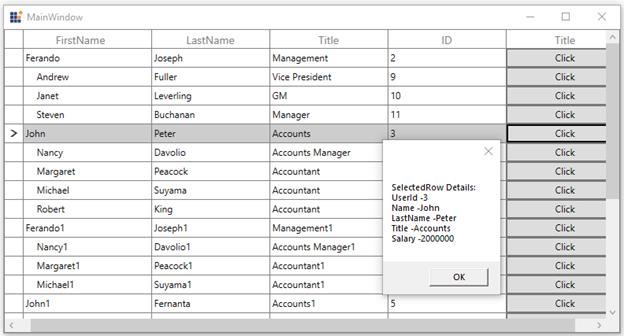
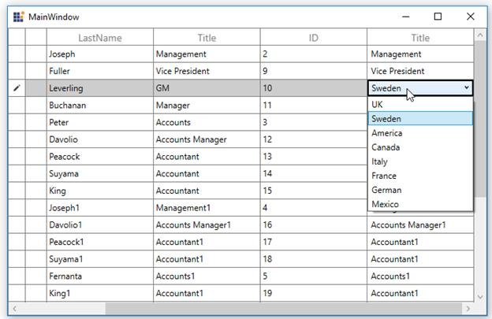
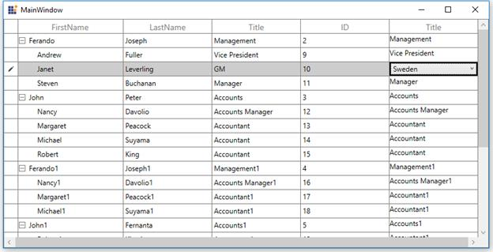

# MVVM in WPF TreeGrid (SfTreeGrid)

This section explains various MVVM requirements using SfTreeGrid.

## Bind the SelectedItem property of treegrid

You can bind the [SelectedItem ](https://help.syncfusion.com/cr/wpf/Syncfusion.UI.Xaml.Grid.SfGridBase.html#Syncfusion_UI_Xaml_Grid_SfGridBase_SelectedItem) property directly to treegrid by setting the `SfTreeGrid.SelectedItem` property.



<syncfusion:SfTreeGrid Name="treeGrid" 
                               Grid.Row="1" 
                               ChildPropertyName="ReportsTo"  
                               AutoExpandMode="AllNodesExpanded"
                               ShowRowHeader="True" 
                               SelectedItem="{Binding SelectedItem, Mode=TwoWay, UpdateSourceTrigger=PropertyChanged}"
                               AutoGenerateColumns="False"
                               ItemsSource="{Binding Employees}"
                               ParentPropertyName="ID"
                               SelfRelationRootValue="-1"/>



Whenever the `SelectedItem` is changed, the `ViewModel` property will get notified.



public class ViewModel: NotificationObject
{
    private object selectedItem;
    public object SelectedItem
    {
        get
        {
           return selectedItem;
        }
        set
        {
           selectedItem = value;
           RaisePropertyChanged("SelectedItem");
        }
    }
}



You can download the sample [here](https://github.com/SyncfusionExamples/how-to-bind-the-SelectedItem-property-of-wpf-and-uwp-tree-grid-in-mvvm/tree/master/WPF).

## Bind button command to view model

You can load a button for the columns in treegrid using [TreeGridTemplateColumn](https://help.syncfusion.com/cr/wpf/Syncfusion.UI.Xaml.TreeGrid.TreeGridTemplateColumn.html). When loading the buttons, you can bind a command in ViewModel using `ElementName` binding.

In the following example, ViewModel command receives the underlying data object as command parameter, since the DataContext is bound as command parameter.



<syncfusion:TreeGridTemplateColumn MappingName="Title" syncfusion:FocusManagerHelper.WantsKeyInput="True">
       <syncfusion:TreeGridTemplateColumn.CellTemplate>
           <DataTemplate>
               <Button  Content="Click" syncfusion:FocusManagerHelper.FocusedElement="True" 
                                        Command="{Binding Path=DataContext.RowDataCommand,ElementName=treeGrid}" CommandParameter="{Binding}"/>
           </DataTemplate>
       </syncfusion:TreeGridTemplateColumn.CellTemplate>
</syncfusion:TreeGridTemplateColumn>



You can download the sample [here](https://github.com/SyncfusionExamples/how-to-bind-button-command-to-view-model-in-wpf-and-uwp-treegrid-in-mvvm/tree/master/WPF).

## Bind combobox column ItemsSource from view model

You can bind the ItemsSource from ViewModel to [TreeGridComboBoxColumn](https://help.syncfusion.com/cr/wpf/Syncfusion.UI.Xaml.TreeGrid.TreeGridComboBoxColumn.html) or using `ElementName` binding.



<syncfusion:TreeGridComboBoxColumn AllowEditing="True" 
                                   MappingName="Title"
                                   HeaderText="Title"
                                   ItemsSource="{Binding DataContext.TitleList,
                                                                     ElementName=treeGrid}" />


private ObservableCollection<string> titleList;
public ObservableCollection<string> TitleList
{
     get { return titleList; }
     set { titleList = value; }
}



You can download the sample [here](https://github.com/SyncfusionExamples/how-to-bind-combobox-column-ItemsSource-from-view-model-in-wpf-and-uwp-treegrid-in-mvvm/tree/master/WPF).

## Bind view model ItemsSource to ComboBox inside template

You can load a ComboBox inside [TreeGridTemplateColumn](https://help.syncfusion.com/cr/wpf/Syncfusion.UI.Xaml.TreeGrid.TreeGridTemplateColumn.html) and bind the ItemsSource from ViewModel to ComboBox using `ElementName` binding.



  <syncfusion:TreeGridTemplateColumn MappingName="Title" syncfusion:FocusManagerHelper.WantsKeyInput="True">
         <syncfusion:TreeGridTemplateColumn.CellTemplate>
            <DataTemplate>
                            <TextBlock Text="{Binding Title}"/>
            </DataTemplate>
         </syncfusion:TreeGridTemplateColumn.CellTemplate>
         <syncfusion:TreeGridTemplateColumn.EditTemplate>
         DataTemplate>
        <ComboBox ItemsSource="{Binding Path=DataContext.TitleList, ElementName=treeGrid}" />
        </DataTemplate>
                    </syncfusion:TreeGridTemplateColumn.EditTemplate>
 </syncfusion:TreeGridTemplateColumn>



You can download the sample [here](https://github.com/SyncfusionExamples/how-to-bind-view-model-ItemsSource-to-combo-box-inside-template-in-wpf-and-uwp-treegrid-in-mvvm/tree/master/WPF).

## Bind columns from view model

You can bind the [SfTreeGrid.Columns](https://help.syncfusion.com/cr/wpf/Syncfusion.UI.Xaml.TreeGrid.SfTreeGrid.html#Syncfusion_UI_Xaml_TreeGrid_SfTreeGrid_ColumnsProperty) property in ViewModel by having the binding property of `Syncfusion.SfGrid.UI.Xaml.TreeGrid.Columns` type. Thus, you can set binding to the SfTreeGrid.Columns property that provides DataContext of treegrid in ViewModel.



<syncfusion:SfTreeGrid Name="treeGrid" 
                               Grid.Row="1" 
                               ChildPropertyName="ReportsTo"  
                               AutoExpandMode="AllNodesExpanded"
                               ShowRowHeader="True" 
                              Columns="{Binding SfGridColumns, Mode=TwoWay}"
                               AutoGenerateColumns="False"
                               ItemsSource="{Binding Employees}"
                               ParentPropertyName="ID"
                               SelfRelationRootValue="-1">
         
</syncfusion:SfTreeGrid>



Refer to the following code example in which the treegrid column is populated with some [TreeGridTextColumn](https://help.syncfusion.com/cr/wpf/Syncfusion.UI.Xaml.TreeGrid.TreeGridTextColumn.html) when creating the ViewModel instance.



public class ViewModel: NotificationObject
    {
        #region Private Variables
        private ObservableCollection<EmployeeInfo> _employees;
      
        #endregion

        #region ctr

        public ViewModel()
        {
            this.Employees = GetEmployeesDetails();
            rowDataCommand = new RelayCommand(ChangeCanExecute);
            this.sfGridColumns = new TreeGridColumns();
            sfGridColumns.Add(new TreeGridTextColumn() { MappingName = "FirstName" });
            sfGridColumns.Add(new TreeGridTextColumn() { MappingName = "LastName" });
            sfGridColumns.Add(new TreeGridTextColumn() { MappingName = "Title" });
            sfGridColumns.Add(new TreeGridTextColumn() { MappingName = "Salary" });
        }

        
        }
        #endregion
    }



You can download the sample [here](https://github.com/SyncfusionExamples/how-to-bind-columns-from-view-model-in-wpf-and-uwp-treegrid-in-mvvm/tree/master/WPF).
