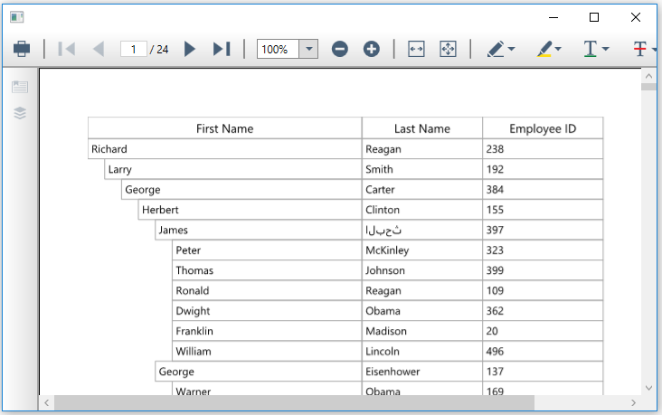

# Printing in WPF TreeGrid (SfTreeGrid)

The printing feature can be achieved by exporting the tree grid to PDF and printing the exported PDF using the [PdfViewerControl](https://help.syncfusion.com/wpf/pdf-viewer/printing-pdf-files) .



var options = new TreeGridPdfExportingOptions();
FileStream fileStream = new FileStream("Sample.pdf", FileMode.Create);
var document = treeGrid.ExportToPdf(options);
MemoryStream stream = new MemoryStream();
document.Save(stream);
PdfViewerControl pdfViewer = new PdfViewerControl();
pdfViewer.Load(stream);
Window window = new Window();
window.Content = pdfViewer;
window.Loaded += Window_Loaded;
window.Show();

private void Window_Loaded(object sender, RoutedEventArgs e)
{
    var toolbar = pdfViewer.Template.FindName("PART_Toolbar", pdfViewer) as DocumentToolbar;

    // Get an instance of the open and save file buttons using its template name.

    Button openButton = (Button)toolbar.Template.FindName("PART_ButtonOpen", toolbar);
    Button saveButton = (Button)toolbar.Template.FindName("PART_ButtonSave", toolbar);

    // Set visibility of the button to collapsed.
    openButton.Visibility = System.Windows.Visibility.Collapsed;
    saveButton.Visibility = Visibility.Collapsed;
}




You can download the [sample](https://github.com/SyncfusionExamples/how-to-print-wpf-treegrid-with-pdfviewercontrol).

## Print parent and expanded child nodes

You can print only the parent and expanded child nodes by overriding the [ExportNodesToPdf](https://help.syncfusion.com/cr/wpf/Syncfusion.UI.Xaml.TreeGrid.Converter.TreeGridToPdfConverter.html#Syncfusion_UI_Xaml_TreeGrid_Converter_TreeGridToPdfConverter_ExportNodesToPdf_Syncfusion_UI_Xaml_TreeGrid_SfTreeGrid_Syncfusion_UI_Xaml_TreeGrid_TreeNodes_Syncfusion_Pdf_Grid_PdfGrid_Syncfusion_UI_Xaml_TreeGrid_Converter_TreeGridPdfExportingOptions_) method of the [TreeGridToPdfConverter](https://help.syncfusion.com/cr/wpf/Syncfusion.UI.Xaml.TreeGrid.Converter.TreeGridToPdfConverter.html) class.



var options = new TreeGridPdfExportingOptions();
options.AllowIndentColumn = true;
options.FitAllColumnsInOnePage = true;

var document = treeGrid.ExportToPdf(options, true);

PdfViewerControl pdfViewer = new PdfViewerControl();
MemoryStream stream = new MemoryStream();
document.Save(stream);
PdfLoadedDocument ldoc = new PdfLoadedDocument(stream);
pdfViewer.Load(ldoc);
// If you want to  show the pdf viewer window, enable the following line.
MainWindow pdfPage = new MainWindow();
pdfPage.Content = pdfViewer;
pdfPage.Show();
pdfViewer.Print(true);

public class TreeGridCustomPdfConverter : TreeGridToPdfConverter
{
    internal bool _excludeNonExpandedNodes;
    public TreeGridCustomPdfConverter(bool excludeNonExpandedNodes) :base()
    {
        _excludeNonExpandedNodes = excludeNonExpandedNodes;
    }
    /// 

    /// ExportNodes to PDF
    /// 

    /// <param name="treeGrid"></param>
    /// <param name="nodes"></param>
    /// <param name="pdfGrid"></param>
    /// <param name="pdfExportingOptions"></param>
    protected override void ExportNodesToPdf(SfTreeGrid treeGrid, TreeNodes nodes, PdfGrid pdfGrid, TreeGridPdfExportingOptions pdfExportingOptions)
    {
        if (!_excludeNonExpandedNodes)
        {
            base.ExportNodesToPdf(treeGrid, nodes, pdfGrid, pdfExportingOptions);
        }
        else
        {
            for (int i = 0; i < nodes.Count; i++)
            {
                TreeNode node = nodes[i];
                ExportNodeToPdf(treeGrid, node, pdfGrid, pdfExportingOptions);
                if (node.IsExpanded && node.HasChildNodes)
                {
                    node.PopulateChildNodes();
                    ExportNodesToPdf(treeGrid, node.ChildNodes, pdfGrid, pdfExportingOptions);
                }
            }
        }
    }
}




You can download the [sample](https://github.com/SyncfusionExamples/how-to-print-wpf-treegrid-with-pdfviewercontrol).

## Print customization

The print page can be customized when exporting by passing the [TreeGridPdfExportingOptions](https://help.syncfusion.com/cr/wpf/Syncfusion.UI.Xaml.TreeGrid.Converter.TreeGridPdfExportingOptions.html) instance as an argument to the [ExportToPdf](https://help.syncfusion.com/cr/wpf/Syncfusion.UI.Xaml.TreeGrid.Converter.TreeGridPdfExportExtension.html#Syncfusion_UI_Xaml_TreeGrid_Converter_TreeGridPdfExportExtension_ExportToPdf_Syncfusion_UI_Xaml_TreeGrid_SfTreeGrid_Syncfusion_UI_Xaml_TreeGrid_Converter_TreeGridPdfExportingOptions_) and [ExportToPdfGrid](https://help.syncfusion.com/cr/wpf/Syncfusion.UI.Xaml.TreeGrid.Converter.TreeGridPdfExportExtension.html#Syncfusion_UI_Xaml_TreeGrid_Converter_TreeGridPdfExportExtension_ExportToPdfGrid_Syncfusion_UI_Xaml_TreeGrid_SfTreeGrid_Syncfusion_UI_Xaml_TreeGrid_Converter_TreeGridPdfExportingOptions_) methods. Refer to this [documentation](https://help.syncfusion.com/wpf/treegrid/export-to-pdf#export-options) to customize the export options.

N> You can refer to our [WPF TreeGrid](https://www.syncfusion.com/wpf-controls/treegrid) feature tour page for its groundbreaking feature representations. You can also explore our [WPF TreeGrid example](https://github.com/syncfusion/wpf-demos) to know how to render and configure the treegrid.