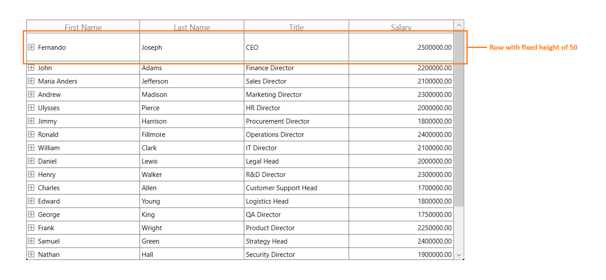

# Row Height Customization in WPF TreeGrid (SfTreeGrid)

You can change the header row height by setting **SfTreeGrid.HeaderRowHeight** and the other rows height can be changed by setting **SfTreeGrid.RowHeight** property.



<syncfusion:SfTreeGrid Name="treeGrid"
                       ChildPropertyName="ReportsTo"
                       ItemsSource="{Binding Employees}"
                       ParentPropertyName="ID"
                       SelfRelationRootValue="-1"
                       RowHeight="30"
                       HeaderRowHeight="50"/>


this.treeGrid.HeaderRowHeight = 50;
this.treeGrid.RowHeight = 30;



You can also change the particular row height using **TreeGridPanel.RowHeights** property.



using Syncfusion.UI.Xaml.TreeGrid.Helpers;
this.treeGrid.Loaded +=treeGrid_Loaded;

void treeGrid_Loaded(object sender, RoutedEventArgs e)
{
    var TreeGridPanel = this.treeGrid.GetTreePanel();

    //Set RowHeight to 2'nd row
    TreeGridPanel.RowHeights[2] = 50;
    TreeGridPanel.InvalidateMeasure();
}



You can also change the row height of particular row using **QueryRowHeight** event.



this.treeGrid.QueryRowHeight += TreeGrid_QueryRowHeight; 

void TreeGrid_QueryRowHeight(object sender, TreeGridQueryRowHeightEventArgs e)
{
    if (e.RowIndex == 2) //Sets Height to the second row.
    {
        e.Height = 50;
        e.Handled = true;
    }
}



## QueryRowHeight event

You can change the row height in on-demand based on the row index or row data using **SfTreeGrid.QueryRowHeight** event.

**QueryRowHeight** event triggered for each row when it becomes visible. **TreeGridQueryRowHeightEventArgs** provides information to **QueryRowHeight** event with following members,

* **RowIndex** – denotes index of the row in SfTreeGrid.

* **Height** – Gets or sets the height of the row.

* **Handled** – Gets or sets a value indicating whether the **QueryRowHeight** event handled to change height of the row. Its default value is `false`.



this.treeGrid.QueryRowHeight += TreeGrid_QueryRowHeight; 

void TreeGrid_QueryRowHeight(object sender, TreeGridQueryRowHeightEventArgs e)
{
    if (e.RowIndex == 1) //Sets Height to the first row.
    {
        e.Height = 50;
        e.Handled = true;
    }
}



## Fit the Row Height based on its content

You can fit the row height based on its content in **QueryRowHeight** event handler using **GetAutoRowHeight** method. This improves the readability of the content and it does not affect the loading performance of the SfTreeGrid as the **QueryRowHeight** event triggered for rows in on-demand.

**GetAutoRowHeight** method returns `true` when the row height is calculated for record and header rows and returns `false` for other rows. Calculated height based on content set to the `out` parameter and you can assign the calculated height to the `Height` property of **TreeGridQueryRowHeightEventArgs**.

Below are the parameter to **GetAutoRowHeight** method, 

1. **RowIndex** – denotes the index of row in SfTreeGrid.

2. **GridRowSizingOptions** – A class with properties to customize the row height calculation.




<syncfusion:SfTreeGrid Name="treeGrid"
                       AutoGenerateColumns="False"
                       ChildPropertyName="ReportsTo"
                       ItemsSource="{Binding Employees}"
                       ParentPropertyName="ID"
                       SelfRelationRootValue="-1">
    <syncfusion:SfTreeGrid.Columns>
        <syncfusion:TreeGridTextColumn MappingName="FirstName"  TextWrapping="Wrap"/>
        <syncfusion:TreeGridTextColumn MappingName="Title" TextWrapping="Wrap"/>
        <syncfusion:TreeGridNumericColumn MappingName="Salary" TextWrapping="Wrap"/>
        <syncfusion:TreeGridNumericColumn MappingName="About" TextWrapping="Wrap"/>
        </syncfusion:SfTreeGrid.Columns>
</syncfusion:SfTreeGrid>


GridRowSizingOptions gridRowResizingOptions = new GridRowSizingOptions();

//To get the calculated height from GetAutoRowHeight method.
double autoHeight;
this.treeGrid.QueryRowHeight += TreeGrid_QueryRowHeight;

void TreeGrid_QueryRowHeight(object sender, TreeGridQueryRowHeightEventArgs e)
{
    if (this.treeGrid.TreeGridColumnSizer.GetAutoRowHeight(e.RowIndex, gridRowResizingOptions, out autoHeight))
    {
        if (autoHeight > 24)
        {
            e.Height = autoHeight;
            e.Handled = true;
        }
    }
}



{{ codesnippet1 | OrderList_Indent_Level_1 }}

Here, row heights are customized based on the large text content.

### GridRowSizingOptions

**GridRowSizingOptions** have the following properties,

1. **ExcludeColumns** – If you want to skips specific column from row height calculation, you can add that columns to **GridRowSizingOptions.ExcludeColumns**. By default, **GetAutoRowHeight** method calculates the row height based on all columns.
 
2. **CanIncludeHiddenColumns** – If you want to consider the hidden columns while calculating row height, you can set **GridRowSizingOptions.CanIncludeHiddenColumns** as `true`.

### Calculate Height based on certain columns

You can exclude columns from row height calculation using **GridRowSizingOptions.ExcludeColumns**. This will helps to reduce the count of loop run for height calculation for better performance.

You can add the columns which needs to exclude from height calculation using **GridRowSizingOptions.ExcludeColumns** collection.



GridRowSizingOptions gridRowResizingOptions = new GridRowSizingOptions();

//To get the calculated height from GetAutoRowHeight method.    
double autoHeight = double.NaN;

// The list contains the column names that will excluded from the height calculation in GetAutoRowHeight method.
List<string> excludeColumns = new List<string>() {"FirstName", "LastName", "Title", "Salary" }; 
this.treeGrid.QueryRowHeight += TreeGrid_QueryRowHeight;
gridRowResizingOptions.ExcludeColumns = excludeColumns;
    
void TreeGrid_QueryRowHeight(object sender, QueryRowHeightEventArgs e)
{

    if (this.treeGrid.TreeGridColumnSizer.GetAutoRowHeight(e.RowIndex, gridRowResizingOptions, out autoHeight))
    {

        if (autoHeight > 24)
        {
            e.Height = autoHeight;
            e.Handled = true;
        }
    }
}



Here `FirstName`,`LastName`, `Title` and `Salary` columns are excluded from height calculation and the row height is calculated based on `About` column only.
 

## Reset Row Height at runtime

You can reset height of the particular or all rows in View at runtime to get the updated height from **QueryRowHeight** event handler using below methods. You have to call **InvalidateMeasureInfo** method of **TreeGridPanel** to refresh the View.
 
* **InvalidateRowHeight** – Resets the height of particular row.




using Syncfusion.UI.Xaml.Grid.Helpers;

treeGrid.InvalidateRowHeight(2);
treeGrid.GetTreePanel().InvalidateMeasureInfo();



{{ codesnippet2 | UnOrderList_Indent_Level_1 }}

* **TreeGridRowHeightManager.Reset** – Resets the height for all rows in View.




using Syncfusion.UI.Xaml.Grid.Helpers;

this.treeGrid.GetTreePanel().TreeGridRowHeightManager.Reset();
treeGrid.GetTreePanel().InvalidateMeasureInfo();



{{ codesnippet3 | UnOrderList_Indent_Level_1 }}

### Update Row Height while editing

You can set the height of the row based on the content after editing by refreshing the row height in **SfTreeGrid.CurrentCellEndEdit** event.

You can call the `InvalidateRowHeight` method in **CurrentCellEndEdit** event to reset the particular row height. Then call the **InvalidateMeasureInfo** method of **TreeGridPanel** to refresh the view. Now the **QueryRowHeight** event is called again for edited row alone and row height is calculated based on edited content.

 


using Syncfusion.UI.Xaml.Grid.Helpers;

GridRowSizingOptions gridRowResizingOptions = new GridRowSizingOptions();

//To get the calculated height from GetAutoRowHeight method.    
double autoHeight = double.NaN;        

this.treeGrid.QueryRowHeight += TreeGrid_QueryRowHeight;
this.treeGrid.CurrentCellEndEdit += TreeGrid_CurrentCellEndEdit;

void TreeGrid_CurrentCellEndEdit(object sender, CurrentCellEndEditEventArgs args)
{
     treeGrid.InvalidateRowHeight(args.RowColumnIndex.RowIndex);
     treeGrid.GetTreePanel().InvalidateMeasureInfo();
}

void TreeGrid_QueryRowHeight(object sender, TreeGridQueryRowHeightEventArgs e)
{

    if (this.treeGrid.TreeGridColumnSizer.GetAutoRowHeight(e.RowIndex, gridRowResizingOptions, out autoHeight))
    {

        if (autoHeight > 24)
        {
            e.Height = autoHeight;
            e.Handled = true;
        }
    }
}



## Change HeaderRow Height based on its Content

By default, auto height is supported for the headers is **QueryRowHeight** event. If you want to set the auto height to header row alone, you can use the **GetHeaderIndex** method to decide whether the row index is header or not in **QueryRowHeight** event.



<Window.Resources>
    <DataTemplate x:Key="headerTemplate">
        <TextBlock  FontWeight="Bold"
                    Foreground="DarkBlue"
                    Text="Employees with Over 5 Years of Experience"
                    TextWrapping="Wrap" />
    </DataTemplate>
</Window.Resources>

<syncfusion:SfTreeGrid x:Name="treeGrid" ItemsSource="{Binding Employees}">
    <syncfusion:SfTreeGrid.Columns>
        <syncfusion:TreeGridTextColumn HeaderTemplate="{StaticResource headerTemplate}" MappingName="FirstName" />
    </syncfusion:SfTreeGrid.Columns>
</syncfusion:SfTreeGrid>


GridRowSizingOptions gridRowResizingOptions = new GridRowSizingOptions();

//To get the calculated height from the GetAutoRowHeight method.
double autoHeight;
this.treeGrid.QueryRowHeight += TreeGrid_QueryRowHeight;            

void TreeGrid_QueryRowHeight(object sender, TreeGridQueryRowHeightEventArgs e)
{

     //checked whether the row index is header or not.

     if (this.treeGrid.GetHeaderIndex() == e.RowIndex)
     {

          if (this.treeGrid.TreeGridColumnSizer.GetAutoRowHeight(e.RowIndex, gridRowResizingOptions, out autoHeight))
          {

              if (autoHeight > 24)
              {
                   e.Height = autoHeight;
                   e.Handled = true;
              }
          }
     } 
}   



## Change StackedHeaderRow Height based on its content

By default, auto height is supported for **StackedHeaderRows** in **QueryRowHeight** event. You can also set the auto height to the StackedHeaderRows alone using **QueryRowHeight** event by checking the row index with StackedHeaderRows count.
Also you can wrap stacked header text by writing style of TargetType **GridStackedHeaderCellControl** and set the **TextWrapping** as Wrap as below,






GridRowSizingOptions gridRowResizingOptions = new GridRowSizingOptions();

//To get the calculated height from the GetAutoRowHeight method.
double autoHeight;

this.treeGrid.QueryRowHeight += TreeGrid_QueryRowHeight;

void TreeGrid_QueryRowHeight(object sender, TreeGridQueryRowHeightEventArgs e)
{

     if (e.RowIndex < this.treeGrid.StackedHeaderRows.Count)
     {

         if (this.treeGrid.TreeGridColumnSizer.GetAutoRowHeight(e.RowIndex, gridRowResizingOptions, out autoHeight))
         {

               if (autoHeight > 24)
               {
                    e.Height = autoHeight;
                    e.Handled = true;
               }
          }
     }
}



