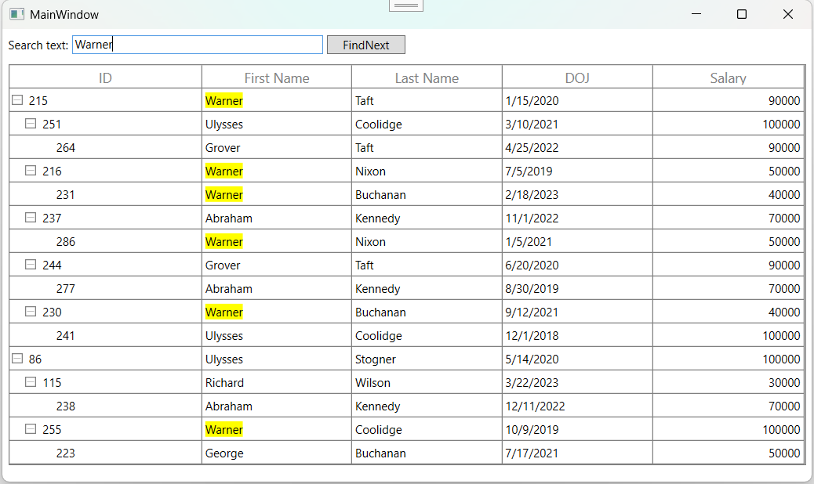
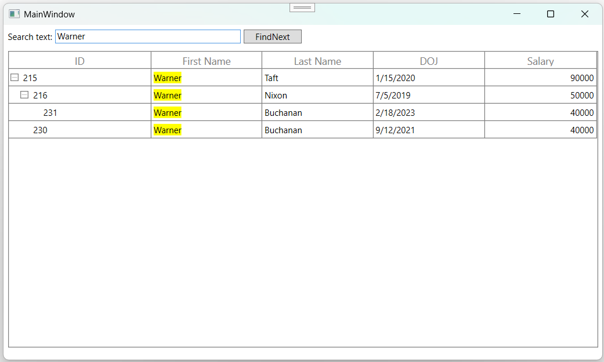
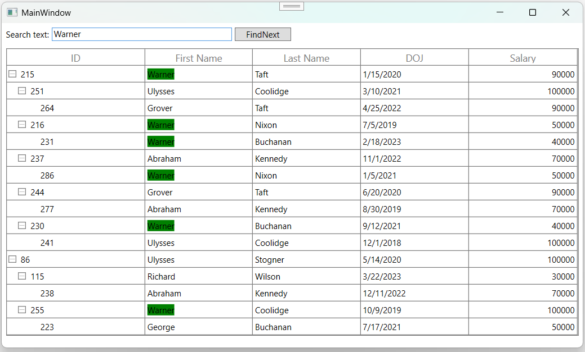
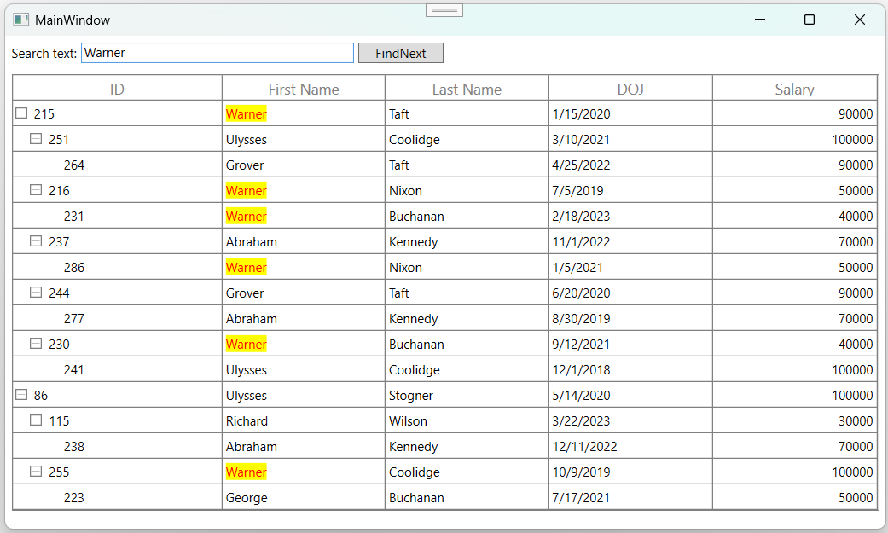
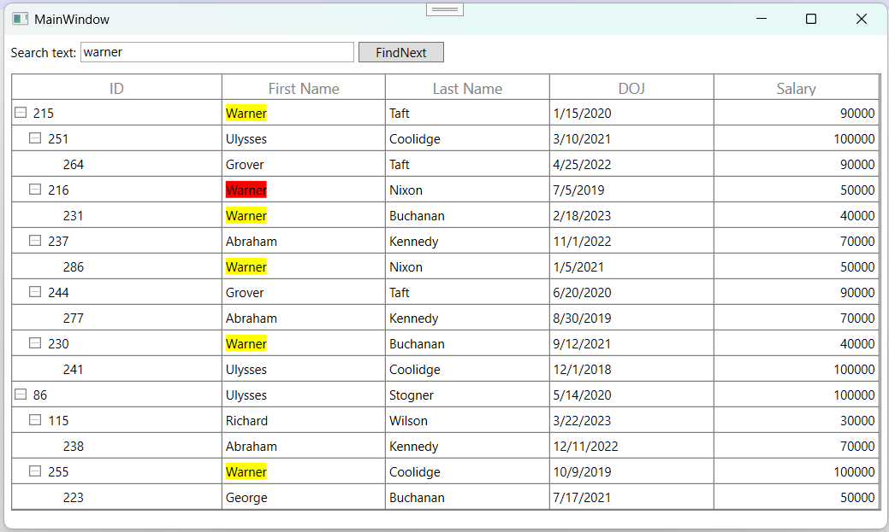
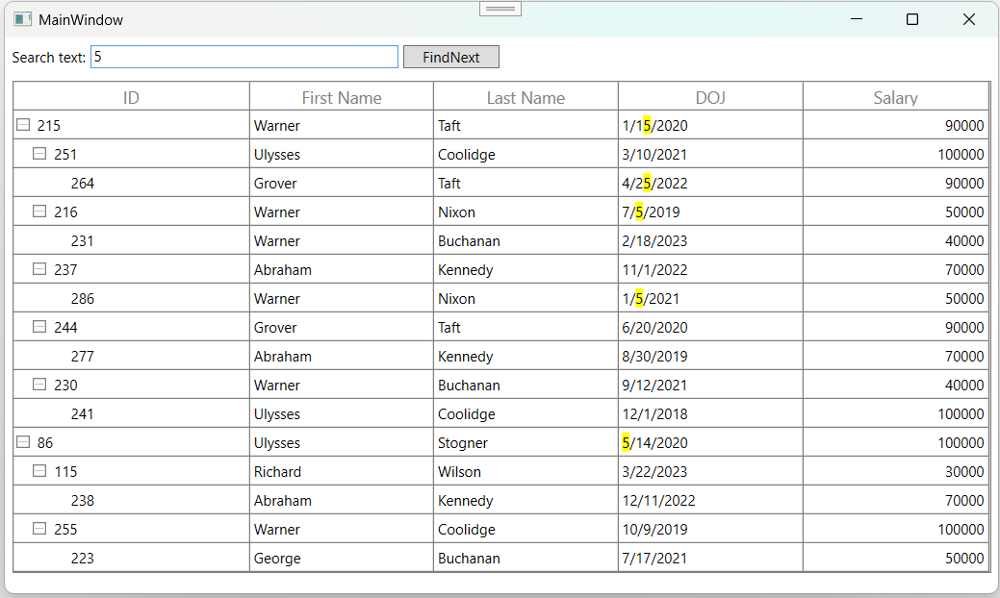
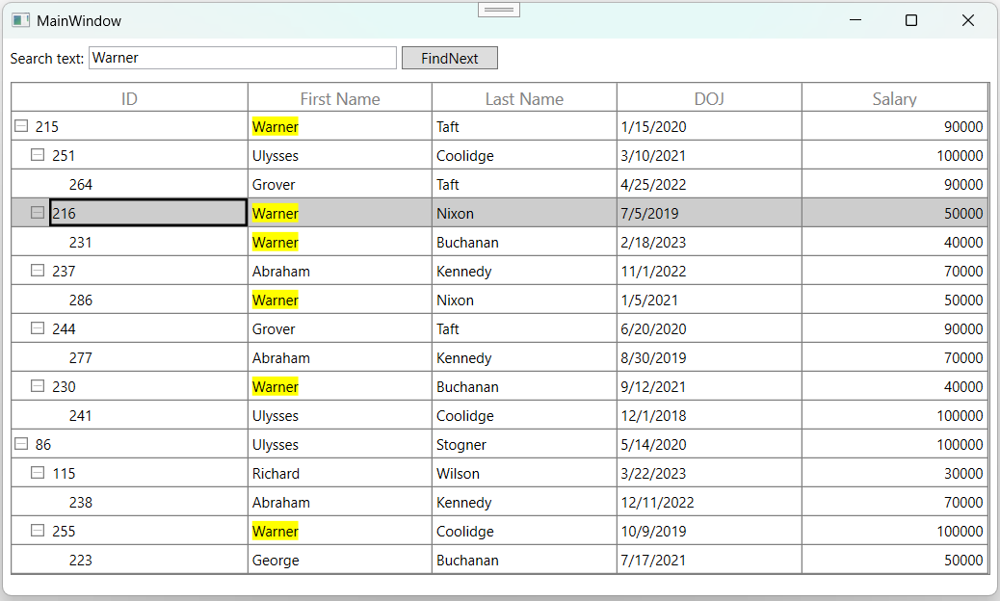

# Search in WPF TreeGrid (SfTreeGrid)

[WPF TreeGrid](https://www.syncfusion.com/wpf-controls/treegrid) control allows you to search the data displayed in the SfTreeGrid. You can search the data by using `SearchControlller.Search` method.




this.treeGrid.SearchController.Search(TextBox.Text);




### Filtering

You can enable filter based on search by setting `SearchController.AllowFiltering` property to true.




this.treeGrid.SearchController.AllowFiltering = true;
this.treeGrid.SearchController.Search(TextBox.Text);




You can search the data with the case-sensitivity by setting `SearchController.AllowCaseSensitiveSearch` property to true.




this.treeGrid.SearchController.AllowCaseSensitiveSearch = true;
this.treeGrid.SearchController.Search(TextBox.Text);




### Changing Search Highlight Background

In WPF TreeGrid (SfTreeGrid), you can change the search text highlighting color by setting `SearchController.MatchedCellBackground` property. 




this.treeGrid.SearchController.MatchedCellBackground = Brushes.Green;
this.treeGrid.SearchController.Search(TextBox.Text);




### Changing foreground for search highlight

In WPF TreeGrid (SfTreeGrid), you can change the foreground color for search text by setting the `SearchController.MatchedCellForeground` property. 




this.treeGrid.SearchController.MatchedCellForeground = Brushes.Red;
this.treeGrid.SearchController.Search(TextBox.Text);    




## Navigating cells based on search text

You can navigate to the cells contains the SearchText using `SearchController.FindNext` and `SearchController.FindPrevious` methods.




this.treeGrid.SearchController.FindNext(TextBox.Text);
this.treeGrid.SearchController.FindPrevious(TextBox.Text);




You can highlight the currently navigated search text using `SearchController.CurrentMatchedCellBackground` property.




this.treeGrid.SearchController.CurrentMatchedCellBackground = Brushes.Red;
this.treeGrid.SearchController.FindNext(TextBox.Text);




You can highlight the foreground color of current navigated search text by using the `SearchController.CurrentMatchedCellForeground` property.




this.treeGrid.SearchController.CurrentMatchedCellForeground = Brushes.Red;
this.treeGrid.SearchController.FindNext(TextBox.Text);




## Move CurrentCell when FindNext and FindPrevious

You can move the current cell along with FindNext and FindPrevious operation using [MoveCurrentCell](https://help.syncfusion.com/cr/wpf/Syncfusion.UI.Xaml.TreeGrid.SfTreeGrid.html#Syncfusion_UI_Xaml_TreeGrid_SfTreeGrid_MoveCurrentCell_Syncfusion_UI_Xaml_ScrollAxis_RowColumnIndex_System_Boolean_) method in selection controller. 




this.treeGrid.SearchController.FindNext(TextBox.Text);            
this.treeGrid.SelectionController.MoveCurrentCell(this.treeGrid.SearchController.CurrentMatchedCellIndex);




## Clear Search

You can clear the search by calling the `SearchController.Clear` method. 




this.treeGrid.SearchController.Clear();




## Search customization

WPF TreeGrid (SfTreeGrid) process the search operations in `SearchController` class. You can change the default search behaviors by overriding `SearchController` class and set to `SfTreeGrid.SearchController`.




this.treeGrid.SearchController = new SearchControllerExt(this.treeGrid);
public class SearchControllerExt : SearchController
{

    public SearchControllerExt(SfTreeGrid treeGrid)
        : base(treeGrid)
    {
    }
}




### Search only selected columns

You can search only selected columns by overriding `SearchCell` method of `SearchController`. In the `SearchCell` method, based on `MappingName` you can skip the columns that you don’t want to search. 

In the below code, except `DOJ` column other columns are gets excluded from search. 




this.treeGrid.SearchController = new SearchControllerExt(this.treeGrid);
this.treeGrid.SearchController.Search("5");

public class SearchControllerExt : TreeGridSearchController
{

    public SearchControllerExt(SfTreeGrid treeGrid)
        : base(treeGrid)
    {
    }

    protected override bool SearchCell(TreeDataColumnBase column, object record, bool applyCurrentMatchedCellBackground)
    {

        if (column.TreeGridColumn.MappingName == "DOJ")
            return base.SearchCell(column, record, applyCurrentMatchedCellBackground);
        return false;
    }
}




### Select the record based on the SearchText

You can select the records which contains the search text by using `GetRecords` method. 




this.treeGrid.SelectedItems.Clear();
this.treeGrid.SearchController.Search(TextBox.Text); 
var list = this.treeGrid.SearchController.GetRecords();
int recordIndex = this.treeGrid.ResolveToNodeIndex(this.treeGrid.ResolveToRowIndex(list[1].Record));
this.treeGrid.SelectedIndex = recordIndex;




### Search with the TreeGridComboBoxColumn

You can search the data in SfTreeGrid with all the TreeGridColumns which loads TextBlock as display element. To perform the search operation in the [TreeGridComboBoxColumn](https://help.syncfusion.com/cr/wpf/Syncfusion.UI.Xaml.TreeGrid.TreeGridComboBoxColumn.html) you need to customize the `TreeGridComboBoxColumn`.  As it loads the ContentControl in display mode. 



public class TreeGridComboBoxColumnExt : TreeGridComboBoxColumn
{

    public TreeGridComboBoxColumnExt()
    {
        SetCellType("TreeGridComboBoxExt");
    }
    
    protected override Freezable CreateInstanceCore()
    {
        return new TreeGridComboBoxColumnExt();
    }
}




You can change the display element of each column by creating new renderer for the particular column and assign to corresponding cell type in `SfTreeGrid.CellRenderers`.



public class TreeGridComboBoxRendererExt : TreeGridVirtualizingCellRenderer<TextBlock, ComboBox>
{
 
    public TreeGridComboBoxRendererExt()
    {
    }
    
    public override object GetControlValue()
    {
 
        if (!HasCurrentCellState)
            return null;
        return CurrentCellRendererElement.GetValue(IsInEditing ? Selector.SelectedValueProperty : TextBlock.TextProperty);
    }

    // Creates the binding to the Edit-element
 
    private void InitializeEditBinding(ComboBox uiElement, TreeGridColumn column)
    {
        var comboBoxColumn = (TreeGridComboBoxColumn)column;
        var source = comboBoxColumn.ValueBinding as Binding;
 
        // Creates the bind element to the edit-element.
        var bind = new Binding
        {
            Mode = BindingMode.TwoWay,
            Path = source.Path,
            StringFormat = source.StringFormat,
            TargetNullValue = source.TargetNullValue,
            UpdateSourceTrigger = UpdateSourceTrigger.PropertyChanged,
            ValidatesOnExceptions = source.ValidatesOnExceptions,
            AsyncState = source.AsyncState,
            BindingGroupName = source.BindingGroupName,
            IsAsync = source.IsAsync,
            NotifyOnSourceUpdated = source.NotifyOnSourceUpdated,
            NotifyOnTargetUpdated = source.NotifyOnTargetUpdated,
            UpdateSourceExceptionFilter = source.UpdateSourceExceptionFilter,
            XPath = source.XPath
        };
        
        uiElement.SetBinding(ComboBox.SelectedValueProperty, bind);
 
        // Binding the ItemSource to the TreeGridComboBox.
        var itemsSourceBinding = new Binding { Path = new PropertyPath("ItemsSource"), Mode = BindingMode.TwoWay, Source = comboBoxColumn };
        uiElement.SetBinding(ComboBox.ItemsSourceProperty, itemsSourceBinding);
        var displayMemberBinding = new Binding { Path = new PropertyPath("DisplayMemberPath"), Mode = BindingMode.TwoWay, Source = comboBoxColumn };
        uiElement.SetBinding(ComboBox.DisplayMemberPathProperty, displayMemberBinding);
        var selectedValuePathBinding = new Binding { Path = new PropertyPath("SelectedValuePath"), Mode = BindingMode.TwoWay, Source = comboBoxColumn };
        uiElement.SetBinding(ComboBox.SelectedValuePathProperty, selectedValuePathBinding);
        var staysOpenOnEditBinding = new Binding { Path = new PropertyPath("StaysOpenOnEdit"), Mode = BindingMode.TwoWay, Source = comboBoxColumn };
        uiElement.SetBinding(ComboBox.StaysOpenOnEditProperty, staysOpenOnEditBinding);
        var isEditableBinding = new Binding { Path = new PropertyPath("IsEditable"), Mode = BindingMode.TwoWay, Source = comboBoxColumn };
        uiElement.SetBinding(ComboBox.IsEditableProperty, isEditableBinding);                       
        var itemTemplateBinding = new Binding { Path = new PropertyPath("ItemTemplate"), Mode = BindingMode.TwoWay, Source = comboBoxColumn };
        uiElement.SetBinding(ComboBox.ItemTemplateProperty, itemTemplateBinding);
    }

    // This will be invoke when the editing is triggered.
 
    public override void OnInitializeEditElement(TreeDataColumnBase dataColumn, ComboBox uiElement, object dataContext)
    {
        TreeGridColumn column = dataColumn.TreeGridColumn;
        InitializeEditBinding(uiElement, column);
        var textAlignment = new Binding { Path = new PropertyPath("TextAlignment"), Mode = BindingMode.OneWay, Source = column, Converter = new TextAlignmentToHorizontalAlignmentConverter() };
        uiElement.SetBinding(Control.HorizontalContentAlignmentProperty, textAlignment);
        var verticalAlignment = new Binding { Path = new PropertyPath("VerticalAlignment"), Mode = BindingMode.TwoWay, Source = column };
        uiElement.SetBinding(Control.VerticalContentAlignmentProperty, verticalAlignment);           
    }

    // Display Element initialized for required properties

    public override void OnInitializeDisplayElement(TreeDataColumnBase dataColumn, TextBlock uiElement, object dataContext)
    {
        var column = dataColumn.TreeGridColumn;
        var treeGridColumn = column as TreeGridComboBoxColumn;
        uiElement.SetBinding(TextBlock.TextProperty, column.DisplayBinding);
        var textAlignment = new Binding { Path = new PropertyPath("TextAlignment"), Mode = BindingMode.OneWay, Source = column, Converter = new TextAlignmentToHorizontalAlignmentConverter() };
        uiElement.SetBinding(Control.HorizontalAlignmentProperty, textAlignment);
        var verticalAlignment = new Binding { Path = new PropertyPath("VerticalAlignment"), Mode = BindingMode.TwoWay, Source = column };
        uiElement.SetBinding(Control.VerticalAlignmentProperty, verticalAlignment);
        uiElement.Margin = new Thickness(3,0,1,0);
    }

}


