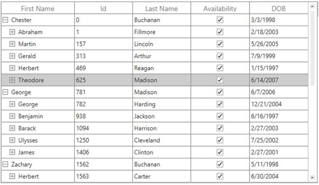
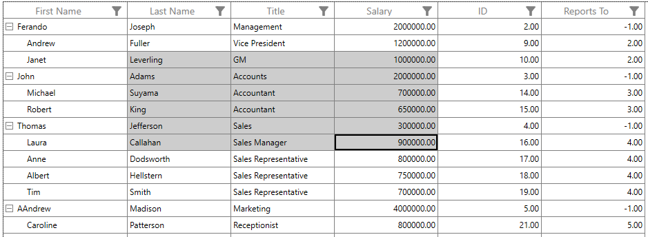
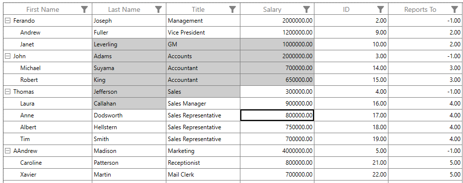
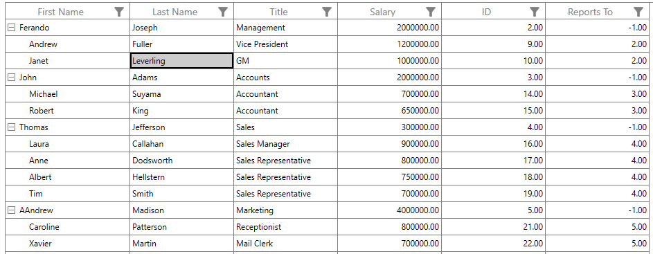
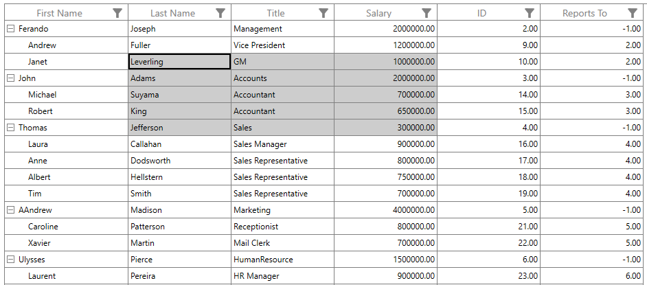
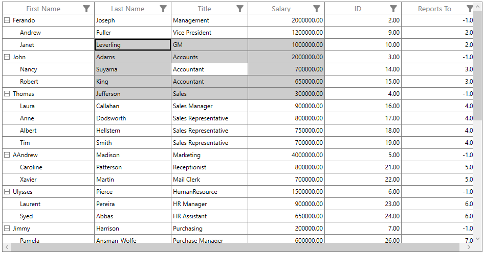
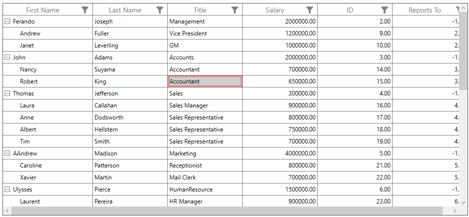

# Selection in WPF TreeGrid (SfTreeGrid)

[WPF TreeGrid](https://www.syncfusion.com/wpf-controls/treegrid) (SfTreeGrid) allows you to select one or more rows or cells. For selecting specific row or group of rows you have to set [SelectionUnit](https://help.syncfusion.com/cr/wpf/Syncfusion.UI.Xaml.Grid.SfGridBase.html#Syncfusion_UI_Xaml_Grid_SfGridBase_SelectionUnit) as [Row](https://help.syncfusion.com/cr/wpf/Syncfusion.UI.Xaml.Grid.GridSelectionUnit.html) and for selecting a specific cell or group of cells you have to set `SelectionUnit` as [Cell](https://help.syncfusion.com/cr/wpf/Syncfusion.UI.Xaml.Grid.GridSelectionUnit.html) or [Any](https://help.syncfusion.com/cr/wpf/Syncfusion.UI.Xaml.Grid.GridSelectionUnit.html). In [SelectionUnit.Any](https://help.syncfusion.com/cr/wpf/Syncfusion.UI.Xaml.Grid.GridSelectionUnit.html) option you can select the row by clicking on row header.

## Current cell navigation

Keyboard navigation through the cells and rows is determined based on the [NavigationMode](https://help.syncfusion.com/cr/wpf/Syncfusion.UI.Xaml.Grid.SfGridBase.html#Syncfusion_UI_Xaml_Grid_SfGridBase_NavigationMode) property. [NavigationMode.Cell](https://help.syncfusion.com/cr/wpf/Syncfusion.UI.Xaml.Grid.NavigationMode.html) allows you to navigate between the cells in a row as well as between rows. [NavigationMode.Row](https://help.syncfusion.com/cr/wpf/Syncfusion.UI.Xaml.Grid.NavigationMode.html) allows you to navigate only between rows. It is not possible to set `NavigationMode.Row` when cell selection is enabled (`SelectionUnit` is Cell or Any).

## Selection modes

The `SelectionUnit` and [SelectionMode](https://help.syncfusion.com/cr/wpf/Syncfusion.UI.Xaml.Grid.SfGridBase.html#Syncfusion_UI_Xaml_Grid_SfGridBase_SelectionMode) properties together define the behavior of selection in SfTreeGrid. If the `SelectionMode` is [Single](https://help.syncfusion.com/cr/wpf/Syncfusion.UI.Xaml.Grid.GridSelectionMode.html), you can able to select single row or cell, and if the `SelectionMode` is `Extended` or `Multiple`, you can able to select multiple rows or cells. If you want to disable the selection you need to set `SelectionMode` as `None`.



<syncfusion:SfTreeGrid Name="treeGrid"
                                       AutoExpandMode="RootNodesExpanded"
                                       AutoGenerateColumns="False" 
                                       NavigationMode="Row"
                                       ChildPropertyName="Children"
                                       SelectionMode="Single"
                                       ColumnSizer="Star" 
                                       ExpanderColumn="FirstName"
                                       ItemsSource="{Binding PersonDetails}"
                                       >



## Disable selection for rows and columns

You can disable selection and navigation on particular column by setting the [GridColumn.AllowFocus](https://help.syncfusion.com/cr/wpf/Syncfusion.UI.Xaml.Grid.GridColumnBase.html#Syncfusion_UI_Xaml_Grid_GridColumnBase_AllowFocus) property. You can disable selection on particular row or cell or column by handling the [CurrentCellActivating](https://help.syncfusion.com/cr/wpf/Syncfusion.UI.Xaml.TreeGrid.SfTreeGrid.html#Syncfusion_UI_Xaml_TreeGrid_SfTreeGrid_CurrentCellActivating) event.

## Multiple row or cell selection

The SfTreeGrid allows you to select multiple rows or cells by setting the [SelectionMode](https://help.syncfusion.com/cr/wpf/Syncfusion.UI.Xaml.Grid.SfGridBase.html#Syncfusion_UI_Xaml_Grid_SfGridBase_SelectionMode) property as [Extended](http://help.syncfusion.com/cr/wpf/Syncfusion.UI.Xaml.Grid.GridSelectionMode.html) or [Multiple](http://help.syncfusion.com/cr/wpf/Syncfusion.UI.Xaml.Grid.GridSelectionMode.html), where you can select multiple rows or cells by dragging the mouse on SfTreeGrid and also using the key modifiers.

When using `Extended`, you can select multiple rows or cells by pressing the key modifiers <kbd>Ctrl</kbd> and <kbd>Shift</kbd>.



<syncfusion:SfTreeGrid Name="treeGrid"
                                       AutoExpandMode="RootNodesExpanded"
                                       AutoGenerateColumns="False" 
                                       NavigationMode="Row"
                                       ChildPropertyName="Children"
                                       SelectionMode="Extended"
                                       ColumnSizer="Star" 
                                       ExpanderColumn="FirstName"
                                       ItemsSource="{Binding PersonDetails}"
                                       >



N> When [SelectionMode](https://help.syncfusion.com/cr/wpf/Syncfusion.UI.Xaml.Grid.SfGridBase.html#Syncfusion_UI_Xaml_Grid_SfGridBase_SelectionMode) is [Multiple](https://help.syncfusion.com/cr/wpf/Syncfusion.UI.Xaml.Grid.GridSelectionMode.html), you can select or deselect multiple rows and cells by clicking the respective row or cell. In multiple selection, pressing the navigation keys moves only the current cell, and you can select or deselect by pressing the `Space` key.



<syncfusion:SfTreeGrid Name="treeGrid"
                       AutoExpandMode="RootNodesExpanded"
                       AutoGenerateColumns="False" 
                       NavigationMode="Cell"
                       ChildPropertyName="Children"
                       SelectionMode="Extended"
                       SelectionUnit="Cell"
                       ColumnSizer="Star" 
                       ExpanderColumn="FirstName"
                       ItemsSource="{Binding PersonDetails}">





<syncfusion:SfTreeGrid Name="treeGrid"
                       AutoExpandMode="RootNodesExpanded"
                       AutoGenerateColumns="False" 
                       NavigationMode="Cell"
                       ChildPropertyName="Children"
                       SelectionMode="Multiple"
                       SelectionUnit="Cell"
                       ColumnSizer="Star" 
                       ExpanderColumn="FirstName"
                       ItemsSource="{Binding PersonDetails}">



## Get selected rows and cells

The [SelectedItem](https://help.syncfusion.com/cr/wpf/Syncfusion.UI.Xaml.Grid.SfGridBase.html#Syncfusion_UI_Xaml_Grid_SfGridBase_SelectedItem) property returns the data object of the selected row, and the [SelectedIndex](https://help.syncfusion.com/cr/wpf/Syncfusion.UI.Xaml.Grid.SfGridBase.html#Syncfusion_UI_Xaml_Grid_SfGridBase_SelectedIndex) property returns the index of the `SelectedItem` in tree grid. The `SelectedItem` denotes the first selected row in multiple selection.

The [CurrentItem](https://help.syncfusion.com/cr/wpf/Syncfusion.UI.Xaml.TreeGrid.SfTreeGrid.html#Syncfusion_UI_Xaml_TreeGrid_SfTreeGrid_CurrentItemProperty) returns the data object that currently has focus, and the [CurrentColumn](https://help.syncfusion.com/cr/wpf/Syncfusion.UI.Xaml.TreeGrid.SfTreeGrid.html#Syncfusion_UI_Xaml_TreeGrid_SfTreeGrid_CurrentColumnProperty) denotes the [TreeGridColumn](https://help.syncfusion.com/cr/wpf/Syncfusion.UI.Xaml.TreeGrid.TreeGridColumn.html) that currently has focus.

The [CurrentCellInfo](https://help.syncfusion.com/cr/wpf/Syncfusion.UI.Xaml.TreeGrid.SfTreeGrid.html#Syncfusion_UI_Xaml_TreeGrid_SfTreeGrid_CurrentCellInfo) returns an instance [TreeGridCellInfo](https://help.syncfusion.com/cr/wpf/Syncfusion.UI.Xaml.TreeGrid.TreeGridCellInfo.html), which contains information about the cell that currently has focus.

### Row selection

You can get all the selected records using the [SelectedItems](https://help.syncfusion.com/cr/wpf/Syncfusion.UI.Xaml.Grid.SfGridBase.html#Syncfusion_UI_Xaml_Grid_SfGridBase_SelectedItems) property, and you can also get all the selected rows information using [SfTreeGrid.SelectionController.SelectedRows](https://help.syncfusion.com/cr/wpf/Syncfusion.UI.Xaml.TreeGrid.TreeGridBaseSelectionController.html#Syncfusion_UI_Xaml_TreeGrid_TreeGridBaseSelectionController_SelectedRows), which is a collection of [TreeGridRowInfo](https://help.syncfusion.com/cr/wpf/Syncfusion.UI.Xaml.TreeGrid.TreeGridRowInfo.html).

### Cell Selection

You can get all selected cells information through `SfTreeGrid.SelectionController.SelectedCells` property which is the collection of [TreeGridCellInfo](https://help.syncfusion.com/cr/wpf/Syncfusion.UI.Xaml.TreeGrid.TreeGridCellInfo.html).

You can get the selected cells as `TreeGridCellInfo` collection by using [GetSelectedCells](https://help.syncfusion.com/cr/wpf/Syncfusion.UI.Xaml.TreeGrid.SfTreeGrid.html#Syncfusion_UI_Xaml_TreeGrid_SfTreeGrid_GetSelectedCells) method.




List<TreeGridCellInfo> selectedCells = this.treeGrid.GetSelectedCells();




### CurrentItem vs SelectedItem

Both [SelectedItem](https://help.syncfusion.com/cr/wpf/Syncfusion.UI.Xaml.Grid.SfGridBase.html#Syncfusion_UI_Xaml_Grid_SfGridBase_SelectedItem) and [CurrentItem](https://help.syncfusion.com/cr/wpf/Syncfusion.UI.Xaml.TreeGrid.SfTreeGrid.html#Syncfusion_UI_Xaml_TreeGrid_SfTreeGrid_CurrentItem) returns the same data object when there is single cell or row is selected in SfTreeGrid. When you have selected more than one rows or cells, the record that had been selected initially is maintained in `SelectedItem` and the record that currently have focus is maintained in `CurrentItem`. 

## Programmatic selection

### Process selection using properties

You can select a single row or cell by setting the [SelectedItem](https://help.syncfusion.com/cr/wpf/Syncfusion.UI.Xaml.Grid.SfGridBase.html#Syncfusion_UI_Xaml_Grid_SfGridBase_SelectedItem) property or [SelectedIndex](https://help.syncfusion.com/cr/wpf/Syncfusion.UI.Xaml.Grid.SfGridBase.html#Syncfusion_UI_Xaml_Grid_SfGridBase_SelectedIndex) property.




var recordIndex = this.treeGrid.ResolveToNodeIndex(6);
this.treeGrid.SelectedIndex = recordIndex;




var node = this.treeGrid.GetNodeAtRowIndex(6);
this.treeGrid.SelectedItem = node.Item;




In row selection, you can select multiple rows by adding data objects to the [SelectedItems](https://help.syncfusion.com/cr/wpf/Syncfusion.UI.Xaml.Grid.SfGridBase.html#Syncfusion_UI_Xaml_Grid_SfGridBase_SelectedItems) property.



var viewModel = this.treeGrid.DataContext as ViewModel;

foreach (var order in viewModel.PersonDetails)
{
    if (order.LastName == "Buchanan")
        this.treeGrid.SelectedItems.Add(order);
}



### Process selection using methods

You can select a range of rows using the [SelectRows](https://help.syncfusion.com/cr/wpf/Syncfusion.UI.Xaml.TreeGrid.TreeGridBaseSelectionController.html#Syncfusion_UI_Xaml_TreeGrid_TreeGridBaseSelectionController_SelectedRows) method in row selection.




this.treeGrid.SelectRows(3, 7);




You can select a specific cell by using the [SelectCell](https://help.syncfusion.com/cr/wpf/Syncfusion.UI.Xaml.TreeGrid.SfTreeGrid.html#Syncfusion_UI_Xaml_TreeGrid_SfTreeGrid_SelectCell_System_Object_Syncfusion_UI_Xaml_TreeGrid_TreeGridColumn_System_Boolean_) method in cell selection.




var record = this.treeGrid.GetNodeAtRowIndex(3).Item;
var column = this.treeGrid.Columns[1];
this.treeGrid.SelectCell(record, column);




You can select a range of cells through [SelectCells](https://help.syncfusion.com/cr/wpf/Syncfusion.UI.Xaml.TreeGrid.SfTreeGrid.html#Syncfusion_UI_Xaml_TreeGrid_SfTreeGrid_SelectCells_System_Object_Syncfusion_UI_Xaml_TreeGrid_TreeGridColumn_System_Object_Syncfusion_UI_Xaml_TreeGrid_TreeGridColumn_System_Boolean_) method in cell selection.




var firstRecord = this.treeGrid.GetNodeAtRowIndex(3).Item;
var lastRecord = this.treeGrid.GetNodeAtRowIndex(7).Item;
var firstColumn = this.treeGrid.Columns[1];
var lastColumn = this.treeGrid.Columns[3];
this.treeGrid.SelectCells(firstRecord, firstColumn, lastRecord, lastColumn);




You can select all the rows or cells using [SelectAll](https://help.syncfusion.com/cr/wpf/Syncfusion.UI.Xaml.TreeGrid.SfTreeGrid.html#Syncfusion_UI_Xaml_TreeGrid_SfTreeGrid_SelectAll) method.




this.treeGrid.SelectAll();




### Process current cell

When you set [CurrentItem](https://help.syncfusion.com/cr/wpf/Syncfusion.UI.Xaml.TreeGrid.SfTreeGrid.html#Syncfusion_UI_Xaml_TreeGrid_SfTreeGrid_CurrentItem) to a particular record, the [CurrentCell](https://help.syncfusion.com/cr/wpf/Syncfusion.UI.Xaml.TreeGrid.TreeGridCurrentCellManager.html#Syncfusion_UI_Xaml_TreeGrid_TreeGridCurrentCellManager_CurrentCell) will be moved to the corresponding record when the [SelectionMode](https://help.syncfusion.com/cr/wpf/Syncfusion.UI.Xaml.Grid.SfGridBase.html#Syncfusion_UI_Xaml_Grid_SfGridBase_SelectionMode) is [Multiple](https://help.syncfusion.com/cr/wpf/Syncfusion.UI.Xaml.Grid.GridSelectionMode.html) or [Extended](https://help.syncfusion.com/cr/wpf/Syncfusion.UI.Xaml.Grid.GridSelectionMode.html) and the selection will added to a particular record item when the `SelectionMode` is [Single](https://help.syncfusion.com/cr/wpf/Syncfusion.UI.Xaml.Grid.GridSelectionMode.html).




var viewModel = this.treeGrid.DataContext as ViewModel;
this.treeGrid.CurrentItem = viewModel.Employees.FirstOrDefault(emp => emp.FirstName == "Andrew");




You can move the [CurrentCell](https://help.syncfusion.com/cr/wpf/Syncfusion.UI.Xaml.TreeGrid.TreeGridCurrentCellManager.html#Syncfusion_UI_Xaml_TreeGrid_TreeGridCurrentCellManager_CurrentCell) to a particular rowColumnIndex using the [MoveCurrentCell](https://help.syncfusion.com/cr/wpf/Syncfusion.UI.Xaml.TreeGrid.SfTreeGrid.html#Syncfusion_UI_Xaml_TreeGrid_SfTreeGrid_MoveCurrentCell_Syncfusion_UI_Xaml_ScrollAxis_RowColumnIndex_System_Boolean_) method.




this.treeGrid.MoveCurrentCell(new RowColumnIndex(3, 2), false);




### Clear selection

You can clear the selection using the [ClearSelections](https://help.syncfusion.com/cr/wpf/Syncfusion.UI.Xaml.TreeGrid.SfTreeGrid.html#Syncfusion_UI_Xaml_TreeGrid_SfTreeGrid_ClearSelections_System_Boolean_) method. In row selection, you can remove the selection by setting null to the [SelectedItem](https://help.syncfusion.com/cr/wpf/Syncfusion.UI.Xaml.Grid.SfGridBase.html#Syncfusion_UI_Xaml_Grid_SfGridBase_SelectedItem) or clearing the [SelectedItems](https://help.syncfusion.com/cr/wpf/Syncfusion.UI.Xaml.Grid.SfGridBase.html#Syncfusion_UI_Xaml_Grid_SfGridBase_SelectedItems) property.




this.treeGrid.SelectionController.ClearSelections(true);




You can clear selection on group of cells by using the [UnselectCells](https://help.syncfusion.com/cr/wpf/Syncfusion.UI.Xaml.TreeGrid.SfTreeGrid.html#Syncfusion_UI_Xaml_TreeGrid_SfTreeGrid_UnselectCells_System_Object_Syncfusion_UI_Xaml_TreeGrid_TreeGridColumn_System_Object_Syncfusion_UI_Xaml_TreeGrid_TreeGridColumn_) method in cell selection.




var firstRecord = this.treeGrid.GetNodeAtRowIndex(3).Item;
var lastRecord = this.treeGrid.GetNodeAtRowIndex(7).Item;
var firstColumn = this.treeGrid.Columns[1];
var lastColumn = this.treeGrid.Columns[3];
this.treeGrid.UnselectCells(firstRecord, firstColumn, lastRecord, lastColumn);




You can clear the selection on particular cell by using the [UnselectCell](https://help.syncfusion.com/cr/wpf/Syncfusion.UI.Xaml.TreeGrid.SfTreeGrid.html#Syncfusion_UI_Xaml_TreeGrid_SfTreeGrid_UnselectCell_System_Object_Syncfusion_UI_Xaml_TreeGrid_TreeGridColumn_) method in cell selection.




var removeRecord = this.treeGrid.GetNodeAtRowIndex(5).Item;
var removeColumn = this.treeGrid.Columns[2];
this.treeGrid.UnselectCell(removeRecord, removeColumn);




## Scrolling rows and columns

### Automatic scrolling on drag selection

SfTreeGrid scrolls rows and columns automatically when you try to perform the drag selection like in Excel. You can enable or disable AutoScrolling by setting the [AutoScroller.AutoScrolling](https://help.syncfusion.com/cr/wpf/Syncfusion.UI.Xaml.TreeGrid.SfTreeGrid.html#Syncfusion_UI_Xaml_TreeGrid_SfTreeGrid_AutoScroller) property.




this.treeGrid.AutoScroller.AutoScrolling = AutoScrollOrientation.Both;




### Scroll to a particular row or column index

You can scroll programmatically to particular cell using the [ScrollInView](https://help.syncfusion.com/cr/wpf/Syncfusion.UI.Xaml.TreeGrid.SfTreeGrid.html#Syncfusion_UI_Xaml_TreeGrid_SfTreeGrid_ScrollInView_Syncfusion_UI_Xaml_ScrollAxis_RowColumnIndex_) method by passing row and column index.




int rowIndex = this.treeGrid.GetLastDataRowIndex();
int columnIndex = this.treeGrid.GetLastColumnIndex();
this.treeGrid.ScrollInView(new RowColumnIndex(rowIndex, columnIndex));




### Scroll to selected item

You can scroll programmatically to the `SelectedItem` using the `ScrollInView` method.




var rowIndex = this.treeGrid.ResolveToRowIndex(this.treeGrid.SelectedItem);
var columnIndex = this.treeGrid.ResolveToStartColumnIndex();
this.treeGrid.ScrollInView(new RowColumnIndex(rowIndex, columnIndex));




## Mouse and keyboard behaviors

### Keyboard behavior

<table>
<tr>
<td>
{{'**Key or Key combinations**'| markdownify }}
</td>
<td>
{{'**Description**'| markdownify }}
</td>
</tr>
<tr>
<td>
<kbd>DownArrow</kbd>

</td>
<td>
Moves CurrentCell directly below the active current cell. If the CurrentCell is in the last row, pressing the Down arrow does nothing.
</td>
</tr>
<tr>
<td>
<kbd>UpArrow</kbd>

</td>
<td>
Moves the CurrentCell directly above the active current cell. If the CurrentCell is in the first row, pressing the Up arrow does nothing.
</td>
</tr>
<tr>
<td>
<kbd>LeftArrow</kbd>

</td>
<td>
Moves the current cell to previous to the active current cell. If the CurrentCell is in the first cell, pressing the Left arrow does nothing. If the focused row is group header, the group will be collapsed when it is in expanded state.
</td>
</tr>
<tr>
<td>
<kbd>RightArrow</kbd>

</td>
<td>
Moves the current cell to next to the active current cell. If the CurrentCell is in the last cell, pressing the Right arrow does nothing. If the focused row is group header, the group will be expanded when it is in collapsed state.
</td>
</tr>
<tr>
<td>
<kbd>Home</kbd> / <kbd>Ctrl</kbd> + <kbd>LeftArrow</kbd>

</td>
<td>
Moves the current cell to the first cell of the current row.
</td>
</tr>
<tr>
<td>
<kbd>End</kbd> / <kbd>Ctrl</kbd> + <kbd>RightArrow</kbd>

</td>
<td>
Moves the current cell to the last cell of the current row.
</td>
</tr>
<tr>
<td>
<kbd>PageDown</kbd>

</td>
<td>
The tree grid will be scrolled to the next set of rows that is not displayed in view, including the row that is partially displayed, and the current cell is set to the last row.
</td>
</tr>
<tr>
<td>
<kbd>PageUp</kbd>

</td>
<td>
The tree grid will be scrolled to the previous set of rows that is not displayed in view, including the row that is partially displayed, and the current cell is set to the first row.
</td>
</tr>
<tr>
<td>
<kbd>Tab</kbd>

</td>
<td>
Moves the current cell to next to the active current cell. If the active current cell is the last cell of the current row, the focus will be moved to the first cell of the row next to the current row. If the active current cell is the last cell of the last row, the focus will be moved to next control in the tab order of the parent container.
</td>
</tr>
<tr>
<td>
<kbd>Shift</kbd> + <kbd>Tab</kbd>

</td>
<td>
Moves the current cell to previous cell to the active current cell. If the active current cell is the first cell of the current row, the current cell will be moved to the last cell of the row previous to the current row. If the active current cell is the first cell of the first row, the focus will be moved to the previous control in the tab order of the parent container.
</td>
</tr>
<tr>
<td>
<kbd>Ctrl</kbd> + <kbd>DownArrow</kbd>

</td>
<td>
Moves the current cell to the current column of the last row.
</td>
</tr>
<tr>
<td>
<kbd>Ctrl</kbd> + <kbd>UpArrow</kbd>

</td>
<td>
Moves the current cell to the current column of the first row.
</td>
</tr>
<tr>
<td>
<kbd>Ctrl</kbd> + <kbd>Home</kbd>

</td>
<td>
Moves the current cell to the first cell of the first row.
</td>
</tr>
<tr>
<td>
<kbd>Ctrl</kbd> + <kbd>End</kbd>

</td>
<td>
Moves the current cell to the last cell of the last row.
</td>
</tr>
<tr>
<td>
<kbd>Enter</kbd>

</td>
<td>
If the active current cell is in edit mode, the changes will be committed, and moves the current cell to below the active current cell. If the active current cell is in the last row, commits changes only and retains the same cell.
</td>
</tr>
<tr>
<td>
<kbd>Ctrl</kbd> + <kbd>Enter</kbd>

</td>
<td>
Commits only the changes when the current cell is in edit mode and retains the focus in same cell.
</td>
</tr>
<tr>
<td>
<kbd>F2</kbd>

</td>
<td>
If the {{'[SfTreeGrid.AllowEditing](https://help.syncfusion.com/cr/wpf/Syncfusion.UI.Xaml.Grid.SfGridBase.html#Syncfusion_UI_Xaml_Grid_SfGridBase_AllowEditing)'| markdownify }} property is true, and the 
{{'[GridColumn.AllowEditing](https://help.syncfusion.com/cr/wpf/Syncfusion.UI.Xaml.Grid.GridColumnBase.html#Syncfusion_UI_Xaml_Grid_GridColumnBase_AllowEditing)'| markdownify }} property is true for the current column, the current cell enters into edit mode.
</td>
</tr>
<tr>
<td>
<kbd>Esc</kbd>
</td>
<td>
If the current cell is in edit mode, reverts the changes that had been done in the current cell. If the underlying source implements {{'[IEditableObject](https://learn.microsoft.com/en-us/dotnet/api/system.componentmodel.ieditableobject?redirectedfrom=MSDN&view=net-5.0#%22%22%22%22)'| markdownify }}, clicking the Esc key for the second time cancels the edit mode for entire row.
</td>
</tr>
<tr>
<td>
<kbd>Ctrl</kbd> + <kbd>A</kbd>
</td>
<td>
All rows or cells will be selected.
</td>
</tr>
</table>

N> When the [NavigationMode](https://help.syncfusion.com/cr/wpf/Syncfusion.UI.Xaml.Grid.SfGridBase.html#Syncfusion_UI_Xaml_Grid_SfGridBase_NavigationMode) is in [Row](https://help.syncfusion.com/cr/wpf/Syncfusion.UI.Xaml.Grid.NavigationMode.html), the following keys <kbd>RightArrow</kbd>, <kbd>LeftArrow</kbd>, <kbd>Tab</kbd>, <kbd>Shift</kbd> + <kbd>Tab</kbd>, <kbd>Home</kbd> and <kbd>End</kbd> will not work. 

### Shift key combinations

When [SelectionMode](https://help.syncfusion.com/cr/wpf/Syncfusion.UI.Xaml.Grid.SfGridBase.html#Syncfusion_UI_Xaml_Grid_SfGridBase_SelectionMode) is set to [Extended](http://help.syncfusion.com/cr/wpf/Syncfusion.UI.Xaml.Grid.GridSelectionMode.html), you can select multiple rows or cells using the navigation keys along with the <kbd>Shift</kbd> key. Before starting navigation, the current cell will be marked as a pressed cell, and the selection will be done in all rows or cells between the pressed cell and current cell.

<table>
<tr>
<td>
{{'**Key combinations**'| markdownify }}
</td>
</tr>
<tr>
<td>
<kbd>Shift</kbd> + <kbd>DownArrow</kbd>
</td>
</tr>
<tr>
<td>
<kbd>Shift</kbd> + <kbd>UpArrow</kbd>
</td>
</tr>
<tr>
<td>
<kbd>Shift</kbd> + <kbd>RightArrow</kbd>
</td>
</tr>
<tr>
<td>
<kbd>Shift</kbd> + <kbd>LeftArrow</kbd>
</td>
</tr>
<tr>
<td>
<kbd>Shift</kbd> + <kbd>Home</kbd>
</td>
</tr>
<tr>
<td>
<kbd>Shift</kbd> + <kbd>End</kbd>
</td>
</tr>
<tr>
<td>
<kbd>Shift</kbd> + <kbd>PageDown</kbd>
</td>
</tr>
<tr>
<td>
<kbd>Shift</kbd> + <kbd>PageUp</kbd>
</td>
</tr>
<tr>
<td>
<kbd>Shift</kbd> + <kbd>Ctrl</kbd> + <kbd>DownArrow</kbd>
</td>
</tr>
<tr>
<td>
<kbd>Shift</kbd> + <kbd>Ctrl</kbd> + <kbd>UpArrow</kbd>
</td>
</tr>
<tr>
<td>
<kbd>Shift</kbd> + <kbd>Ctrl</kbd> + <kbd>RightArrow</kbd>
</td>
</tr>
<tr>
<td>
<kbd>Shift</kbd> + <kbd>Ctrl</kbd> + <kbd>LeftArrow</kbd>
</td>
</tr>
<tr>
<td>
<kbd>Shift</kbd> + <kbd>Ctrl</kbd> + <kbd>Home</kbd>
</td>
</tr>
<tr>
<td>
<kbd>Shift</kbd> + <kbd>Ctrl</kbd> + <kbd>End</kbd>
</td>
</tr>
<tr>
<td>
<kbd>Shift</kbd> + <kbd>Ctrl</kbd> + <kbd>PageDown</kbd>
</td>
</tr>
<tr>
<td>
<kbd>Shift</kbd> + <kbd>Ctrl</kbd> + <kbd>PageUp</kbd>
</td>
</tr>
</table>

### Mouse behavior

You can enable or disable the selection when the mouse button is in the pressed state by setting the [AllowSelectionOnPointerPressed](https://help.syncfusion.com/cr/wpf/Syncfusion.UI.Xaml.Grid.SfGridBase.html#Syncfusion_UI_Xaml_Grid_SfGridBase_AllowSelectionOnPointerPressed) property.

When [SelectionMode](https://help.syncfusion.com/cr/wpf/Syncfusion.UI.Xaml.Grid.SfGridBase.html#Syncfusion_UI_Xaml_Grid_SfGridBase_SelectionMode) is set to [Extended](http://help.syncfusion.com/cr/wpf/Syncfusion.UI.Xaml.Grid.GridSelectionMode.html), you can select multiple rows or cells by clicking any cell along with `ctrl` and `Shift` keys. When you click a cell along with `Ctrl` key, you can select or deselect a particular row or cell. When you click a cell along with `Shift` key, you can select the range rows or cells from the pressed cell to the current cell.

### Customize mouse and keyboard behaviors

You can customize the mouse and keyboard behaviors by overriding the selection controller. Refer to the [Customize selection behaviors](https://help.syncfusion.com/wpf/treegrid/selection#customize-selection-behaviors) section to learn about override the selection controller.

## Events

### CurrentCellActivating

The [CurrentCellActivating](https://help.syncfusion.com/cr/wpf/Syncfusion.UI.Xaml.TreeGrid.SfTreeGrid.html#Syncfusion_UI_Xaml_TreeGrid_SfTreeGrid_CurrentCellActivating) event will occurs before moving the current cell to particular cell. [CurrentCellActivatingEventArgs](https://help.syncfusion.com/cr/wpf/Syncfusion.UI.Xaml.Grid.CurrentCellActivatingEventArgs.html) has following members which provides information for `CurrentCellActivatingEvent`.

[ActivationTrigger](https://help.syncfusion.com/cr/wpf/Syncfusion.UI.Xaml.CellGrid.Helpers.CurrentCellActivatingEventArgs.html#Syncfusion_UI_Xaml_CellGrid_Helpers_CurrentCellActivatingEventArgs_ActivationTrigger): Returns the reason for moving the current cell.

[CurrentRowColumnIndex](https://help.syncfusion.com/cr/wpf/Syncfusion.UI.Xaml.Grid.CurrentCellActivatingEventArgs.html#Syncfusion_UI_Xaml_Grid_CurrentCellActivatingEventArgs_CurrentRowColumnIndex): [RowColumnIndex](https://help.syncfusion.com/cr/wpf/Syncfusion.UI.Xaml.ScrollAxis.RowColumnIndex.html) of the cell where the current cell need to move.

[PreviousRowColumnIndex](https://help.syncfusion.com/cr/wpf/Syncfusion.UI.Xaml.Grid.CurrentCellActivatingEventArgs.html#Syncfusion_UI_Xaml_Grid_CurrentCellActivatingEventArgs_PreviousRowColumnIndex): RowColumnIndex of the cell from where the current cell moved.



<syncfusion:SfTreeGrid Name="treeGrid"
                       Grid.Row="0"
                       AutoExpandMode="RootNodesExpanded"
                       AutoGenerateColumns="False"
                       ChildPropertyName="ReportsTo"
                       CurrentCellActivating="TreeGrid_CurrentCellActivating"                        
                       ItemsSource="{Binding EmployeeInfo}"
                       LiveNodeUpdateMode="AllowDataShaping"
                       Converter="{StaticResource SelectionModeConverter}">
                                                                                                          



this.treeGrid.CurrentCellActivating += TreeGrid_CurrentCellActivating;

private void TreeGrid_CurrentCellActivating(object sender, Syncfusion.UI.Xaml.Grid.CurrentCellActivatingEventArgs e)
{
           
}



You can cancel the current cell moving process within this event by setting [GridCurrentCellActivatingEventArgs.Cancel](https://help.syncfusion.com/cr/wpf/Syncfusion.UI.Xaml.TreeGrid.SfTreeGrid.html) to true.



private void TreeGrid_CurrentCellActivating(object sender, Syncfusion.UI.Xaml.Grid.CurrentCellActivatingEventArgs e)
{
    var provider = this.treeGrid.View.GetPropertyAccessProvider();
    var record = this.treeGrid.GetNodeAtRowIndex(e.CurrentRowColumnIndex.RowIndex).Item;

    if (record == null)
        return;

    var column = this.treeGrid.Columns[this.treeGrid.ResolveToGridVisibleColumnIndex(e.CurrentRowColumnIndex.ColumnIndex)];
    var cellValue = provider.GetValue(record, column.MappingName);

    if (cellValue.ToString() == "1001")
        e.Cancel = true;
}



### CurrentCellActivated

The [CurrentCellActivated](https://help.syncfusion.com/cr/wpf/Syncfusion.UI.Xaml.TreeGrid.SfTreeGrid.html#Syncfusion_UI_Xaml_TreeGrid_SfTreeGrid_CurrentCellActivated) event occurs after the current cell moves to the corresponding cell. [CurrentCellActivatedEventArgs](https://help.syncfusion.com/cr/wpf/Syncfusion.UI.Xaml.Grid.CurrentCellActivatedEventArgs.html) has the following members, which provide information to the `CurrentCellActivated` event:

[ActivationTrigger](https://help.syncfusion.com/cr/wpf/Syncfusion.UI.Xaml.Grid.CurrentCellActivatedEventArgs.html#Syncfusion_UI_Xaml_Grid_CurrentCellActivatedEventArgs_ActivationTrigger): Returns the reason of the current cell movement.

[CurrentRowColumnIndex](https://help.syncfusion.com/cr/wpf/Syncfusion.UI.Xaml.Grid.CurrentCellActivatedEventArgs.html#Syncfusion_UI_Xaml_Grid_CurrentCellActivatedEventArgs_CurrentRowColumnIndex): RowColumnIndex of the cell where the current cell move.

[PreviousRowColumnIndex](https://help.syncfusion.com/cr/wpf/Syncfusion.UI.Xaml.Grid.CurrentCellActivatedEventArgs.html#Syncfusion_UI_Xaml_Grid_CurrentCellActivatedEventArgs_PreviousRowColumnIndex): RowColumnIndex of the cell from where the current cell moved.



<syncfusion:SfTreeGrid Name="treeGrid"
                       Grid.Row="0"
                       AutoExpandMode="RootNodesExpanded"
                       AutoGenerateColumns="False"
                       ChildPropertyName="ReportsTo"
                       CurrentCellActivated="TreeGrid_CurrentCellActivated"                        
                       ItemsSource="{Binding EmployeeInfo}"
                       LiveNodeUpdateMode="AllowDataShaping"
                       Converter="{StaticResource SelectionModeConverter}">




this.treeGrid.CurrentCellActivated += TreeGrid_CurrentCellActivated;

private void TreeGrid_CurrentCellActivated(object sender, Syncfusion.UI.Xaml.Grid.CurrentCellActivatedEventArgs e)
{

}



### SelectionChanging

The [SelectionChanging](https://help.syncfusion.com/cr/wpf/Syncfusion.UI.Xaml.TreeGrid.SfTreeGrid.html#Syncfusion_UI_Xaml_TreeGrid_SfTreeGrid_SelectionChanging) event occurs before processing the selection to a particular row or cell. This event is triggered only to the keyboard and mouse interactions. [GridSelectionChangingEventArgs](https://help.syncfusion.com/cr/wpf/Syncfusion.UI.Xaml.Grid.GridSelectionChangingEventArgs.html) has the following members, which provide information to the SelectionChanging event.

[AddedItems](https://help.syncfusion.com/cr/wpf/Syncfusion.UI.Xaml.Grid.GridSelectionChangingEventArgs.html#Syncfusion_UI_Xaml_Grid_GridSelectionChangingEventArgs_AddedItems): Collection of [TreeGridRowInfo](https://help.syncfusion.com/cr/wpf/Syncfusion.UI.Xaml.TreeGrid.TreeGridRowInfo.html) or [TreeGridCellInfo](https://help.syncfusion.com/cr/wpf/Syncfusion.UI.Xaml.TreeGrid.TreeGridCellInfo.html) where the selection is going to be processed.

[RemovedItems](https://help.syncfusion.com/cr/wpf/Syncfusion.UI.Xaml.Grid.GridSelectionChangingEventArgs.html#Syncfusion_UI_Xaml_Grid_GridSelectionChangingEventArgs_RemovedItems): Collection of `TreeGridRowInfo` or `TreeGridCellInfo` where the selection is going to be removed.



<syncfusion:SfTreeGrid Name="treeGrid"
                       Grid.Row="0"
                       AutoExpandMode="RootNodesExpanded"
                       AutoGenerateColumns="False"
                       ChildPropertyName="ReportsTo"
                       SelectionChanging="TreeGrid_SelectionChanging"
                       ItemsSource="{Binding EmployeeInfo}"
                       LiveNodeUpdateMode="AllowDataShaping"
                       Converter="{StaticResource SelectionModeConverter}">




this.treeGrid.SelectionChanging += TreeGrid_SelectionChanging;

private void TreeGrid_SelectionChanging(object sender, Syncfusion.UI.Xaml.Grid.GridSelectionChangingEventArgs e)
{
            
}



### SelectionChanged

The [SelectionChanged](https://help.syncfusion.com/cr/wpf/Syncfusion.UI.Xaml.TreeGrid.SfTreeGrid.html#Syncfusion_UI_Xaml_TreeGrid_SfTreeGrid_SelectionChanged) event occurs after the selection process is completed for a particular row or cell in tree grid. [GridSelectionChangedEventArgs](https://help.syncfusion.com/cr/wpf/Syncfusion.UI.Xaml.Grid.GridSelectionChangedEventArgs.html) has the following members, which provide information to the SelectionChanged event:

[AddedItems](https://help.syncfusion.com/cr/wpf/Syncfusion.UI.Xaml.Grid.GridSelectionChangedEventArgs.html#Syncfusion_UI_Xaml_Grid_GridSelectionChangedEventArgs_AddedItems): Collection of [TreeGridRowInfo](https://help.syncfusion.com/cr/wpf/Syncfusion.UI.Xaml.TreeGrid.TreeGridRowInfo.html) or [TreeGridCellInfo](https://help.syncfusion.com/cr/wpf/Syncfusion.UI.Xaml.TreeGrid.TreeGridCellInfo.html) where the selection has been processed.

[RemovedItems](https://help.syncfusion.com/cr/wpf/Syncfusion.UI.Xaml.Grid.GridSelectionChangedEventArgs.html#Syncfusion_UI_Xaml_Grid_GridSelectionChangedEventArgs_RemovedItems): Collection of `TreeGridRowInfo` or `TreeGridCellInfo` where the selection has been removed.



<syncfusion:SfTreeGrid Name="treeGrid"
                       Grid.Row="0"
                       AutoExpandMode="RootNodesExpanded"
                       AutoGenerateColumns="False"
                       ChildPropertyName="ReportsTo"
                       SelectionChanged="TreeGrid_SelectionChanged"
                       ItemsSource="{Binding EmployeeInfo}"
                       LiveNodeUpdateMode="AllowDataShaping"
                       Converter="{StaticResource SelectionModeConverter}">




this.treeGrid.SelectionChanged += TreeGrid_SelectionChanged;

private void TreeGrid_SelectionChanged(object sender, Syncfusion.UI.Xaml.Grid.GridSelectionChangedEventArgs e)
{
           
}



## Appearance

### Change selection background and foreground

You can change the selection background and foreground using the [SelectionBackGround](https://help.syncfusion.com/cr/wpf/Syncfusion.UI.Xaml.TreeGrid.SfTreeGrid.html#Syncfusion_UI_Xaml_TreeGrid_SfTreeGrid_SelectionBackgroundProperty) and [SelectionForeGround](https://help.syncfusion.com/cr/wpf/Syncfusion.UI.Xaml.TreeGrid.SfTreeGrid.html#Syncfusion_UI_Xaml_TreeGrid_SfTreeGrid_SelectionForegroundProperty) properties.



<syncfusion:SfTreeGrid Name="treeGrid"
                                           Grid.Row="0"
                                           AutoExpandMode="RootNodesExpanded"
                                           AutoGenerateColumns="False"
                                           SelectionMode="Multiple"
                                           ChildPropertyName="ReportsTo"
                                           SelectionChanged="TreeGrid_SelectionChanged"
                                           ItemsSource="{Binding EmployeeInfo}"
                                           SelectionBackground="SkyBlue"
                                           SelectionForeground="DarkBlue"
                                         >



### Change current cell border style

You can change the current cell border thickness and border color using the [CurrentCellBorderThickness](https://help.syncfusion.com/cr/wpf/Syncfusion.UI.Xaml.Grid.SfGridBase.html#Syncfusion_UI_Xaml_Grid_SfGridBase_CurrentCellBorderThickness) and [CurrentCellBorderBrush](https://help.syncfusion.com/cr/wpf/Syncfusion.UI.Xaml.Grid.SfGridBase.html#Syncfusion_UI_Xaml_Grid_SfGridBase_CurrentCellBorderBrush) properties.



<syncfusion:SfTreeGrid Name="treeGrid"
                                           Grid.Row="0"
                                           AutoExpandMode="RootNodesExpanded"
                                           AutoGenerateColumns="False"
                                           SelectionMode="Multiple"
                                           ChildPropertyName="ReportsTo"
                                           SelectionChanged="TreeGrid_SelectionChanged"
                                           ItemsSource="{Binding EmployeeInfo}"
                                           LiveNodeUpdateMode="AllowDataShaping"
                                           ParentPropertyName="ID"
                                           SelectedIndex="0"
                                           CurrentCellBorderBrush="Red"
                                           CurrentCellBorderThickness="1.6"
                                         >



### Customize row selection border

You can customize the row selection by editing the control template of `TreeGridRowControl`.







### Customizing cell selection border

You can customize the cell selection by editing the control template of the corresponding [TreeGridCell](https://help.syncfusion.com/cr/wpf/Syncfusion.UI.Xaml.TreeGrid.TreeGridCell.html) control.







## Customize selection behaviors

The SfTreeGrid process the selection operations in selection controller. Below are the built-in selection controllers,

* [TreeGridRowSelectionController](https://help.syncfusion.com/cr/wpf/Syncfusion.UI.Xaml.TreeGrid.TreeGridRowSelectionController.html) – Process selection operations when `selection unit` as `row`.

* [TreeGridCellSelectionController](https://help.syncfusion.com/cr/wpf/Syncfusion.UI.Xaml.TreeGrid.TreeGridCellSelectionController.html) – process selection operations when `selection unit` as `cell` or `Any`.

You can customize the default row selection behaviors by overriding the `TreeGridRowSelectionController` class or customize the cell selection behaviors by overriding the `TreeGridCellSelectionController` class and set it to `SfTreeGrid.SelectionController`.



this.treeGrid.SelectionController = new GridSelectionControllerExt(this.treeGrid);
public class GridSelectionControllerExt : TreeGridRowSelectionController
{
    public GridSelectionControllerExt(SfTreeGrid treeGrid) : base(treeGrid)
    {
    }
}



### Change enter key behavior

By default, when pressing the `Enter` key, the current cell will be moved to the next focused cell in the same column. You can change the `Enter` key behavior by overriding the [ProcessKeyDown](https://help.syncfusion.com/cr/wpf/Syncfusion.UI.Xaml.TreeGrid.TreeGridRowSelectionController.html#Syncfusion_UI_Xaml_TreeGrid_TreeGridRowSelectionController_ProcessKeyDown_System_Windows_Input_KeyEventArgs_) method in selection controller. In this method, you have to create a new [KeyEventArgs](https://learn.microsoft.com/en-us/dotnet/api/system.windows.input.keyeventargs?view=windowsdesktop-7.0&viewFallbackFrom=net-5.0&redirectedfrom=MSDN), which refers to the `Tab` key and processes the `Tab` key action.



public class GridSelectionControllerExt : TreeGridRowSelectionController
{
    public GridSelectionControllerExt(SfTreeGrid treeGrid) : base(treeGrid)
    {

    }
    protected override void ProcessKeyDown(KeyEventArgs args)
    {
        if (args.Key == Key.Enter)
        {
            //Creates new KeyEventArgs to refer the Tab key.
            KeyEventArgs arguments = new KeyEventArgs(args.KeyboardDevice, args.InputSource, args.Timestamp, Key.Tab) { RoutedEvent = args.RoutedEvent };

            //Base ProcessKeyDown is invoked to process Tab key operations.
            base.ProcessKeyDown(arguments);
            args.Handled = arguments.Handled;
            return;
        }
        base.ProcessKeyDown(args);
    }
}



### Scroll and select the record programmatically

You can scroll to the record programmatically using the [ScrollInView](https://help.syncfusion.com/cr/wpf/Syncfusion.UI.Xaml.TreeGrid.SfTreeGrid.html#Syncfusion_UI_Xaml_TreeGrid_SfTreeGrid_ScrollInView_Syncfusion_UI_Xaml_ScrollAxis_RowColumnIndex_) method by passing the row index of the record. You can get the row index of the record using the [ResolveToRowIndex](https://help.syncfusion.com/cr/wpf/Syncfusion.UI.Xaml.TreeGrid.TreeGridIndexResolver.html#Syncfusion_UI_Xaml_TreeGrid_TreeGridIndexResolver_ResolveToRowIndex_Syncfusion_UI_Xaml_TreeGrid_SfTreeGrid_Syncfusion_UI_Xaml_TreeGrid_TreeNode_) extension method present in `Syncfusion.UI.Xaml.TreeGrid.Helpers`.

You can select the record programmatically by setting the [SelectedItem](https://help.syncfusion.com/cr/wpf/Syncfusion.UI.Xaml.Grid.SfGridBase.html#Syncfusion_UI_Xaml_Grid_SfGridBase_SelectedItem) property in tree grid.



private void Treegrid_Loaded(object sender, System.Windows.RoutedEventArgs e)
{
    var selectedItem = (this.treegrid.DataContext as ViewModel).SelectedItem;
    var rowindex = this.treegrid.ResolveToRowIndex(selectedItem);
    var columnindex = this.treegrid.ResolveToStartColumnIndex();
    //Make the row in to available on the view. 
    this.treegrid.ScrollInView(new RowColumnIndex(rowindex, columnindex));
    //Set the SelectedItem in SfTreeGrid.
    this.treegrid.SelectedItem = selectedItem;
}



You can [download]( https://github.com/SyncfusionExamples/how-to-scroll-and-select-the-record-programmatically-in-wpf-and-uwp-treegrid/tree/master/WPF) the sample.

### Prevent the selection when right-click

You can prevent the selection when right-clicking in tree grid by customizing the [SelectionController](https://help.syncfusion.com/cr/wpf/Syncfusion.UI.Xaml.TreeGrid.SfTreeGrid.html#Syncfusion_UI_Xaml_TreeGrid_SfTreeGrid_SelectionController) and overriding the [ProcessPointerPressed](https://help.syncfusion.com/cr/wpf/Syncfusion.UI.Xaml.TreeGrid.TreeGridRowSelectionController.html#Syncfusion_UI_Xaml_TreeGrid_TreeGridRowSelectionController_ProcessPointerPressed_System_Windows_Input_MouseButtonEventArgs_Syncfusion_UI_Xaml_ScrollAxis_RowColumnIndex_).



protected override void ProcessPointerPressed(MouseButtonEventArgs args, RowColumnIndex rowColumnIndex)
{
    if (args.ChangedButton == MouseButton.Right)
    {
        args.Handled = true;
    }
    else
        base.ProcessPointerPressed(args, rowColumnIndex);
}



You can [download](https://github.com/SyncfusionExamples/how-to-prevent-the-selection-while-pressing-right-click-in-wpf-and-uwp-treegrid/tree/master/WPF) the sample.

### Change the checkbox column values based on row selection

In tree grid, you can select multiple rows using the [SelectionMode](https://help.syncfusion.com/cr/wpf/Syncfusion.UI.Xaml.Grid.SfGridBase.html#Syncfusion_UI_Xaml_Grid_SfGridBase_SelectionMode) property. You can process the CheckBoxSelection using TreeGridCheckBoxColumn and a boolean property called `IsSelected` in Model. You can also select all the rows in tree grid by defining the CheckBox in header cell of GridCheckBoxColumn using [GridColumn.HeaderTemplate](https://help.syncfusion.com/cr/wpf/Syncfusion.UI.Xaml.TreeGrid.SfTreeGrid.html#Syncfusion_UI_Xaml_TreeGrid_SfTreeGrid_HeaderTemplateProperty).



public static class Commands
{
    static Commands()
    {
        CommandManager.RegisterClassCommandBinding(typeof(CheckBox), new CommandBinding(CheckAndUnCheck, OnCheckUnCheckCommand, OnCanExecuteCheckAndUnCheck));
    }

    public static RoutedCommand CheckAndUnCheck = new RoutedCommand("CheckAndUnCheck", typeof(CheckBox));

    private static void OnCheckUnCheckCommand(object sender, ExecutedRoutedEventArgs args)
    {
        var treegrid = (args.Parameter as SfTreeGrid);
        var viewmodel = (treegrid.DataContext as ViewModel);
        var checkbox = (sender as CheckBox).IsChecked;
        if (viewmodel != null)
        {
            if (checkbox == true)
            {
                treegrid.SelectAll();
                foreach (var collection in viewmodel.EmployeeInfo)
                {
                    if (collection.IsSelected == false)
                        collection.IsSelected = true;
                }
            }
            else if (checkbox == false)
            {
                treegrid.ClearSelections(false);
                foreach (var collection in viewmodel.EmployeeInfo)
                {  
                    if (collection.IsSelected == true)
                        collection.IsSelected = false;
                }
            }
        }
    }

    private static void OnCanExecuteCheckAndUnCheck(object sender, CanExecuteRoutedEventArgs args)
    {
        args.CanExecute = true;
    }     
}



You can download the [sample](https://github.com/SyncfusionExamples/how-to-change-the-checkbox-column-values-based-on-selection-in-wpf-treegrid).

### Select the rows based on cell value

In tree grid, you can select the rows based on cell value by adding the corresponding records to SelectedItems. You can get the cell value of a particular cell using the `View.GetPropertyAccessProvider` method.



private void Button_Click(object sender, RoutedEventArgs e)
{
    if (treeGrid.View != null)
        reflector = treeGrid.View.GetPropertyAccessProvider();
    else
        reflector = null;

    var totalRowIndex = treeGrid.View.Nodes.Count;
    var totalColumnIndex = treeGrid.Columns.Count;

    for (int recordIndex = 0; recordIndex < totalRowIndex; recordIndex++)
    {
        for (int colindex = 0; colindex < totalColumnIndex; colindex++)
        {
            var record = this.treeGrid.View.Nodes[recordIndex];
            var mappingName = treeGrid.Columns[colindex].MappingName;
            //Get the cell value based on mappingName.
            var currentCellValue = reflector.GetValue(record.Item, mappingName);
            if (currentCellValue == "Steven")
            {
                object node = treeGrid.View.Nodes[recordIndex];
                //selected rows should be added here.
                treeGrid.SelectedItems.Add((node as TreeNode).Item);
            }
        }
    }
}



### Search and select the record

You can search and select a record in tree grid based on the searched text using the TextChanged event of TextBox.



private void TextBox_TextChanged(object sender, System.Windows.Controls.TextChangedEventArgs e)
{
    var textBox = sender as TextBox;
    var treeGrid = this.AssociatedObject.treeGrid;
    if (textBox.Text == "")
        treeGrid.SelectedItems.Clear();

    for (int i = 0; i < treeGrid.View.Nodes.Count; i++)
    {
        if (Provider == null)
            Provider = treeGrid.View.GetPropertyAccessProvider();

        if (treeGrid.View.Nodes[i].HasChildNodes && treeGrid.View.Nodes[i].ChildNodes.Count == 0)
        {
            treeGrid.BeginInit();
            treeGrid.ExpandNode(treeGrid.View.Nodes[i]);
            treeGrid.CollapseNode(treeGrid.View.Nodes[i]);
            treeGrid.EndInit();
        }
        else if (treeGrid.View.Nodes[i].HasChildNodes)
        {                    
            dataRow = (treeGrid.View.Nodes[i].Item as EmployeeInfo);
            FindMatchText(dataRow);
            GetChildNodes(treeGrid.View.Nodes[i]);
        }
        else
        {
            dataRow=(treeGrid.View.Nodes[i].Item as EmployeeInfo);
            FindMatchText(dataRow);
        }
    }
}



You can download the [sample](https://github.com/SyncfusionExamples/how-to-search-and-select-the-record-in-wpf-and-uwp-treegrid/tree/master/WPF).

### Read cell values from selected items

You can get the cell values of [SelectedItems](https://help.syncfusion.com/cr/wpf/Syncfusion.UI.Xaml.Grid.SfGridBase.html#Syncfusion_UI_Xaml_Grid_SfGridBase_SelectedItems) using [SfTreeGrid.SelectedItems](https://help.syncfusion.com/cr/wpf/Syncfusion.UI.Xaml.Grid.SfGridBase.html#Syncfusion_UI_Xaml_Grid_SfGridBase_SelectedItems) and internal reflector, which reflects the field value from data object based on field name.



private void Button_Click(object sender, RoutedEventArgs e)
{
    listBox.Items.Clear();
    // Get the selected items of SfTreeGrid
    var reflector = this.treeGrid.View.GetPropertyAccessProvider();
    foreach (var row in this.treeGrid.SelectedItems)
    {
        foreach (var column in treeGrid.Columns)
        {
            //Get the value from data object based on MappingName 
            var cellvalue = reflector.GetValue(row, column.MappingName);
            //Returns the display value of the cell from data object based on MappingName 
            //var displayValue = reflector.GetFormattedValue(row, column.MappingName);
            listBox.Items.Add(cellvalue.ToString());
        }
    }
}



### Show the selection of row/cell when setting the background

The `Row`/`Cell` selection border is behind the grid cell content. So, when you apply the background for a row, the selection is not displayed in `UI`. You can overcome this by setting opacity in `TreeGridCell`.







### Set the current cell on a particular row when tree grid is loaded

You can set the current cell in tree grid using the [treeGrid.SelectionController.MoveCurrentCell](https://help.syncfusion.com/cr/wpf/Syncfusion.UI.Xaml.TreeGrid.TreeGridRowSelectionController.html#Syncfusion_UI_Xaml_TreeGrid_TreeGridRowSelectionController_MoveCurrentCell_Syncfusion_UI_Xaml_ScrollAxis_RowColumnIndex_System_Boolean_) method.



private void TreeGrid_Loaded(object sender, RoutedEventArgs e)
{
    var viewModel = this.treeGrid.DataContext as ViewModel;
    //find the RowIndex for particular record
    var RowIndex = this.treeGrid.ResolveToRowIndex(viewModel.EmployeeInfo[5]);
    // find the ColumnIndex for that row.
    var ColumnIndex = this.treeGrid.ResolveToScrollColumnIndex(2);
    // CurrentCell is set if MappingName is EmployeeID
    if (this.treeGrid.Columns[ColumnIndex].MappingName == "FirstName")
        this.treeGrid.SelectionController.MoveCurrentCell(new RowColumnIndex(RowIndex, ColumnIndex));
}



N> You can refer to our [WPF TreeGrid](https://www.syncfusion.com/wpf-controls/treegrid) feature tour page for its groundbreaking feature representations. You can also explore our [WPF TreeGrid example](https://github.com/syncfusion/wpf-demos) to know how to render and configure the treegrid.