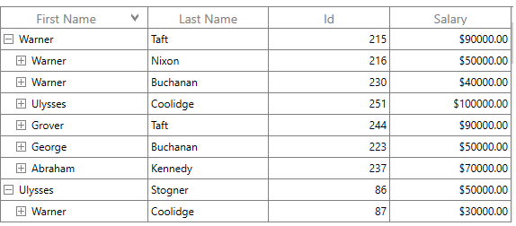
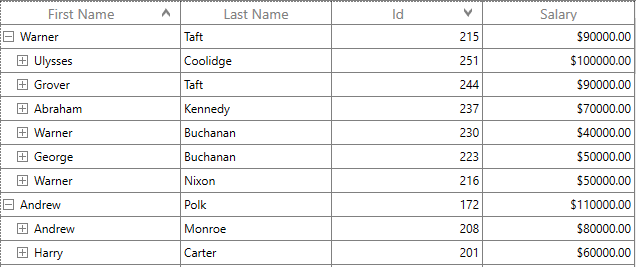
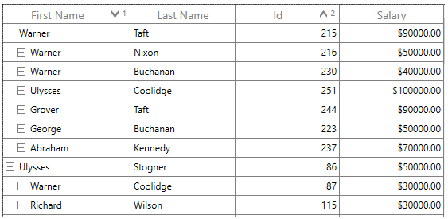
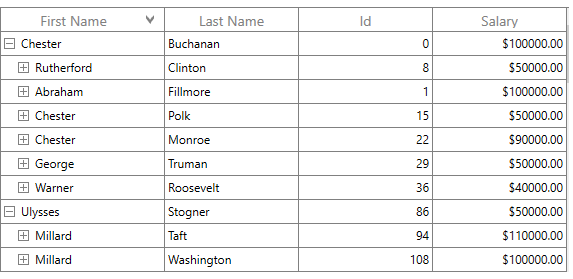

# Sorting in WPF TreeGrid (SfTreeGrid)

SfTreeGrid allows you to sort the data against one or more columns in either ascending or descending order. When sorting is applied, the rows are rearranged based on the sort criteria. You can allow users to sort the data by touching or clicking the column header by setting the [SfTreeGrid.AllowSorting](https://help.syncfusion.com/cr/wpf/Syncfusion.UI.Xaml.Grid.SfGridBase.html#Syncfusion_UI_Xaml_Grid_SfGridBase_AllowSorting) property to `true`.




<syncfusion:SfTreeGrid Name="treeGrid"
						AllowSorting="True"                             
						AutoExpandMode="RootNodesExpanded"                    
						ChildPropertyName="Children"                  
						ItemsSource="{Binding EmployeeDetails}">



this.treeGrid.AllowSorting = true;




Alternatively, you can enable or disable sorting for a particular column by setting the [TreeGridColumn.AllowSorting](https://help.syncfusion.com/cr/wpf/Syncfusion.UI.Xaml.Grid.GridColumnBase.html#Syncfusion_UI_Xaml_Grid_GridColumnBase_AllowSorting) property.




<syncfusion:SfTreeGrid Name="treeGrid"
							   AllowSorting="False"
							   AutoGenerateColumns="False"
							   AutoExpandMode="RootNodesExpanded"                    
							   ChildPropertyName="Children"                  
							   ItemsSource="{Binding EmployeeDetails}">
	<syncfusion:SfTreeGrid.Columns>
		<syncfusion:TreeGridTextColumn AllowSorting="True" MappingName="FirstName" />
		<syncfusion:TreeGridTextColumn AllowSorting="False" MappingName="LastName" />
		<syncfusion:TreeGridTextColumn  MappingName="Id" />
		<syncfusion:TreeGridNumericColumn MappingName="Salary" />
	</syncfusion:SfTreeGrid.Columns>
</syncfusion:SfTreeGrid>
	



this.treeGrid.Columns["FirstName"].AllowSorting = true;
this.treeGrid.Columns["LastName"].AllowSorting = false;




N> The [TreeGridColumn.AllowSorting](https://help.syncfusion.com/cr/wpf/Syncfusion.UI.Xaml.Grid.GridColumnBase.html#Syncfusion_UI_Xaml_Grid_GridColumnBase_AllowSorting) takes higher priority than the [SfTreeGrid.AllowSorting](https://help.syncfusion.com/cr/wpf/Syncfusion.UI.Xaml.Grid.SfGridBase.html#Syncfusion_UI_Xaml_Grid_SfGridBase_AllowSorting) property.

End users can sort the column by clicking the column header cell. Once the columns get sorted, the sort indicator will be displayed on the right side of the column header.

## Sort column in double click

By default, the column gets sorted when the column header is clicked. You can change this behavior to sort the column on a double click action by setting the [SfTreeGrid.SortClickAction](https://help.syncfusion.com/cr/wpf/Syncfusion.UI.Xaml.Grid.SfGridBase.html#Syncfusion_UI_Xaml_Grid_SfGridBase_SortClickAction) property to `DoubleClick`.




<syncfusion:SfTreeGrid Name="treeGrid"
						AllowSorting="True"
						SortClickAction="DoubleClick"
						AutoExpandMode="RootNodesExpanded"                    
						ChildPropertyName="Children"                  
						ItemsSource="{Binding EmployeeDetails}">
							   



this.treeGrid.AllowSorting = true;
this.treeGrid.SortClickAction = SortClickAction.DoubleClick;
	



## Sorting order

By default, the data is sorted in ascending or descending order when clicking the column header. You can rearrange the data to its initial order from descending when clicking the column header by setting the [SfTreeGrid.AllowTriStateSorting](https://help.syncfusion.com/cr/wpf/Syncfusion.UI.Xaml.Grid.SfGridBase.html#Syncfusion_UI_Xaml_Grid_SfGridBase_AllowTriStateSorting) property.

The following is the sequence of sorting orders when clicking the column header:

* Sorts the data in ascending order.
* Sorts the data in descending order.
* Clears the sorting, and records are displayed in their initial order.

## Multi column sorting

The SfTreeGrid control allows you to sort more than one column, where sorting is applied one column against other columns. To apply sorting on multiple columns, the user has to click the column header while pressing the <kbd>Ctrl</kbd> key.
In the screenshot below, the `First Name` column is sorted. Then the `Employee ID` column is sorted against the `First Name` data by clicking the column header while pressing the <kbd>Ctrl</kbd> key. The sorting state of the `First Name` column is preserved, and the `Employee ID` column is sorted against the `First Name` column.

### Display sort order

It is also possible to display the sorted order of columns in the header by setting the [SfTreeGrid.ShowSortNumbers](https://help.syncfusion.com/cr/wpf/Syncfusion.UI.Xaml.Grid.SfGridBase.html#Syncfusion_UI_Xaml_Grid_SfGridBase_ShowSortNumbers) property to `true`.




<syncfusion:SfTreeGrid Name="treeGrid"
					AllowSorting="True"
					ShowSortNumbers="True"
					AutoExpandMode="RootNodesExpanded"                    
					ChildPropertyName="Children"                  
					ItemsSource="{Binding EmployeeDetails}">
						



this.treeGrid.ShowSortNumbers = true;
	



## Programmatic Sorting

You can sort the data programmatically by adding or removing the [SortColumnDescription](https://help.syncfusion.com/cr/wpf/Syncfusion.UI.Xaml.Grid.SortColumnDescription.html) in [SfTreeGrid.SortColumnDescriptions](https://help.syncfusion.com/cr/wpf/Syncfusion.UI.Xaml.Grid.SfGridBase.html#Syncfusion_UI_Xaml_Grid_SfGridBase_SortColumnDescriptions) property.

N> [SfTreeGrid.SortColumnChanging](https://help.syncfusion.com/cr/wpf/Syncfusion.UI.Xaml.TreeGrid.SfTreeGrid.html#Syncfusion_UI_Xaml_TreeGrid_SfTreeGrid_SortColumnsChanging) and [SfTreeGrid.SortColumnChanged](https://help.syncfusion.com/cr/wpf/Syncfusion.UI.Xaml.TreeGrid.SfTreeGrid.html#Syncfusion_UI_Xaml_TreeGrid_SfTreeGrid_SortColumnsChanged) events are not raised when the data sorted programmatically through `SfTreeGrid.SortColumnDescriptions`.

### Adding sort columns




<syncfusion:SfTreeGrid Name="treeGrid"
						AllowSorting="True"
						AutoExpandMode="RootNodesExpanded"                    
						ChildPropertyName="Children"                  
						ItemsSource="{Binding EmployeeDetails}">
			<syncfusion:SfTreeGrid.SortColumnDescriptions>
				<sync:SortColumnDescription ColumnName="FirstName" SortDirection="Ascending" />
				<sync:SortColumnDescription ColumnName="Id" SortDirection="Descending"/>
			</syncfusion:SfTreeGrid.SortColumnDescriptions>
</syncfusion:SfTreeGrid>




this.treeGrid.SortColumnDescriptions.Add(new SortColumnDescription() { ColumnName = "FirstName",SortDirection=ListSortDirection.Ascending });
this.treeGrid.SortColumnDescriptions.Add(new SortColumnDescription() { ColumnName = "Id", SortDirection = ListSortDirection.Descending });
	



### Removing sort columns

You can unsort the data by removing the corresponding [SortColumnDescription](https://help.syncfusion.com/cr/wpf/Syncfusion.UI.Xaml.Grid.SortColumnDescription.html) from the [SfTreeGrid.SortColumnDescriptions](https://help.syncfusion.com/cr/wpf/Syncfusion.UI.Xaml.Grid.SfGridBase.html#Syncfusion_UI_Xaml_Grid_SfGridBase_SortColumnDescriptions) property.




var sortColumnDescription = this.treeGrid.SortColumnDescriptions.FirstOrDefault(col => col.ColumnName == "FirstName");

if (sortColumnDescription != null)
    this.treeGrid.SortColumnDescriptions.Remove(sortColumnDescription);
			  



### Clear sorting

You can clear sorting, by clearing the [SfTreeGrid.SortColumnDescriptions](https://help.syncfusion.com/cr/wpf/Syncfusion.UI.Xaml.Grid.SfGridBase.html#Syncfusion_UI_Xaml_Grid_SfGridBase_SortColumnDescriptions).




this.treeGrid.SortColumnDescriptions.Clear();
	



## Custom sorting

SfTreeGrid allows you to sort the columns based on custom logic. The custom sorting can be applied by adding the [SortComparer](https://help.syncfusion.com/cr/wpf/Syncfusion.Data.SortComparer.html) instance to [SfTreeGrid.SortComparers](https://help.syncfusion.com/cr/wpf/Syncfusion.UI.Xaml.TreeGrid.SfTreeGrid.html#Syncfusion_UI_Xaml_TreeGrid_SfTreeGrid_SortComparers). 

The [SortComparer](https://help.syncfusion.com/cr/wpf/Syncfusion.Data.SortComparer.html) has the following properties:

[PropertyName](https://help.syncfusion.com/cr/wpf/Syncfusion.Data.SortComparer.html#Syncfusion_Data_SortComparer_PropertyName) - Gets or sets the name of the column to apply custom sorting.

[Comparer](https://help.syncfusion.com/cr/wpf/Syncfusion.Data.SortComparer.html#Syncfusion_Data_SortComparer_Comparer) - Gets or sets the custom comparer in which you can code to compare the data using custom logic. 

You can implement the [ISortDirection](https://help.syncfusion.com/cr/wpf/Syncfusion.Data.ISortDirection.html) interface in the comparer to get the sort direction. So you can apply different custom logic for ascending and descending. 

Follow the steps below to add a custom comparer to sort using custom logic:

#### Define custom comparer with custom sort logic

In the code snippet below, the `FirstName` property is compared based on its string length, instead of the default string comparison. 
 



public class CustomSortComparer : IComparer<object>, ISortDirection
{
	public int Compare(object x, object y)
	{
		var item1 = x as EmployeeInfo;
		var item2 = y as EmployeeInfo;
		var value1 = item1.FirstName;
		var value2 = item2.FirstName;
		int c = 0;

		if (value1 != null && value2 == null)
		{
			c = 1;
		}
		else if (value1 == null && value2 != null)
		{
			c = -1;
		}
		else if (value1 != null && value2 != null)
		{
			c = value1.Length.CompareTo(value2.Length);
		}

		if (SortDirection == ListSortDirection.Descending)
			c = -c;

		return c;
	}

	//Get or Set the SortDirection value
	private ListSortDirection _SortDirection;

	public ListSortDirection SortDirection
	{
		get { return _SortDirection; }
		set { _SortDirection = value; }
	}
}
	



#### Adding custom comparer to SfTreeGrid

A custom comparer can be added to the [SfTreeGrid.SortComparers](https://help.syncfusion.com/cr/wpf/Syncfusion.UI.Xaml.TreeGrid.SfTreeGrid.html#Syncfusion_UI_Xaml_TreeGrid_SfTreeGrid_SortComparers) property. `SortComparers` maintains custom comparers, and the custom comparer is called when the corresponding column gets sorted by clicking the column header or programmatically.



	
xmlns:data="clr-namespace:Syncfusion.Data;assembly=Syncfusion.Data.WPF"

<syncfusion:SfTreeGrid.SortComparers>
	<data:SortComparer Comparer="{StaticResource sortComparer}"  PropertyName="FirstName" />
</syncfusion:SfTreeGrid.SortComparers>
	



this.treeGrid.SortComparers.Add(new SortComparer() { Comparer = new CustomSortComparer(), PropertyName = "FirstName" });	
	



Sorting the `First Name` column sorts the data using the custom sort comparer available in `SfTreeGrid.SortComparers`.

## Handling events

### SortColumnsChanging event

The [SfTreeGrid.SortColumnsChanging](https://help.syncfusion.com/cr/wpf/Syncfusion.UI.Xaml.TreeGrid.SfTreeGrid.html#Syncfusion_UI_Xaml_TreeGrid_SfTreeGrid_SortColumnsChanging) event occurs while sorting the columns by clicking the column header. [GridSortColumnsChangingEventArgs](https://help.syncfusion.com/cr/wpf/Syncfusion.UI.Xaml.Grid.GridSortColumnsChangingEventArgs.html) has the following members, which provide information for the `SortColumnsChanging` event.

[Action](https://help.syncfusion.com/cr/wpf/Syncfusion.UI.Xaml.Grid.GridSortColumnsChangingEventArgs.html#Syncfusion_UI_Xaml_Grid_GridSortColumnsChangingEventArgs_Action) - Gets the action triggered this event. 

[Cancel](https://learn.microsoft.com/en-us/dotnet/api/system.componentmodel.canceleventargs.cancel?redirectedfrom=MSDN&view=net-5.0#System_ComponentModel_CancelEventArgs_Cancel) - Setting the value to `true` cancels the triggered action. 

[AddedItems](https://help.syncfusion.com/cr/wpf/Syncfusion.UI.Xaml.Grid.GridSortColumnsChangingEventArgs.html#Syncfusion_UI_Xaml_Grid_GridSortColumnsChangingEventArgs_AddedItems) - Gets the list of new `SortColumnDescriptions` that are added.

[RemovedItems](https://help.syncfusion.com/cr/wpf/Syncfusion.UI.Xaml.Grid.GridSortColumnsChangingEventArgs.html#Syncfusion_UI_Xaml_Grid_GridSortColumnsChangingEventArgs_RemovedItems) - Gets the list of `SortColumnDescriptions` that are removed. 

[CancelScroll](https://help.syncfusion.com/cr/wpf/Syncfusion.UI.Xaml.Grid.GridSortColumnsChangingEventArgs.html#Syncfusion_UI_Xaml_Grid_GridSortColumnsChangingEventArgs_CancelScroll) - Gets or sets a value that indicates whether to scroll and bring the `SelectedItem` into view after sorting takes place.

You can prevent sorting for a particular column through the [GridSortColumnsChangingEventArgs.Cancel](https://learn.microsoft.com/en-us/dotnet/api/system.componentmodel.canceleventargs.cancel?redirectedfrom=MSDN&view=net-5.0#System_ComponentModel_CancelEventArgs_Cancel) property of the `SortColumnsChanging` event.




this.treeGrid.SortColumnsChanging += TreeGrid_SortColumnsChanging;

private void TreeGrid_SortColumnsChanging(object sender, GridSortColumnsChangingEventArgs e)
{
	if (e.AddedItems[0].ColumnName == "FirstName")
	{
		e.Cancel = true;
	}
}
	



### SortColumnsChanged event

The [SfTreeGrid.SortColumnsChanged](https://help.syncfusion.com/cr/wpf/Syncfusion.UI.Xaml.TreeGrid.SfTreeGrid.html#Syncfusion_UI_Xaml_TreeGrid_SfTreeGrid_SortColumnsChanged) event occurs when the sorting is applied to the column. [GridSortColumnsChangedEventArgs](https://help.syncfusion.com/cr/wpf/Syncfusion.UI.Xaml.Grid.GridSortColumnsChangedEventArgs.html) provides information for the `SortColumnsChanged` event. 

N> You can refer to our [WPF TreeGrid](https://www.syncfusion.com/wpf-controls/treegrid) feature tour page for its groundbreaking feature representations. You can also explore our [WPF TreeGrid example](https://github.com/syncfusion/wpf-demos) to know how to render and configure the TreeGrid.