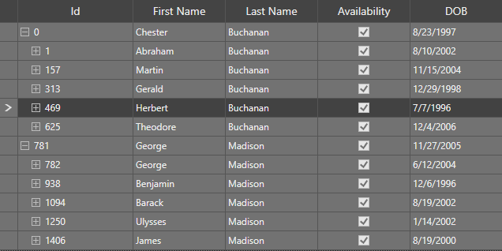

# Themes

SfTreeGrid provides built-in themes which can be applied using [SfSkinManager](https://help.syncfusion.com/wpf/themes/getting-started) and also provides support to create custom theme using [theme studio](https://help.syncfusion.com/wpf/themes/theme-studio). 

## Built-in Themes

SfTreeGrid supports various built-in themes. Refer to the below links to apply themes for the SfTreeGrid,

  * [Apply theme using SfSkinManager](https://help.syncfusion.com/wpf/themes/skin-manager)
	
  * [Create a custom theme using ThemeStudio](https://help.syncfusion.com/wpf/themes/theme-studio#creating-custom-theme)
  
