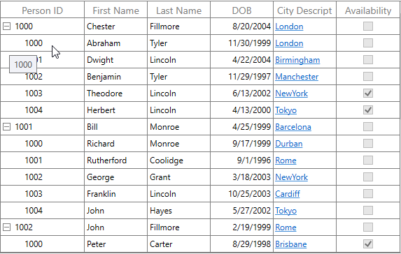

# ToolTip in WPF TreeGrid (SfTreeGrid)

Tooltip supports showing the pop-up window that displays the information when the mouse hovers over a cell of the SfTreeGrid.

## Record cell tooltip

You can enable tooltip for the TreeGridCell by setting the [SfTreeGrid.ShowToolTip](https://help.syncfusion.com/cr/wpf/Syncfusion.UI.Xaml.Grid.SfGridBase.html#Syncfusion_UI_Xaml_Grid_SfGridBase_ShowToolTip) property to `true`.




<syncfusion:SfTreeGrid Name="treeGrid" 
                        AutoExpandMode="RootNodesExpanded"
                        AutoGenerateColumns="False"
                        ShowToolTip="True"
                        ChildPropertyName="Children"    ItemsSource="{Binding EmployeeDetails}">	




this.treeGrid.ShowToolTip = true;




You can enable the tooltip of a particular column by setting the [TreeGridColumn.ShowToolTip](https://help.syncfusion.com/cr/wpf/Syncfusion.UI.Xaml.Grid.GridColumnBase.html#Syncfusion_UI_Xaml_Grid_GridColumnBase_ShowToolTip) property to `true`.




<syncfusion:TreeGridTextColumn HeaderText="First Name" MappingName="FirstName" ShowToolTip="True" />
<syncfusion:TreeGridTextColumn HeaderText="Last Name" MappingName="LastName" ShowToolTip="True" />	




this.treeGrid.Columns["FirstName"].ShowToolTip = true;
this.treeGrid.Columns["LastName"].ShowToolTip = true;




N> It has higher priority than [SfTreeGrid.ShowToolTip](https://help.syncfusion.com/cr/wpf/Syncfusion.UI.Xaml.Grid.SfGridBase.html#Syncfusion_UI_Xaml_Grid_SfGridBase_ShowToolTip).

## Header tooltip

You can enable the tooltip of a header cell by setting the [TreeGridColumn.ShowHeaderToolTip](https://help.syncfusion.com/cr/wpf/Syncfusion.UI.Xaml.Grid.GridColumnBase.html#Syncfusion_UI_Xaml_Grid_GridColumnBase_ShowHeaderToolTip) property to `true`.




<syncfusion:SfTreeGrid.Columns>
    <syncfusion:TreeGridTextColumn HeaderText="First Name" MappingName="FirstName" ShowHeaderToolTip="True" />
</syncfusion:SfTreeGrid.Columns>




this.treeGrid.Columns["FirstName"].ShowHeaderToolTip = true;




## Tooltip customization

You can change appearance of the tooltip by customizing the style with TargetType as ToolTip.




<Window.Resources>        
    
</Window.Resources>

<syncfusion:SfTreeGrid.Columns>
    <syncfusion:TreeGridTextColumn HeaderText="First Name" MappingName="FirstName" ShowToolTip="True" />
</syncfusion:SfTreeGrid.Columns>
	



You can customize the template of the tooltip by using the [TreeGridColumn.ToolTipTemplate](https://help.syncfusion.com/cr/wpf/Syncfusion.UI.Xaml.Grid.GridColumnBase.html#Syncfusion_UI_Xaml_Grid_GridColumnBase_ToolTipTemplate) and [TreeGridColumn.ToolTipTemplateSelector](https://help.syncfusion.com/cr/wpf/Syncfusion.UI.Xaml.Grid.GridColumnBase.html#Syncfusion_UI_Xaml_Grid_GridColumnBase_ToolTipTemplateSelector) properties. 

### Customize the tooltip using ToolTipTemplate

You can customize appearance of the tooltip of a particular column by setting the `TreeGridColumn.ToolTipTemplate`. You can also customize appearance of the header tooltip of a particular column by using the [TreeGridColumn.HeaderToolTipTemplate](https://help.syncfusion.com/cr/wpf/Syncfusion.UI.Xaml.Grid.GridColumnBase.html#Syncfusion_UI_Xaml_Grid_GridColumnBase_HeaderToolTipTemplate) property.

The ToolTipTemplate receives the underlying data object as DataContext by default. You can set the [TreeGridColumn.SetCellBoundToolTip](https://help.syncfusion.com/cr/wpf/Syncfusion.UI.Xaml.Grid.GridColumnBase.html#Syncfusion_UI_Xaml_Grid_GridColumnBase_SetCellBoundToolTip) to `true` to change the DataContext of the tooltip template where it sets the DataContext as DataContextHelper. The [TreeGridDataContextHelper](https://help.syncfusion.com/cr/wpf/Syncfusion.UI.Xaml.TreeGrid.Cells.TreeGridDataContextHelper.html) has the following properties to reuse the same template for all the columns: 

 <ul>  
 <li> <a href="https://help.syncfusion.com/cr/wpf/Syncfusion.UI.Xaml.Grid.Cells.DataContextHelper.html#Syncfusion_UI_Xaml_Grid_Cells_DataContextHelper_Record"><b>Record:</b></a> Gets the underlying data record of a row which has the cell.  </li>
 <li> <a href="https://help.syncfusion.com/cr/wpf/Syncfusion.UI.Xaml.Grid.Cells.DataContextHelper.html#Syncfusion_UI_Xaml_Grid_Cells_DataContextHelper_Value"><b>Value:</b></a> Gets the underlying value of a cell. </li> 
 </ul>




<Window.Resources>
    <local:StringToImageConverter x:Key="ImageConverter" />
    <DataTemplate x:Key="TemplateToolTip">
        <Grid>
            <Grid.RowDefinitions>
                <RowDefinition Height="*"/>
                <RowDefinition Height="*"/>
            </Grid.RowDefinitions>
            <Image Height="100" Width="100" Source="{Binding LastName,Converter={StaticResource ImageConverter}}" />
            <TextBlock Grid.Row="1" Text="{Binding LastName}" HorizontalAlignment="Center"/>
        </Grid>
    </DataTemplate>
</Window.Resources>

<syncfusion:SfTreeGrid.Columns>    
    <syncfusion:TreeGridTextColumn HeaderText="Last Name" MappingName="LastName" ToolTipTemplate="{StaticResource TemplateToolTip}" ShowToolTip="True" />
</syncfusion:SfTreeGrid.Columns>




public class StringToImageConverter : IValueConverter
{
    public object Convert(object value, Type targetType, object parameter, System.Globalization.CultureInfo culture)
    {
        string imagename = value.ToString();
        return @"..\..\Assets\" + imagename + @".png";
    }

    public object ConvertBack(object value, Type targetType, object parameter, System.Globalization.CultureInfo culture)
    {
        return value;
    }
}




You can get the sample [here](http://www.syncfusion.com/downloads/support/directtrac/general/ze/ToolTipTemplateDemo-1415306479.zip).

### Customize the ToolTip with ToolTipTemplateSelector

Different tooltip templates can be loaded conditionally in same column based on the data by setting the [TreeGridColumn.ToolTipTemplateSelector](https://help.syncfusion.com/cr/wpf/Syncfusion.UI.Xaml.Grid.GridColumnBase.html#Syncfusion_UI_Xaml_Grid_GridColumnBase_ToolTipTemplateSelector) property. 




<Window.Resources>
    <DataTemplate x:Key="ToolTip1">
        <Grid>                
            <TextBlock Text="{Binding Record.Id}" FontWeight="Bold" Foreground="Red" />
        </Grid>
    </DataTemplate>
    <DataTemplate x:Key="ToolTip2">
        <Grid>
            <TextBlock Text="{Binding Record.Id}" FontWeight="Bold" Foreground="Green"/>                
        </Grid>
    </DataTemplate>      
</Window.Resources>

<syncfusion:SfTreeGrid.Columns>
    <syncfusion:TreeGridTextColumn HeaderText="Person ID" MappingName="Id" ShowToolTip="True" >
        <syncfusion:TreeGridTextColumn.ToolTipTemplateSelector>
            <syncfusion:TreeGridTextColumn HeaderText="Person ID" MappingName="Id" 
                                               DisplayBinding="{Binding Path=Id, StringFormat=c}"
                                               ShowToolTip="True" SetCellBoundToolTip="True" >
        </syncfusion:TreeGridTextColumn.ToolTipTemplateSelector>
    </syncfusion:TreeGridTextColumn>
</syncfusion:SfTreeGrid.Columns>




public class ToolTipTemplateSelector : DataTemplateSelector
{
    private DataTemplate _defaultTemplate;

    /// 

    /// Gets or sets DefaultTemplate.
    /// 

    public DataTemplate DefaultTemplate
    {
        get { return _defaultTemplate; }
        set { _defaultTemplate = value; }
    }

    private DataTemplate _alternateTemplate;

    /// 

    /// Gets or Sets AlternateTemplate.
    /// 

    public DataTemplate AlternateTemplate
    {
        get { return _alternateTemplate; }
        set { _alternateTemplate = value; }
    }

    public override System.Windows.DataTemplate SelectTemplate(object item, System.Windows.DependencyObject container)
    {
        var treeGridData = item as TreeGridDataContextHelper;
        if (treeGridData == null)
            return this.DefaultTemplate;
        // To see what template needs to be select according to the specified property value.
        if ((treeGridData.Record as Employee).Id == (int)treeGridData.Value && ((int)treeGridData.Value % 2) == 0)
            return this.AlternateTemplate;
        else
            return this.DefaultTemplate;
    }
}




The following image shows the DefaultTemplate applied through ToolTipTemplateSelector.

The following image shows the AlternateTemplate applied through ToolTipTemplateSelector.

You can get the sample [here](http://www.syncfusion.com/downloads/support/directtrac/general/ze/ToolTipTemplateSelectorDemo1909534526.zip).

## Events

### CellToolTipOpening event

The [CellToolTipOpening](https://help.syncfusion.com/cr/wpf/Syncfusion.UI.Xaml.TreeGrid.SfTreeGrid.html) event occurs when any tooltip of the cell is opened. The `CellToolTipOpening` event receives the [TreeGridCellToolTipOpeningEventArgs](https://help.syncfusion.com/cr/wpf/Syncfusion.UI.Xaml.TreeGrid.TreeGridCellToolTipOpeningEventArgs.html) as argument which has the following properties:

<ul>
<li> <a href="https://help.syncfusion.com/cr/wpf/Syncfusion.UI.Xaml.Grid.CellToolTipOpeningEventArgs.html#Syncfusion_UI_Xaml_Grid_CellToolTipOpeningEventArgs_Column">Column:</a> Gets the hovered cell column in the SfTreeGrid.</li>
<li> <a href="https://help.syncfusion.com/cr/wpf/Syncfusion.UI.Xaml.TreeGrid.TreeGridCellToolTipOpeningEventArgs.html#Syncfusion_UI_Xaml_TreeGrid_TreeGridCellToolTipOpeningEventArgs_Node">Node:</a> Gets the hovered cell node.</li>
<li> <a href="https://help.syncfusion.com/cr/wpf/Syncfusion.UI.Xaml.Grid.CellToolTipOpeningEventArgs.html#Syncfusion_UI_Xaml_Grid_CellToolTipOpeningEventArgs_Record">Record:</a> Gets the data context of hovered cell.</li>
<li> <a href="https://help.syncfusion.com/cr/wpf/Syncfusion.UI.Xaml.Grid.CellToolTipOpeningEventArgs.html#Syncfusion_UI_Xaml_Grid_CellToolTipOpeningEventArgs_RowColumnIndex">RowColumnIndex:</a> Gets the row and column index of the hovered cell.</li>
<li> <a href="https://help.syncfusion.com/cr/wpf/Syncfusion.UI.Xaml.Grid.CellToolTipOpeningEventArgs.html#Syncfusion_UI_Xaml_Grid_CellToolTipOpeningEventArgs_ToolTip">ToolTip:</a> Gets the tooltip of the hovered cells.</li>
</ul>



<syncfusion:SfTreeGrid Name="treeGrid"  
                        AutoExpandMode="RootNodesExpanded" 
                        CellToolTipOpening="TreeGrid_CellToolTipOpening"
                        AutoGenerateColumns="False"
                        ChildPropertyName="Children"
                        ColumnSizer="Star"
                        ExpanderColumn="Id"
                        ItemsSource="{Binding PersonDetails}">


this.treeGrid.CellToolTipOpening += TreeGrid_CellToolTipOpening;

private void TreeGrid_CellToolTipOpening(object sender, Syncfusion.UI.Xaml.TreeGrid.TreeGridCellToolTipOpeningEventArgs e)
{
           
}


