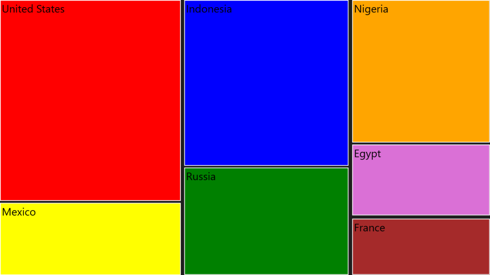

# ColorMapping in SfTreeMap

ColorMapping is categorized into four different types such as,

* UniColorMapping
* RangeBrushColorMapping
* DesaturationColorMapping
* PaletteColorMapping
* GroupColorMapping

## TreeMap ColorMapping:

The leaf nodes of TreeMap can be colored by setting LeafColorMapping of TreeMap.



 <syncfusion:SfTreeMap ItemsSource="{Binding PopulationDetails}" 

                       WeightValuePath="Population"                              

                       ColorValuePath="Growth">

    <syncfusion:SfTreeMap.LeafColorMapping>

        <syncfusion:UniColorMapping Color="Crimson"/>

    </syncfusion:SfTreeMap.LeafColorMapping>

    <syncfusion:SfTreeMap.Levels>

        <syncfusion:TreeMapFlatLevel GroupPath="Continent" GroupGap="10"/>

    </syncfusion:SfTreeMap.Levels>

 </syncfusion:SfTreeMap>



## TreeMapLevel ColorMapping:

The headers of TreeMap level can also be colored using ColorMapping property of TreeMapLevel. 



<syncfusion:SfTreeMap ItemsSource="{Binding PopulationDetails}" 

                       WeightValuePath="Population"                              

                       ColorValuePath="Growth">

    <syncfusion:SfTreeMap.LeafColorMapping>

        <syncfusion:UniColorMapping Color="Orange"/>

    </syncfusion:SfTreeMap.LeafColorMapping>

    <syncfusion:SfTreeMap.Levels>

        <syncfusion:TreeMapFlatLevel GroupPath="Continent" GroupGap="10" HeaderHeight="20">

            <syncfusion:TreeMapFlatLevel.ColorMapping>

                <syncfusion:UniColorMapping Color="YellowGreen"/>

            </syncfusion:TreeMapFlatLevel.ColorMapping>

        </syncfusion:TreeMapFlatLevel>

        <syncfusion:TreeMapFlatLevel GroupPath="Country" GroupGap="5" HeaderHeight="15">

            <syncfusion:TreeMapFlatLevel.ColorMapping>

                <syncfusion:UniColorMapping Color="Crimson"/>

            </syncfusion:TreeMapFlatLevel.ColorMapping>

        </syncfusion:TreeMapFlatLevel>

    </syncfusion:SfTreeMap.Levels>

 </syncfusion:SfTreeMap>  


## UniColorMapping

TreeMap leaf nodes can be colored with the help of Color property specified using UniColorMapping.



    <Grid Background="Black">

        <Grid.DataContext>

            <local:PopulationViewModel/>

        </Grid.DataContext>

        <syncfusion:SfTreeMap ItemsSource="{Binding PopulationDetails}"                              

                              WeightValuePath="Population"                              

                              ColorValuePath="Growth">

            <syncfusion:SfTreeMap.LeafColorMapping>

                <syncfusion:UniColorMapping Color="Crimson"/>

            </syncfusion:SfTreeMap.LeafColorMapping>

            <syncfusion:SfTreeMap.Levels>

                <syncfusion:TreeMapFlatLevel GroupPath="Continent" 

                                             GroupGap="10"/>

                <syncfusion:TreeMapFlatLevel GroupPath="Country" 

                                             GroupGap="5"

                                             ShowLabels="True"/>

            </syncfusion:SfTreeMap.Levels>

        </syncfusion:SfTreeMap>

    </Grid>


## RangeBrushColorMapping

The leaf nodes of TreeMap can be colored based upon the range, such as From and To, and Brush specified using RangeBrush collection of RangeBrushColorMapping.



<syncfusion:SfTreeMap ItemsSource="{Binding PopulationDetails}" 

                      WeightValuePath="Population" ColorValuePath="Growth">

    <syncfusion:SfTreeMap.LeafColorMapping>

        <syncfusion:RangeBrushColorMapping>

            <syncfusion:RangeBrushColorMapping.Brushes>

                <syncfusion:RangeBrush From="0" To="1" Color="#A4C400"/>

                <syncfusion:RangeBrush From="1" To="2" Color="#AA00FF"/>

                <syncfusion:RangeBrush From="2" To="3" Color="#F0A30A"/>

                <syncfusion:RangeBrush From="3" To="4" Color="#1BA1E2"/>

            </syncfusion:RangeBrushColorMapping.Brushes>

        </syncfusion:RangeBrushColorMapping>

    </syncfusion:SfTreeMap.LeafColorMapping>

    <syncfusion:SfTreeMap.Levels>

        <syncfusion:TreeMapFlatLevel GroupPath="Continent" GroupGap="10"/>

        <syncfusion:TreeMapFlatLevel GroupPath="Country" GroupGap="5"

                                     ShowLabels="True"/>

    </syncfusion:SfTreeMap.Levels>

</syncfusion:SfTreeMap>



## DesaturationColorMapping

The leaf nodes of TreeMap can be colored based upon the Color specified using DesaturationColorMapping. The RangeMinimum and RangeMaximum must be specified to determine the opacity for each leaf node. The opacity of leaf nodes are in the range of From and To mentioned in DesaturationColorMapping.



<syncfusion:SfTreeMap ItemsSource="{Binding PopulationDetails}"   

                      WeightValuePath="Population" ColorValuePath="Growth">

    <syncfusion:SfTreeMap.LeafColorMapping>

        <syncfusion:DesaturationColorMapping From="1" To="0.5" 

                                             RangeMinimum="0" RangeMaximum="4" Color="DeepSkyBlue">

        </syncfusion:DesaturationColorMapping>

    </syncfusion:SfTreeMap.LeafColorMapping>

    <syncfusion:SfTreeMap.Levels>

        <syncfusion:TreeMapFlatLevel GroupPath="Continent" GroupGap="10"/>

        <syncfusion:TreeMapFlatLevel GroupPath="Country" GroupGap="5"

                                     ShowLabels="True"/>

    </syncfusion:SfTreeMap.Levels>

</syncfusion:SfTreeMap>



## PaletteColorMapping

The leaf nodes are colored by using the brushes mentioned in Colors collection of PaletteColorMapping.



<syncfusion:SfTreeMap ItemsSource="{Binding PopulationDetails}"                              

                      WeightValuePath="Population" ColorValuePath="Growth">

    <syncfusion:SfTreeMap.LeafColorMapping>

        <syncfusion:PaletteColorMapping>

            <syncfusion:PaletteColorMapping.Colors>

                <SolidColorBrush Color="Red"/><SolidColorBrush Color="Blue"/>

                <SolidColorBrush Color="Green"/><SolidColorBrush Color="Yellow"/><SolidColorBrush Color="Orange"/><SolidColorBrush Color="Orchid"/><SolidColorBrush Color="Brown"/><SolidColorBrush Color="BlueViolet"/><SolidColorBrush Color="OrangeRed"/>

                <SolidColorBrush Color="Magenta"/>

                <SolidColorBrush Color="Olive"/>

                <SolidColorBrush Color="Crimson"/>

                <SolidColorBrush Color="DeepSkyBlue"/>

            </syncfusion:PaletteColorMapping.Colors>

        </syncfusion:PaletteColorMapping>

    </syncfusion:SfTreeMap.LeafColorMapping>

    <syncfusion:SfTreeMap.Levels>

        <syncfusion:TreeMapFlatLevel GroupPath="Continent" GroupGap="10"/>

        <syncfusion:TreeMapFlatLevel GroupPath="Country" GroupGap="5"

                                     ShowLabels="True"/>

    </syncfusion:SfTreeMap.Levels>

</syncfusion:SfTreeMap>



## GroupColorMapping

The leaf nodes are colored by using different ColorMappings available in the TreeMap control. Each group can also be colored with different ColorMappings of TreeMapGroupColorMapping. GroupColorMapping is done based on the GroupID property.



<syncfusion:SfTreeMap Name="TreeMap" ItemsSource="{Binding PopulationDetails}" WeightValuePath="Growth" ColorValuePath="Growth"

                              ItemsLayoutMode="Squarified" Margin="10">

            <syncfusion:SfTreeMap.GroupColorMappings>

                <syncfusion:GroupColorMapping GroupID="North America">

                    <syncfusion:GroupColorMapping.TreeMapColorMapping>

                        <syncfusion:DesaturationColorMapping From="1" To="0.1" Color="#F3D240" RangeMinimum="0" RangeMaximum="6"/>

                    </syncfusion:GroupColorMapping.TreeMapColorMapping>

                </syncfusion:GroupColorMapping>

                <syncfusion:GroupColorMapping GroupID="Asia">

                    <syncfusion:GroupColorMapping.TreeMapColorMapping>

                        <syncfusion:DesaturationColorMapping From="1" To="0.1" Color="#77D8D8" RangeMinimum="0" RangeMaximum="7"/>

                    </syncfusion:GroupColorMapping.TreeMapColorMapping>

                </syncfusion:GroupColorMapping>

                <syncfusion:GroupColorMapping GroupID="Africa">

                    <syncfusion:GroupColorMapping.TreeMapColorMapping>

                        <syncfusion:DesaturationColorMapping From="1" To="0.1" Color="#faafbe" RangeMinimum="0" RangeMaximum="6"/>

                    </syncfusion:GroupColorMapping.TreeMapColorMapping>

                </syncfusion:GroupColorMapping>

                <syncfusion:GroupColorMapping GroupID="Europe">

                    <syncfusion:GroupColorMapping.TreeMapColorMapping>

                        <syncfusion:DesaturationColorMapping From="1" To="0.1" Color="#AED960" RangeMinimum="0" RangeMaximum="6"/>

                    </syncfusion:GroupColorMapping.TreeMapColorMapping>

                </syncfusion:GroupColorMapping>

                <syncfusion:GroupColorMapping GroupID="South America">

                    <syncfusion:GroupColorMapping.TreeMapColorMapping>

                        <syncfusion:DesaturationColorMapping From="1" To="0" Color="#FFAF51" RangeMinimum="0" RangeMaximum="6"/>

                    </syncfusion:GroupColorMapping.TreeMapColorMapping>

                </syncfusion:GroupColorMapping>

            </syncfusion:SfTreeMap.GroupColorMappings>

</syncfusion:SfTreeMap>



## see also

[How to apply gradient color mapping to SfTreeMap](https://www.syncfusion.com/kb/9802/how-to-apply-gradientcolormapping-to-sftreemap)