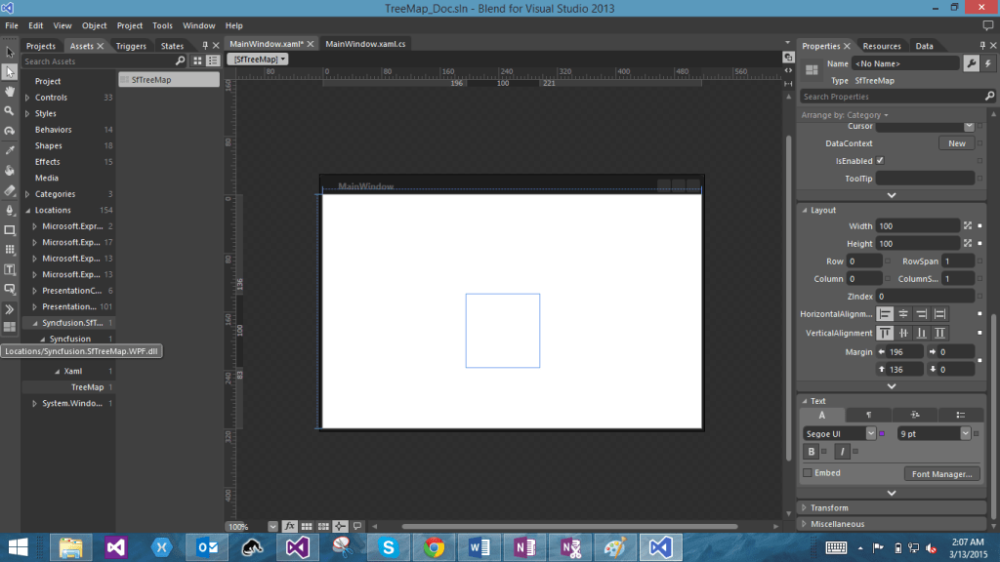

# Getting Started with SfTreeMap

TreeMaps are a growing trend in data visualization. It displays hierarchical information in a series of clustered rectangles, which together represent a whole dataset. The size of each box represents a quantity. TreeMaps also use color to represent any number of values, but it is often used to categorize the various boxes within the tree map.

## Configuring the SfTreeMap Control

### Through Visual Studio

To create the SfTreeMap control through VisualStudio, drag SfTreeMap from Toolbox and drop it to the designer. It will generate the following the SfTreeMap control.

### Through Expression Blend 

The SfTreeMap control can also be created and configured using Expression Blend. Follow these steps to do so.

1. Create a WPF project in Expression Blend and reference the following assemblies.
i. Syncfusion.SfTreeMap.WPF
2. Search for SfTreeMap in the Toolbox.
3. Drag SfTreeMap to the designer. It will generate the SfTreeMap control with one child element.

### Through XAML and C#

You can create the SfTreeMap control programmatically through XAML and C#.

In order to create a TreeMap you can refer to the following assembly and namespace.

{{ '**Assembly**' | markdownify }}: Syncfusion.SfTreeMap.WPF

{{ '**Namespace**' | markdownify }}: Syncfusion.UI.Xaml.TreeMap

In the following code example, the SfTreeMap control is created. 




<Window x:Class="TreeMapDemo.MainWindow"

        xmlns="http://schemas.microsoft.com/winfx/2006/xaml/presentation"

        xmlns:x="http://schemas.microsoft.com/winfx/2006/xaml"

        xmlns:syncfusion="clr-namespace:Syncfusion.UI.Xaml.TreeMap;assembly=Syncfusion.SfTreeMap.WPF"

        Title="TreeMap Demo" WindowState="Maximized">

    <Grid>

        <syncfusion:SfTreeMap>

        </syncfusion:SfTreeMap>

    </Grid>

</Window>




SfTreeMap treemap = new SfTreeMap()

{

            Height = 300,

            Width = 300,

};




## Customizing the TreeMap Control

### Populate ItemsSource

The ItemsSource property accepts the collection values as input. For example, you can provide the list of objects as input.



public class PopulationViewModel

    {

        public PopulationViewModel()

        {

            this.PopulationDetails = new ObservableCollection<PopulationDetail>();

            PopulationDetails.Add(new PopulationDetail() { Continent = "Asia", Country = "Indonesia", Growth = 3, Population = 237641326 });

            PopulationDetails.Add(new PopulationDetail() { Continent = "Asia", Country = "Russia", Growth = 2, Population = 152518015 });

            PopulationDetails.Add(new PopulationDetail() { Continent = "Asia", Country = "Malaysia", Growth = 1, Population = 29672000 });

            PopulationDetails.Add(new PopulationDetail() { Continent = "North America", Country = "United States", Growth = 4, Population = 315645000 });

            PopulationDetails.Add(new PopulationDetail() { Continent = "North America", Country = "Mexico", Growth = 2, Population = 112336538 });

            PopulationDetails.Add(new PopulationDetail() { Continent = "North America", Country = "Canada", Growth = 1, Population = 35056064 });

            PopulationDetails.Add(new PopulationDetail() { Continent = "South America", Country = "Colombia", Growth = 1, Population = 47000000 });

            PopulationDetails.Add(new PopulationDetail() { Continent = "South America", Country = "Brazil", Growth = 3, Population = 193946886 });

            PopulationDetails.Add(new PopulationDetail() { Continent = "Africa", Country = "Nigeria", Growth = 2, Population = 170901000 });

            PopulationDetails.Add(new PopulationDetail() { Continent = "Africa", Country = "Egypt", Growth = 1, Population = 83661000 });

            PopulationDetails.Add(new PopulationDetail() { Continent = "Europe", Country = "Germany", Growth = 1, Population = 81993000 });

            PopulationDetails.Add(new PopulationDetail() { Continent = "Europe", Country = "France", Growth = 1, Population = 65605000 });

            PopulationDetails.Add(new PopulationDetail() { Continent = "Europe", Country = "UK", Growth = 1, Population = 63181775 });

        }

        public ObservableCollection<PopulationDetail> PopulationDetails

        {

            get;

            set;

        }

        public class PopulationDetail

        {

            public string Continent { get; set; }

            public string Country { get; set; }

            public double Growth { get; set; }

            public double Population { get; set; }

        }


After defining the ItemsSource, set the DataContext of the TreeMap as shown here:




    <Grid>

        <Grid.DataContext>

            <local:PopulationViewModel/>

        </Grid.DataContext>

  <syncfusion:SfTreeMap Name="TreeMap" ItemsSource="{Binding PopulationDetails}" ItemsLayoutMode="Squarified" WeightValuePath="Population"/>

<syncfusion:SfTreeMap.Levels>

                <syncfusion:TreeMapFlatLevel GroupPath="Continent" GroupGap="5" HeaderHeight="30">

                    <syncfusion:TreeMapFlatLevel.HeaderTemplate>

                        <DataTemplate>

                            <TextBlock Text="{Binding Header}" Foreground="#D6D6D6" FontSize="18" FontWeight="Light" HorizontalAlignment="Left" VerticalAlignment="Center"/>

                        </DataTemplate>

                    </syncfusion:TreeMapFlatLevel.HeaderTemplate>

                </syncfusion:TreeMapFlatLevel>

            </syncfusion:SfTreeMap.Levels>

    </Grid>




this.TreeMap.DataContext = new PopulationViewModel();



## see also

[How to apply gradient color mapping to SfTreeMap](https://www.syncfusion.com/kb/9802/how-to-apply-gradientcolormapping-to-sftreemap)