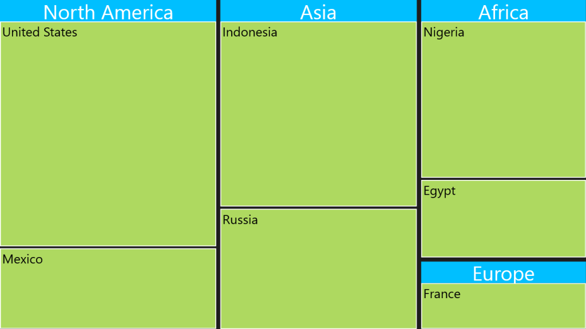
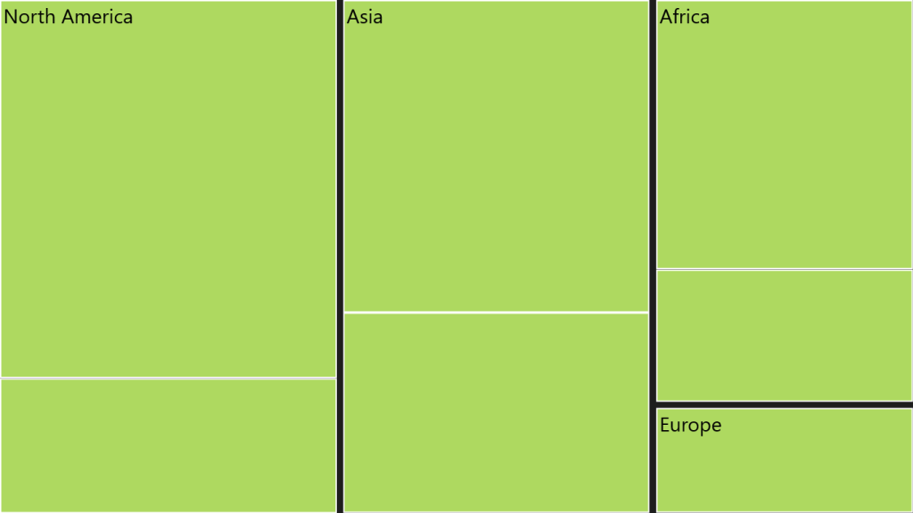

# Headers and Labels in WPF TreeMap (SfTreeMap)

## Headers

To show headers in the TreeMap, you can set the HeaderHeight property of the TreeMapLevel. For customizing the default Header appearance, you can specify the HeaderTemplate.

### TreeMap with Flat Collection

If the HeaderTemplate is specified for the TreeMapLevel, then the header can be bound by referring the Header object to the data template.



<Grid Background="Black">
    <Grid.DataContext>
        <local:PopulationViewModel />
    </Grid.DataContext>

    <syncfusion:SfTreeMap ItemsSource="{Binding PopulationDetails}"
                          WeightValuePath="Population"
                          ColorValuePath="Growth">
        <syncfusion:SfTreeMap.Levels>
            <syncfusion:TreeMapFlatLevel GroupPath="Continent"
                                         GroupGap="10"
                                         HeaderHeight="50" />

            <syncfusion:TreeMapFlatLevel GroupPath="Country"
                                         GroupGap="5" />
        </syncfusion:SfTreeMap.Levels>
    </syncfusion:SfTreeMap>
</Grid>



### TreeMap with Hierarchical Collection

For the TreeMap with a Hierarchical Collection, the HeaderPath must be specified. The header can be bound by referring the `Data.<FieldName>` to the data template, where `FieldName` refers to the field of the object specified in the particular treemap level.



<Grid Background="Black">
    <Grid.Resources>
        <local:CountrySalesCollection x:Key="countrySalesCollection" />
    </Grid.Resources>

    <syncfusion:SfTreeMap
        ItemsSource="{Binding Source={StaticResource countrySalesCollection}}"
        WeightValuePath="Sales"
        ColorValuePath="Expense">
        <syncfusion:SfTreeMap.Levels>
            <syncfusion:TreeMapHierarchicalLevel
                ChildPath="RegionalSalesCollection"
                ChildGap="10"
                HeaderHeight="25"
                HeaderPath="Name" />
        </syncfusion:SfTreeMap.Levels>
    </syncfusion:SfTreeMap>
</Grid>



## Labels

To show labels in the TreeMap, the ShowLabels of the TreeMapLevel should be enabled to True. For customizing the default label appearance, you can specify the LabelTemplate.

### TreeMap with Flat Collection

If the LabelTemplate is specified for the TreeMapLevel, then the label can be bound by referring the Label object to the data template.



<Grid Background="Black">
    <Grid.DataContext>
        <local:PopulationViewModel />
    </Grid.DataContext>

    <syncfusion:SfTreeMap ItemsSource="{Binding PopulationDetails}"
                          WeightValuePath="Population"
                          ColorValuePath="Growth">
        <syncfusion:SfTreeMap.Levels>
            <syncfusion:TreeMapFlatLevel GroupPath="Continent"
                                         GroupGap="10"
                                         ShowLabels="True" />
        </syncfusion:SfTreeMap.Levels>
    </syncfusion:SfTreeMap>
</Grid>



### TreeMap with Hierarchical Collection

For the TreeMap with a Hierarchical Collection, the LabelPath must be specified. The label can be bound by referring the `Data.<FieldName>` to the data template, where `FieldName` refers to the field of the object specified in the particular treemap level.



<Grid Background="Black">
    <Grid.Resources>
        <local:CountrySalesCollection x:Key="countrySalesCollection" />
    </Grid.Resources>

    <syncfusion:SfTreeMap
        ItemsSource="{Binding Source={StaticResource countrySalesCollection}}"
        WeightValuePath="Sales"
        ColorValuePath="Expense">
        <syncfusion:SfTreeMap.Levels>
            <syncfusion:TreeMapHierarchicalLevel
                ChildPath="RegionalSalesCollection"
                ChildGap="10"
                ShowLabels="True"
                LabelPath="Name" />
        </syncfusion:SfTreeMap.Levels>
    </syncfusion:SfTreeMap>
</Grid>



