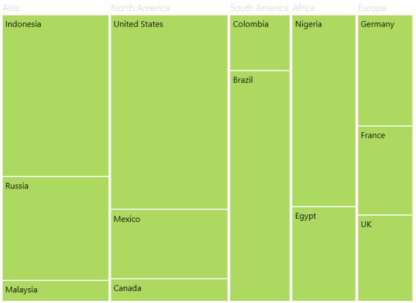

# LeafItemSettings in WPF TreeMap (SfTreeMap)

[LeafItemSettings](https://help.syncfusion.com/cr/wpf/Syncfusion.UI.Xaml.TreeMap.SfTreeMap.html#Syncfusion_UI_Xaml_TreeMap_SfTreeMap_LeafItemSettings) of [SfTreeMap](https://help.syncfusion.com/cr/wpf/Syncfusion.UI.Xaml.TreeMap.SfTreeMap.html) is a setting by which you can set the template for the leaf node.



<Grid Background="Black">
    <Grid.DataContext>
        <local:PopulationViewModel />
    </Grid.DataContext>

    <syncfusion:SfTreeMap Name="TreeMap"
                          ItemsSource="{Binding PopulationDetails}"
                          WeightValuePath="Population"
                          ColorValuePath="Growth"
                          ItemsLayoutMode="Squarified"
                          Margin="10">
        <syncfusion:SfTreeMap.LeafItemSettings>
            <syncfusion:LeafItemSettings />
        </syncfusion:SfTreeMap.LeafItemSettings>
    </syncfusion:SfTreeMap>
</Grid> 



N> The specified field must be available in each and every subclass (object) defined in the hierarchical (nested) data collection.

## LabelPath

[LabelPath](https://help.syncfusion.com/cr/wpf/Syncfusion.UI.Xaml.TreeMap.LeafItemSettings.html#Syncfusion_UI_Xaml_TreeMap_LeafItemSettings_LabelPath) of the leaves is the WeightValuePath by default, and you can change the LabelPath as desired based on the data provided.



<Grid Background="Black">
    <Grid.DataContext>
        <local:PopulationViewModel />
    </Grid.DataContext>

    <syncfusion:SfTreeMap Name="TreeMap"
                          ItemsSource="{Binding PopulationDetails}"
                          WeightValuePath="Population"
                          ColorValuePath="Growth"
                          ItemsLayoutMode="Squarified"
                          Margin="10">
        <syncfusion:SfTreeMap.LeafItemSettings>
            <syncfusion:LeafItemSettings LabelPath="Country" />
        </syncfusion:SfTreeMap.LeafItemSettings>
    </syncfusion:SfTreeMap>
</Grid>



## LabelTemplate

[LabelTemplate](https://help.syncfusion.com/cr/wpf/Syncfusion.UI.Xaml.TreeMap.LeafItemSettings.html#Syncfusion_UI_Xaml_TreeMap_LeafItemSettings_LabelTemplate) of the LeafItemSettings class provides the template for the labels of the leaf nodes.



<Grid Background="Black">
    <Grid.DataContext>
        <local:PopulationViewModel />
    </Grid.DataContext>

    <syncfusion:SfTreeMap Name="TreeMap"
                          ItemsSource="{Binding PopulationDetails}"
                          WeightValuePath="Population"
                          ColorValuePath="Growth"
                          ItemsLayoutMode="Squarified"
                          Margin="10">
        <syncfusion:SfTreeMap.LeafItemSettings>
            <syncfusion:LeafItemSettings>
                <syncfusion:LeafItemSettings.LabelTemplate>
                    <DataTemplate>
                        <TextBlock Text="{Binding Data.Country}"
                                   Margin="5,5,0,0"
                                   HorizontalAlignment="Left"
                                   VerticalAlignment="Top"
                                   FontSize="16"
                                   FontWeight="Normal"
                                   Foreground="White" />
                    </DataTemplate>
                </syncfusion:LeafItemSettings.LabelTemplate>
            </syncfusion:LeafItemSettings>
        </syncfusion:SfTreeMap.LeafItemSettings>
    </syncfusion:SfTreeMap>
</Grid>



## Gap

[Gap](https://help.syncfusion.com/cr/wpf/Syncfusion.UI.Xaml.TreeMap.LeafItemSettings.html#Syncfusion_UI_Xaml_TreeMap_LeafItemSettings_Gap) provides the gap between the leaves at the leaf level.



<Grid Background="Black">
    <Grid.DataContext>
        <local:PopulationViewModel />
    </Grid.DataContext>

    <syncfusion:SfTreeMap Name="TreeMap"
                          ItemsSource="{Binding PopulationDetails}"
                          WeightValuePath="Population"
                          ColorValuePath="Growth"
                          ItemsLayoutMode="Squarified"
                          Margin="10">
        <syncfusion:SfTreeMap.LeafItemSettings>
            <syncfusion:LeafItemSettings Gap="5" />
        </syncfusion:SfTreeMap.LeafItemSettings>
    </syncfusion:SfTreeMap>
</Grid>



## BorderBrush

[BorderBrush](https://help.syncfusion.com/cr/wpf/Syncfusion.UI.Xaml.TreeMap.LeafItemSettings.html#Syncfusion_UI_Xaml_TreeMap_LeafItemSettings_BorderBrush) provides the border color for the leaf nodes, and the BorderThickness provides the thickness of the BorderBrush.



<Grid Background="Black">
    <Grid.DataContext>
        <local:PopulationViewModel />
    </Grid.DataContext>

    <syncfusion:SfTreeMap Name="TreeMap"
                          ItemsSource="{Binding PopulationDetails}"
                          WeightValuePath="Population"
                          ColorValuePath="Growth"
                          ItemsLayoutMode="Squarified"
                          Margin="10">
        <syncfusion:SfTreeMap.LeafItemSettings>
            <syncfusion:LeafItemSettings BorderBrush="Red"
                                         BorderThickness="3" />
        </syncfusion:SfTreeMap.LeafItemSettings>
    </syncfusion:SfTreeMap>
</Grid>



