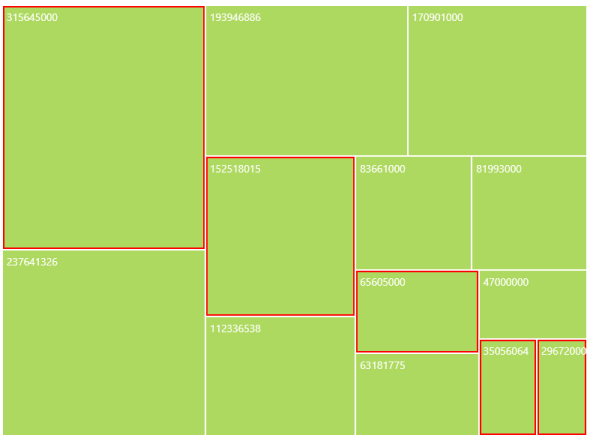
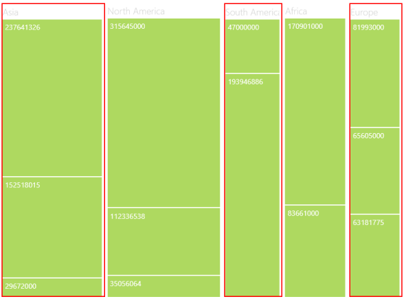

# Selection Support in WPF TreeMap (SfTreeMap)

While selecting a leaf node, you can highlight it by setting HighlightOnSelection property of [SfTreeMap](https://help.syncfusion.com/cr/wpf/Syncfusion.UI.Xaml.TreeMap.SfTreeMap.html) to “True”. The border of highlight on selection can be customized by HighlightBorderBrush and HighlightBorderThickness properties of SfTreeMap. SelectionMode can also be set to either “Default” or “Multiple”. “Multiple” selection of leaf nodes is made possible by pressing the control key continuously while Mouse Click happens.



<syncfusion:SfTreeMap Name="TreeMap"
                      ItemsSource="{Binding PopulationDetails}"
                      WeightValuePath="Population"
                      ColorValuePath="Growth"
                      HighlightOnSelection="True"
                      HighlightBorderBrush="Red"
                      HighlightBorderThickness="4"
                      HighlightHoverBrush="Yellow"
                      SelectionModes="Multiple">
</syncfusion:SfTreeMap>



GroupSelection support is also provided under selection support where the whole group can be selected. While selecting a leaf node, you can highlight it by setting [HighlightGroupOnSelection](https://help.syncfusion.com/cr/wpf/Syncfusion.UI.Xaml.TreeMap.SfTreeMap.html#Syncfusion_UI_Xaml_TreeMap_SfTreeMap_HighlightGroupOnSelection) property of SfTreeMap to “True”. The helper properties, [HighlightBorderBrush](https://help.syncfusion.com/cr/wpf/Syncfusion.UI.Xaml.TreeMap.SfTreeMap.html#Syncfusion_UI_Xaml_TreeMap_SfTreeMap_HighlightBorderBrush), [HighlightBorderThickness](https://help.syncfusion.com/cr/wpf/Syncfusion.UI.Xaml.TreeMap.SfTreeMap.html#Syncfusion_UI_Xaml_TreeMap_SfTreeMap_HighlightBorderThickness), and [SelectionModes](https://help.syncfusion.com/cr/wpf/Syncfusion.UI.Xaml.TreeMap.SfTreeMap.html#Syncfusion_UI_Xaml_TreeMap_SfTreeMap_SelectionModes) are shared for both [HighlightOnSelection](https://help.syncfusion.com/cr/wpf/Syncfusion.UI.Xaml.TreeMap.SfTreeMap.html#Syncfusion_UI_Xaml_TreeMap_SfTreeMap_HighlightOnSelection) and [HighlightGroupOnSelection](https://help.syncfusion.com/cr/wpf/Syncfusion.UI.Xaml.TreeMap.SfTreeMap.html#Syncfusion_UI_Xaml_TreeMap_SfTreeMap_HighlightGroupOnSelection).



<syncfusion:SfTreeMap Name="TreeMap"
                      ItemsSource="{Binding PopulationDetails}"
                      WeightValuePath="Population"
                      ColorValuePath="Growth"
                      HighlightGroupOnSelection="True"
                      HighlightBorderBrush="Red"
                      HighlightBorderThickness="4"
                      SelectionModes="Multiple">
</syncfusion:SfTreeMap>



## see also

[How to highlight group selection](https://www.syncfusion.com/kb/7654/how-to-highlight-group-selection) 
