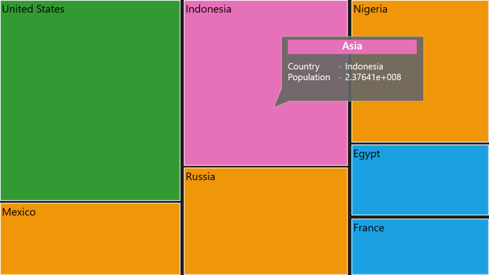

# ToolTip Support in WPF TreeMap (SfTreeMap)

You can enable tooltip for TreeMap by setting [`ShowToolTip`](https://help.syncfusion.com/cr/wpf/Syncfusion.UI.Xaml.TreeMap.SfTreeMap.html#Syncfusion_UI_Xaml_TreeMap_SfTreeMap_ShowToolTip) to “True”. For modifying default appearance of tooltip, [`ToolTipTemplate`](https://help.syncfusion.com/cr/wpf/Syncfusion.UI.Xaml.TreeMap.SfTreeMap.html#Syncfusion_UI_Xaml_TreeMap_SfTreeMap_ToolTipTemplate) can be specified and also you can set the [`ToolTipShowDuration`](https://help.syncfusion.com/cr/wpf/Syncfusion.UI.Xaml.TreeMap.SfTreeMap.html#Syncfusion_UI_Xaml_TreeMap_SfTreeMap_ToolTipShowDuration) property to define the animation speed.



<syncfusion:SfTreeMap ItemsSource="{Binding PopulationDetails}" 

                      WeightValuePath="Population" ColorValuePath="Growth"

                      ShowToolTip="True">

    <syncfusion:SfTreeMap.ToolTipTemplate>

        <DataTemplate>

            <Grid Height="200" Width="420" Margin="0,-420,0,0">

                <Path Data="M0,0 L360,0 L360,200 L20,200 L-20,220 L0,160 L0,0 z" Fill="#666666" Stroke="Wheat" Opacity="0.9" Stretch="Fill"/>

                <StackPanel>

                  <Grid Background="{Binding MappedColor}" Margin="40 10 20 0" Height="40">

                  <TextBlock Text="{Binding Data.Continent}" Foreground= "White" FontWeight="SemiBold" FontSize="30" TextAlignment="Center"/>

                  </Grid>

                  <StackPanel Margin="40 20">

                  <StackPanel Orientation="Horizontal">

                  <TextBlock Text="Country" Width="140" FontSize="25"/>

                  <TextBlock Text="-" Width="20" FontSize="25"/>

                  <TextBlock Text="{Binding Data.Country}" FontSize="25"/>

                  </StackPanel>

                  <StackPanel Orientation="Horizontal">

                  <TextBlock Text="Population" Width="140" FontSize="25"/>

                  <TextBlock Text="-" Width="20" FontSize="25"/>

                  <TextBlock Text="{Binding Data.Population}" FontSize="25"/>

                  </StackPanel>

                  </StackPanel>

                </StackPanel>

            </Grid>

        </DataTemplate>

    </syncfusion:SfTreeMap.ToolTipTemplate>

    <syncfusion:SfTreeMap.LeafColorMapping>

        <syncfusion:RangeBrushColorMapping>

            <syncfusion:RangeBrushColorMapping.Brushes>

                <syncfusion:RangeBrush From="0" To="1" Color="#1BA1E2"/>

                <syncfusion:RangeBrush From="1" To="2" Color="#F09609"/>

                <syncfusion:RangeBrush From="2" To="3" Color="#E671B8"/>

                <syncfusion:RangeBrush From="3" To="4" Color="#339933"/>

            </syncfusion:RangeBrushColorMapping.Brushes>

        </syncfusion:RangeBrushColorMapping>

    </syncfusion:SfTreeMap.LeafColorMapping>

    <syncfusion:SfTreeMap.Levels>

        <syncfusion:TreeMapFlatLevel GroupPath="Continent" GroupGap="10"/>

        <syncfusion:TreeMapFlatLevel GroupPath="Country" GroupGap="5" ShowLabels="True"/>

    </syncfusion:SfTreeMap.Levels>

</syncfusion:SfTreeMap>



The following screenshot shows a tree map with a tool tip.

