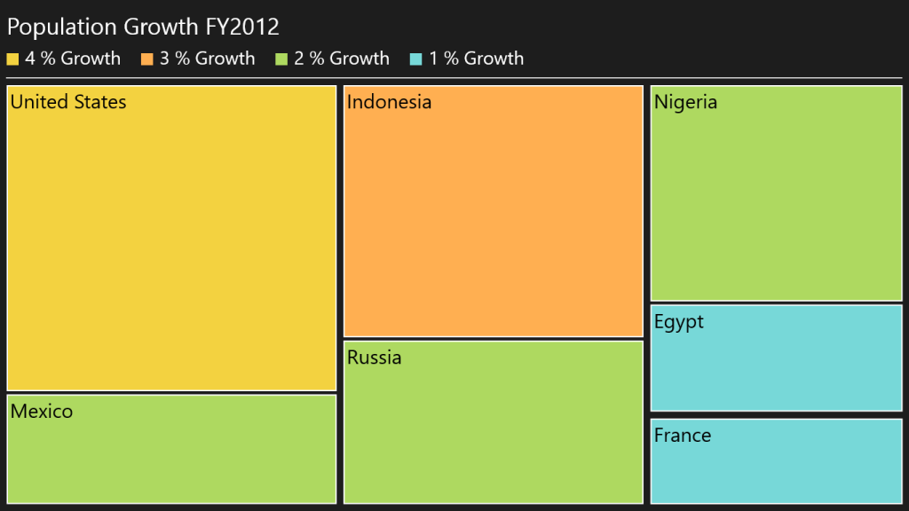

# TreeMap Legend in WPF TreeMap (SfTreeMap)

TreeMap [legend](https://help.syncfusion.com/cr/wpf/Syncfusion.UI.Xaml.TreeMap.SfTreeMap.html#Syncfusion_UI_Xaml_TreeMap_SfTreeMap_Legend) is used to easily demonstrate about the color value of leaf nodes. But this legend could be appropriate only for the treemap having leaf nodes colored by using RangeBrushColorMapping. The labels of the legend item can be customized by specifying LegendLabel of RangeBrush mentioned in the Brushes of RangeBrushColorMapping.

The icon of legend item can be set by LegendIconStyle of TreeMapLegend. Custom legend icon can be set by assigning DataTemplate to LegendIconTemplate with LegendIconStyle as “Custom”. The width and height of the legend icon can be modified by setting LegendIconWidth and LegendIconHeight of TreeMapLegend.

The legend can be positioned to Left, Right, Top or Bottom of TreeMap with the help of LegendPosition property.



<syncfusion:SfTreeMap Name="TreeMap"
                      ItemsSource="{Binding PopulationDetails}"
                      WeightValuePath="Population"
                      ColorValuePath="Growth"
                      Margin="10">
    <syncfusion:SfTreeMap.Legend>
        <syncfusion:TreeMapLegend
            Width="{Binding ActualWidth, ElementName=TreeMap}"
            Margin="0,5"
            HorizontalAlignment="Left"
            BorderBrush="#CCCCCC"
            BorderThickness="0,0,0,2"
            FontSize="25"
            LegendIconStyle="Rectangle"
            LegendIconHeight="18"
            LegendIconWidth="18"
            LegendItemMargin="0,0,20,10"
            LegendItemElementMargin="0,0,10,0">
            <syncfusion:TreeMapLegend.Header>
                <TextBlock Text="Population Growth FY2012"
                           Margin="0,0,0,10"
                           FontSize="35" />
            </syncfusion:TreeMapLegend.Header>
        </syncfusion:TreeMapLegend>
    </syncfusion:SfTreeMap.Legend>

    <syncfusion:SfTreeMap.LeafColorMapping>
        <syncfusion:RangeBrushColorMapping>
            <syncfusion:RangeBrushColorMapping.Brushes>
                <syncfusion:RangeBrush Color="#77D8D8"
                                       From="0"
                                       To="1"
                                       LegendLabel="1 % Growth" />

                <syncfusion:RangeBrush Color="#AED960"
                                       From="1"
                                       To="2"
                                       LegendLabel="2 % Growth" />

                <syncfusion:RangeBrush Color="#FFAF51"
                                       From="2"
                                       To="3"
                                       LegendLabel="3 % Growth" />

                <syncfusion:RangeBrush Color="#F3D240"
                                       From="3"
                                       To="4"
                                       LegendLabel="4 % Growth" />
            </syncfusion:RangeBrushColorMapping.Brushes>
        </syncfusion:RangeBrushColorMapping>
    </syncfusion:SfTreeMap.LeafColorMapping>

    <syncfusion:SfTreeMap.Levels>
        <syncfusion:TreeMapFlatLevel GroupPath="Continent"
                                     GroupGap="10" />

        <syncfusion:TreeMapFlatLevel GroupPath="Country"
                                     GroupGap="5"
                                     ShowLabels="True" />
    </syncfusion:SfTreeMap.Levels>
</syncfusion:SfTreeMap>


