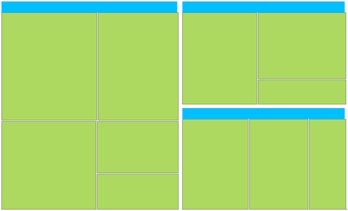

# TreeMap Levels in WPF TreeMap (SfTreeMap)

The levels of TreeMap can be categorized into two types such as,

* TreeMapFlatLevel
* TreeMapHierarchicalLevel

## TreeMapFlatLevel

TreeMapFlatLevel is used to define levels for flat data collection. 

###ItemsSource:

The ItemsSource set for SfTreeMap must be a flat collection of data. The following code shows how to bind a flat collection as ItemsSource to a TreeMap.




    <Grid Background="Black">

        <Grid.DataContext>

            <local:PopulationViewModel/>

        </Grid.DataContext>

        <syncfusion:SfTreeMap ItemsSource="{Binding PopulationDetails}"

                              WeightValuePath="Population"

                              ColorValuePath="Growth"/>

    </Grid>




    public class PopulationViewModel

    {

        public PopulationViewModel()

        {

            this.PopulationDetails = new

                                    ObservableCollection<PopulationDetail>();

PopulationDetails.Add(new PopulationDetail() { Continent = "Asia", Country = "Indonesia", Growth = 3, Population = 237641326 });

PopulationDetails.Add(new PopulationDetail() { Continent = "Asia", Country = "Russia", Growth = 2, Population = 152518015 });

PopulationDetails.Add(new PopulationDetail() { Continent = "North America", Country = "United States", Growth = 4, Population = 315645000 });

PopulationDetails.Add(new PopulationDetail() { Continent = "North America", Country = "Mexico", Growth = 2, Population = 112336538 });

      PopulationDetails.Add(new PopulationDetail() { Continent = "Africa", Country = "Nigeria", Growth = 2, Population = 170901000 });            

      PopulationDetails.Add(new PopulationDetail() { Continent = "Africa", Country = "Egypt", Growth = 1, Population = 83661000 });

      PopulationDetails.Add(new PopulationDetail() { Continent = "Europe", Country = "Germany", Growth = 1, Population = 81993000 });

      PopulationDetails.Add(new PopulationDetail() { Continent = "Europe", Country = "France", Growth = 1, Population = 65605000 });

        PopulationDetails.Add(new PopulationDetail() { Continent = "Europe", Country = "UK", Growth = 1, Population = 63181775 });

        }

        public ObservableCollection<PopulationDetail> PopulationDetails

        {

            get;

            set;

        }

        public class PopulationDetail

        {

            public string Continent { get; set; }

            public string Country { get; set; }

            public double Growth { get; set; }

            public double Population { get; set; }

        }        

    }



### GroupPath:

You must specify the GroupPath for each and every flat level of TreeMap. It is a path to a field on the source object, which serves as the “Group” for the levels specified. Based upon the GroupPath, the data is grouped in the TreeMap. If GroupPath is not specified, then the items are not grouped, and it is shown in the order, in which they are specified in the ItemsSource.



<Grid Background="Black">

    <Grid.DataContext>

        <local:PopulationViewModel/>

    </Grid.DataContext>

    <syncfusion:SfTreeMap ItemsSource="{Binding PopulationDetails}"

                          WeightValuePath="Population"                              

                          ColorValuePath="Growth">

        <syncfusion:SfTreeMap.Levels>

                <syncfusion:TreeMapFlatLevel GroupPath="Continent” HeaderHeight="30">

                    <syncfusion:TreeMapFlatLevel.HeaderTemplate>

                        <DataTemplate>

                            <TextBlock Text="{Binding Header}" Foreground="#D6D6D6" FontSize="18" FontWeight="Light" HorizontalAlignment="Left" VerticalAlignment="Center"/>

                        </DataTemplate>

                    </syncfusion:TreeMapFlatLevel.HeaderTemplate>

                </syncfusion:TreeMapFlatLevel>

            </syncfusion:SfTreeMap.Levels>

        </syncfusion:SfTreeMap>

    </Grid>



### GroupGap: 

You can specify GroupGap for separating the items of every flat level and it is used to differentiate the levels mentioned for TreeMap.



<Grid Background="Black">

    <Grid.DataContext>

        <local:PopulationViewModel/>

    </Grid.DataContext>

    <syncfusion:SfTreeMap ItemsSource="{Binding PopulationDetails}"

                          WeightValuePath="Population"                              

                          ColorValuePath="Growth">

<syncfusion:SfTreeMap.Levels>

                <syncfusion:TreeMapFlatLevel GroupPath="Continent" GroupGap="5" HeaderHeight="30">

                </syncfusion:TreeMapFlatLevel>

            </syncfusion:SfTreeMap.Levels>

        </syncfusion:SfTreeMap>

    </Grid>


### GroupBorderBrush

GroupBorderBrush provides the border color for the group levels.



    <Grid Background="Black">

        <Grid.Resources>

            <local:CountrySalesCollection x:Key="countrySalesCollection"/>

        </Grid.Resources>

        <syncfusion:SfTreeMap ItemsSource="{Binding Source={StaticResource 

                                                    countrySalesCollection}}"

                              WeightValuePath="Sales"                              

                              ColorValuePath="Expense">

            <syncfusion:SfTreeMap.Levels>

                 <syncfusion:TreeMapFlatLevel GroupBorderBrush="Red" GroupPath="Continent" GroupBorderThickness="3">

                </syncfusion:TreeMapFlatLevel>

                           </syncfusion:SfTreeMap.Levels>

        </syncfusion:SfTreeMap>

    </Grid>


### GroupBackground

GroupBackground specifies the background brush for the levels. The GroupBackground is effectively seen when we provide GroupPadding also while defining the Levels.



    <Grid Background="Black">

        <Grid.Resources>

            <local:CountrySalesCollection x:Key="countrySalesCollection"/>

        </Grid.Resources>

        <syncfusion:SfTreeMap ItemsSource="{Binding Source={StaticResource 

                                                    countrySalesCollection}}"

                              WeightValuePath="Sales"                              

                              ColorValuePath="Expense">

            <syncfusion:SfTreeMap.Levels>

                  <syncfusion:TreeMapFlatLevel GroupPadding="5" GroupPath="Continent" GroupBackground="Red">                                      

                </syncfusion:TreeMapFlatLevel>

             </syncfusion:SfTreeMap.Levels>

        </syncfusion:SfTreeMap>

    </Grid>


## TreeMapHierarchicalLevel:

TreeMapHierarchicalLevel is used to define levels for hierarchical data collection which contains tree-structured data. 

### ItemsSource:

The ItemsSource set for TreeMap must be a nested data collection. The following code shows how to bind a hierarchical data collection as ItemsSource for TreeMap.





    <Grid Background="Black">

        <Grid.Resources>

            <local:CountrySalesCollection x:Key="countrySalesCollection"/>

        </Grid.Resources>

        <syncfusion:SfTreeMap ItemsSource="{Binding Source={StaticResource 

                                                    countrySalesCollection}}"

                              WeightValuePath="Sales"                              

                              ColorValuePath="Expense">

            <syncfusion:SfTreeMap.Levels>

                <syncfusion:TreeMapHierarchicalLevel/>

            </syncfusion:SfTreeMap.Levels>

        </syncfusion:SfTreeMap>

    </Grid>




    public class CountrySalesCollection : ObservableCollection<CountrySale>

    {

        public CountrySalesCollection()

        {

            this.Add(new CountrySale() { Name = "United States", Sales = 98456, Expense = 87000 });

            this.Add(new CountrySale() { Name = "Canada", Sales = 43523, Expense = 40000 });

            this.Add(new CountrySale() { Name = "Mexico", Sales = 45634, Expense = 46000 });

            this[0].RegionalSalesCollection.Add(new RegionSale() { Country = "United States", Name = "New York", Sales = 2353, Expense = 2000 });

            this[0].RegionalSalesCollection.Add(new RegionSale() { Country = "United States", Name = "Los Angeles", Sales = 3453, Expense = 3000 });

            this[0].RegionalSalesCollection.Add(new RegionSale() { Country = "United States", Name = "San Francisco", Sales = 8456, Expense = 8000 });

            this[0].RegionalSalesCollection.Add(new RegionSale() { Country = "United States", Name = "Chicago", Sales = 6785, Expense = 7000 });

            this[0].RegionalSalesCollection.Add(new RegionSale() { Country = "United States", Name = "Miami", Sales = 7045, Expense = 6000 });            

            this[1].RegionalSalesCollection.Add(new RegionSale() { Country = "Canada", Name = "Toronto", Sales = 7045, Expense = 7000 });

            this[1].RegionalSalesCollection.Add(new RegionSale() { Country = "Canada", Name = "Vancouver", Sales = 4352, Expense = 4000 });

            this[1].RegionalSalesCollection.Add(new RegionSale() { Country = "Canada", Name = "Winnipeg", Sales = 7843, Expense = 7500 });

            this[2].RegionalSalesCollection.Add(new RegionSale() { Country = "Mexico", Name = "Mexico City", Sales = 7843, Expense = 6500 });

            this[2].RegionalSalesCollection.Add(new RegionSale() { Country = "Mexico", Name = "Cancun", Sales = 6683, Expense = 6000 });        }

    }

    public class CountrySale : INotifyPropertyChanged

    {

        public string Name { get; set; }

        private double _sales = 0;

        public double Sales

        {

            get { return _sales; }

            set

            {

                if (_sales != value)

                {

                    _sales = value;

                    this.OnPropertyChanged(new  

                         PropertyChangedEventArgs("Sales"));

                }

            }

        }

        private double _expense = 0;

        public double Expense

        {

            get { return _expense; }

            set

            {

                if (_expense != value)

                {

                    _expense = value;

                    this.OnPropertyChanged(new  

                         PropertyChangedEventArgs("Expense"));

                }

            }

        }

        public ObservableCollection<RegionSale> RegionalSalesCollection 

        { get; set; }

        public CountrySale()

        {

            this.RegionalSalesCollection = new ObservableCollection<RegionSale>();

        }

        #region INotifyPropertyChanged Members

        public event PropertyChangedEventHandler PropertyChanged;

        protected void OnPropertyChanged(PropertyChangedEventArgs e)

        {

            if (this.PropertyChanged != null)

                this.PropertyChanged.Invoke(this, e);

        }

        #endregion

    }

    public class RegionSale : INotifyPropertyChanged

    {

        public string Name { get; set; }

        public string Country { get; set; }

        private double _sales = 0;

        public double Sales

        {

            get { return _sales; }

            set

            {

                if (_sales != value)

                {

                    _sales = value;

                    this.OnPropertyChanged(new  

                         PropertyChangedEventArgs("Sales"));

                }

            }

        }

        private double _expense = 0;

        public double Expense

        {

            get { return _expense; }

            set

            {

                if (_expense != value)

                {

                    _expense = value;

                    this.OnPropertyChanged(new  

                         PropertyChangedEventArgs("Expense"));

                }

            }

        }

        #region INotifyPropertyChanged Members

        public event PropertyChangedEventHandler PropertyChanged;

        protected void OnPropertyChanged(PropertyChangedEventArgs e)

        {

            if (this.PropertyChanged != null)

                this.PropertyChanged.Invoke(this, e);

        }

        #endregion

    }




### ChildPath:

You must specify ChildPath for each and every hierarchical level of TreeMap. It is a path to a field on the source object, which serves as the “Child” for the level specified. Based upon the ChildPath, the treemap contains child items.



    <Grid Background="Black">

        <Grid.Resources>

            <local:CountrySalesCollection x:Key="countrySalesCollection"/>

        </Grid.Resources>

        <syncfusion:SfTreeMap ItemsSource="{Binding Source={StaticResource 

                                                    countrySalesCollection}}"

                              WeightValuePath="Sales"                              

                              ColorValuePath="Expense">

            <syncfusion:SfTreeMap.Levels>

                <syncfusion:TreeMapHierarchicalLevel

                              ChildPath="RegionalSalesCollection">

                     </syncfusion:TreeMapHierarchicalLevel>

            </syncfusion:SfTreeMap.Levels>

        </syncfusion:SfTreeMap>

    </Grid>


N> The specified field must be a collection of sub class (object) specified in the nested data collection.

### ChildGap: 

You can specify ChildGap for separating the child items of every level and it is used to differentiate the levels mentioned for TreeMap.



    <Grid Background="Black">

        <Grid.Resources>

            <local:CountrySalesCollection x:Key="countrySalesCollection"/>

        </Grid.Resources>

        <syncfusion:SfTreeMap ItemsSource="{Binding Source={StaticResource 

                                                    countrySalesCollection}}"

                              WeightValuePath="Sales"                              

                              ColorValuePath="Expense">

            <syncfusion:SfTreeMap.Levels>

                <syncfusion:TreeMapHierarchicalLevel ChildGap="10"

                              ChildPath="RegionalSalesCollection">

                     </syncfusion:TreeMapHierarchicalLevel>

            </syncfusion:SfTreeMap.Levels>

        </syncfusion:SfTreeMap>

    </Grid>


