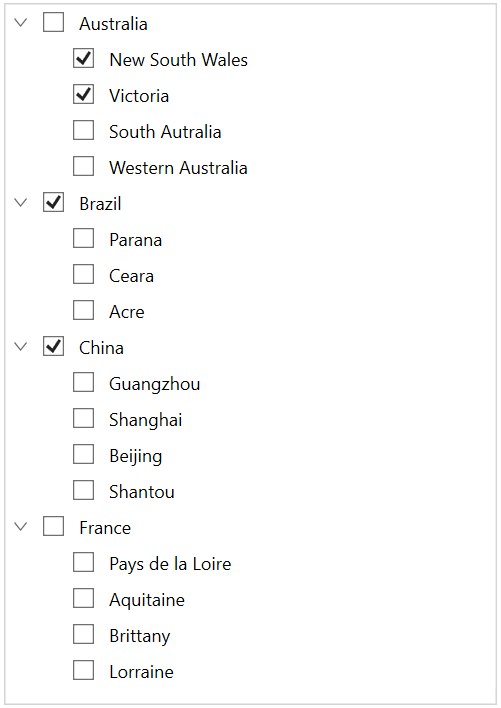
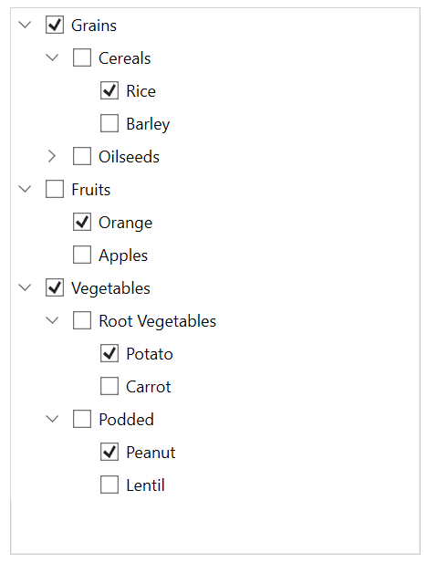

# Checkbox in WPF TreeView (SfTreeView)

SfTreeView provides support for loading `CheckBox` in each node, and allows users to check/uncheck the corresponding node. So, you should add checkbox in the [ItemTemplate](https://help.syncfusion.com/cr/wpf/Syncfusion.UI.Xaml.TreeView.SfTreeView.html#Syncfusion_UI_Xaml_TreeView_SfTreeView_ItemTemplate) of the `SfTreeView` and bind the [IsChecked](https://help.syncfusion.com/cr/wpf/Syncfusion.UI.Xaml.TreeView.Engine.TreeViewNode.html#Syncfusion_UI_Xaml_TreeView_Engine_TreeViewNode_IsChecked) property of the [TreeViewNode](https://help.syncfusion.com/cr/wpf/Syncfusion.UI.Xaml.TreeView.Engine.TreeViewNode.html).

## Working with Checkbox in BoundMode

When you are populating treeview nodes from [ItemsSource](https://help.syncfusion.com/cr/wpf/Syncfusion.UI.Xaml.TreeView.SfTreeView.html#Syncfusion_UI_Xaml_TreeView_SfTreeView_ItemsSource), then you can get or set the checked items by using [CheckedItems](https://help.syncfusion.com/cr/wpf/Syncfusion.UI.Xaml.TreeView.SfTreeView.html#Syncfusion_UI_Xaml_TreeView_SfTreeView_CheckedItems) property.

SfTreeView supports to check multiple items through binding the [CheckedItems](https://help.syncfusion.com/cr/wpf/Syncfusion.UI.Xaml.TreeView.SfTreeView.html#Syncfusion_UI_Xaml_TreeView_SfTreeView_CheckedItems) property from view model with `ObservableCollection<object>` type.

N> Set [ItemTemplateDataContextType](https://help.syncfusion.com/cr/wpf/Syncfusion.UI.Xaml.TreeView.SfTreeView.html#Syncfusion_UI_Xaml_TreeView_SfTreeView_ItemTemplateDataContextType) as `Node` to bind the `TreeViewNode.IsChecked` property to `CheckBox` in `ItemTemplate`.

N> TreeView process and sets [TreeViewNode.IsChecked](https://help.syncfusion.com/cr/wpf/Syncfusion.UI.Xaml.TreeView.Engine.TreeViewNode.html#Syncfusion_UI_Xaml_TreeView_Engine_TreeViewNode_IsChecked) based on `CheckedItems` only when you are binding `ItemsSource`.



<syncfusion:SfTreeView 
            x:Name="sfTreeView"
            Margin="10"
            BorderThickness="1"
            AutoExpandMode="AllNodes"
            BorderBrush="LightGray"
            AllowDragging="True"
            SelectionMode="Multiple"
            CheckBoxMode ="Recursive"
            CheckedItems="{Binding CheckedStates}"
            ChildPropertyName="Models"
            ExpandActionTrigger="Node"
            ItemTemplateDataContextType="Node"
            FocusVisualStyle="{x:Null}"
            IsAnimationEnabled="True"                     
            ItemsSource="{Binding Items}">            
<syncfusion:SfTreeView.ItemTemplate>
        <DataTemplate>
            <Grid>                        
                <CheckBox x:Name="CheckBox" FocusVisualStyle="{x:Null}"
                                    IsChecked="{Binding IsChecked, Mode=TwoWay}"/>
                <TextBlock FontSize="12" VerticalAlignment="Center" Text="{Binding Content.State}" Margin="25,0,0,0"/>
            </Grid>
        </DataTemplate>
    </syncfusion:SfTreeView.ItemTemplate>
</syncfusion:SfTreeView>



public class ViewModel : NotificationObject
{
    public ObservableCollection<Model> Items { get; set; }

    private ObservableCollection<object> checkedStates;

    public ObservableCollection<object> CheckedStates
    {
        get { return checkedStates; }
        set { checkedStates = value; }
    }

    public ViewModel()
    {
        Items = new ObservableCollection<Model>();
        checkedStates = new ObservableCollection<object>();
                 
        var country1 = new Model { State = "Australia" };
        var country2 = new Model { State = "Brazil" };
        var country3 = new Model { State = "China" };
        var country4 = new Model { State = "France" };

        var aus_state1 = new Model { State = "New South Wales" };
        var aus_state2 = new Model { State = "Victoria" };
        var aus_state3 = new Model { State = "South Autralia" };
        var aus_state4 = new Model { State = "Western Australia" };

        var brazil_state1 = new Model { State = "Parana" };
        var brazil_state2 = new Model { State = "Ceara" };
        var brazil_state3 = new Model { State = "Acre" };

        var china_state1 = new Model { State = "Guangzhou" };
        var china_state2 = new Model { State = "Shanghai" };
        var china_state3 = new Model { State = "Beijing" };
        var china_state4 = new Model { State = "Shantou" };

        var france_state1 = new Model { State = "Pays de la Loire" };
        var france_state2 = new Model { State = "Aquitaine" };
        var france_state3 = new Model { State = "Brittany" };
        var france_state4 = new Model { State = "Lorraine" };

        country1.Models.Add(aus_state1);
        country1.Models.Add(aus_state2);
        country1.Models.Add(aus_state3);
        country1.Models.Add(aus_state4);

        country2.Models.Add(brazil_state1);
        country2.Models.Add(brazil_state2);
        country2.Models.Add(brazil_state3);

        country3.Models.Add(china_state1);
        country3.Models.Add(china_state2);
        country3.Models.Add(china_state3);
        country3.Models.Add(china_state4);

        country4.Models.Add(france_state1);
        country4.Models.Add(france_state2);
        country4.Models.Add(france_state3);
        country4.Models.Add(france_state4);

        Items.Add(country1);
        Items.Add(country2);
        Items.Add(country3);
        Items.Add(country4);

        checkedStates.Add(aus_state1);
        checkedStates.Add(aus_state2);
        checkedStates.Add(country2);
        checkedStates.Add(country3);
    }
}



N> View sample in [GitHub](https://github.com/SyncfusionExamples/How-to-work-with-check-boxes-in-bound-mode-in-wpf-treeview)

## Working with Checkbox in UnboundMode

You can directly set the checkbox state by setting the [TreeViewNode.IsChecked](https://help.syncfusion.com/cr/wpf/Syncfusion.UI.Xaml.TreeView.Engine.TreeViewNode.html#Syncfusion_UI_Xaml_TreeView_Engine_TreeViewNode_IsChecked) property value while creating nodes.



<Window 
    x:Class="TreeNodeWithCheckBoxDemo.Window1"
    xmlns="http://schemas.microsoft.com/winfx/2006/xaml/presentation"
    xmlns:x="http://schemas.microsoft.com/winfx/2006/xaml"
    xmlns:local="clr-namespace:TreeNodeWithCheckBoxDemo"
    xmlns:syncfusion="http://schemas.syncfusion.com/wpf"
    xmlns:Engine="clr-namespace:Syncfusion.UI.Xaml.TreeView.Engine;assembly=Syncfusion.SfTreeView.WPF"
    Title="Node With CheckBox"
    Width="450"
    Height="500"
    Icon="App.ico"
    WindowStartupLocation="CenterScreen">
    <Grid>
        <syncfusion:SfTreeView x:Name="sfTreeView"
                                Width="400"
                                Margin="10,10,10,10"
                                BorderThickness="1"
                                BorderBrush="LightGray"
                                IsAnimationEnabled="True"
                                ItemTemplateDataContextType="Node" 
                                CheckBoxMode="Recursive" >
            <syncfusion:SfTreeView.Nodes>
                <Engine:TreeViewNode Content="Grains" IsExpanded="True" IsChecked="True">
                    <Engine:TreeViewNode.ChildNodes>
                        <Engine:TreeViewNode Content="Cereals" IsExpanded="True">
                            <Engine:TreeViewNode.ChildNodes>
                                <Engine:TreeViewNode Content="Rice" IsChecked="True"/>
                                <Engine:TreeViewNode Content="Barley"/>
                            </Engine:TreeViewNode.ChildNodes>
                        </Engine:TreeViewNode>
                        <Engine:TreeViewNode Content="Oilseeds">
                            <Engine:TreeViewNode.ChildNodes>
                                <Engine:TreeViewNode Content="Safflower" IsChecked="True"/>
                            </Engine:TreeViewNode.ChildNodes>
                        </Engine:TreeViewNode>
                    </Engine:TreeViewNode.ChildNodes>
                </Engine:TreeViewNode>
                <Engine:TreeViewNode Content="Fruits" IsExpanded="true">
                    <Engine:TreeViewNode.ChildNodes>
                        <Engine:TreeViewNode Content="Orange" IsChecked="True"/>
                        <Engine:TreeViewNode Content="Apples" IsExpanded="true"/>
                    </Engine:TreeViewNode.ChildNodes>
                </Engine:TreeViewNode>
                <Engine:TreeViewNode Content="Vegetables" IsExpanded="true" IsChecked="True">
                    <Engine:TreeViewNode.ChildNodes>
                        <Engine:TreeViewNode Content="Root Vegetables" IsExpanded="true">
                            <Engine:TreeViewNode.ChildNodes>
                                <Engine:TreeViewNode Content="Potato" IsChecked="True"/>
                                <Engine:TreeViewNode Content="Carrot"/>
                            </Engine:TreeViewNode.ChildNodes>
                        </Engine:TreeViewNode>
                        <Engine:TreeViewNode Content="Podded">
                            <Engine:TreeViewNode.ChildNodes>
                                <Engine:TreeViewNode Content="Peanut" IsChecked="True"/>
                                <Engine:TreeViewNode Content="Lentil"/>
                            </Engine:TreeViewNode.ChildNodes>
                        </Engine:TreeViewNode>
                    </Engine:TreeViewNode.ChildNodes>
                </Engine:TreeViewNode>
            </syncfusion:SfTreeView.Nodes>
            <syncfusion:SfTreeView.ItemTemplate>
                <DataTemplate>
                    <Grid>
                        <CheckBox x:Name="CheckBox" FocusVisualStyle="{x:Null}"
                                            IsChecked="{Binding IsChecked, Mode=TwoWay}" Content="{Binding Content}"/>

                    </Grid>
                </DataTemplate>
            </syncfusion:SfTreeView.ItemTemplate>
        </syncfusion:SfTreeView>
    </Grid>
</Window>




N> View sample in [GitHub](https://github.com/SyncfusionExamples/How-to-work-with-check-boxes-in-unbound-mode-in-wpf-treeview)

## CheckBox State

SfTreeView process [IsChecked](https://help.syncfusion.com/cr/wpf/Syncfusion.UI.Xaml.TreeView.Engine.TreeViewNode.html#Syncfusion_UI_Xaml_TreeView_Engine_TreeViewNode_IsChecked) property (checkbox state) of `TreeViewNode` based on [CheckBoxMode](https://help.syncfusion.com/cr/wpf/Syncfusion.UI.Xaml.TreeView.SfTreeView.html#Syncfusion_UI_Xaml_TreeView_SfTreeView_CheckBoxMode) property. `CheckBoxMode` defines how parent and child node's checkbox state updates when user check or un-check the node. By default, its value is `None`. Checkbox contains the following three states:

* `None`: Check and uncheck are updates only in the view, but it will not affect the CheckedItems collection.
* `Individual`: Checkbox state affect individual node only, and it does not affect the parent node or child nodes checkbox state or  `IsChecked` property value.
* `Recursive`: Check and uncheck the node value affects the parent and child nodes checkbox state. For example, If parent nodes checkbox state is check/uncheck then the all of its child nodes checkbox state is check/uncheck. If all the child nodes are check/uncheck within the parent node, then parent node will be check/uncheck. If any of the child node is check, then the parent node will be in intermediate state.



<syncfusion:SfTreeView x:Name="sfTreeView" CheckBoxMode="Recursive" />


sfTreeView.CheckBoxMode = CheckBoxMode.Recursive;



N> In recursive mode, the parent nodes checkbox state or `IsChecked` property value is updated only in UI interaction.

## Get or Set Checked Items

### Get or Set Checked Items in Bound Mode

You can get or set list of items to be checked or un-checked by using [CheckedItems](https://help.syncfusion.com/cr/wpf/Syncfusion.UI.Xaml.TreeView.SfTreeView.html#Syncfusion_UI_Xaml_TreeView_SfTreeView_CheckedItems) property.

When the [CheckBoxMode](https://help.syncfusion.com/cr/wpf/Syncfusion.UI.Xaml.TreeView.SfTreeView.html#Syncfusion_UI_Xaml_TreeView_SfTreeView_CheckBoxMode) is other than `None`, the individual `TreeViewNode` or collection of `TreeViewNode` can be checked from the code by setting the  `CheckedItems`, or adding items to the `CheckedItems` property based on the `CheckBoxMode`.

N> Programmatically adding or removing the node value not affects their parent and child nodes checkbox state.




sfTreeView.CheckedItems.Add(viewModel.Items[2]);
sfTreeView.CheckedItems.Add(viewModel.Items[3]);




## Events

### NodeChecked event

The [NodeChecked](https://help.syncfusion.com/cr/wpf/Syncfusion.UI.Xaml.TreeView.SfTreeView.html) event raised when checking and unchecking the checkbox at run time. The [NodeCheckedEventArgs](https://help.syncfusion.com/cr/wpf/Syncfusion.UI.Xaml.TreeView.NodeCheckedEventArgs.html) has the following members, which provide information for the `NodeChecked` event.

* `Node`: Gets the `TreeViewNode` and data associated with the checked item as its arguments.



sfTreeView.NodeChecked += SfTreeView_NodeChecked;

private void SfTreeView_NodeChecked(object sender, NodeCheckedEventArgs e)
{
    
}




N> `NodeChecked` event occurs only in UI interactions.
