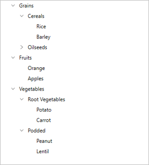

# Data Population in WPF TreeView

The [WPF TreeView](https://www.syncfusion.com/wpf-controls/treeview) control can be populated with a data source by using the [ItemsSource](https://help.syncfusion.com/cr/wpf/Syncfusion.UI.Xaml.TreeView.SfTreeView.html#Syncfusion_UI_Xaml_TreeView_SfTreeView_ItemsSource) property or by creating and adding a [TreeViewNode](https://help.syncfusion.com/cr/wpf/Syncfusion.UI.Xaml.TreeView.Engine.TreeViewNode.html) to the hierarchical structure through the [Nodes](https://help.syncfusion.com/cr/wpf/Syncfusion.UI.Xaml.TreeView.SfTreeView.html#Syncfusion_UI_Xaml_TreeView_SfTreeView_Nodes) property.

## Populating Nodes by data binding – Bound Mode

[Nodes](https://help.syncfusion.com/cr/wpf/Syncfusion.UI.Xaml.TreeView.SfTreeView.html#Syncfusion_UI_Xaml_TreeView_SfTreeView_Nodes) can be populated in bound mode by following these steps.

   * Create hierarchical data model
   * Bind data model to WPF TreeView

To update the collection changes in the UI, it is necessary to set the [NotificationSubscriptionMode](https://help.syncfusion.com/cr/wpf/Syncfusion.UI.Xaml.TreeView.SfTreeView.html#Syncfusion_UI_Xaml_TreeView_SfTreeView_NotificationSubscriptionMode) on the WPF TreeView to either `CollectionChange` or `PropertyChange`.

`NotificationSubscriptionMode` has the following enum values:

   * `CollectionChange` — Updates its tree structure when a child items collection is changed.
   * `PropertyChange` — Updates its child items when the associated collection property is changed.
   * `None` — The default mode. It does not reflect collection/property changes in the UI.

To decide how to populate the nodes, it is necessary to set the `NodePopulationMode` API on the WPF TreeView.

The [NodePopulationMode](https://help.syncfusion.com/cr/wpf/Syncfusion.UI.Xaml.TreeView.SfTreeView.html#Syncfusion_UI_Xaml_TreeView_SfTreeView_NodePopulationMode) API has the following enum values:

   * `OnDemand` — Populates child nodes only when the parent node is expanded. This is the default value.
   * `Instant` — Populates all child nodes when the WPF TreeView control is initially loaded.

  
### Create Data Model for WPF TreeView

Create a simple data source as shown in the following code example in a new class file, and save it as FileManager.cs file:




//FileManager.cs
public class FileManager : INotifyPropertyChanged
{
   private string fileName;
   private ImageSource imageIcon;
   private ObservableCollection<FileManager> subFiles;

   public ObservableCollection<FileManager> SubFiles
   {
      get { return subFiles; }
      set
      {
         subFiles = value;
         RaisedOnPropertyChanged("SubFiles");
      }
   }

   public string ItemName
   {
      get { return fileName; }
      set
      {
         fileName = value;
         RaisedOnPropertyChanged("FolderName");
      }
   }
   
   public ImageSource ImageIcon
   {
       get { return imageIcon; }
       set
       {
          imageIcon = value;
          RaisedOnPropertyChanged("ImageIcon");
       }
   }

   public event PropertyChangedEventHandler PropertyChanged;

   public void RaisedOnPropertyChanged(string _PropertyName)
   {
      if (PropertyChanged != null)
      {
         PropertyChanged(this, new PropertyChangedEventArgs(_PropertyName));
      }
   }
}




Create a model repository class with ImageNodeInfo collection property initialized with required number of data objects in a new class file as shown in the following code example, and save it as FileManagerViewModel.cs file:




public class FileManagerViewModel
{
   private ObservableCollection<FileManager> imageNodeInfo;

   public FileManagerViewModel()
   {
      GenerateSource();
   }

   public ObservableCollection<FileManager> ImageNodeInfo
   {
      get { return imageNodeInfo; }
      set { this.imageNodeInfo = value; }
   }

   private void GenerateSource()
   {
      var nodeImageInfo = new ObservableCollection<FileManager>();
      Assembly assembly = typeof(GettingStated).GetTypeInfo().Assembly;
      var doc = new FileManager() { ItemName = "Documents", ImageIcon = new BitmapImage(new Uri("pack://application:,,,/NodeWithImageDemo;component/Icons/treeview_folder.png")) };
      var download = new FileManager() { ItemName = "Downloads", ImageIcon = new BitmapImage(new Uri("pack://application:,,,/NodeWithImageDemo;component/Icons/treeview_folder.png")) };
      var mp3 = new FileManager() { ItemName = "Music", ImageIcon = new BitmapImage(new Uri("pack://application:,,,/NodeWithImageDemo;component/Icons/treeview_folder.png")) };
      var pictures = new FileManager() { ItemName = "Pictures", ImageIcon = new BitmapImage(new Uri("pack://application:,,,/NodeWithImageDemo;component/Icons/treeview_folder.png")) };
      var video = new FileManager() { ItemName = "Videos", ImageIcon = new BitmapImage(new Uri("pack://application:,,,/NodeWithImageDemo;component/Icons/treeview_folder.png")) };

      var pollution = new FileManager() { ItemName = "Environmental Pollution.docx", ImageIcon = new BitmapImage(new Uri("pack://application:,,,/NodeWithImageDemo;component/Icons/treeview_word.png"))} };
      var globalWarming = new FileManager() { ItemName = "Global Warming.ppt", ImageIcon = new BitmapImage(new Uri("pack://application:,,,/NodeWithImageDemo;component/Icons/treeview_ppt.png")) };
      var sanitation = new FileManager() { ItemName = "Sanitation.docx", ImageIcon = new BitmapImage(new Uri("pack://application:,,,/NodeWithImageDemo;component/Icons/treeview_word.png")) };
      var socialNetwork = new FileManager() { ItemName = "Social Network.pdf", ImageIcon = new BitmapImage(new Uri("pack://application:,,,/NodeWithImageDemo;component/Icons/treeview_pdf.png")) };
      var youthEmpower = new FileManager() { ItemName = "Youth Empowerment.pdf", ImageIcon = new BitmapImage(new Uri("pack://application:,,,/NodeWithImageDemo;component/Icons/treeview_pdf.png")) };

      var games = new FileManager() { ItemName = "Game.exe", ImageIcon = new BitmapImage(new Uri("pack://application:,,,/NodeWithImageDemo;component/Icons/treeview_exe.png")) };
      var tutorials = new FileManager() { ItemName = "Tutorials.zip", ImageIcon = new BitmapImage(new Uri("pack://application:,,,/NodeWithImageDemo;component/Icons/treeview_zip.png")) };
      var TypeScript = new FileManager() { ItemName = "TypeScript.7z", ImageIcon = new BitmapImage(new Uri("pack://application:,,,/NodeWithImageDemo;component/Icons/treeview_zip.png")) };
      var uiGuide = new FileManager() { ItemName = "UI-Guide.pdf", ImageIcon = new BitmapImage(new Uri("pack://application:,,,/NodeWithImageDemo;component/Icons/treeview_pdf.png")) };

      var song = new FileManager() { ItemName = "Goutiest", ImageIcon = new BitmapImage(new Uri("pack://application:,,,/NodeWithImageDemo;component/Icons/treeview_mp3.png")) };

      var camera = new FileManager() { ItemName = "Camera Roll", ImageIcon = new BitmapImage(new Uri("pack://application:,,,/NodeWithImageDemo;component/Icons/treeview_folder.png")) };
      var stone = new FileManager() { ItemName = "Stone.jpg", ImageIcon = new BitmapImage(new Uri("pack://application:,,,/NodeWithImageDemo;component/Icons/treeview_png.png")) };
      var wind = new FileManager() { ItemName = "Wind.jpg", ImageIcon = new BitmapImage(new Uri("pack://application:,,,/NodeWithImageDemo;component/Icons/treeview_png.png")) };

      var img0 = new FileManager() { ItemName = "WIN_20160726_094117.JPG", ImageIcon = new BitmapImage(new Uri("pack://application:,,,/NodeWithImageDemo;component/Icons/treeview_img0.png")) };
      var img1 = new FileManager() { ItemName = "WIN_20160726_094118.JPG", ImageIcon = new BitmapImage(new Uri("pack://application:,,,/NodeWithImageDemo;component/Icons/treeview_img1.png")) };

      var video1 = new FileManager() { ItemName = "Naturals.mp4", ImageIcon = new BitmapImage(new Uri("pack://application:,,,/NodeWithImageDemo;component/Icons/treeview_video.png")) };
      var video2 = new FileManager() { ItemName = "Wild.mpg", ImageIcon = new BitmapImage(new Uri("pack://application:,,,/NodeWithImageDemo;component/Icons/treeview_video.png")) };

      doc.SubFiles = new ObservableCollection<FileManager>
      {
         pollution,
         globalWarming,
         sanitation,
         socialNetwork,
         youthEmpower
      };

      download.SubFiles = new ObservableCollection<FileManager>
      {
         games,
         tutorials,
         TypeScript,
         uiGuide
      };

      mp3.SubFiles = new ObservableCollection<FileManager>
      {
         song
      };

      pictures.SubFiles = new ObservableCollection<FileManager>
      {
         camera,
         stone,
         wind
      };
      
      camera.SubFiles = new ObservableCollection<FileManager>
      {
         img0,
         img1
      };

      video.SubFiles = new ObservableCollection<FileManager>
      {
         video1,
         video2
      };

      nodeImageInfo.Add(doc);
      nodeImageInfo.Add(download);
      nodeImageInfo.Add(mp3);
      nodeImageInfo.Add(pictures);
      nodeImageInfo.Add(video);
      imageNodeInfo = nodeImageInfo;
  }
}



### Bind to hierarchical datasource

To create a WPF TreeView using data binding, set a hierarchical data collection to the [ItemsSource](https://help.syncfusion.com/cr/wpf/Syncfusion.UI.Xaml.TreeView.SfTreeView.html#Syncfusion_UI_Xaml_TreeView_SfTreeView_ItemsSource) property. And set the child object name to the [ChildPropertyName](https://help.syncfusion.com/cr/wpf/Syncfusion.UI.Xaml.TreeView.SfTreeView.html#Syncfusion_UI_Xaml_TreeView_SfTreeView_ChildPropertyName) property.




<Window x:Class="NodeWithImageDemo.MainWindow"
        xmlns="http://schemas.microsoft.com/winfx/2006/xaml/presentation"
        xmlns:x="http://schemas.microsoft.com/winfx/2006/xaml"
        xmlns:d="http://schemas.microsoft.com/expression/blend/2008"
        xmlns:mc="http://schemas.openxmlformats.org/markup-compatibility/2006"
        xmlns:local="clr-namespace:NodeWithImageDemo"
        xmlns:syncfusion="http://schemas.syncfusion.com/wpf"
        xmlns:Engine="clr-namespace:Syncfusion.UI.Xaml.TreeView.Engine;assembly=Syncfusion.SfTreeView.WPF"
        mc:Ignorable="d">

    <Window.DataContext>
        <local:FileManagerViewModel/>
    </Window.DataContext>

    <Grid>
        <syncfusion:SfTreeView x:Name="sfTreeView" 
                               ChildPropertyName="SubFiles"
                               ItemsSource="{Binding ImageNodeInfo}">

            <syncfusion:SfTreeView.ItemTemplate>
                <DataTemplate>
                    <Grid x:Name="grid">
                        <Grid Grid.Row="0">
                            <Grid.ColumnDefinitions>
                                <ColumnDefinition Width="20" />
                                <ColumnDefinition Width="*" />
                            </Grid.ColumnDefinitions>
                            <Grid>
                                <Image Source="{Binding ImageIcon}"
                                               VerticalAlignment="Center"
                                               HorizontalAlignment="Center"
                                               Height="16"
                                               Width="16"/>
                            </Grid>
                            <Grid Grid.Column="1"
                                              Margin="1,0,0,0"
                                              VerticalAlignment="Center">
                                <TextBlock Text="{Binding ItemName}"
                                                   Foreground="Black"
                                                   FontSize="14"
                                                   VerticalAlignment="Center" 
                            </Grid>
                        </Grid>
                    </Grid>
                </DataTemplate>
            </syncfusion:SfTreeView.ItemTemplate>
        </syncfusion:SfTreeView>
    </Grid>
</Window>




N> View sample in [GitHub](https://github.com/SyncfusionExamples/How-to-populate-nodes-with-binding-to-a-data-in-wpf-treeview).

## Populating Nodes without data source – Unbound Mode

You can create and manage the [TreeViewNode](https://help.syncfusion.com/cr/wpf/Syncfusion.UI.Xaml.TreeView.Engine.TreeViewNode.html) objects by yourself to display the data in a hierarchical view. To create a WPF TreeView, you use a `SfTreeView` control and a hierarchy of `TreeViewNode` objects. You create the node hierarchy by adding one or more root nodes to the [SfTreeView.Nodes](https://help.syncfusion.com/cr/wpf/Syncfusion.UI.Xaml.TreeView.SfTreeView.html#Syncfusion_UI_Xaml_TreeView_SfTreeView_Nodes) collection. Each `TreeViewNode` can have more nodes added to its Children collection. You can nest WPF TreeView nodes to whatever depth you require.



<Window
        xmlns="http://schemas.microsoft.com/winfx/2006/xaml/presentation"
        xmlns:x="http://schemas.microsoft.com/winfx/2006/xaml"
        xmlns:d="http://schemas.microsoft.com/expression/blend/2008"
        xmlns:mc="http://schemas.openxmlformats.org/markup-compatibility/2006"
        xmlns:local="clr-namespace:GettingStarted"
        xmlns:Syncfusion="http://schemas.syncfusion.com/wpf" xmlns:Engine="clr-namespace:Syncfusion.UI.Xaml.TreeView.Engine;assembly=Syncfusion.SfTreeView.WPF" x:Class="GettingStarted.MainWindow"
        mc:Ignorable="d"
        Title="MainWindow" Height="450" Width="800">
    <Grid>
        <Syncfusion:SfTreeView HorizontalAlignment="Left" Height="414" Margin="318,0,0,0" VerticalAlignment="Center" Width="250">
            <Syncfusion:SfTreeView.Nodes>
                <Engine:TreeViewNode Content="Grains" IsExpanded="True">
                    <Engine:TreeViewNode.ChildNodes>
                        <Engine:TreeViewNode Content="Cereals" IsExpanded="True">
                            <Engine:TreeViewNode.ChildNodes>
                                <Engine:TreeViewNode Content="Rice"/>
                                <Engine:TreeViewNode Content="Barley"/>
                            </Engine:TreeViewNode.ChildNodes>
                        </Engine:TreeViewNode>
                        <Engine:TreeViewNode Content="Oilseeds">
                            <Engine:TreeViewNode.ChildNodes>
                                <Engine:TreeViewNode Content="Safflower"/>
                            </Engine:TreeViewNode.ChildNodes>
                        </Engine:TreeViewNode>
                    </Engine:TreeViewNode.ChildNodes>
                </Engine:TreeViewNode>
                <Engine:TreeViewNode Content="Fruits" IsExpanded="true">
                    <Engine:TreeViewNode.ChildNodes>
                        <Engine:TreeViewNode Content="Orange"/>
                        <Engine:TreeViewNode Content="Apples" IsExpanded="true"/>
                    </Engine:TreeViewNode.ChildNodes>
                </Engine:TreeViewNode>
                <Engine:TreeViewNode Content="Vegetables" IsExpanded="true">
                    <Engine:TreeViewNode.ChildNodes>
                        <Engine:TreeViewNode Content="Root Vegetables" IsExpanded="true">
                            <Engine:TreeViewNode.ChildNodes>
                                <Engine:TreeViewNode Content="Potato"/>
                                <Engine:TreeViewNode Content="Carrot"/>
                            </Engine:TreeViewNode.ChildNodes>
                        </Engine:TreeViewNode>
                        <Engine:TreeViewNode Content="Podded">
                            <Engine:TreeViewNode.ChildNodes>
                                <Engine:TreeViewNode Content="Peanut"/>
                                <Engine:TreeViewNode Content="Lentil"/>
                            </Engine:TreeViewNode.ChildNodes>
                        </Engine:TreeViewNode>
                    </Engine:TreeViewNode.ChildNodes>
                </Engine:TreeViewNode>
            </Syncfusion:SfTreeView.Nodes>
        </Syncfusion:SfTreeView>
    </Grid>
</Window>



N> View sample in [GitHub](https://github.com/SyncfusionExamples/How-to-populate-nodes-without-binding-data-as-unbound-mode-in-wpf-treeview).

N> You can refer to our [WPF TreeView](https://www.syncfusion.com/wpf-controls/treeview) feature tour page for its key feature highlights. You can also explore our [WPF TreeView example](https://github.com/syncfusion/wpf-demos) to know how to represent hierarchical data in a tree-like structure with expand and collapse node options.