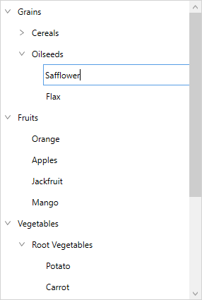

# Editing in WPF TreeView

The [WPF TreeView](https://www.syncfusion.com/wpf-controls/treeview) control supports editing. Editing can be enabled or disabled by using the [SfTreeView.AllowEditing](https://help.syncfusion.com/cr/wpf/Syncfusion.UI.Xaml.TreeView.SfTreeView.html#Syncfusion_UI_Xaml_TreeView_SfTreeView_AllowEditing) property. You can enter edit mode on a node by pressing the <kbd>F2</kbd> key, or by setting the [EditTrigger](https://help.syncfusion.com/cr/wpf/Syncfusion.UI.Xaml.TreeView.SfTreeView.html#Syncfusion_UI_Xaml_TreeView_SfTreeView_EditTrigger) property to enable single-click or double-click editing. The edit changes for a node are committed only when the user moves to another node or presses the <kbd>Enter</kbd> key. The WPF TreeView is implemented through the `SfTreeView` class.

The `EditTrigger` property accepts the following values:

* `F2` — Press <kbd>F2</kbd> to start editing. This is the default.
* `Tap` — Single tap or click to start editing.
* `DoubleTap` — Double tap or double click to start editing.

It is necessary to define an [EditTemplate](https://help.syncfusion.com/cr/wpf/Syncfusion.UI.Xaml.TreeView.SfTreeView.html#Syncfusion_UI_Xaml_TreeView_SfTreeView_EditTemplate) or [EditTemplateSelector](https://help.syncfusion.com/cr/wpf/Syncfusion.UI.Xaml.TreeView.SfTreeView.html#Syncfusion_UI_Xaml_TreeView_SfTreeView_EditTemplateSelector) for bound mode, to enable editing. For unbound mode, a `TextBox` is loaded in edit mode by default.



<syncfusion:SfTreeView x:Name="sfTreeView" 
                               ItemsSource="{Binding Items}"    
                               ChildPropertyName="Files"
                               AutoExpandMode="RootNodes"
                               AllowEditing="True"
                               >
    <syncfusion:SfTreeView.ItemTemplate>
        <DataTemplate>
            <TextBlock Text="{Binding Name}" VerticalAlignment="Center"/>
        </DataTemplate>
    </syncfusion:SfTreeView.ItemTemplate>
    <syncfusion:SfTreeView.EditTemplate>
        <DataTemplate>
            <TextBox Text="{Binding Name}" 
					 VerticalContentAlignment="Center" 
                     Margin="-4,0,-4,0"
                     Height="{Binding ItemHeight,ElementName=sfTreeView}" />
        </DataTemplate>
    </syncfusion:SfTreeView.EditTemplate>
</syncfusion:SfTreeView>


sfTreeView.AllowEditing = true;



## Edit mode

By default, you can enter edit mode by pressing the <kbd>F2</kbd> key. The WPF TreeView also allows entering edit mode with a single click (Tap) or a double click (DoubleTap) by setting the [EditTrigger](https://help.syncfusion.com/cr/wpf/Syncfusion.UI.Xaml.TreeView.SfTreeView.html#Syncfusion_UI_Xaml_TreeView_SfTreeView_EditTrigger) property.




<syncfusion:SfTreeView x:Name="sfTreeView" 
                       ItemsSource="{Binding Countries}"
                       AutoExpandMode="RootNodes"
                       EditTrigger="DoubleTap"
                       AllowEditing="True"/>




this.sfTreeView.EditTrigger = Syncfusion.UI.Xaml.TreeView.TreeViewEditTrigger.DoubleTap;




## Programmatic Editing

### Begin the editing

The WPF TreeView allows you to start editing a node programmatically by calling the [BeginEdit](https://help.syncfusion.com/cr/wpf/Syncfusion.UI.Xaml.TreeView.SfTreeView.html#Syncfusion_UI_Xaml_TreeView_SfTreeView_BeginEdit_Syncfusion_UI_Xaml_TreeView_Engine_TreeViewNode_) method.



this.sfTreeView.Loaded += TreeView_Loaded;

private void TreeView_Loaded(object sender, RoutedEventArgs e)
{
    this.sfTreeView.BeginEdit(this.sfTreeView.Nodes[0]);
}



N> The [CurrentItem](https://help.syncfusion.com/cr/wpf/Syncfusion.UI.Xaml.TreeView.SfTreeView.html#Syncfusion_UI_Xaml_TreeView_SfTreeView_CurrentItem) is set to the node when `BeginEdit` is called.

### End the editing

You can call the [EndEdit](https://help.syncfusion.com/cr/wpf/Syncfusion.UI.Xaml.TreeView.SfTreeView.html#Syncfusion_UI_Xaml_TreeView_SfTreeView_EndEdit_Syncfusion_UI_Xaml_TreeView_Engine_TreeViewNode_) method to programmatically end editing for a specific node.



this.sfTreeView.Loaded += TreeView_Loaded;

private void TreeView_Loaded(object sender, RoutedEventArgs e)
{
    this.sfTreeView.EndEdit(this.sfTreeView.Nodes[0]);
}



## Revert the edited changes while pressing the Escape key

By default, the WPF TreeView does not support rolling back changes when the <kbd>ESC</kbd> key is pressed while editing a node. It does support rolling back changes when the underlying data object implements the [IEditableObject](https://docs.microsoft.com/en-us/dotnet/api/system.componentmodel.ieditableobject?redirectedfrom=MSDN&view=net-5.0) interface.

The user can take a backup of the existing data of a node in the [BeginEdit](https://docs.microsoft.com/en-us/dotnet/api/system.componentmodel.ieditableobject.beginedit?redirectedfrom=MSDN&view=net-5.0#System_ComponentModel_IEditableObject_BeginEdit) method and revert to the previous values in the [CancelEdit](https://docs.microsoft.com/en-us/dotnet/api/system.componentmodel.ieditableobject.canceledit?redirectedfrom=MSDN&view=net-5.0#System_ComponentModel_IEditableObject_CancelEdit) method to roll back the changes.

The following code example shows a simple implementation of the `IEditableObject` interface to roll back the changes.



public class Country : INotifyPropertyChanged, IEditableObject
{
    private bool isSelected;
    internal string name;
    private ObservableCollection<State> states;
    internal Country backUpData;
    private Country currentData;

    public Country()
    {
	
    }

    public Country(string name):base()
    {
        this.currentData = new Country();
        this.currentData.name = name;
        this.currentData.isSelected = false;
    }

    public ObservableCollection<State> States
    {
        get 
        { 
            return states; 
        }
        set
        {
            states = value;
            RaisedOnPropertyChanged("States");
        }
    }

    public string Name
    {
        get
        { 
            return this.currentData.name; 
        }
        set
        {
            this.currentData.name = value;
            RaisedOnPropertyChanged("Name");
        }
    }

    public bool IsSelected
    {
        get 
        { 
            return this.currentData.isSelected; 
        }
        set
        {
            this.currentData.isSelected = value;
            RaisedOnPropertyChanged("IsSelected");
        }
    }

    public event PropertyChangedEventHandler PropertyChanged;

    public void RaisedOnPropertyChanged(string _PropertyName)
    {
        if (PropertyChanged != null)
        {
            PropertyChanged(this, new PropertyChangedEventArgs(_PropertyName));
        }
    }

    public void BeginEdit()
    {
        Debug.WriteLine("BeginEdit is Called.");
        backUpData = new Country();
        backUpData.name = this.currentData.name;
        backUpData.isSelected = this.currentData.isSelected;
    }

    public void CancelEdit()
    {
        Debug.WriteLine("CancelEdit is Called.");
        this.currentData = backUpData;
    }

    public void EndEdit()
    {
        Debug.WriteLine("EndEdit is Called.");
    }
}



N> View sample in [GitHub](https://github.com/syncfusion/wpf-demos/blob/master/treeview/Views/EditingDemo.xaml)

## Events

### ItemBeginEdit Event

The [ItemBeginEdit](https://help.syncfusion.com/cr/wpf/Syncfusion.UI.Xaml.TreeView.SfTreeView.html#Syncfusion_UI_Xaml_TreeView_SfTreeView_ItemBeginEdit) event occurs when the node enters edit mode. The [TreeViewItemBeginEditEventArgs](https://help.syncfusion.com/cr/wpf/Syncfusion.UI.Xaml.TreeView.TreeViewItemBeginEditEventArgs.html) has the following members which provides information about the `ItemBeginEdit` event.

* [Node](https://help.syncfusion.com/cr/wpf/Syncfusion.UI.Xaml.TreeView.TreeViewItemEditEventArgs.html#Syncfusion_UI_Xaml_TreeView_TreeViewItemEditEventArgs_Node) : Gets the [TreeViewNode](https://help.syncfusion.com/cr/wpf/Syncfusion.UI.Xaml.TreeView.Engine.TreeViewNode.html) which is being edited.

You can cancel the editing of certain nodes using custom logic within this event by setting `TreeViewItemBeginEditEventArgs.Cancel` as true.



sfTreeView.ItemBeginEdit += TreeView_ItemBeginEdit;

private void TreeView_ItemBeginEdit(object sender, TreeViewItemBeginEditEventArgs e)
{
    if (e.Node.Content == "Grains")
		e.Cancel = true;
}



### ItemEndEdit Event

The [ItemEndEdit](https://help.syncfusion.com/cr/wpf/Syncfusion.UI.Xaml.TreeView.SfTreeView.html#Syncfusion_UI_Xaml_TreeView_SfTreeView_ItemEndEdit) event occurs when the node leaves the edit mode. The [TreeViewItemEndEditEventArgs](https://help.syncfusion.com/cr/wpf/Syncfusion.UI.Xaml.TreeView.TreeViewItemEndEditEventArgs.html) has the following members which provides information about the `ItemEndEdit` event.

* [Node](https://help.syncfusion.com/cr/wpf/Syncfusion.UI.Xaml.TreeView.TreeViewItemEditEventArgs.html#Syncfusion_UI_Xaml_TreeView_TreeViewItemEditEventArgs_Node) : Gets the [TreeViewNode](https://help.syncfusion.com/cr/wpf/Syncfusion.UI.Xaml.TreeView.Engine.TreeViewNode.html) which is being edited.

You can cancel the editing from being ended for certain nodes using custom logic within this event by setting `TreeViewItemEndEditEventArgs.Cancel` as true.



sfTreeView.ItemEndEdit += TreeView_ItemEndEdit;

private void TreeView_ItemEndEdit(object sender, TreeViewItemEndEditEventArgs e)
{
	if (e.Node.Content == "Cereals")
		e.Cancel = true;
}



N> You can refer to our [WPF TreeView](https://www.syncfusion.com/wpf-controls/treeview) feature tour page for its key feature highlights. You can also explore our [WPF TreeView example](https://github.com/syncfusion/wpf-demos) to know how to represent hierarchical data in a tree-like structure with expand and collapse node options.
