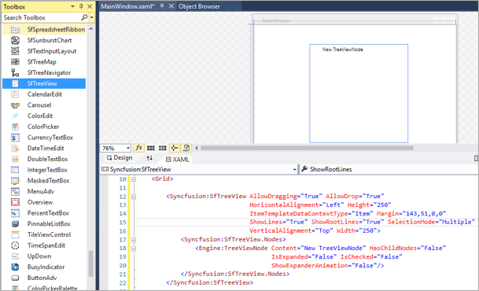
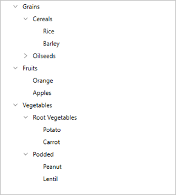

# Getting started with WPF TreeView (SfTreeView)

This section provides a quick overview for getting started with the `SfTreeView` for WPF. Walk through the entire process of creating a real world of this control.

## Assembly Deployment

Refer to the [Control Dependencies](https://help.syncfusion.com/wpf/control-dependencies#sftreeview) section to get the list of assemblies or NuGet package that needs to be added as a reference to use the control in any application.

Refer to this documentation to find more details about installing nuget packages in a WPF application.

## Creating simple application with SfTreeView

* Creating the project
* Add SfTreeView to Project
* Populating Nodes without data source - Unbound Mode
* Bind to a hierarchical data source - Bound Mode
* Bind to a Hierarchy Property Descriptors data source - Bound Mode

### Creating the project

Create new WPF Project in Visual Studio to display [SfTreeView](https://help.syncfusion.com/cr/wpf/Syncfusion.SfTreeView.WPF.html) with data objects.

### Add SfTreeView to Project

The SfTreeView control can be added to project by the following ways.

#### Adding SfTreeView by designer.

SfTreeView control can be added to the application by dragging it from Toolbox and dropping it in Designer view. The required assembly references will be added automatically.

#### Adding SfTreeView by XAML.

In order to add control manually in XAML, do the below steps,

1. Add the below required assembly references to the project,

	* Syncfusion.SfBusyIndicator.WPF
	* Syncfusion.SfTreeView.WPF
	* Syncfusion.SfGridCommon.WPF
	
2. Import Syncfusion WPF schema **http://schemas.syncfusion.com/wpf** in XAML page.
3. Declare SfTreeView control in XAML page.




<Window x:Class="GettingStarted.MainWindow"
        xmlns="http://schemas.microsoft.com/winfx/2006/xaml/presentation"
        xmlns:x="http://schemas.microsoft.com/winfx/2006/xaml"
        xmlns:d="http://schemas.microsoft.com/expression/blend/2008"
        xmlns:mc="http://schemas.openxmlformats.org/markup-compatibility/2006"
        xmlns:local="clr-namespace:GettingStarted"
        xmlns:syncfusion="http://schemas.syncfusion.com/wpf"
        mc:Ignorable="d"
        Title="MainWindow" Height="350" Width="525">
    <Grid>
        <syncfusion:SfTreeView x:Name="treeView" />
    </Grid>
</Window>




#### Adding SfTreeView by C#.

In order to add control manually in C#, do the below steps,

1. Add the below required assembly references to the project,
	* Syncfusion.SfBusyIndicator.WPF
	* Syncfusion.SfTreeView.WPF
	* Syncfusion.SfGridCommon.WPF
2. Import SfTreeView namespace **using Syncfusion.UI.Xaml.TreeView** .
3. Create SfTreeView control instance and add it to the Page.




using Syncfusion.UI.Xaml.TreeView;
using System.Windows;

namespace GettingStarted
{
    /// 

    /// Interaction logic for MainWindow.xaml
    /// 

    public partial class MainWindow : Window
    {
        public MainWindow()
        {
            InitializeComponent();
            SfTreeView treeView = new SfTreeView();
            Root_Grid.Children.Add(treeView);
        }
    }
}




### Populating Nodes without data source - Unbound Mode

You can create and manage the [TreeViewNode](https://help.syncfusion.com/cr/wpf/Syncfusion.UI.Xaml.TreeView.Engine.TreeViewNode.html) objects by yourself to display the data in a hierarchical view. To create a tree view, you use a `SfTreeView` control and a hierarchy of `TreeViewNode` objects. You create the node hierarchy by adding one or more root nodes to the [SfTreeView.Nodes](https://help.syncfusion.com/cr/wpf/Syncfusion.UI.Xaml.TreeView.SfTreeView.html#Syncfusion_UI_Xaml_TreeView_SfTreeView_Nodes) collection. Each `TreeViewNode` can have more nodes added to its Children collection. You can nest tree view nodes to whatever depth you require.



<Window
        xmlns="http://schemas.microsoft.com/winfx/2006/xaml/presentation"
        xmlns:x="http://schemas.microsoft.com/winfx/2006/xaml"
        xmlns:d="http://schemas.microsoft.com/expression/blend/2008"
        xmlns:mc="http://schemas.openxmlformats.org/markup-compatibility/2006"
        xmlns:local="clr-namespace:GettingStarted"
        xmlns:Syncfusion="http://schemas.syncfusion.com/wpf" xmlns:Engine="clr-namespace:Syncfusion.UI.Xaml.TreeView.Engine;assembly=Syncfusion.SfTreeView.WPF" x:Class="GettingStarted.MainWindow"
        mc:Ignorable="d"
        Title="MainWindow" Height="450" Width="800">
    <Grid>
        <Syncfusion:SfTreeView HorizontalAlignment="Left" Height="414" Margin="318,0,0,0" VerticalAlignment="Center" Width="250">
            <Syncfusion:SfTreeView.Nodes>
                <Engine:TreeViewNode Content="Grains" IsExpanded="True">
                    <Engine:TreeViewNode.ChildNodes>
                        <Engine:TreeViewNode Content="Cereals" IsExpanded="True">
                            <Engine:TreeViewNode.ChildNodes>
                                <Engine:TreeViewNode Content="Rice"/>
                                <Engine:TreeViewNode Content="Barley"/>
                            </Engine:TreeViewNode.ChildNodes>
                        </Engine:TreeViewNode>
                        <Engine:TreeViewNode Content="Oilseeds">
                            <Engine:TreeViewNode.ChildNodes>
                                <Engine:TreeViewNode Content="Safflower"/>
                            </Engine:TreeViewNode.ChildNodes>
                        </Engine:TreeViewNode>
                    </Engine:TreeViewNode.ChildNodes>
                </Engine:TreeViewNode>
                <Engine:TreeViewNode Content="Fruits" IsExpanded="true">
                    <Engine:TreeViewNode.ChildNodes>
                        <Engine:TreeViewNode Content="Orange"/>
                        <Engine:TreeViewNode Content="Apples" IsExpanded="true"/>
                    </Engine:TreeViewNode.ChildNodes>
                </Engine:TreeViewNode>
                <Engine:TreeViewNode Content="Vegetables" IsExpanded="true">
                    <Engine:TreeViewNode.ChildNodes>
                        <Engine:TreeViewNode Content="Root Vegetables" IsExpanded="true">
                            <Engine:TreeViewNode.ChildNodes>
                                <Engine:TreeViewNode Content="Potato"/>
                                <Engine:TreeViewNode Content="Carrot"/>
                            </Engine:TreeViewNode.ChildNodes>
                        </Engine:TreeViewNode>
                        <Engine:TreeViewNode Content="Podded">
                            <Engine:TreeViewNode.ChildNodes>
                                <Engine:TreeViewNode Content="Peanut"/>
                                <Engine:TreeViewNode Content="Lentil"/>
                            </Engine:TreeViewNode.ChildNodes>
                        </Engine:TreeViewNode>
                    </Engine:TreeViewNode.ChildNodes>
                </Engine:TreeViewNode>
            </Syncfusion:SfTreeView.Nodes>
        </Syncfusion:SfTreeView>
    </Grid>
</Window>



### Bind to a hierarchical data source - Bound Mode

You can create a tree view by binding the ItemsSource to a hierarchical data source. To create a tree view using data binding, set a hierarchical collection to the [ItemsSource](https://help.syncfusion.com/cr/wpf/Syncfusion.UI.Xaml.TreeView.SfTreeView.html#Syncfusion_UI_Xaml_TreeView_SfTreeView_ItemsSource) property. Then in the [ItemTemplate](https://help.syncfusion.com/cr/wpf/Syncfusion.UI.Xaml.TreeView.SfTreeView.html#Syncfusion_UI_Xaml_TreeView_SfTreeView_ItemTemplate) and [ExpanderTemplate](https://help.syncfusion.com/cr/wpf/Syncfusion.UI.Xaml.TreeView.SfTreeView.html#Syncfusion_UI_Xaml_TreeView_SfTreeView_ExpanderTemplate), set the child items collection to the `ItemsSource` property.




<Window x:Class="NodeWithImageDemo.MainWindow"
        xmlns="http://schemas.microsoft.com/winfx/2006/xaml/presentation"
        xmlns:x="http://schemas.microsoft.com/winfx/2006/xaml"
        xmlns:d="http://schemas.microsoft.com/expression/blend/2008"
        xmlns:mc="http://schemas.openxmlformats.org/markup-compatibility/2006"
        xmlns:local="clr-namespace:NodeWithImageDemo"
        xmlns:syncfusion="http://schemas.syncfusion.com/wpf"
        xmlns:Syncfusion="http://schemas.syncfusion.com/wpf" xmlns:Engine="clr-namespace:Syncfusion.UI.Xaml.TreeView.Engine;assembly=Syncfusion.SfTreeView.WPF"
        mc:Ignorable="d">

    <Window.DataContext>
        <local:FileManagerViewModel/>
    </Window.DataContext>

    <Grid>
        <syncfusion:SfTreeView x:Name="sfTreeView" 
                               ChildPropertyName="SubFiles"
                               ItemsSource="{Binding ImageNodeInfo}">

            <syncfusion:SfTreeView.ItemTemplate>
                <DataTemplate>
                    <Grid x:Name="grid">
                        <Grid Grid.Row="0">
                            <Grid.ColumnDefinitions>
                                <ColumnDefinition Width="20" />
                                <ColumnDefinition Width="*" />
                            </Grid.ColumnDefinitions>
                            <Grid>
                                <Image Source="{Binding ImageIcon}"
                                               VerticalAlignment="Center"
                                               HorizontalAlignment="Center"
                                               Height="16"
                                               Width="16"/>
                            </Grid>
                            <Grid Grid.Column="1"
                                              Margin="1,0,0,0"
                                              VerticalAlignment="Center">
                                <TextBlock Text="{Binding ItemName}"
                                                   Foreground="Black"
                                                   FontSize="14"
                                                   VerticalAlignment="Center" 
                            </Grid>
                        </Grid>
                    </Grid>
                </DataTemplate>
            </syncfusion:SfTreeView.ItemTemplate>
        </syncfusion:SfTreeView>
    </Grid>
</Window>




public class FileManager : INotifyPropertyChanged
{
   private string fileName;
   private ImageSource imageIcon;
   private ObservableCollection<FileManager> subFiles;

   public ObservableCollection<FileManager> SubFiles
   {
      get { return subFiles; }
      set
      {
         subFiles = value;
         RaisedOnPropertyChanged("SubFiles");
      }
   }

   public string ItemName
   {
      get { return fileName; }
      set
      {
         fileName = value;
         RaisedOnPropertyChanged("FolderName");
      }
   }
   
   public ImageSource ImageIcon
   {
       get { return imageIcon; }
       set
       {
          imageIcon = value;
          RaisedOnPropertyChanged("ImageIcon");
       }
   }

   public event PropertyChangedEventHandler PropertyChanged;

   public void RaisedOnPropertyChanged(string _PropertyName)
   {
      if (PropertyChanged != null)
      {
         PropertyChanged(this, new PropertyChangedEventArgs(_PropertyName));
      }
   }
}




public class FileManagerViewModel
{
   private ObservableCollection<FileManager> imageNodeInfo;

   public FileManagerViewModel()
   {
      GenerateSource();
   }

   public ObservableCollection<FileManager> ImageNodeInfo
   {
      get { return imageNodeInfo; }
      set { this.imageNodeInfo = value; }
   }

   private void GenerateSource()
   {
      var nodeImageInfo = new ObservableCollection<FileManager>();
      Assembly assembly = typeof(GettingStated).GetTypeInfo().Assembly;
      var doc = new FileManager() { ItemName = "Documents", ImageIcon = ImageSource.FromResource("GettingStartedBound.Icons.treeview_folder.png", assembly) };
      var download = new FileManager() { ItemName = "Downloads", ImageIcon = ImageSource.FromResource("GettingStartedBound.Icons.treeview_folder.png", assembly) };
      var mp3 = new FileManager() { ItemName = "Music", ImageIcon = ImageSource.FromResource("GettingStartedBound.Icons.treeview_folder.png", assembly) };
      var pictures = new FileManager() { ItemName = "Pictures", ImageIcon = ImageSource.FromResource("GettingStartedBound.Icons.treeview_folder.png", assembly) };
      var video = new FileManager() { ItemName = "Videos", ImageIcon = ImageSource.FromResource("GettingStartedBound.Icons.treeview_folder.png", assembly) };

      var pollution = new FileManager() { ItemName = "Environmental Pollution.docx", ImageIcon = ImageSource.FromResource("GettingStartedBound.Icons.treeview_word.png", assembly) };
      var globalWarming = new FileManager() { ItemName = "Global Warming.ppt", ImageIcon = ImageSource.FromResource("GettingStartedBound.Icons.treeview_ppt.png", assembly) };
      var sanitation = new FileManager() { ItemName = "Sanitation.docx", ImageIcon = ImageSource.FromResource("GettingStartedBound.Icons.treeview_word.png", assembly) };
      var socialNetwork = new FileManager() { ItemName = "Social Network.pdf", ImageIcon = ImageSource.FromResource("GettingStartedBound.Icons.treeview_pdf.png", assembly) };
      var youthEmpower = new FileManager() { ItemName = "Youth Empowerment.pdf", ImageIcon = ImageSource.FromResource("GettingStartedBound.Icons.treeview_pdf.png", assembly) };

      var games = new FileManager() { ItemName = "Game.exe", ImageIcon = ImageSource.FromResource("GettingStartedBound.Icons.treeview_exe.png", assembly) };
      var tutorials = new FileManager() { ItemName = "Tutorials.zip", ImageIcon = ImageSource.FromResource("GettingStartedBound.Icons.treeview_zip.png", assembly) };
      var TypeScript = new FileManager() { ItemName = "TypeScript.7z", ImageIcon = ImageSource.FromResource("GettingStartedBound.Icons.treeview_zip.png", assembly) };
      var uiGuide = new FileManager() { ItemName = "UI-Guide.pdf", ImageIcon = ImageSource.FromResource("GettingStartedBound.Icons.treeview_pdf.png", assembly) };

      var song = new FileManager() { ItemName = "Goutiest", ImageIcon = ImageSource.FromResource("GettingStartedBound.Icons.treeview_mp3.png", assembly) };

      var camera = new FileManager() { ItemName = "Camera Roll", ImageIcon = ImageSource.FromResource("GettingStartedBound.Icons.treeview_folder.png", assembly) };
      var stone = new FileManager() { ItemName = "Stone.jpg", ImageIcon = ImageSource.FromResource("GettingStartedBound.Icons.treeview_png.png", assembly) };
      var wind = new FileManager() { ItemName = "Wind.jpg", ImageIcon = ImageSource.FromResource("GettingStartedBound.Icons.treeview_png.png", assembly) };

      var img0 = new FileManager() { ItemName = "WIN_20160726_094117.JPG", ImageIcon = ImageSource.FromResource("GettingStartedBound.Icons.treeview_img0.png", assembly) };
      var img1 = new FileManager() { ItemName = "WIN_20160726_094118.JPG", ImageIcon = ImageSource.FromResource("GettingStartedBound.Icons.treeview_img1.png", assembly) };

      var video1 = new FileManager() { ItemName = "Naturals.mp4", ImageIcon = ImageSource.FromResource("GettingStartedBound.Icons.treeview_video.png", assembly) };
      var video2 = new FileManager() { ItemName = "Wild.mpg", ImageIcon = ImageSource.FromResource("GettingStartedBound.Icons.treeview_video.png", assembly) };

      doc.SubFiles = new ObservableCollection<FileManager>
      {
         pollution,
         globalWarming,
         sanitation,
         socialNetwork,
         youthEmpower
      };

      download.SubFiles = new ObservableCollection<FileManager>
      {
         games,
         tutorials,
         TypeScript,
         uiGuide
      };

      mp3.SubFiles = new ObservableCollection<FileManager>
      {
         song
      };

      pictures.SubFiles = new ObservableCollection<FileManager>
      {
         camera,
         stone,
         wind
      };
      
      camera.SubFiles = new ObservableCollection<FileManager>
      {
         img0,
         img1
      };

      video.SubFiles = new ObservableCollection<FileManager>
      {
         video1,
         video2
      };

      nodeImageInfo.Add(doc);
      nodeImageInfo.Add(download);
      nodeImageInfo.Add(mp3);
      nodeImageInfo.Add(pictures);
      nodeImageInfo.Add(video);
      imageNodeInfo = nodeImageInfo;
  }
}




### Bind to a Hierarchy Property Descriptors data source - Bound Mode

 You can create a tree view by binding the `ItemsSource` to a hierarchy property descriptors data source. To create a tree view using hierarchical data binding, set a hierarchical collection to the [ItemsSource](https://help.syncfusion.com/cr/wpf/Syncfusion.UI.Xaml.TreeView.SfTreeView.html#Syncfusion_UI_Xaml_TreeView_SfTreeView_ItemsSource) property, and then set the TargetType and [ChildPropertyName](https://help.syncfusion.com/cr/wpf/Syncfusion.UI.Xaml.TreeView.SfTreeView.html#Syncfusion_UI_Xaml_TreeView_SfTreeView_ChildPropertyName) property values in [HierarchyPropertyDescriptors](https://help.syncfusion.com/cr/wpf/Syncfusion.UI.Xaml.TreeView.SfTreeView.html#Syncfusion_UI_Xaml_TreeView_SfTreeView_HierarchyPropertyDescriptors).
 
 


<Window x:Class="WpfApp1.MainWindow"
        xmlns="http://schemas.microsoft.com/winfx/2006/xaml/presentation"
        xmlns:x="http://schemas.microsoft.com/winfx/2006/xaml"
        xmlns:d="http://schemas.microsoft.com/expression/blend/2008"
        xmlns:mc="http://schemas.openxmlformats.org/markup-compatibility/2006"
        xmlns:local="clr-namespace:WpfApp1"
        xmlns:syncfusion="http://schemas.syncfusion.com/wpf"
        xmlns:treeViewEngine="clr-namespace:Syncfusion.UI.Xaml.TreeView.Engine;assembly=Syncfusion.SfTreeView.WPF"
        mc:Ignorable="d"
        Title="MainWindow" >
    
    <Window.DataContext>
        <local:FileManagerViewModel/>
    </Window.DataContext>

    <Grid>
        <syncfusion:SfTreeView x:Name="treeView" ItemsSource="{Binding ImageNodeInfo}">
            <syncfusion:SfTreeView.HierarchyPropertyDescriptors>
                <treeViewEngine:HierarchyPropertyDescriptor TargetType="{x:Type local:Folder}" ChildPropertyName="Files"/>
                <treeViewEngine:HierarchyPropertyDescriptor TargetType="{x:Type local:File}" ChildPropertyName="SubFiles"/>
                <treeViewEngine:HierarchyPropertyDescriptor TargetType="{x:Type local:SubFile}" ChildPropertyName="Items"/>
            </syncfusion:SfTreeView.HierarchyPropertyDescriptors>
            <syncfusion:SfTreeView.ItemTemplate>
                <DataTemplate>
                    <TextBlock Text="{Binding FileName}" VerticalAlignment="Center" />
                </DataTemplate>
            </syncfusion:SfTreeView.ItemTemplate>
        </syncfusion:SfTreeView>
    </Grid>
</Window>



public class Folder : INotifyPropertyChanged
{
    private string fileName;
    private ImageSource imageIcon;
    private ObservableCollection<File> files;

    public Folder()
    {
    }

    public ObservableCollection<File> Files
    {
        get { return files; }
        set
        {
            files = value;
            RaisedOnPropertyChanged("SubFiles");
        }
    }

    public string FileName
    {
        get { return fileName; }
        set
        {
            fileName = value;
            RaisedOnPropertyChanged("FileName");
        }
    }

    public ImageSource ImageIcon
    {
        get { return imageIcon; }
        set
        {
            imageIcon = value;
            RaisedOnPropertyChanged("ImageIcon");
        }
    }

    public event PropertyChangedEventHandler PropertyChanged;

    public void RaisedOnPropertyChanged(string _PropertyName)
    {
        if (PropertyChanged != null)
        {
            PropertyChanged(this, new PropertyChangedEventArgs(_PropertyName));
        }
    }
}

public class File : INotifyPropertyChanged
{
    private string fileName;
    private ImageSource imageIcon;
    private ObservableCollection<SubFile> subFiles;

    public File()
    {
    }

    public ObservableCollection<SubFile> SubFiles
    {
        get { return subFiles; }
        set
        {
            subFiles = value;
            RaisedOnPropertyChanged("SubFiles");
        }
    }

    public string FileName
    {
        get { return fileName; }
        set
        {
            fileName = value;
            RaisedOnPropertyChanged("FileName");
        }
    }

    public ImageSource ImageIcon
    {
        get { return imageIcon; }
        set
        {
            imageIcon = value;
            RaisedOnPropertyChanged("ImageIcon");
        }
    }

    public event PropertyChangedEventHandler PropertyChanged;

    public void RaisedOnPropertyChanged(string _PropertyName)
    {
        if (PropertyChanged != null)
        {
            PropertyChanged(this, new PropertyChangedEventArgs(_PropertyName));
        }
    }
}

public class SubFile : INotifyPropertyChanged
{
    private string fileName;
    private ImageSource imageIcon;

    public SubFile()
    {
    }

    public string FileName
    {
        get { return fileName; }
        set
        {
            fileName = value;
            RaisedOnPropertyChanged("FolderName");
        }
    }

    public ImageSource ImageIcon
    {
        get { return imageIcon; }
        set
        {
            imageIcon = value;
            RaisedOnPropertyChanged("ImageIcon");
        }
    }

    public event PropertyChangedEventHandler PropertyChanged;

    public void RaisedOnPropertyChanged(string _PropertyName)
    {
        if (PropertyChanged != null)
        {
            PropertyChanged(this, new PropertyChangedEventArgs(_PropertyName));
        }
    }
}




public class FileManagerViewModel
{
    public ObservableCollection<Folder> Folders { get; set; }

    public ObservableCollection<File> Files { get; set; }

    public ObservableCollection<SubFile> SubFiles { get; set; }

    public FileManagerViewModel()
    {
        this.Folders = GetFiles();
    }

    private ObservableCollection<Folder> GetFiles()
    {
        var nodeImageInfo = new ObservableCollection<Folder>();
        Assembly assembly = typeof(NodeWithImage).GetTypeInfo().Assembly;

        var doc = new Folder() { FileName = "Documents", ImageIcon = ImageSource.FromResource("SampleBrowser.SfTreeView.Icons.NodeWithImage.treeview_folder.png", assembly) };
        var download = new Folder() { FileName = "Downloads", ImageIcon = ImageSource.FromResource("SampleBrowser.SfTreeView.Icons.NodeWithImage.treeview_folder.png", assembly) };
        var mp3 = new Folder() { FileName = "Music", ImageIcon = ImageSource.FromResource("SampleBrowser.SfTreeView.Icons.NodeWithImage.treeview_folder.png", assembly) };
        var pictures = new Folder() { FileName = "Pictures", ImageIcon = ImageSource.FromResource("SampleBrowser.SfTreeView.Icons.NodeWithImage.treeview_folder.png", assembly) };
        var video = new Folder() { FileName = "Videos", ImageIcon = ImageSource.FromResource("SampleBrowser.SfTreeView.Icons.NodeWithImage.treeview_folder.png", assembly) };

        var pollution = new File() { FileName = "Environmental Pollution.docx", ImageIcon = ImageSource.FromResource("SampleBrowser.SfTreeView.Icons.NodeWithImage.treeview_word.png", assembly) };
        var globalWarming = new File() { FileName = "Global Warming.ppt", ImageIcon = ImageSource.FromResource("SampleBrowser.SfTreeView.Icons.NodeWithImage.treeview_ppt.png", assembly) };
        var sanitation = new File() { FileName = "Sanitation.docx", ImageIcon = ImageSource.FromResource("SampleBrowser.SfTreeView.Icons.NodeWithImage.treeview_word.png", assembly) };
        var socialNetwork = new File() { FileName = "Social Network.pdf", ImageIcon = ImageSource.FromResource("SampleBrowser.SfTreeView.Icons.NodeWithImage.treeview_pdf.png", assembly) };
        var youthEmpower = new File() { FileName = "Youth Empowerment.pdf", ImageIcon = ImageSource.FromResource("SampleBrowser.SfTreeView.Icons.NodeWithImage.treeview_pdf.png", assembly) };

        var games = new File() { FileName = "Game.exe", ImageIcon = ImageSource.FromResource("SampleBrowser.SfTreeView.Icons.NodeWithImage.treeview_exe.png", assembly) };
        var tutorials = new File() { FileName = "Tutorials.zip", ImageIcon = ImageSource.FromResource("SampleBrowser.SfTreeView.Icons.NodeWithImage.treeview_zip.png", assembly) };
        var typeScript = new File() { FileName = "TypeScript.7z", ImageIcon = ImageSource.FromResource("SampleBrowser.SfTreeView.Icons.NodeWithImage.treeview_zip.png", assembly) };
        var uiGuide = new File() { FileName = "UI-Guide.pdf", ImageIcon = ImageSource.FromResource("SampleBrowser.SfTreeView.Icons.NodeWithImage.treeview_pdf.png", assembly) };

        var song = new File() { FileName = "Gouttes", ImageIcon = ImageSource.FromResource("SampleBrowser.SfTreeView.Icons.NodeWithImage.treeview_mp3.png", assembly) };

        var camera = new File() { FileName = "Camera Roll", ImageIcon = ImageSource.FromResource("SampleBrowser.SfTreeView.Icons.NodeWithImage.treeview_folder.png", assembly) };
        var stone = new File() { FileName = "Stone.jpg", ImageIcon = ImageSource.FromResource("SampleBrowser.SfTreeView.Icons.NodeWithImage.treeview_png.png", assembly) };
        var wind = new File() { FileName = "Wind.jpg", ImageIcon = ImageSource.FromResource("SampleBrowser.SfTreeView.Icons.NodeWithImage.treeview_png.png", assembly) };

        var img0 = new SubFile() { FileName = "WIN_20160726_094117.JPG", ImageIcon = ImageSource.FromResource("SampleBrowser.SfTreeView.Icons.NodeWithImage.treeview_img0.png", assembly) };
        var img1 = new SubFile() { FileName = "WIN_20160726_094118.JPG", ImageIcon = ImageSource.FromResource("SampleBrowser.SfTreeView.Icons.NodeWithImage.treeview_img1.png", assembly) };

        var video1 = new File() { FileName = "Naturals.mp4", ImageIcon = ImageSource.FromResource("SampleBrowser.SfTreeView.Icons.NodeWithImage.treeview_video.png", assembly) };
        var video2 = new File() { FileName = "Wild.mpeg", ImageIcon = ImageSource.FromResource("SampleBrowser.SfTreeView.Icons.NodeWithImage.treeview_video.png", assembly) };

        doc.Files = new ObservableCollection<File>
            {
                pollution,
                globalWarming,
                sanitation,
                socialNetwork,
                youthEmpower
            };

        download.Files = new ObservableCollection<File>
            {
                games,
                tutorials,
                typeScript,
                uiGuide
            };

        mp3.Files = new ObservableCollection<File>
            {
                song
            };

        pictures.Files = new ObservableCollection<File>
            {
                camera,
                stone,
                wind
            };

        camera.SubFiles = new ObservableCollection<SubFile>
            {
                img0,
                img1
            };

        video.Files = new ObservableCollection<File>
            {
                video1,
                video2
            };

        nodeImageInfo.Add(doc);
        nodeImageInfo.Add(download);
        nodeImageInfo.Add(mp3);
        nodeImageInfo.Add(pictures);
        nodeImageInfo.Add(video);
        return nodeImageInfo;
    }
}




## Theme

SfTreeView supports various built-in themes. Refer to the below links to apply themes for the SfTreeView,

  * [Apply theme using SfSkinManager](https://help.syncfusion.com/wpf/themes/skin-manager)
	
  * [Create a custom theme using ThemeStudio](https://help.syncfusion.com/wpf/themes/theme-studio#creating-custom-theme)