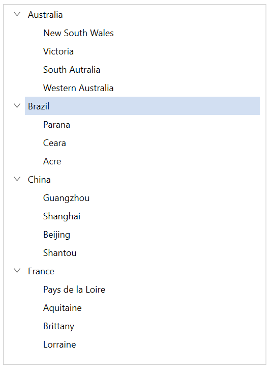
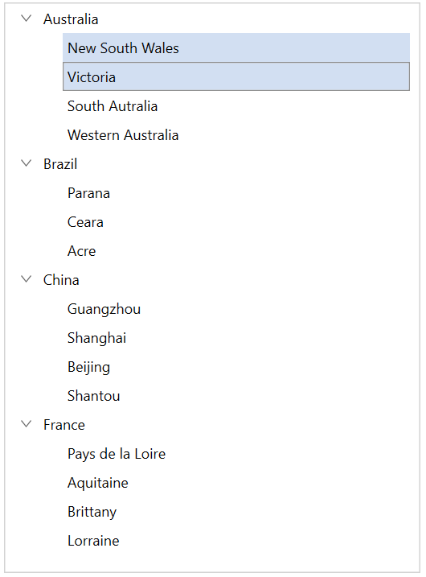

# MVVM in WPF TreeView (SfTreeView)

This section explains about how to work with MVVM pattern in TreeView.

## Binding properties in MVVM pattern

### Binding SelectedItem

TreeView support to select the items through binding the [SelectedItem](https://help.syncfusion.com/cr/wpf/Syncfusion.UI.Xaml.TreeView.SfTreeView.html#Syncfusion_UI_Xaml_TreeView_SfTreeView_SelectedItem) property from view model by implementing the `INotifyPropertyChanged` interface that gives the call back notification to UI.



<syncfusion:SfTreeView 
            x:Name="sfTreeView"
            SelectedItem="{Binding SelectedNode}"      
            ChildPropertyName="Models"
            ItemTemplateDataContextType="Node"
            ItemsSource="{Binding Items}" >
</syncfusion:SfTreeView>



sfTreeView.SetBinding(SfTreeView.SelectedItemProperty, new Binding("SelectedNode"));






 public class ViewModel : NotificationObject
 {
     public ObservableCollection<Model> Items { get; set; }

     public object SelectedNode { get; set; }
     public ViewModel()
     {
         Items = new ObservableCollection<Model>();
                  
         var country1 = new Model { State = "Australia" };
         var country2 = new Model { State = "Brazil" };
         var country3 = new Model { State = "China" };
         var country4 = new Model { State = "France" };            

         var aus_state1 = new Model { State = "New South Wales" };
         var aus_state2 = new Model { State = "Victoria" };
         var aus_state3 = new Model { State = "South Autralia" };
         var aus_state4 = new Model { State = "Western Australia" };

         var brazil_state1 = new Model { State = "Parana" };
         var brazil_state2 = new Model { State = "Ceara" };
         var brazil_state3 = new Model { State = "Acre" };

         var china_state1 = new Model { State = "Guangzhou" };
         var china_state2 = new Model { State = "Shanghai" };
         var china_state3 = new Model { State = "Beijing" };
         var china_state4 = new Model { State = "Shantou" };

         var france_state1 = new Model { State = "Pays de la Loire" };
         var france_state2 = new Model { State = "Aquitaine" };
         var france_state3 = new Model { State = "Brittany" };
         var france_state4 = new Model { State = "Lorraine" };
       
         country1.Models.Add(aus_state1);
         country1.Models.Add(aus_state2);
         country1.Models.Add(aus_state3);
         country1.Models.Add(aus_state4);

         country2.Models.Add(brazil_state1);
         country2.Models.Add(brazil_state2);
         country2.Models.Add(brazil_state3);

         country3.Models.Add(china_state1);
         country3.Models.Add(china_state2);
         country3.Models.Add(china_state3);
         country3.Models.Add(china_state4);

         country4.Models.Add(france_state1);
         country4.Models.Add(france_state2);
         country4.Models.Add(france_state3);
         country4.Models.Add(france_state4);

         Items.Add(country1);
         Items.Add(country2);
         Items.Add(country3);
         Items.Add(country4);

         SelectedNode = country2;
     }        
 }



### Binding SelectedItems

TreeView support to select multiple items through binding the [SelectedItems](https://help.syncfusion.com/cr/wpf/Syncfusion.UI.Xaml.TreeView.SfTreeView.html#Syncfusion_UI_Xaml_TreeView_SfTreeView_SelectedItems) property from view model with `ObservableCollection<object>` type. 



<syncfusion:SfTreeView 
            x:Name="sfTreeView"
            SelectionMode="Multiple"
            SelectedItems="{Binding SelectedNodes}"   
            ChildPropertyName="Models"
            ItemsSource="{Binding Items}" >
</syncfusion:SfTreeView>


sfTreeView.SelectionMode = SelectionMode.Multiple;
sfTreeView.SetBinding(SfTreeView.SelectedItemsProperty, new Binding("SelectedNodes"));





public class ViewModel : NotificationObject
{
    public ObservableCollection<Model> Items { get; set; }

    public ObservableCollection<object> SelectedNodes { get; set; }
    public ViewModel()
    {
        Items = new ObservableCollection<Model>();
        SelectedNodes = new ObservableCollection<object>();
                 
        var country1 = new Model { State = "Australia" };
        var country2 = new Model { State = "Brazil" };
        var country3 = new Model { State = "China" };
        var country4 = new Model { State = "France" };            

        var aus_state1 = new Model { State = "New South Wales" };
        var aus_state2 = new Model { State = "Victoria" };
        var aus_state3 = new Model { State = "South Autralia" };
        var aus_state4 = new Model { State = "Western Australia" };

        var brazil_state1 = new Model { State = "Parana" };
        var brazil_state2 = new Model { State = "Ceara" };
        var brazil_state3 = new Model { State = "Acre" };

        var china_state1 = new Model { State = "Guangzhou" };
        var china_state2 = new Model { State = "Shanghai" };
        var china_state3 = new Model { State = "Beijing" };
        var china_state4 = new Model { State = "Shantou" };

        var france_state1 = new Model { State = "Pays de la Loire" };
        var france_state2 = new Model { State = "Aquitaine" };
        var france_state3 = new Model { State = "Brittany" };
        var france_state4 = new Model { State = "Lorraine" };
      
        country1.Models.Add(aus_state1);
        country1.Models.Add(aus_state2);
        country1.Models.Add(aus_state3);
        country1.Models.Add(aus_state4);

        country2.Models.Add(brazil_state1);
        country2.Models.Add(brazil_state2);
        country2.Models.Add(brazil_state3);

        country3.Models.Add(china_state1);
        country3.Models.Add(china_state2);
        country3.Models.Add(china_state3);
        country3.Models.Add(china_state4);

        country4.Models.Add(france_state1);
        country4.Models.Add(france_state2);
        country4.Models.Add(france_state3);
        country4.Models.Add(france_state4);

        Items.Add(country1);
        Items.Add(country2);
        Items.Add(country3);
        Items.Add(country4);

        SelectedNodes.Add(aus_state1);
        SelectedNodes.Add(aus_state2);
    }        
}




N> View sample in [GitHub](https://github.com/SyncfusionExamples/How-to-bind-selected-items-in-wpf-treeview).

## Event to command

The `TreeView` event can be converted into commands using [Behaviors](https://devblogs.microsoft.com/dotnet/open-sourcing-xaml-behaviors-for-wpf/). To achieve this, create a command in the ViewModel class and associate it to the TreeView event using `Behaviors`.



<syncfusion:SfTreeView 
            x:Name="sfTreeView"
            Margin="20"
            BorderThickness="1"
            SelectionMode="Multiple"
            AutoExpandMode="AllNodes"
            BorderBrush="LightGray"   
            ChildPropertyName="Models"
            ItemTemplateDataContextType="Node"
            ItemsSource="{Binding Items}">
    <syncfusion:SfTreeView.ItemTemplate>
        <DataTemplate>
            <Grid>
                <TextBlock FontSize="12" VerticalAlignment="Center" Text="{Binding Content.State}" />
            </Grid>
        </DataTemplate>
    </syncfusion:SfTreeView.ItemTemplate>
    <I:Interaction.Triggers>
        <I:EventTrigger EventName="SelectionChanged" >
            <cmd:EventToCommand Command="{Binding SelectionChangedCommand}" PassEventArgsToCommand="True" />
        </I:EventTrigger>
    </I:Interaction.Triggers>
</syncfusion:SfTreeView>


public class ViewModel : NotificationObject
{
    public ObservableCollection<Model> Items { get; set; }

    private ICommand selectionChangedCommand;

    public ICommand SelectionChangedCommand
    {
        get
        {
            return selectionChangedCommand;
        }
        set
        {
            selectionChangedCommand = value;
        }
    }
   
    public ViewModel()
    {
        Items = new ObservableCollection<Model>();

        SelectionChangedCommand = new BaseCommand(OnSelectionChanged);

        var country1 = new Model { State = "Australia" };
        var country2 = new Model { State = "Brazil" };
        var country3 = new Model { State = "China" };
        var country4 = new Model { State = "France" };            

        var aus_state1 = new Model { State = "New South Wales" };
        var aus_state2 = new Model { State = "Victoria" };
        var aus_state3 = new Model { State = "South Autralia" };
        var aus_state4 = new Model { State = "Western Australia" };

        var brazil_state1 = new Model { State = "Parana" };
        var brazil_state2 = new Model { State = "Ceara" };
        var brazil_state3 = new Model { State = "Acre" };

        var china_state1 = new Model { State = "Guangzhou" };
        var china_state2 = new Model { State = "Shanghai" };
        var china_state3 = new Model { State = "Beijing" };
        var china_state4 = new Model { State = "Shantou" };

        var france_state1 = new Model { State = "Pays de la Loire" };
        var france_state2 = new Model { State = "Aquitaine" };
        var france_state3 = new Model { State = "Brittany" };
        var france_state4 = new Model { State = "Lorraine" };
      
        country1.Models.Add(aus_state1);
        country1.Models.Add(aus_state2);
        country1.Models.Add(aus_state3);
        country1.Models.Add(aus_state4);

        country2.Models.Add(brazil_state1);
        country2.Models.Add(brazil_state2);
        country2.Models.Add(brazil_state3);

        country3.Models.Add(china_state1);
        country3.Models.Add(china_state2);
        country3.Models.Add(china_state3);
        country3.Models.Add(china_state4);

        country4.Models.Add(france_state1);
        country4.Models.Add(france_state2);
        country4.Models.Add(france_state3);
        country4.Models.Add(france_state4);

        Items.Add(country1);
        Items.Add(country2);
        Items.Add(country3);
        Items.Add(country4);
    }

    private void OnSelectionChanged(object obj)
    {
        var args = obj as ItemSelectionChangedEventArgs;
        if (args.AddedItems.Count > 0)
            MessageBox.Show("Selected State: " + (args.AddedItems[0] as Model).State.ToString());
    }
}




N> View sample in [GitHub](https://github.com/SyncfusionExamples/How-to-convert-event-to-command-in-MVVM-pattern-in-wpf-treeview).

