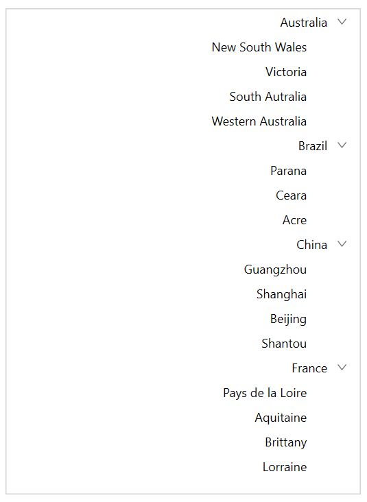

# Right to left(RTL) in WPF TreeView (SfTreeView)

TreeView supports to change the flow of text to the right-to-left direction by setting the [FlowDirection](https://docs.microsoft.com/en-us/dotnet/api/system.windows.frameworkelement.flowdirection?view=netframework-4.0) to `RightToLeft`. 




<syncfusion:SfTreeView x:Name="sfTreeView" FlowDirection="RightToLeft"/>




sfTreeView.FlowDirection = FlowDirection.RightToLeft;




