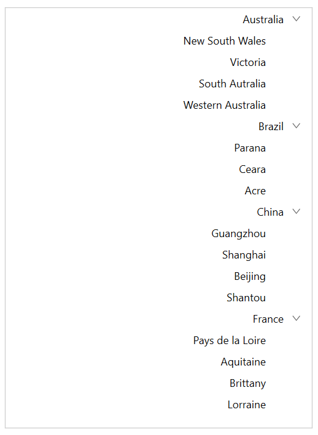

# Right-to-left (RTL) in WPF TreeView

The [WPF TreeView](https://www.syncfusion.com/wpf-controls/treeview) control supports changing the text flow to the right-to-left direction by setting the [FlowDirection](https://docs.microsoft.com/en-us/dotnet/api/system.windows.frameworkelement.flowdirection?view=netframework-4.0) property to `RightToLeft`. The WPF TreeView is implemented through the `SfTreeView` class.




<syncfusion:SfTreeView x:Name="sfTreeView" FlowDirection="RightToLeft"/>




sfTreeView.FlowDirection = FlowDirection.RightToLeft;




N> You can refer to our [WPF TreeView](https://www.syncfusion.com/wpf-controls/treeview) feature tour page for its key feature highlights. You can also explore our [WPF TreeView example](https://github.com/syncfusion/wpf-demos) to know how to represent hierarchical data in a tree-like structure with expand and collapse node options.

