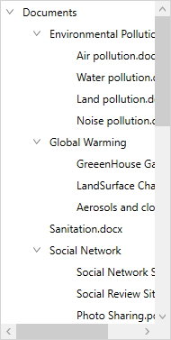

# Scrolling in in WPF TreeView(SfTreeView)
The TreeView provides various options to achieve programmatic scrolling. Please walkthrough the below section in detail to achieve the same.

## Bring Into View

The TreeView allows programmatic scrolling based on the data model and [TreeViewNode](https://help.syncfusion.com/cr/wpf/Syncfusion.UI.Xaml.TreeView.Engine.TreeViewNode.html) by using the [BringIntoView](https://help.syncfusion.com/cr/wpf/Syncfusion.UI.Xaml.TreeView.SfTreeView.html#Syncfusion_UI_Xaml_TreeView_SfTreeView_BringIntoView_Syncfusion_UI_Xaml_TreeView_Engine_TreeViewNode_System_Boolean_System_Boolean_Syncfusion_UI_Xaml_TreeView_ScrollToPosition_) method.



private void BringIntoView_Click(object sender, RoutedEventArgs e)
{
    var count = viewModel.Items.Count;
    var data = viewModel.Items[count - 1];
    sfTreeView.BringIntoView(data);
}




N> View sample in [GitHub](https://github.com/SyncfusionExamples/How-to-bring-the-tree-node-into-view-by-scrolling-in-wpf-treeview).

The `BringIntoView` method comprises of other optional parameters to decide on the way in which the child item should come into view. 

### Scroll to the child item with animation

The second optional parameter `disableAnimation` in `BringIntoView` method decides whether the scrolling animation should be enabled or disabled when the child item comes into view. By default, the scrolling will be animated.

* If the parameter value is `true`, scrolling animation will be disabled.
* If the parameter value is `false`, scrolling animation will be enabled.



private void BringIntoView_Click(object sender, RoutedEventArgs e)
{
    var count = viewModel.Items.Count;
    var data = viewModel.Items[count - 1];
    // Here, the second optional parameter has been passed as true hence it will disable the animation
    sfTreeView.BringIntoView(data, true);
}



### Scroll to the collapsed child item

 The third optional parameter `canExpand` in `BringIntoView` method decides whether we need to expand and show the collapsed node or not when item passed for `BringIntoView` method which is in collapsed state. By default, this parameter value will be `false`.
 
 * If the parameter value is `true`, TreeView expands the collapsed node if it is collapsed and scroll to the specified item.
 * If the parameter value is `false`, TreeView does not expand the collapsed node and only scroll for item which is not in collapsed state.



private void BringIntoView_Click(object sender, RoutedEventArgs e)
{
    var count = viewModel.Items.Count;
    var data = viewModel.Items[count - 1];
    sfTreeView.BringIntoView(data, false,true);
}



N> We need to set the [NodePopulationMode](https://help.syncfusion.com/cr/wpf/Syncfusion.UI.Xaml.TreeView.SfTreeView.html#Syncfusion_UI_Xaml_TreeView_SfTreeView_NodePopulationMode) API value as `TreeNodePopulationMode.Instant` for scrolling to the collapsed item in addition to the additional parameter passed to the `BringIntoView` method.

### Scroll the item into specified position

The fourth optional parameter `scrollToPosition` in `BringIntoView` method allows to position the scrolled item in the view. The scrolled item can take either of the four positions as explained below. The default position is `Start`.

* `Start`: Scroll to make the node positioned at the start of the view.
* `MakeVisible`: Scroll to make a specified node visible in the view. If the specified node is already in view, scrolling will not occur.
* `Center`: Scroll to make the node positioned at the center of the view.
* `End`: Scroll to make the node positioned at the end of the view.



private void BringIntoView_Click(object sender, RoutedEventArgs e)
{
    var count = viewModel.Items.Count;
    var data = viewModel.Items[count - 1];
    // Scrolls to the data item to make visible in the view.
    sfTreeView.BringIntoView(data,false,true,ScrollToPosition.MakeVisible);
}



## Horizontal Scrolling

By default, horizontal scrollbar is not enabled in the TreeView. If you want to enable horizontal scrolling based on the content, you should set [ScrollView.HorizontalScrollBarVisibility](https://docs.microsoft.com/en-us/dotnet/api/system.windows.controls.scrollviewer.horizontalscrollbarvisibility?view=netcore-3.1) as `Auto`. 



<syncfusion:SfTreeView  
                x:Name="treeView" 
                ScrollViewer.HorizontalScrollBarVisibility="Auto" 
                AutoExpandMode="AllNodes"
                IsAnimationEnabled="True" 
                ItemsSource="{Binding Countries}"/>



