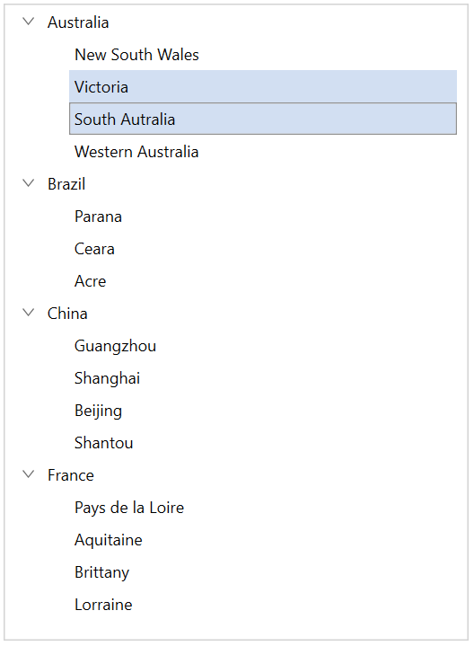

# Selection in WPF TreeView (SfTreeView)

This section explains how to perform selection and its related operations in the TreeView.

## UI Selection
The TreeView allows selecting the items either programmatically or touch interactions by setting the [SelectionMode](https://help.syncfusion.com/cr/wpf/Syncfusion.UI.Xaml.TreeView.SfTreeView.html#Syncfusion_UI_Xaml_TreeView_SfTreeView_SelectionMode) property value to other than `None`. The control has different selection modes to perform selection operations as listed as follows.

* `None`: Allows disabling the selection.
* `Single`: Allows selecting the single item only. When clicking on the selected item, selection will not be cleared. This is the default value for `SelectionMode`.
* `SingleDeselect`: Allows selecting the single item only. When clicking on the selected item, selection gets cleared.
* `Multiple`: Allows selecting more than one item. Selection is not cleared when selecting more than one items. When clicking on the selected item, selection gets cleared.
* `Extended`: Allows to select the multiple items using the common key modifiers.



<syncfusion:SfTreeView x:Name="sfTreeView" SelectionMode="Multiple"/>


sfTreeView.SelectionMode = SelectionMode.Multiple;



## Programmatic Selection

When the [SelectionMode](https://help.syncfusion.com/cr/wpf/Syncfusion.UI.Xaml.TreeView.SfTreeView.html#Syncfusion_UI_Xaml_TreeView_SfTreeView_SelectionMode) is other than `None`, the item or items in the TreeView can be selected from the code by setting the [SelectedItem](https://help.syncfusion.com/cr/wpf/Syncfusion.UI.Xaml.TreeView.SfTreeView.html#Syncfusion_UI_Xaml_TreeView_SfTreeView_SelectedItem), or adding items to the [SelectedItems](https://help.syncfusion.com/cr/wpf/Syncfusion.UI.Xaml.TreeView.SfTreeView.html#Syncfusion_UI_Xaml_TreeView_SfTreeView_SelectedItems) property based on the `SelectionMode`.

When the selection mode is `Single` or `SingleDeselect`, programmatically select an item by setting the underlying object to the [SelectedItem](https://help.syncfusion.com/cr/wpf/Syncfusion.UI.Xaml.TreeView.SfTreeView.html#Syncfusion_UI_Xaml_TreeView_SfTreeView_SelectedItem) property.




sfTreeView.SelectedItem = viewModel.Items[0];




When the selection mode is `Multiple`, programmatically select more than one item by adding the underlying object to the [SelectedItems](https://help.syncfusion.com/cr/wpf/Syncfusion.UI.Xaml.TreeView.SfTreeView.html#Syncfusion_UI_Xaml_TreeView_SfTreeView_SelectedItems) property.




sfTreeView.SelectedItems.Add(viewModel.Items[2]);
sfTreeView.SelectedItems.Add(viewModel.Items[3]);




W> If an item is selected programmatically when `SelectionMode` is `None` and if multiple items are programmatically selected when `SelectionMode` is `Single` or `SingleDeselect`, then exception will be thrown internally.

## Select the nodes based on property of underlying data object

You can bind selection state of node to the bool property in underlying data object by using [IsSelectedPropertyName](https://help.syncfusion.com/cr/wpf/Syncfusion.UI.Xaml.TreeView.Engine.HierarchyPropertyDescriptor.html#Syncfusion_UI_Xaml_TreeView_Engine_HierarchyPropertyDescriptor_IsSelectedPropertyName) property. TreeView updates the selection of node when underlying data object property gets changed and vice versa.




<treeView:SfTreeView x:Name="treeView"
         ItemsSource="{Binding Folders}">
    <treeView:SfTreeView.HierarchyPropertyDescriptors>        
        <treeView:HierarchyPropertyDescriptor IsSelectedPropertyName="IsSelected" ChildPropertyName="SubFiles" TargetType="local:FileManager" />
    </treeView:SfTreeView.HierarchyPropertyDescriptors>
</treeView:SfTreeView>




public class FileManager : INotifyPropertyChanged
{
    private string fileName;        
    private ObservableCollection<FileManager> subFiles;
    private bool isSelected;

    public ObservableCollection<FileManager> SubFiles
    {
        get { return subFiles; }
        set
        {
            subFiles = value;
            RaisedOnPropertyChanged("SubFiles");
        }
    }

    public string ItemName
    {
        get { return fileName; }
        set
        {
            fileName = value;
            RaisedOnPropertyChanged("ItemName");
        }
    }

    public bool IsSelected
    {
        get { return isSelected; }
        set
        {
            isSelected = value;
            RaisedOnPropertyChanged("IsSelected");
        }
    }

    public event PropertyChangedEventHandler PropertyChanged;

    public void RaisedOnPropertyChanged(string _PropertyName)
    {
        if (PropertyChanged != null)
        {
            PropertyChanged(this, new PropertyChangedEventArgs(_PropertyName));
        }
    }
}

public class FileManagerViewModel
{
    private ObservableCollection<FileManager> folders;

    public FileManagerViewModel()
    {
        GenerateSource();            
    }

    public ObservableCollection<FileManager> Folders
    {
        get { return folders; }
        set { this.folders = value; }
    }

    private void GenerateSource()
    {
        var fileManager = new ObservableCollection<FileManager>();
        
        var doc = new FileManager() { ItemName = "Documents", IsSelected = true };
        var download = new FileManager() { ItemName = "Downloads",  IsSelected = false };
        
        var pollution = new FileManager() { ItemName = "Environmental Pollution.docx"};
        var globalWarming = new FileManager() { ItemName = "Global Warming.ppt" };
        var sanitation = new FileManager() { ItemName = "Sanitation.docx"};
        var socialNetwork = new FileManager() { ItemName = "Social Network.pdf", IsSelected = true };
        var youthEmpower = new FileManager() { ItemName = "Youth Empowerment.pdf" };

        var games = new FileManager() { ItemName = "Game.exe" };
        var tutorials = new FileManager() { ItemName = "Tutorials.zip" };
        var TypeScript = new FileManager() { ItemName = "TypeScript.7z"};
        var uiGuide = new FileManager() { ItemName = "UI-Guide.pdf"};
        
        doc.SubFiles = new ObservableCollection<FileManager>
        {
            pollution,
            globalWarming,
            sanitation,
            socialNetwork,
            youthEmpower
        };
     
        download.SubFiles = new ObservableCollection<FileManager>
        {
            games,
            tutorials,
            TypeScript,
            uiGuide
        };
    
        fileManager.Add(doc);
        fileManager.Add(download);
     
        folders = fileManager;
    }
}    




N> `IsSelectedPropertyName` property is not supported for unbound mode and it accepts only boolean type property.

## Selected items 

### Gets selected Items
The TreeView gets all the selected items through the `SelectedItems` property and gets the single item by using the `SelectedItem` property.

### Clear selected items
The selected items can be cleared by calling the `SelectedItems.Clear()` method.




sfTreeView.SelectedItems.Clear();




### CurrentItem vs SelectedItem

The TreeView gets the selected item by using the [SelectedItem](https://help.syncfusion.com/cr/wpf/Syncfusion.UI.Xaml.TreeView.SfTreeView.html#Syncfusion_UI_Xaml_TreeView_SfTreeView_SelectedItem) and [CurrentItem](https://help.syncfusion.com/cr/wpf/Syncfusion.UI.Xaml.TreeView.SfTreeView.html#Syncfusion_UI_Xaml_TreeView_SfTreeView_CurrentItem) properties. Both `SelectedItem` and `CurrentItem` returns the same data object when selecting single item. When selecting more than one item, the `SelectedItem` property returns the first selected item, and the `CurrentItem` property returns the last selected item.

## Selected item style

### Selection background

The TreeView allows changing the selection background color for the selected items by using the [SelectionBackgroundColor](https://help.syncfusion.com/cr/wpf/Syncfusion.UI.Xaml.TreeView.SfTreeView.html#Syncfusion_UI_Xaml_TreeView_SfTreeView_SelectionBackgroundColor) property. You can also change the selection background color at runtime.

### Selection foreground

The TreeView allows changing the selection foreground color for the selected items by using the [SelectionForegroundColor](https://help.syncfusion.com/cr/wpf/Syncfusion.UI.Xaml.TreeView.SfTreeView.html#Syncfusion_UI_Xaml_TreeView_SfTreeView_SelectionForegroundColor) property. You can also change the selection foreground color at runtime.

N> `SelectionForegroundColor` is applicable only for unbound mode.

## Events

### SelectionChanging Event

The [SelectionChanging](https://help.syncfusion.com/cr/wpf/Syncfusion.UI.Xaml.TreeView.SfTreeView.html) event is raised while selecting an item at the execution time. The [ItemSelectionChangingEventArgs](https://help.syncfusion.com/cr/wpf/Syncfusion.UI.Xaml.TreeView.ItemSelectionChangingEventArgs.html) has the following members which provides the information for `SelectionChanging` event:

* [AddedItems](https://help.syncfusion.com/cr/wpf/Syncfusion.UI.Xaml.TreeView.ItemSelectionChangingEventArgs.html#Syncfusion_UI_Xaml_TreeView_ItemSelectionChangingEventArgs_AddedItems): Gets collection of the underlying data objects where the selection is going to process.
* [RemovedItems](https://help.syncfusion.com/cr/wpf/Syncfusion.UI.Xaml.TreeView.ItemSelectionChangingEventArgs.html#Syncfusion_UI_Xaml_TreeView_ItemSelectionChangingEventArgs_RemovedItems): Gets collection of the underlying data objects where the selection is going to remove.

You can cancel the selection process within this event by setting the `ItemSelectionChangingEventArgs.Cancel` property to true.



sfTreeView.SelectionChanging += TreeView_SelectionChanging;

 private void TreeView_SelectionChanging(object sender, Syncfusion.UI.Xaml.TreeView.ItemSelectionChangingEventArgs e)
 {
     if (e.AddedItems.Count > 0 && e.AddedItems[0] == viewModel.Items[0])
     {
         e.Cancel = true;
     }
 }




### SelectionChanged event

The [SelectionChanged](https://help.syncfusion.com/cr/wpf/Syncfusion.UI.Xaml.TreeView.SfTreeView.html) event will occur once selection process has been completed for the selected item in the TreeView. The [ItemSelectionChangedEventArgs](https://help.syncfusion.com/cr/wpf/Syncfusion.UI.Xaml.TreeView.ItemSelectionChangedEventArgs.html) has the following members which provides information for `SelectionChanged` event:

* [AddedItems](https://help.syncfusion.com/cr/wpf/Syncfusion.UI.Xaml.TreeView.ItemSelectionChangedEventArgs.html#Syncfusion_UI_Xaml_TreeView_ItemSelectionChangedEventArgs_AddedItems): Gets collection of the underlying data objects where the selection has been processed.
* [RemovedItems](https://help.syncfusion.com/cr/wpf/Syncfusion.UI.Xaml.TreeView.ItemSelectionChangedEventArgs.html#Syncfusion_UI_Xaml_TreeView_ItemSelectionChangedEventArgs_RemovedItems): Gets collection of the underlying data objects where the selection has been removed.



sfTreeView.SelectionChanged += TreeView_SelectionChanged;

private void TreeView_SelectionChanged(object sender, Syncfusion.UI.Xaml.TreeView.ItemSelectionChangedEventArgs e)
{
    sfTreeView.SelectedItems.Clear();
}




N> [SelectionChanging](https://help.syncfusion.com/cr/wpf/Syncfusion.UI.Xaml.TreeView.SfTreeView.html) and [SelectionChanged](https://help.syncfusion.com/cr/wpf/Syncfusion.UI.Xaml.TreeView.SfTreeView.html) events will be triggered only on UI interactions.

## Key Navigation

The TreeView allows to select or navigate the items through keyboard interactions. When the [SelectionMode](https://help.syncfusion.com/cr/wpf/Syncfusion.UI.Xaml.TreeView.SfTreeView.html#Syncfusion_UI_Xaml_TreeView_SfTreeView_SelectionMode) is `Multiple` or `Extended`, the [FocusBorderColor](https://help.syncfusion.com/cr/wpf/Syncfusion.UI.Xaml.TreeView.SfTreeView.html#Syncfusion_UI_Xaml_TreeView_SfTreeView_FocusBorderColor) will set to the CurrentItem.

## FocusBorderColor

The [FocusBorderColor](https://help.syncfusion.com/cr/wpf/Syncfusion.UI.Xaml.TreeView.SfTreeView.html#Syncfusion_UI_Xaml_TreeView_SfTreeView_FocusBorderColor) property is used to set the border color for the current focused item. The default color is `LightSlateGray`.

## FocusBorderThickness
The [FocusBorderThickness](https://help.syncfusion.com/cr/wpf/Syncfusion.UI.Xaml.TreeView.SfTreeView.html#Syncfusion_UI_Xaml_TreeView_SfTreeView_FocusBorderThickness) property is used to set the border thickness for the current focused item. The default thickness is `1`.

## How to add selection on right click
By default, TreeView doesn't allow selection on right click. However, selection can be added in application level by adding the tree node content to TreeView.SelectedItems collection, for this we retrieve the node at the specified mouse point using [GetNodeAt](https://help.syncfusion.com/cr/wpf/Syncfusion.UI.Xaml.TreeView.SfTreeView.html#Syncfusion_UI_Xaml_TreeView_SfTreeView_GetNodeAt_System_Windows_Point_) method. 

Below is the code example, which adds the node content to selected items upon right click on the tree node by checking the exact behavior of FullRowSelect support.




<treeView:SfTreeView x:Name="treeView" 
                     AutoExpandMode="RootNodes"
                     ItemsSource="{Binding Countries}"
                     SelectionMode="Multiple"
                     MouseRightButtonDown="treeView_MouseRightButtonDown">
</treeView:SfTreeView>




private bool IsMouseOverOnExpander(Syncfusion.UI.Xaml.TreeView.TreeViewItem treeViewItem, Point point)
{
    if (treeViewItem.TreeViewItemInfo.TreeView.ExpanderPosition == ExpanderPosition.Start)
        return point.X < treeViewItem.IndentationWidth + treeViewItem.ExpanderWidth;
    else
        return point.X > (treeViewItem.ActualWidth - treeViewItem.ExpanderWidth);
}

private void treeView_MouseRightButtonDown(object sender, MouseButtonEventArgs e)
{
    var treeViewNode = this.treeView.GetNodeAt(e.GetPosition(this.treeView));
    var itemInfo = treeView.GetItemInfo(treeViewNode.Content);
    var itemPoint = e.GetPosition(itemInfo.Element);

    if (!this.treeView.FullRowSelect && IsMouseOverOnExpander(itemInfo.Element, itemPoint))
        return;

    if (this.treeView.SelectedItems == null)
        this.treeView.SelectedItems = new System.Collections.ObjectModel.ObservableCollection<object>();
    this.treeView.SelectedItems.Add(treeViewNode.Content);
}




## Limitation
* When a grid is loaded inside the [ItemTemplate](https://help.syncfusion.com/cr/wpf/Syncfusion.UI.Xaml.TreeView.SfTreeView.html#Syncfusion_UI_Xaml_TreeView_SfTreeView_ItemTemplate) with background color, the [SelectionBackgroundColor](https://help.syncfusion.com/cr/wpf/Syncfusion.UI.Xaml.TreeView.SfTreeView.html#Syncfusion_UI_Xaml_TreeView_SfTreeView_SelectionBackgroundColor) will not display. Because, it overlaps the `SelectionBackgroundColor`. In this case, set the background color for the TreeView instead of grid in the  `ItemTemplate`.
* When the `TreeView` contains duplicated items in the collection, only the first item whose instance was created initially will be selected or deselected.
