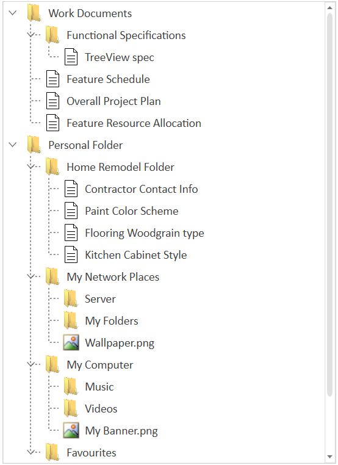
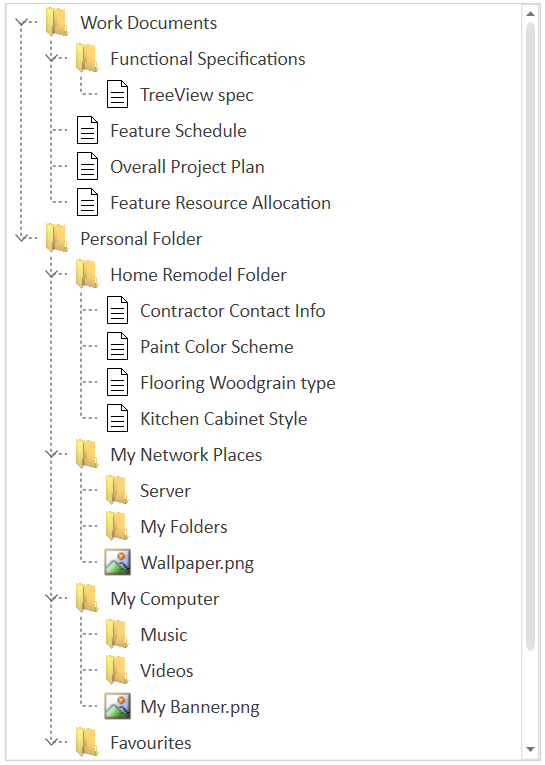
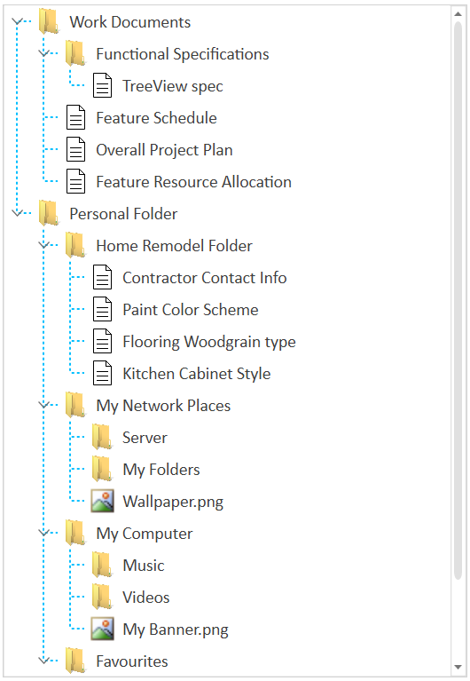
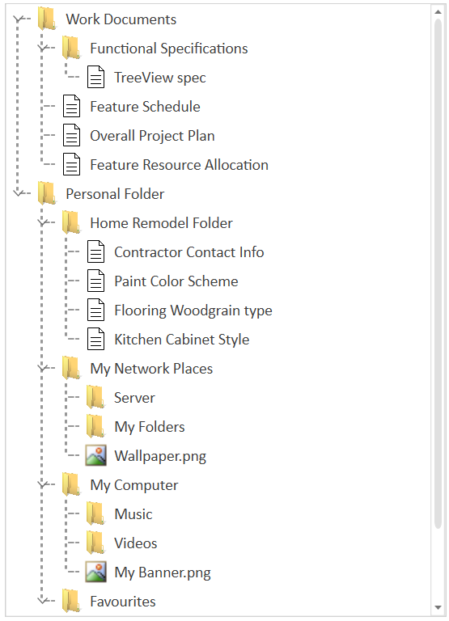

# Tree lines in WPF TreeView

The [WPF TreeView](https://www.syncfusion.com/wpf-controls/treeview) control allows you to show tree lines for its nodes by setting the [ShowLines](https://help.syncfusion.com/cr/wpf/Syncfusion.UI.Xaml.TreeView.SfTreeView.html#Syncfusion_UI_Xaml_TreeView_SfTreeView_ShowLines) property to `true`. The default value of the `ShowLines` property is `false`. The WPF TreeView is implemented through the `SfTreeView` class.



<treeview:SfTreeView
    Name="sfTreeView"    
    ShowLines="True"
    ChildPropertyName="Childs"
    ItemTemplate="{StaticResource SfTreeView_ItemTemplate}"
    ItemsSource="{Binding Nodes1}" />



sfTreeView.ShowLines = true;



## Enable tree line for root nodes

The control also supports showing tree lines for root nodes by setting the [ShowRootLines](https://help.syncfusion.com/cr/wpf/Syncfusion.UI.Xaml.TreeView.SfTreeView.html#Syncfusion_UI_Xaml_TreeView_SfTreeView_ShowRootLines) property to `true`. The default value of the `ShowRootLines` property is `false`.



<treeview:SfTreeView
    Name="sfTreeView"    
    ShowLines="True"
    ShowRootLines="True"
    ChildPropertyName="Childs"
    ItemTemplate="{StaticResource SfTreeView_ItemTemplate}"
    ItemsSource="{Binding Nodes1}" />



sfTreeView.ShowLines = true;
sfTreeView.ShowRootLines = true;



## Customizing the tree lines

### Customizing the line color
You can change the color of tree lines by using the [LineStroke](https://help.syncfusion.com/cr/wpf/Syncfusion.UI.Xaml.TreeView.SfTreeView.html#Syncfusion_UI_Xaml_TreeView_SfTreeView_LineStroke) property. The default value of the `LineStroke` property is `System.Windows.Media.Colors.LightSlateGray`.



<treeview:SfTreeView
    Name="sfTreeView"    
    ShowLines="True"
    ShowRootLines="True"
    LineStroke="DeepSkyBlue"
    ChildPropertyName="Childs"
    ItemTemplate="{StaticResource SfTreeView_ItemTemplate}"
    ItemsSource="{Binding Nodes1}" />


sfTreeView.ShowLines = true;
sfTreeView.ShowRootLines = true;
sfTreeView.LineStroke = new SolidColorBrush(Colors.DeepSkyBlue);



### Customizing the line thickness
You can change the thickness of tree lines by using the [LineStrokeThickness](https://help.syncfusion.com/cr/wpf/Syncfusion.UI.Xaml.TreeView.SfTreeView.html#Syncfusion_UI_Xaml_TreeView_SfTreeView_LineStrokeThickness) property. The default value of the `LineStrokeThickness` property is `1`.



<treeview:SfTreeView
            Name="sfTreeView"           
            ShowLines="True"
            ShowRootLines="True"
            LineStrokeThickness="1.5"
            ChildPropertyName="Childs"
            ItemTemplate="{StaticResource SfTreeView_ItemTemplate}"
            ItemsSource="{Binding Nodes1}" />        


sfTreeView.ShowLines = true;
sfTreeView.ShowRootLines = true;
sfTreeView.LineStrokeThickness = 1.5;



N> You can refer to our [WPF TreeView](https://www.syncfusion.com/wpf-controls/treeview) feature tour page for its key feature highlights. You can also explore our [WPF TreeView example](https://github.com/syncfusion/wpf-demos) to know how to represent hierarchical data in a tree-like structure with expand and collapse node options.
