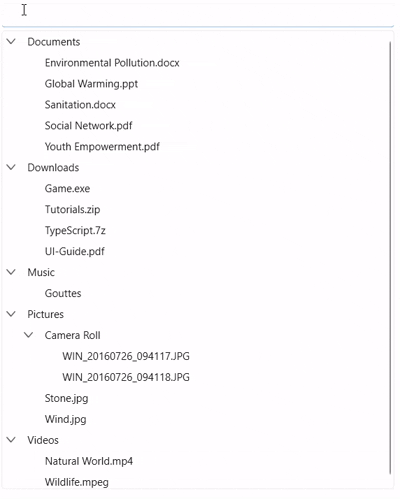

# Empty Content in WPF TreeView (SfTreeView)

The [SfTreeView](https://help.syncfusion.com/cr/wpf/Syncfusion.UI.Xaml.TreeView.html) control allows you to display and customize **empty content** when no data is available. The `EmptyContent` property can be set to either a string or any object, and it will be displayed when the [ItemsSource](https://help.syncfusion.com/cr/wpf/Syncfusion.UI.Xaml.TreeView.SfTreeView.html#Syncfusion_UI_Xaml_TreeView_SfTreeView_ItemsSource) is **null** or **empty**, or when the [Nodes](https://help.syncfusion.com/cr/wpf/Syncfusion.UI.Xaml.TreeView.SfTreeView.html#Syncfusion_UI_Xaml_TreeView_SfTreeView_Nodes) collection is **empty**. Use `EmptyContentTemplate` to customize the appearance of `EmptyContent`.

## Display text when TreeView has no items
The `EmptyContent` property in `SfTreeView` can be set to a string, which will be displayed when no items are present in the TreeView.



<Window x:Class="Samples.EmptyContentDemo"
        xmlns:syncfusion="http://schemas.syncfusion.com/wpf"
        Title="EmptyContent Text" Height="300" Width="400">
    <Grid>
        <syncfusion:SfTreeView x:Name="treeView"
                               ItemsSource="{Binding Items}"
                               EmptyContent="No Items"/>
    </Grid>
</Window>


SfTreeView treeView = new SfTreeView();
treeView.ItemsSource = viewModel.Items;
treeView.EmptyContent = "No Items";



## Display custom UI when TreeView has no items

The `SfTreeView` control allows you to fully customize how empty content is displayed by using the `EmptyContentTemplate` property. This property lets you define a custom UI layout using a `DataTemplate`.



<Grid>
    <syncfusion:SfTreeView
        Grid.Row="1"
        x:Name="treeView"
        BorderThickness="1"
        AutoExpandMode="AllNodes"
        FocusVisualStyle="{x:Null}"
        IsAnimationEnabled="True"
        ItemsSource="{Binding CollectionView}"
        ChildPropertyName="SubFiles">
        <syncfusion:SfTreeView.ItemTemplate>
            <DataTemplate>
                <Grid>
                    <TextBlock VerticalAlignment="Center"
                           Text="{Binding FileName}" />
                </Grid>
            </DataTemplate>
        </syncfusion:SfTreeView.ItemTemplate>
         <syncfusion:SfTreeView.EmptyContentTemplate>
            <DataTemplate>
                <Border Padding="10" BorderBrush="Blue" 
                        BorderThickness="2" CornerRadius="6">
                    <TextBlock Text="No Items Found"
                               FontSize="16" FontWeight="Bold"/>
                </Border>
            </DataTemplate>
        </syncfusion:SfTreeView.EmptyContentTemplate>
    </syncfusion:SfTreeView>
</Grid>




## Binding Empty Content from ViewModel
`SfTreeView` supports data binding of `EmptyContent`, allowing you to update the empty content dynamically from the ViewModel.



<Grid>
    <Grid.DataContext>
	  <local:EmptyContentBindingViewModel/>
	</Grid.DataContext>
    <syncfusion:SfTreeView x:Name="treeView"
                           ItemsSource="{Binding Items}"
                           EmptyContent="{Binding EmptyContentText}"/>
</Grid>


public class EmptyContentBindingViewModel : INotifyPropertyChanged
{
    private string _emptyContentText = "No items to display";
    public event PropertyChangedEventHandler? PropertyChanged;

    public string EmptyContentText
    {
        get => _emptyContentText;
        set 
        { 
           if (_emptyContentText == value) 
                  return; 
           emptyContentText = value; 
           PropertyChanged?.Invoke(this, new PropertyChangedEventArgs(nameof(EmptyContentText))); 
        }
    }
}



