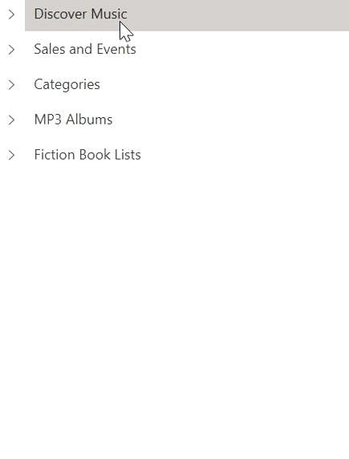

# Load on demand

TreeView allows you to load child items only when they are requested using Load on-demand(Lazy load). It helps to load the child items from services when end-user expands the node. Initially populate the root [Nodes](https://help.syncfusion.com/cr/wpf/Syncfusion.SfTreeView.WPF~Syncfusion.UI.Xaml.TreeView.SfTreeView~Nodes.html) by assigning [ItemsSource](https://help.syncfusion.com/cr/wpf/Syncfusion.SfTreeView.WPF~Syncfusion.UI.Xaml.TreeView.SfTreeView~ItemsSource.html) and then when any node is expanded, child items can be loaded using [LoadOnDemandCommand](https://help.syncfusion.com/cr/wpf/Syncfusion.SfTreeView.WPF~Syncfusion.UI.Xaml.TreeView.SfTreeView~LoadOnDemandCommand.html). Load on-demand is applicable for bound mode only.



<Window
    x:Class="LoadOnDemandDemo.LoadOnDemand"
    xmlns="http://schemas.microsoft.com/winfx/2006/xaml/presentation"
    xmlns:x="http://schemas.microsoft.com/winfx/2006/xaml"
    xmlns:d="http://schemas.microsoft.com/expression/blend/2008"
    xmlns:local="clr-namespace:LoadOnDemandDemo"
    xmlns:mc="http://schemas.openxmlformats.org/markup-compatibility/2006"
    xmlns:syncfusion="http://schemas.syncfusion.com/wpf"
    Title="Load On Demand"   
    mc:Ignorable="d">
    <Window.DataContext>
        <local:MusicInfoRepository />
    </Window.DataContext>
    <Grid>
        <syncfusion:SfTreeView
            x:Name="sfTreeView"
            Margin="10"
            AllowDragging="True"
            BorderBrush="LightGray"
            BorderThickness="1"
            ExpandActionTrigger="Node"
            FocusVisualStyle="{x:Null}"
            IsAnimationEnabled="True"
            ItemHeight="30"
            LoadOnDemandCommand="{Binding TreeViewOnDemandCommand}"
            ItemsSource="{Binding Menu}" >
            <syncfusion:SfTreeView.ItemTemplate>
                <DataTemplate>
                    <Label
                        VerticalContentAlignment="Center"
                        Content="{Binding ItemName}"
                        FocusVisualStyle="{x:Null}"
                        FontSize="12" />
                </DataTemplate>
            </syncfusion:SfTreeView.ItemTemplate>
        </syncfusion:SfTreeView>
    </Grid>
</Window>


 /// 

 /// ViewModel class that implements <see cref="Command"/> for load on demand. 
 /// 

 public class MusicInfoRepository
 {
     DispatcherTimer timer;
     TreeViewNode currentNode;

     private ObservableCollection<MusicInfo> menu;

     public ObservableCollection<MusicInfo> Menu
     {
         get { return menu; }
         set { menu = value; }
     }
     private ICommand treeViewOnDemandCommand;
     public ICommand TreeViewOnDemandCommand
     {
         get{ return treeViewOnDemandCommand; }
         set{ treeViewOnDemandCommand = value; }
     }

     public MusicInfoRepository()
     {
         timer = new DispatcherTimer();
         timer.Interval = new TimeSpan(0, 0, 0, 0, 2000);
         timer.Tick += Timer_Tick;
         this.Menu = this.GetMenuItems();
         TreeViewOnDemandCommand = new OnDemandCommand(ExecuteOnDemandLoading, CanExecuteOnDemandLoading);
     }

     private void Timer_Tick(object sender, EventArgs e)
     {
         MusicInfo musicInfo = currentNode.Content as MusicInfo;

         //Fetching child items to add
         var items = GetSubMenu(musicInfo.ID);

         // Populating child items for the node in on-demand
         currentNode.PopulateChildNodes(items);
         if (items.Count() > 0)
             //Expand the node after child items are added.
             currentNode.IsExpanded = true;

         //Stop the animation after load on demand is executed, if animation not stopped, it remains still after execution of load on demand.
         currentNode.ShowExpanderAnimation = false;
         timer.Stop();
     }

     /// 

     /// CanExecute method is called before expanding and initialization of node. Returns whether the node has child nodes or not.
     /// Based on return value, expander visibility of the node is handled.  
     /// 

     /// <param name="sender">TreeViewNode is passed as default parameter </param>
     /// <returns>Returns true, if the specified node has child items to load on demand and expander icon is displayed for that node, else returns false and icon is not displayed.</returns>
     private bool CanExecuteOnDemandLoading(object sender)
     {
         var hasChildNodes = ((sender as TreeViewNode).Content as MusicInfo).HasChildNodes;
         if (hasChildNodes)
             return true;
         else
             return false;
     }

     /// 

     /// Execute method is called when any item is requested for load-on-demand items.
     /// 

     /// <param name="obj">TreeViewNode is passed as default parameter </param>
     private void ExecuteOnDemandLoading(object obj)
     {
         var node = obj as TreeViewNode;

         // Skip the repeated population of child items when every time the node expands.
         if (node.ChildNodes.Count > 0)
         {
             node.IsExpanded = true;
             return;
         }

         //Animation starts for expander to show progressing of load on demand
         node.ShowExpanderAnimation = true;
         var treeView = Application.Current.MainWindow.FindName("sfTreeView") as SfTreeView;
         treeView.Dispatcher.BeginInvoke(DispatcherPriority.ApplicationIdle, new Action(() =>
         {
             currentNode = node;
             timer.Start();
         }));
     }

     private ObservableCollection<MusicInfo> GetMenuItems()
     {
         ObservableCollection<MusicInfo> menuItems = new ObservableCollection<MusicInfo>();
         menuItems.Add(new MusicInfo() { ItemName = "Discover Music", HasChildNodes = true, ID = 1 });
         menuItems.Add(new MusicInfo() { ItemName = "Sales and Events", HasChildNodes = true, ID = 2 });
         menuItems.Add(new MusicInfo() { ItemName = "Categories", HasChildNodes = true, ID = 3 });
         menuItems.Add(new MusicInfo() { ItemName = "MP3 Albums", HasChildNodes = true, ID = 4 });
         menuItems.Add(new MusicInfo() { ItemName = "Fiction Book Lists", HasChildNodes = true, ID = 5 });
         return menuItems;
     }

     public IEnumerable<MusicInfo> GetSubMenu(int iD)
     {
         ObservableCollection<MusicInfo> menuItems = new ObservableCollection<MusicInfo>();
         if (iD == 1)
         {
             menuItems.Add(new MusicInfo() { ItemName = "Hot Singles", HasChildNodes = false, ID = 11 });
             menuItems.Add(new MusicInfo() { ItemName = "Rising Artists", HasChildNodes = false, ID = 12 });
             menuItems.Add(new MusicInfo() { ItemName = "Live Music", HasChildNodes = false, ID = 13 });
             menuItems.Add(new MusicInfo() { ItemName = "More in Music", HasChildNodes = true, ID = 14 });
         }
         else if (iD == 2)
         {
             menuItems.Add(new MusicInfo() { ItemName = "100 Albums - $10 Each", HasChildNodes = false, ID = 21 });
             menuItems.Add(new MusicInfo() { ItemName = "Hip-Hop and R&B Sale", HasChildNodes = false, ID = 22 });
             menuItems.Add(new MusicInfo() { ItemName = "CD Deals", HasChildNodes = false, ID = 23 });
         }
         else if (iD == 3)
         {
             menuItems.Add(new MusicInfo() { ItemName = "Songs", HasChildNodes = false, ID = 31 });
             menuItems.Add(new MusicInfo() { ItemName = "Bestselling Albums", HasChildNodes = false, ID = 32 });
             menuItems.Add(new MusicInfo() { ItemName = "New Releases", HasChildNodes = false, ID = 33 });
             menuItems.Add(new MusicInfo() { ItemName = "MP3 Albums", HasChildNodes = false, ID = 34 });

         }
         else if (iD == 4)
         {
             menuItems.Add(new MusicInfo() { ItemName = "Rock Music", HasChildNodes = false, ID = 41 });
             menuItems.Add(new MusicInfo() { ItemName = "Gospel", HasChildNodes = false, ID = 42 });
             menuItems.Add(new MusicInfo() { ItemName = "Latin Music", HasChildNodes = false, ID = 43 });
             menuItems.Add(new MusicInfo() { ItemName = "Jazz", HasChildNodes = false, ID = 44 });
         }
         else if (iD == 5)
         {
             menuItems.Add(new MusicInfo() { ItemName = "Hunger Games", HasChildNodes = false, ID = 51 });
             menuItems.Add(new MusicInfo() { ItemName = "Pride and Prejudice", HasChildNodes = false, ID = 52 });
             menuItems.Add(new MusicInfo() { ItemName = "Harry Potter", HasChildNodes = false, ID = 53 });
             menuItems.Add(new MusicInfo() { ItemName = "Game Of Thrones", HasChildNodes = false, ID = 54 });
         }
         else if (iD == 14)
         {
             menuItems.Add(new MusicInfo() { ItemName = "Music Trade-In", HasChildNodes = false, ID = 141 });
             menuItems.Add(new MusicInfo() { ItemName = "Redeem a Gift card", HasChildNodes = false, ID = 142 });
             menuItems.Add(new MusicInfo() { ItemName = "Band T-Shirts", HasChildNodes = false, ID = 143 });
         }
         return menuItems;
     }
 }


/// 

/// Model
/// 

public class MusicInfo : NotificationObject
{
    #region Fields

    public string itemName;
    public int id;
    public bool hasChildNodes;

    #endregion

    #region Properties

    public string ItemName
    {
        get { return itemName; }
        set
        {
            itemName = value;
            RaisePropertyChanged("ItemName");
        }
    }

    public int ID
    {
        get { return id; }
        set
        {
            id = value;
            RaisePropertyChanged("ID");
        }
    }

    public bool HasChildNodes
    {
        get { return hasChildNodes; }
        set
        {
            hasChildNodes = value;
            RaisePropertyChanged("HasChildNodes");
        }
    }

    #endregion
    
}




N> `LoadOnDemandCommand` receives [TreeViewNode](https://help.syncfusion.com/cr/wpf/Syncfusion.SfTreeView.WPF~Syncfusion.UI.Xaml.TreeView.Engine.TreeViewNode.html) as command parameter by default. 

## Handling expander visibility

TreeView shows the expander for a particular node based on return value of [CanExecute](https://docs.microsoft.com/en-us/dotnet/api/system.windows.input.routedcommand.canexecute?view=netframework-4.0_) method of [LoadOnDemandCommand](https://help.syncfusion.com/cr/wpf/Syncfusion.SfTreeView.WPF~Syncfusion.UI.Xaml.TreeView.SfTreeView~LoadOnDemandCommand.html). If `CanExecute` returns `true`, then expander icon is displayed for that node. If `CanExecute` returns `false`, then expander icon will not displayed for that node. `CanExecute` method gets called to decide the visibility of expander icon and before executing `LoadOnDemandCommand`. 




/// 

/// CanExecute method is called before expanding and initialization of node. Returns whether the node has child nodes or not.
/// Based on return value, expander visibility of the node is handled.  
/// 

/// <param name="sender">TreeViewNode is passed as default parameter </param>
/// <returns>Returns true, if the specified node has child items to load on demand and expander icon is displayed for that node, else returns false and icon is not displayed.</returns>
private bool CanExecuteOnDemandLoading(object sender)
{
    var hasChildNodes = ((sender as TreeViewNode).Content as MusicInfo).HasChildNodes;
    if (hasChildNodes)
        return true;
    else
        return false;
}




## On-demand loading of child items

You can load child items for the node in [Execute](https://docs.microsoft.com/en-us/dotnet/api/system.windows.input.routedcommand.execute?view=netframework-4.0) method of `LoadOnDemandCommand`. Execute method will get called when user expands the tree node. In `LoadOnDemand.Execute` method, you have can perform following operations,

* Show or hide busy indicator in the place of expander by setting [TreeViewNode.ShowExpanderAnimation](https://help.syncfusion.com/cr/wpf/Syncfusion.SfTreeView.WPF~Syncfusion.UI.Xaml.TreeView.Engine.TreeViewNode~ShowExpanderAnimation.html) until the data fetched.
* Once data fetched, you can populate the child nodes by calling [TreeViewNode.PopulateChildNodes](https://help.syncfusion.com/cr/wpf/Syncfusion.SfTreeView.WPF~Syncfusion.UI.Xaml.TreeView.Engine.TreeViewNode~PopulateChildNodes.html) method by passing the child items collection. 
* When load on-demand command executes expanding operation will not be handled by `TreeView`. So, you have to set [TreeViewNode.IsExpanded](https://help.syncfusion.com/cr/wpf/Syncfusion.SfTreeView.WPF~Syncfusion.UI.Xaml.TreeView.Engine.TreeViewNode~IsExpanded.html) property to `true` to expand the tree node after populating child nodes.
* You can skip population of child items again and again when every time the node expands, based on [TreeViewNode.ChildNodes](https://help.syncfusion.com/cr/wpf/Syncfusion.SfTreeView.WPF~Syncfusion.UI.Xaml.TreeView.Engine.TreeViewNode~ChildNodes.html) count. 




/// 

/// Execute method is called when any item is requested for load-on-demand items.
/// 

/// <param name="obj">TreeViewNode is passed as default parameter </param>
private void ExecuteOnDemandLoading(object obj)
{
    var node = obj as TreeViewNode;

    // Skip the repeated population of child items when every time the node expands.
    if (node.ChildNodes.Count > 0)
    {
        node.IsExpanded = true;
        return;
    }

    //Animation starts for expander to show progressing of load on demand
    node.ShowExpanderAnimation = true;
    var sfTreeView = Application.Current.MainWindow.FindName("sfTreeView") as SfTreeView;
    sfTreeView.Dispatcher.BeginInvoke(DispatcherPriority.ApplicationIdle, new Action(() =>
    {
        currentNode = node;
        timer.Start();
    }));
}




You can download the entire [source code](https://github.com/SyncfusionExamples/How-to-load-child-items-on-demand-in-wpf-treeview) here.

